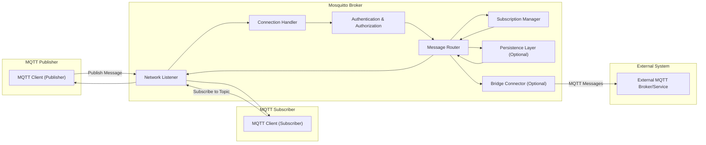
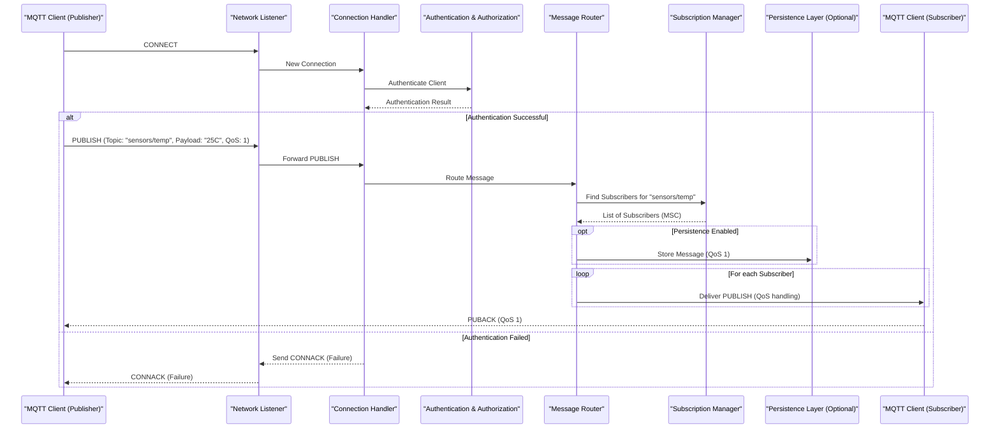

# Project Design Document: Eclipse Mosquitto

**Version:** 1.1
**Date:** October 26, 2023
**Author:** AI Software Architect

## 1. Introduction

This document provides an enhanced architectural design of the Eclipse Mosquitto project. It aims to offer a clearer and more detailed understanding of the system's components, their interactions, and key functionalities. This improved document will serve as a robust foundation for subsequent threat modeling activities, enabling a more comprehensive analysis of potential security vulnerabilities.

## 2. Goals and Objectives

The primary goals of this design document are to:

*   Provide a comprehensive and refined overview of the Mosquitto architecture.
*   Clearly identify key components and elaborate on their specific responsibilities and interactions.
*   Describe the data flow within the system with greater precision.
*   Highlight important security considerations with more specific examples and best practices.
*   Serve as a robust and detailed basis for future threat modeling exercises.

## 3. High-Level Architecture

Mosquitto acts as a central hub, facilitating communication between diverse devices and applications using the MQTT protocol. It efficiently manages the publication and subscription of messages across various topics.

**Key Actors:**

*   **MQTT Publisher:** An MQTT client that sends messages to specific topics.
*   **MQTT Subscriber:** An MQTT client that registers its interest in specific topics to receive messages.
*   **Mosquitto Broker:** The core server responsible for managing connections, authenticating clients, routing messages, and handling subscriptions.
*   **External Systems (Optional):** Other MQTT brokers or external applications that Mosquitto can connect to via bridging.

## 4. Detailed Component Design

This section provides a more detailed breakdown of the key components within the Mosquitto broker.

### 4.1. Network Listener

*   **Responsibility:**  Handles incoming network connections from MQTT clients and other brokers.
*   **Functionality:**
    *   Listens on configurable TCP ports (default: 1883 for unencrypted, 8883 for TLS).
    *   Accepts new client connections.
    *   Manages the underlying network sockets.
    *   Can be configured for different network interfaces.
    *   May support protocols beyond standard TCP, such as WebSockets (configurable via separate listeners).

### 4.2. Connection Handler

*   **Responsibility:** Manages the lifecycle of individual client connections.
*   **Functionality:**
    *   Handles the initial `CONNECT` packet from clients.
    *   Parses connection parameters (e.g., client ID, keep-alive).
    *   Initiates the authentication and authorization process.
    *   Maintains the state of each active connection.
    *   Handles `DISCONNECT` packets and connection termination.
    *   Manages keep-alive pings to detect inactive clients.

### 4.3. Authentication & Authorization

*   **Responsibility:** Verifies the identity of connecting clients and determines their permissions to publish and subscribe to specific topics.
*   **Functionality:**
    *   Supports various authentication methods:
        *   Username/Password authentication.
        *   TLS client certificate authentication.
        *   Anonymous access (if configured).
        *   Integration with external authentication plugins (e.g., databases, LDAP).
    *   Enforces access control policies based on:
        *   Topic-based permissions (allowing or denying access to publish or subscribe to specific topics or topic patterns).
        *   Client identifiers.
        *   IP addresses (less common for authorization, more for connection filtering).
    *   Handles the `CONNACK` packet, indicating connection success or failure based on authentication and authorization.

### 4.4. Message Router

*   **Responsibility:**  The central component responsible for directing incoming messages to the appropriate subscribers and handling message persistence and bridging.
*   **Functionality:**
    *   Receives `PUBLISH` messages from clients.
    *   Examines the topic of the published message.
    *   Queries the Subscription Manager to find matching subscriptions.
    *   Forwards the message to all relevant subscribers based on their subscriptions and the message's QoS level.
    *   Handles message queuing for offline clients if persistence is enabled and the message has a QoS level of 1 or 2.
    *   Passes messages to the Persistence Layer for storage if configured.
    *   Forwards messages to the Bridge Connector if the topic matches a configured bridge.

### 4.5. Subscription Manager

*   **Responsibility:** Manages the active subscriptions of all connected clients.
*   **Functionality:**
    *   Processes `SUBSCRIBE` and `UNSUBSCRIBE` requests from clients.
    *   Stores and efficiently retrieves client subscriptions.
    *   Supports different types of topic filters:
        *   Exact topic matching.
        *   Wildcard subscriptions (`+` for a single level, `#` for multiple levels).
    *   Optimizes the matching of published messages to active subscriptions for efficient message routing.
    *   Handles shared subscriptions (allowing multiple subscribers to share the message load for a topic).

### 4.6. Persistence Layer (Optional)

*   **Responsibility:** Provides the ability to persistently store messages and subscription information, ensuring data durability across broker restarts.
*   **Functionality:**
    *   Supports various persistence mechanisms:
        *   File-based persistence (default).
        *   Database integration (via plugins).
    *   Stores:
        *   Retained messages (messages flagged to be kept and delivered to new subscribers).
        *   In-flight messages for QoS 1 and 2 to ensure delivery.
        *   Durable subscriptions (subscriptions that persist even when the client is offline).
    *   Handles the storage and retrieval of this data efficiently.

### 4.7. Bridge Connector (Optional)

*   **Responsibility:** Enables the Mosquitto broker to connect and exchange messages with other MQTT brokers.
*   **Functionality:**
    *   Establishes connections to remote MQTT brokers.
    *   Supports different bridge modes:
        *   Forwarding specific topics.
        *   Forwarding all messages.
        *   Acting as a bridge for specific client IDs.
    *   Handles authentication with remote brokers.
    *   Manages the flow of messages between the local and remote brokers based on the configured bridge settings.
    *   Can be configured for different QoS levels for bridged messages.

## 5. Data Flow

The following diagram illustrates a more detailed flow of an MQTT `PUBLISH` message through the Mosquitto broker.

**Detailed Data Flow Description:**

1. **Client Connects:** An MQTT client (Publisher) initiates a connection to the broker via the Network Listener.
2. **New Connection Handling:** The Network Listener passes the new connection to the Connection Handler.
3. **Authentication:** The Connection Handler initiates the authentication process with the Authentication & Authorization component.
4. **Authentication Result:** The Authentication & Authorization component returns the authentication status to the Connection Handler.
5. **Publish Message (Successful Authentication):** If authentication is successful, the client sends a `PUBLISH` message to the Network Listener.
6. **Forward Publish:** The Network Listener forwards the `PUBLISH` message to the Connection Handler.
7. **Route Message:** The Connection Handler passes the message to the Message Router.
8. **Find Subscribers:** The Message Router queries the Subscription Manager to find clients subscribed to the message's topic ("sensors/temp").
9. **List of Subscribers:** The Subscription Manager returns a list of matching subscribers (in this case, the MQTT Client (Subscriber)).
10. **Persistence (Optional):** If persistence is enabled and the QoS is greater than 0, the Message Router instructs the Persistence Layer to store the message.
11. **Message Delivery:** The Message Router iterates through the list of subscribers and delivers the `PUBLISH` message to each subscriber, handling the appropriate QoS level.
12. **Publish Acknowledgment (QoS 1):** For QoS 1, the subscribing client (MSC) sends a `PUBACK` back to the publishing client (MPC) (via the broker).
13. **Authentication Failure:** If authentication fails, the Connection Handler sends a `CONNACK` (Connection Acknowledgment) with a failure code back to the Network Listener, which then relays it to the client.

## 6. Security Considerations

This section provides more specific security considerations and best practices for deploying and managing a Mosquitto broker.

*   **Authentication Best Practices:**
    *   **Mandatory Authentication:** Always enable authentication; avoid anonymous access in production environments.
    *   **Strong Credentials:** Enforce strong password policies if using username/password authentication.
    *   **TLS Client Certificates:** Prefer TLS client certificate authentication for stronger security and mutual authentication.
    *   **External Authentication:** Integrate with robust external authentication systems (e.g., LDAP, Active Directory, OAuth 2.0 providers) for centralized user management and stronger security controls.
*   **Authorization Best Practices:**
    *   **Principle of Least Privilege:** Grant clients only the necessary permissions to publish and subscribe to the topics they require.
    *   **Granular ACLs:** Implement fine-grained access control lists (ACLs) to restrict access based on specific topics or topic patterns.
    *   **Dynamic ACLs:** Consider using dynamic ACLs (via plugins) for more flexible and context-aware authorization.
*   **Transport Security Best Practices:**
    *   **Enforce TLS:** Always enable TLS/SSL encryption for all network listeners to protect data in transit.
    *   **Strong Cipher Suites:** Configure the broker to use strong and up-to-date cipher suites. Disable weak or outdated ciphers.
    *   **TLS Protocol Version:** Use the latest stable TLS protocol version (TLS 1.3 is recommended).
    *   **Certificate Management:** Implement proper certificate management practices, including regular rotation and secure storage of private keys.
*   **Input Validation and Sanitization:**
    *   **Topic Validation:** Implement validation rules for topic names to prevent injection attacks or unexpected behavior.
    *   **Payload Handling:** Be mindful of the content of message payloads, especially if they are used in other systems. Sanitize or validate data as needed.
*   **Denial of Service (DoS) Mitigation:**
    *   **Connection Limits:** Configure limits on the maximum number of concurrent client connections.
    *   **Rate Limiting:** Implement rate limiting on incoming messages to prevent message flooding.
    *   **Message Size Limits:** Set limits on the maximum size of MQTT messages.
    *   **Resource Monitoring:** Monitor broker resource usage (CPU, memory, network) to detect potential DoS attacks.
*   **Persistence Security:**
    *   **Secure Storage:** Ensure the persistence storage mechanism (files or database) has appropriate access controls and permissions.
    *   **Encryption at Rest:** Consider encrypting sensitive data stored persistently.
*   **Bridge Security:**
    *   **Secure Bridging:** Use TLS for connections between bridged brokers.
    *   **Authentication on Bridges:** Configure strong authentication credentials for bridge connections.
    *   **Topic Filtering:** Carefully configure the topics being bridged to avoid unintended data leaks or loops.
*   **Logging and Auditing Best Practices:**
    *   **Comprehensive Logging:** Enable detailed logging of connection attempts, authentication events, message activity, and errors.
    *   **Secure Log Storage:** Store logs securely and restrict access to authorized personnel.
    *   **Log Analysis:** Regularly analyze logs for suspicious activity or security incidents.
*   **Software Updates and Patching:**
    *   **Regular Updates:** Keep the Mosquitto broker and its dependencies updated with the latest security patches.
    *   **Vulnerability Monitoring:** Subscribe to security advisories and monitor for known vulnerabilities.
*   **Configuration Security:**
    *   **Secure Configuration Files:** Protect the broker's configuration file with appropriate file system permissions.
    *   **Avoid Hardcoding Secrets:** Avoid storing sensitive information (passwords, API keys) directly in the configuration file. Use environment variables or secrets management solutions.

## 7. Deployment Considerations

*   **Operating System Selection:** Choose an operating system that is well-supported and regularly patched. Linux distributions are commonly used for production deployments.
*   **Containerization (Docker, Kubernetes):** Containerizing Mosquitto simplifies deployment, management, and scaling. Kubernetes provides orchestration capabilities for managing containerized deployments.
*   **Cloud Platform Deployment:** Leverage managed MQTT services offered by cloud providers (AWS IoT Core, Azure IoT Hub, Google Cloud IoT Core) for simplified setup, scalability, and security. Alternatively, deploy Mosquitto on virtual machines or container services in the cloud.
*   **Scalability and High Availability:**
    *   **Clustering:** Implement Mosquitto clustering for horizontal scaling and high availability.
    *   **Load Balancing:** Use load balancers to distribute client connections across multiple broker instances.
    *   **Shared Persistence:** For clustered deployments, use a shared and reliable persistence layer.
*   **Monitoring and Alerting:** Implement robust monitoring of broker performance metrics (e.g., CPU usage, memory usage, message throughput, connection counts) and set up alerts for critical events.

## 8. Future Considerations

*   **Advanced Authentication and Authorization Mechanisms:** Explore integration with more sophisticated authentication protocols like Kerberos or certificate authorities.
*   **Enhanced Monitoring and Observability Tools:** Integrate with advanced monitoring and observability platforms (e.g., Prometheus, Grafana, ELK stack) for deeper insights and visualization.
*   **MQTT 5.0 Features:** Fully adopt and implement features from the MQTT 5.0 specification.
*   **Plugin Ecosystem Expansion:** Encourage and support the development of plugins for extending broker functionality (e.g., custom authentication backends, protocol adaptations).
*   **Improved Management Interfaces:** Develop or integrate with user-friendly management interfaces for configuring and monitoring the broker.

This improved design document provides a more detailed and comprehensive understanding of the Eclipse Mosquitto project, offering a stronger foundation for effective threat modeling and future development.