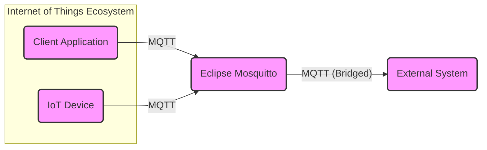
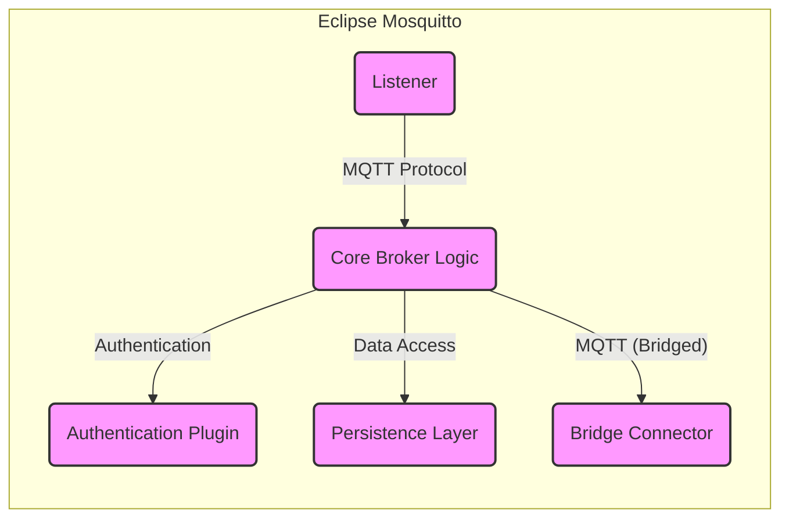
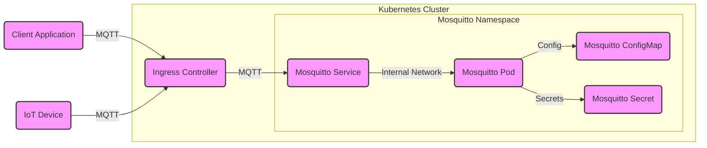
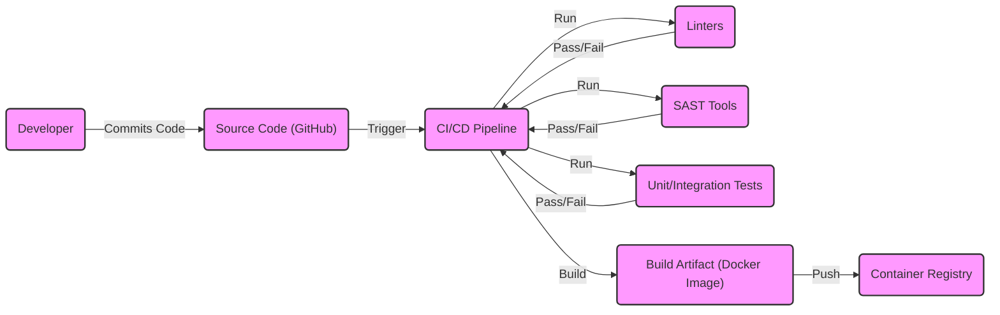

# BUSINESS POSTURE

Business Priorities and Goals:

*   Provide a lightweight, open-source Message Queuing Telemetry Transport (MQTT) broker.
*   Support multiple MQTT protocol versions (5.0, 3.1.1, and 3.1).
*   Offer a stable and reliable messaging service for Internet of Things (IoT) devices and applications.
*   Maintain a small footprint to be suitable for resource-constrained environments.
*   Provide security features to protect message confidentiality and integrity.
*   Foster a community-driven development model.
*   Ensure cross-platform compatibility (Linux, Windows, macOS, and others).

Most Important Business Risks:

*   Unauthorized access to the MQTT broker, leading to data breaches or manipulation of connected devices.
*   Denial-of-service attacks against the broker, disrupting communication between IoT devices and applications.
*   Vulnerabilities in the broker software that could be exploited by attackers.
*   Lack of proper authentication and authorization mechanisms, allowing unauthorized clients to connect and interact with the broker.
*   Insufficient logging and monitoring, hindering the detection and investigation of security incidents.
*   Compromise of the build and distribution process, leading to the deployment of malicious versions of the broker.

# SECURITY POSTURE

Existing Security Controls:

*   security control: TLS/SSL support for encrypted communication between clients and the broker. Implemented in the broker's network communication layer and configured through configuration files.
*   security control: Authentication using username/password. Described in the documentation and configured through configuration files.
*   security control: Access Control Lists (ACLs) to restrict client access to specific topics. Described in the documentation and configured through configuration files.
*   security control: Support for various authentication plugins (e.g., JWT, database-backed authentication). Described in the documentation and implemented as loadable modules.
*   security control: Bridge support for connecting to other MQTT brokers, with security options for the bridge connection. Described in the documentation and configured through configuration files.
*   security control: C and C++ code, with some attention to avoiding buffer overflows and other common vulnerabilities. Evident in the source code.

Accepted Risks:

*   accepted risk: The default configuration does not enforce strong security settings, requiring users to explicitly configure them.
*   accepted risk: Older versions of TLS/SSL may be supported for compatibility reasons, which could be vulnerable to known attacks.
*   accepted risk: The plugin architecture, while providing flexibility, introduces a potential attack surface if plugins are not carefully vetted.

Recommended Security Controls:

*   security control: Implement mandatory TLS/SSL encryption with strong ciphers by default.
*   security control: Enforce strong password policies and multi-factor authentication.
*   security control: Integrate with a centralized identity and access management (IAM) system.
*   security control: Implement robust input validation to prevent injection attacks.
*   security control: Regularly conduct security audits and penetration testing.
*   security control: Implement a comprehensive logging and monitoring system with real-time alerting.
*   security control: Provide a security hardening guide for production deployments.
*   security control: Implement a secure software development lifecycle (SSDLC) with static and dynamic code analysis.

Security Requirements:

*   Authentication:
    *   The broker must support strong authentication mechanisms, including username/password, client certificates, and integration with external authentication providers.
    *   The broker must enforce strong password policies.
    *   The broker should support multi-factor authentication.

*   Authorization:
    *   The broker must implement fine-grained access control using ACLs or a similar mechanism.
    *   The broker must allow administrators to define granular permissions for clients based on topics and actions (publish, subscribe).

*   Input Validation:
    *   The broker must validate all inputs from clients, including topic names, payloads, and control packets.
    *   The broker must protect against common injection attacks, such as SQL injection (if applicable) and command injection.

*   Cryptography:
    *   The broker must use strong cryptographic algorithms and protocols for secure communication (TLS/SSL).
    *   The broker must securely store sensitive data, such as passwords and private keys.
    *   The broker should support hardware security modules (HSMs) for key management.

# DESIGN

## C4 CONTEXT

Element Descriptions:

*   Element:
    *   Name: Client Application
    *   Type: Software System
    *   Description: An application that interacts with the MQTT broker to publish or subscribe to messages.
    *   Responsibilities: Sending and receiving MQTT messages, processing data, interacting with users or other systems.
    *   Security controls: TLS/SSL encryption, authentication (username/password, client certificates), authorization (ACLs).

*   Element:
    *   Name: IoT Device
    *   Type: Device
    *   Description: A physical device (e.g., sensor, actuator) that connects to the MQTT broker.
    *   Responsibilities: Collecting data, sending data to the broker, receiving commands from the broker.
    *   Security controls: TLS/SSL encryption (if supported), authentication (username/password, client certificates), device-specific security measures.

*   Element:
    *   Name: Eclipse Mosquitto
    *   Type: Software System
    *   Description: The MQTT broker, responsible for routing messages between clients.
    *   Responsibilities: Receiving messages from publishers, forwarding messages to subscribers, managing client connections, enforcing security policies.
    *   Security controls: TLS/SSL encryption, authentication (username/password, client certificates, plugins), authorization (ACLs), bridge security.

*   Element:
    *   Name: External System
    *   Type: Software System
    *   Description: Another MQTT broker or system that Mosquitto connects to via a bridge.
    *   Responsibilities: Exchanging messages with Mosquitto, potentially providing additional services.
    *   Security controls: TLS/SSL encryption, authentication, authorization (depending on the external system).

## C4 CONTAINER

Element Descriptions:

*   Element:
    *   Name: Listener
    *   Type: Container
    *   Description: Handles incoming network connections from clients.
    *   Responsibilities: Accepting connections, handling TLS/SSL negotiation, parsing MQTT packets.
    *   Security controls: TLS/SSL configuration, network-level access controls.

*   Element:
    *   Name: Authentication Plugin
    *   Type: Container
    *   Description: Handles client authentication.
    *   Responsibilities: Verifying client credentials, interacting with external authentication providers (if configured).
    *   Security controls: Secure storage of credentials, secure communication with external providers.

*   Element:
    *   Name: Core Broker Logic
    *   Type: Container
    *   Description: Implements the core MQTT message routing and handling.
    *   Responsibilities: Managing subscriptions, routing messages, enforcing ACLs, handling QoS levels.
    *   Security controls: ACL enforcement, input validation.

*   Element:
    *   Name: Persistence Layer
    *   Type: Container
    *   Description: Handles persistent storage of messages and subscriptions (optional).
    *   Responsibilities: Storing and retrieving messages, managing persistent sessions.
    *   Security controls: Data encryption at rest (if applicable), access controls to the storage mechanism.

*   Element:
    *   Name: Bridge Connector
    *   Type: Container
    *   Description: Manages connections to other MQTT brokers (bridges).
    *   Responsibilities: Establishing and maintaining bridge connections, forwarding messages between brokers.
    *   Security controls: TLS/SSL encryption for bridge connections, authentication with the remote broker.

## DEPLOYMENT

Possible Deployment Solutions:

1.  Bare-metal server/Virtual Machine: Mosquitto is installed directly on a physical or virtual server.
2.  Containerized deployment (Docker): Mosquitto is packaged as a Docker container and deployed using Docker Compose, Kubernetes, or other container orchestration platforms.
3.  Cloud-based deployment (AWS IoT, Azure IoT Hub, Google Cloud IoT Core): Mosquitto can be used in conjunction with cloud-based IoT platforms, either as a standalone broker or integrated with the platform's built-in MQTT broker.

Chosen Deployment Solution: Containerized Deployment (Docker with Kubernetes)

Element Descriptions:

*   Element:
    *   Name: Mosquitto Pod
    *   Type: Kubernetes Pod
    *   Description: Contains the Mosquitto Docker container.
    *   Responsibilities: Running the Mosquitto broker process.
    *   Security controls: Container security best practices (e.g., running as non-root, using minimal base images), network policies.

*   Element:
    *   Name: Mosquitto Service
    *   Type: Kubernetes Service
    *   Description: Provides a stable endpoint for accessing the Mosquitto broker.
    *   Responsibilities: Load balancing traffic across multiple Mosquitto pods (if applicable).
    *   Security controls: Network policies.

*   Element:
    *   Name: Mosquitto ConfigMap
    *   Type: Kubernetes ConfigMap
    *   Description: Stores the Mosquitto configuration file.
    *   Responsibilities: Providing configuration data to the Mosquitto pod.
    *   Security controls: Access controls to the ConfigMap.

*   Element:
    *   Name: Mosquitto Secret
    *   Type: Kubernetes Secret
    *   Description: Stores sensitive data, such as passwords and TLS certificates.
    *   Responsibilities: Providing secrets to the Mosquitto pod.
    *   Security controls: Encryption of secrets at rest, access controls to the Secret.

*   Element:
    *   Name: Ingress Controller
    *   Type: Kubernetes Ingress
    *   Description: Exposes the Mosquitto service to external clients.
    *   Responsibilities: Routing traffic to the Mosquitto service, potentially handling TLS termination.
    *   Security controls: TLS configuration, network policies.

*   Element:
    *   Name: Client Application
    *   Type: External Application
    *   Description: Application connecting to the broker.
    *   Responsibilities: Publishing and subscribing to messages.
    *   Security controls: TLS/SSL, authentication.

*   Element:
    *   Name: IoT Device
    *   Type: External Device
    *   Description: Device connecting to the broker.
    *   Responsibilities: Publishing and subscribing to messages.
    *   Security controls: TLS/SSL, authentication.

## BUILD

Build Process Description:

1.  Developers commit code changes to the GitHub repository.
2.  A CI/CD pipeline (e.g., GitHub Actions, Travis CI, Jenkins) is triggered by the commit.
3.  The pipeline performs the following steps:
    *   Runs linters (e.g., `cpplint`, `clang-format`) to check code style and potential errors.
    *   Runs static analysis security testing (SAST) tools (e.g., Coverity, SonarQube) to identify potential security vulnerabilities.
    *   Executes unit and integration tests to verify the functionality of the code.
    *   If all checks and tests pass, builds the Mosquitto broker (compiles the C/C++ code).
    *   Creates a Docker image containing the compiled broker and necessary dependencies.
    *   Pushes the Docker image to a container registry (e.g., Docker Hub, GitHub Container Registry).

Security Controls:

*   security control: Use of linters to enforce coding standards and identify potential errors.
*   security control: Integration of SAST tools to detect security vulnerabilities early in the development process.
*   security control: Automated testing to ensure code quality and prevent regressions.
*   security control: Building and distributing the broker as a container image to ensure consistency and reproducibility.
*   security control: Use of a secure container registry to store and distribute the Docker image.
*   security control: Signing of Docker images to ensure authenticity and integrity.

# RISK ASSESSMENT

Critical Business Processes:

*   Reliable and secure message delivery between IoT devices and applications.
*   Maintaining the availability and integrity of the MQTT broker service.
*   Protecting sensitive data transmitted through the broker.

Data Sensitivity:

*   Data transmitted through the broker can range from non-sensitive sensor readings to highly sensitive personal or business data.
*   The sensitivity of the data depends on the specific use case and the type of devices and applications connected to the broker.
*   Examples of sensitive data:
    *   Personally Identifiable Information (PII)
    *   Financial data
    *   Health information
    *   Location data
    *   Authentication credentials
    *   Proprietary business data

# QUESTIONS & ASSUMPTIONS

Questions:

*   What are the specific compliance requirements (e.g., GDPR, HIPAA) that apply to the use of Mosquitto?
*   What are the expected message volumes and rates?
*   What are the specific security requirements of the connected devices and applications?
*   Are there any existing security infrastructure or tools that should be integrated with Mosquitto?
*   What level of support and maintenance is required for the Mosquitto deployment?
*   What is the expected number of concurrent client connections?
*   Are there any specific performance requirements or limitations?
*   What is the planned lifecycle of the deployment?

Assumptions:

*   BUSINESS POSTURE: The primary goal is to provide a secure and reliable MQTT broker service.
*   BUSINESS POSTURE: The organization has a moderate risk appetite, balancing security with usability and performance.
*   SECURITY POSTURE: The organization has a basic understanding of security best practices.
*   SECURITY POSTURE: The organization is willing to invest in security measures to protect the broker and connected devices.
*   DESIGN: The deployment environment will be a Kubernetes cluster.
*   DESIGN: The build process will use a CI/CD pipeline with automated security checks.
*   DESIGN: The default configuration of Mosquitto will be hardened to improve security.
*   DESIGN: Clients will use TLS/SSL for secure communication.