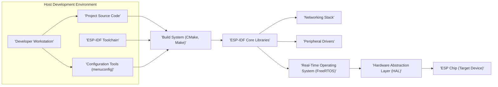
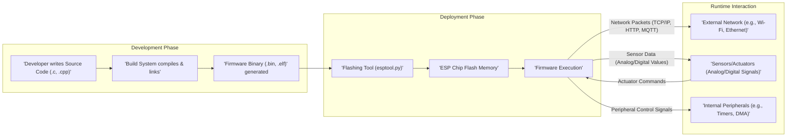

# Project Design Document: ESP-IDF (Espressif IoT Development Framework)

**Version:** 1.1
**Date:** October 26, 2023
**Author:** AI Software Architect

## 1. Introduction

This document provides an enhanced architectural overview of the Espressif IoT Development Framework (ESP-IDF), as represented by the project hosted on GitHub at [https://github.com/espressif/esp-idf](https://github.com/espressif/esp-idf). This revised document aims to provide a more detailed and structured foundation for subsequent threat modeling activities. It elaborates on the key components, their interactions, and the overall structure of the framework, offering greater clarity and depth.

## 2. Goals

*   Provide a comprehensive and refined architectural description of ESP-IDF.
*   Identify key components and their specific functionalities with greater detail.
*   Illustrate the data flow within the framework and its interactions with external entities, including data types.
*   Highlight potential security-relevant aspects of the design with more specific examples.
*   Serve as an improved and more detailed basis for identifying potential threats and vulnerabilities.

## 3. Scope

This document focuses on the software architecture of the ESP-IDF as a development framework, providing a more granular view of its internal workings. It includes:

*   The core components of the SDK, with a deeper dive into key modules.
*   The build and compilation process, outlining the stages involved.
*   The interaction with the target hardware (ESP32, ESP32-S, ESP32-C, ESP32-H series), specifying communication pathways.
*   The interaction with the host development environment, detailing the tools used.
*   Key functionalities and libraries provided by the framework, categorized for clarity.

This document still does not cover:

*   Specific application code developed using ESP-IDF.
*   Detailed hardware specifications of the ESP chips beyond their general capabilities.
*   Cloud services or platforms that might interact with devices running ESP-IDF firmware, except where the framework explicitly provides integration libraries.

## 4. High-Level Architecture

The ESP-IDF employs a layered architecture to facilitate application development for Espressif microcontrollers. This diagram provides a more detailed view of the interactions.

**Components:**

*   **Developer Workstation:** The machine used by developers for coding, building, flashing, and debugging.
*   **ESP-IDF Toolchain:** A suite of tools essential for cross-compilation, including the compiler, linker, debugger, and binary utilities tailored for ESP chips.
*   **Project Source Code:** The application-specific code written by the developer, leveraging the ESP-IDF APIs and libraries.
*   **Configuration Tools (menuconfig):** A text-based interface for configuring various aspects of the ESP-IDF and the application.
*   **Build System (CMake, Make):** Manages the compilation and linking process, orchestrating the toolchain and SDK components based on configuration.
*   **ESP-IDF Core Libraries:** Fundamental libraries providing core functionalities like memory management, system utilities, and bootloaders.
*   **Networking Stack:** Implements networking protocols such as TCP/IP, Wi-Fi, Bluetooth, and Ethernet.
*   **Peripheral Drivers:** Provides interfaces for interacting with the hardware peripherals of the ESP chip.
*   **Real-Time Operating System (FreeRTOS):** The underlying RTOS providing task scheduling, memory management, and inter-process communication.
*   **Hardware Abstraction Layer (HAL):**  Abstracts the hardware details, providing a consistent interface for software to interact with the ESP chip's peripherals.
*   **ESP Chip (Target Device):** The Espressif microcontroller where the compiled firmware is executed.

## 5. Detailed Component Description

### 5.1. ESP-IDF Toolchain

*   **Compiler:**  GCC (xtensa-esp32-elf or riscv32-esp-elf) for compiling C/C++ code.
*   **Linker:**  Links compiled object files into an executable firmware image.
*   **Debugger:** GDB for debugging the application running on the target device.
*   **Build Utilities:**  Tools like `make`, `cmake`, and Python scripts for managing the build process.
*   **Flashing Tools:**  `esptool.py` for uploading the firmware to the ESP chip.

### 5.2. Build System

*   **CMake:** Used to generate platform-specific build files (e.g., Makefiles).
*   **Make:** Executes the generated build files to compile and link the project.
*   **Component Management:**  Handles dependencies between different ESP-IDF components and user-defined components.
*   **Configuration Management:** Integrates with `menuconfig` to incorporate user-defined configurations into the build process.

### 5.3. ESP-IDF Libraries and Components

Categorized for better understanding:

*   **Core System Libraries:**
    *   **`esp_system`:** Provides fundamental system-level functions.
    *   **`esp_event`:**  An event loop library for asynchronous event handling.
    *   **`esp_timer`:**  Software timers.
    *   **`esp_pm`:** Power management functionalities.
    *   **`bootloader`:** The first-stage bootloader.
*   **Connectivity Libraries:**
    *   **`esp_wifi`:**  Wi-Fi driver and networking stack.
    *   **`esp_eth`:** Ethernet driver.
    *   **`esp_bluetooh` / `esp_ble_gatt_server` / `esp_ble_gatt_client`:** Bluetooth and BLE stacks and profiles.
    *   **`lwip`:**  Lightweight TCP/IP stack.
    *   **`mbedtls`:** Cryptographic library for secure communication.
*   **Peripheral Driver Libraries:**
    *   Drivers for various peripherals like GPIO, SPI, I2C, UART, ADC, DAC, Timers, and more.
    *   Specific drivers for display interfaces (e.g., LCD).
    *   Sensor interface drivers (e.g., for temperature, humidity sensors).
*   **Data Storage Libraries:**
    *   **`spiffs`:** SPI Flash File System.
    *   **`fatfs`:** FAT file system support.
    *   **`nvs_flash`:** Non-Volatile Storage library for storing key-value pairs.
*   **Security Libraries:**
    *   **`esp_secure_boot`:** Secure boot implementation.
    *   **`esp_flash_encryption`:** Flash encryption mechanisms.
    *   Integration with hardware cryptographic accelerators.
*   **Protocol Libraries:**
    *   **`esp_http_server` / `esp_http_client`:** HTTP server and client implementations.
    *   **`mqtt`:** MQTT client library.
    *   **`websocket`:** WebSocket client and server support.
*   **Over-The-Air (OTA) Update Libraries:**
    *   Libraries for managing firmware updates over network connections.

### 5.4. Real-Time Operating System (FreeRTOS)

*   **Task Management:** Creation, deletion, and scheduling of tasks.
*   **Inter-Task Communication:** Mechanisms like queues, semaphores, mutexes, and event groups for communication and synchronization between tasks.
*   **Memory Management:** Dynamic memory allocation and deallocation.
*   **Interrupt Management:** Handling hardware interrupts.

### 5.5. Hardware Abstraction Layer (HAL)

*   Provides a set of functions and macros to interact with the hardware registers.
*   Offers a consistent API across different ESP chip revisions where possible.
*   Examples include HALs for GPIO, SPI, I2C, etc.

## 6. Data Flow

The data flow can be broken down into development, deployment, and runtime interactions, with specific data types involved.

**Data Flow Description:**

1. **Source Code Creation:** Developers write application logic in C/C++ files, utilizing ESP-IDF APIs.
2. **Compilation and Linking:** The build system compiles source code into object files and links them with ESP-IDF libraries to create the firmware binary.
3. **Firmware Generation:**  A binary file (`.bin`) and an ELF file (`.elf`) containing the executable code and debugging information are generated.
4. **Flashing:** The `esptool.py` utility transfers the firmware binary to the ESP chip's flash memory via a serial connection (typically UART).
5. **Firmware Execution:** Upon booting, the ESP chip loads and executes the firmware from flash memory.
6. **Network Interaction:** The firmware exchanges data packets over network interfaces using protocols like TCP/IP, HTTP, and MQTT.
7. **Peripheral Interaction:** The firmware interacts with connected sensors and actuators, exchanging analog or digital signals.
8. **Internal Peripheral Interaction:** The firmware controls internal peripherals using specific control signals and data registers.

## 7. Security Considerations (Relevant for Threat Modeling)

This section provides more specific examples and categories for security considerations:

*   **Firmware Security:**
    *   **Secure Boot Vulnerabilities:**  Bypassing secure boot to execute unauthorized code.
    *   **Firmware Downgrade Attacks:**  Exploiting vulnerabilities in the update process to install older, vulnerable firmware.
    *   **JTAG/Debugging Access:** Unauthorized access via JTAG to extract firmware or manipulate execution.
*   **Data Security:**
    *   **Flash Encryption Weaknesses:**  Exploiting vulnerabilities in the flash encryption implementation or key management.
    *   **Man-in-the-Middle (MITM) Attacks:** Intercepting and potentially modifying network communication.
    *   **Exposure of Sensitive Data:**  Accidental logging or transmission of sensitive information (keys, credentials).
*   **Authentication and Authorization:**
    *   **Weak or Default Credentials:** Using easily guessable passwords or default settings.
    *   **Lack of Mutual Authentication:**  Devices not verifying the identity of servers or other devices.
    *   **Authorization Bypass:**  Exploiting flaws in access control mechanisms.
*   **Over-The-Air (OTA) Update Security:**
    *   **Unsigned Firmware Updates:**  Allowing installation of firmware from untrusted sources.
    *   **Insecure Update Channels:**  Transmitting firmware updates over unencrypted connections.
    *   **Rollback Attacks:**  Exploiting vulnerabilities to revert to older, vulnerable firmware versions.
*   **Supply Chain Security:**
    *   **Compromised Components:**  Using libraries or components with known vulnerabilities.
    *   **Counterfeit Hardware:**  Using non-genuine ESP chips with potential backdoors.
*   **Physical Security:**
    *   **Physical Access to Debug Interfaces:**  Using physical access to exploit debug interfaces.
    *   **Flash Memory Extraction:**  Physically removing and reading the flash memory.
*   **Memory Safety:**
    *   **Buffer Overflows:**  Writing beyond the allocated memory boundaries.
    *   **Heap Corruption:**  Corrupting the heap memory, leading to crashes or exploitable conditions.
    *   **Use-After-Free Vulnerabilities:**  Accessing memory that has already been freed.
*   **Cryptographic Implementation:**
    *   **Weak Cryptographic Algorithms:**  Using outdated or insecure cryptographic algorithms.
    *   **Improper Key Management:**  Storing or handling cryptographic keys insecurely.
    *   **Side-Channel Attacks:**  Exploiting information leaked through power consumption, timing, or other side channels.

## 8. Diagrams

The diagrams illustrating the high-level architecture and data flow are provided in sections 4 and 6.

## 9. Conclusion

This improved design document offers a more detailed and structured understanding of the ESP-IDF architecture, its components, and data flow. The enhanced descriptions and more specific security considerations provide a stronger foundation for conducting comprehensive threat modeling. This document serves as a valuable resource for identifying potential vulnerabilities and designing effective security mitigations for systems built using the ESP-IDF.