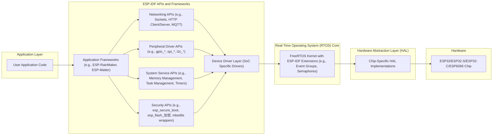
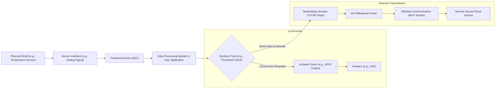

# Project Design Document: ESP-IDF (Espressif IoT Development Framework)

**Version:** 1.1
**Date:** October 26, 2023
**Author:** AI Software Architect

## 1. Introduction

This document provides an enhanced architectural overview of the Espressif IoT Development Framework (ESP-IDF), as hosted on the GitHub repository [https://github.com/espressif/esp-idf](https://github.com/espressif/esp-idf). This revised document aims to provide a more detailed and structured foundation for subsequent threat modeling activities. It elaborates on the key components, data flows, and technologies inherent in the ESP-IDF, offering a deeper understanding of the system's structure and potential attack surfaces.

## 2. System Overview

ESP-IDF is a robust and versatile software development framework engineered for the ESP32, ESP32-S, ESP32-C, and ESP8266 series of system-on-a-chip (SoC) devices manufactured by Espressif Systems. It furnishes developers with a comprehensive suite of tools, well-defined libraries, and extensive documentation to facilitate the creation of embedded applications, particularly those leveraging Wi-Fi, Bluetooth, and other networking capabilities. Being open-source, ESP-IDF enjoys widespread adoption within the Internet of Things (IoT) ecosystem.

Key characteristics of ESP-IDF include:

*   **Real-Time Operating System (RTOS):** Employs FreeRTOS as its core, augmented with Espressif-specific extensions for enhanced functionality and hardware integration.
*   **Hardware Abstraction Layer (HAL):** Presents a consistent and unified programming interface to interact with the diverse hardware peripherals across different ESP chip variants.
*   **Peripheral Drivers:** Offers a rich set of drivers for controlling various on-chip peripherals, such as General Purpose Input/Output (GPIO), Serial Peripheral Interface (SPI), Inter-Integrated Circuit (I2C), Universal Asynchronous Receiver/Transmitter (UART), and more.
*   **Networking Stacks:** Integrates mature and widely used networking stacks, providing support for Wi-Fi (including various modes and security protocols), Bluetooth (both Classic and Low Energy), and Ethernet connectivity.
*   **Security Features:** Incorporates a range of security mechanisms, including secure boot to ensure firmware integrity, flash encryption to protect sensitive data stored in flash memory, and robust cryptographic libraries for secure communication.
*   **Build System:** Leverages CMake as its build system, enabling cross-platform development and simplifying the management of complex build configurations.
*   **Comprehensive Toolchain:** Includes a complete set of essential tools for the development lifecycle, such as flashing utilities for uploading firmware, monitoring tools for real-time debugging, and debugging interfaces for in-depth analysis.

## 3. System Architecture

The ESP-IDF architecture is structured in a layered manner, with distinct components interacting to provide the overall functionality. The following diagram provides a more detailed view of the architecture:

**Detailed Component Breakdown:**

*   **User Application Code:** This represents the custom-developed software that implements the specific logic and functionality of the target IoT device. It interacts with the ESP-IDF through well-defined APIs.
*   **Application Frameworks:** These are higher-level libraries built upon the core ESP-IDF, offering pre-built functionalities for common IoT tasks. Examples include ESP-RainMaker for cloud connectivity and device management, and ESP-Matter for interoperability with the Matter smart home standard.
*   **Networking APIs:** This layer provides APIs for implementing network communication using various protocols. It includes socket APIs for TCP/IP communication, HTTP client and server libraries, MQTT client libraries for IoT messaging, and more.
*   **Peripheral Driver APIs:** These APIs offer a structured way to control the hardware peripherals of the ESP chips. They provide functions for initializing, configuring, and interacting with peripherals like GPIOs, SPI, I2C, UART, ADC, DAC, etc. The naming convention often includes prefixes like `gpio_`, `spi_`, and `i2c_`.
*   **System Service APIs:** This category encompasses APIs for core system functionalities, including dynamic memory allocation and management, task creation and scheduling, inter-task communication mechanisms (queues, semaphores), software timers, and interrupt handling.
*   **Security APIs:** This crucial layer provides APIs for utilizing the security features of the ESP chips. It includes interfaces for configuring and managing secure boot, enabling and controlling flash encryption, and accessing the functionalities of the underlying cryptographic library (mbedTLS).
*   **Device Driver Layer (SoC Specific Drivers):** This layer contains lower-level drivers that are specific to the particular ESP chip being used. They provide a more direct interface to the hardware and are often used by the higher-level peripheral driver APIs.
*   **FreeRTOS Kernel with ESP-IDF Extensions:** The core real-time operating system that manages the execution of tasks, allocates resources, and handles scheduling. ESP-IDF extends the standard FreeRTOS kernel with features tailored to the ESP chips, such as event groups and enhanced synchronization primitives.
*   **Hardware Abstraction Layer (HAL):** This layer provides a thin abstraction over the hardware, offering a consistent interface for the RTOS and higher-level drivers to interact with the chip's peripherals. Different HAL implementations exist for each ESP chip variant.
*   **ESP32/ESP32-S/ESP32-C/ESP8266 Chip:** The physical microcontroller unit, integrating processing cores, memory, and various peripherals, including Wi-Fi and/or Bluetooth radios.

## 4. Data Flow

Data flow within an ESP-IDF application is highly dependent on the application's specific purpose. However, a common pattern involves sensing, processing, and transmitting data. The following diagram illustrates a more detailed example of data flow:

**Description of Data Flow:**

*   **Physical World Interaction:** Data originates from the physical environment, such as a temperature reading from a sensor.
*   **Sensor Interface:** The sensor provides an electrical signal (e.g., analog voltage) representing the measured data.
*   **Peripheral Driver (ADC):** The Analog-to-Digital Converter (ADC) driver reads the analog signal and converts it into a digital value.
*   **Data Processing Module:** The user application code receives the raw digital data and performs processing, such as filtering, scaling, or unit conversion.
*   **Decision Point:** The application logic may involve decision-making based on the processed data, such as checking if a temperature threshold has been exceeded.
*   **Local Action:** If a local action is required, the application interacts with actuator drivers (e.g., GPIO driver to control an LED).
*   **Network Transmission:** If the data needs to be sent over the network, it's passed to the networking libraries.
*   **Networking Libraries (TCP/IP Stack):** The TCP/IP stack handles the encapsulation of data into network packets, manages connections, and ensures reliable delivery.
*   **Wi-Fi/Bluetooth Driver:** The appropriate wireless driver manages the low-level communication with the Wi-Fi or Bluetooth radio hardware.
*   **Wireless Communication:** Data is transmitted wirelessly to a network access point (e.g., a Wi-Fi router).
*   **Remote Server/Cloud Service:** The data reaches its destination, which could be a cloud platform, a local server, or another networked device.

**Additional Data Flow Considerations:**

*   **Firmware Updates:** Involve downloading firmware images over the network, verifying their integrity, and writing them to flash memory. This process utilizes networking stacks, secure storage mechanisms, and the secure boot functionality.
*   **Configuration Management:** Configuration data can be received from a network server, read from local storage, or entered through a user interface. This data influences the behavior of the application.
*   **Control Commands:** Devices can receive commands from remote systems to control their operation. This involves network communication and parsing of command messages.

## 5. Key Technologies

*   **Primary Programming Languages:** C and C++.
*   **Build System:** CMake, along with Python-based build scripts.
*   **Real-Time Operating System:** FreeRTOS, extended with ESP-IDF specific features.
*   **Networking Stacks:**
    *   **lwIP:** A lightweight TCP/IP implementation.
    *   **NimBLE:** A Bluetooth Low Energy (BLE) stack.
    *   **Bluedroid:** A Bluetooth Classic stack.
    *   **Ethernet MAC/PHY drivers:** For wired network connectivity.
*   **Security Libraries:**
    *   **mbedTLS:** A comprehensive and widely used cryptographic library.
    *   **ESP-IDF specific security modules:** For secure boot and flash encryption.
*   **Communication Protocols:**
    *   **Wi-Fi:** IEEE 802.11 b/g/n (and potentially ac/ax on newer chips).
    *   **Bluetooth:** Bluetooth Classic and Bluetooth Low Energy (BLE).
    *   **Ethernet:** IEEE 802.3.
    *   **Various application-level protocols:** HTTP, HTTPS, MQTT, CoAP, etc.
*   **Microcontroller Architectures:** Primarily based on Tensilica Xtensa LX6/LX7 dual-core or single-core processors (for ESP32, ESP32-S series) and RISC-V single-core processors (for ESP32-C series).

## 6. Security Considerations

ESP-IDF provides a foundation for building secure IoT devices, but developers must carefully utilize its features and avoid introducing vulnerabilities in their application code. Key security considerations include:

*   **Secure Boot:** Ensures that only cryptographically signed firmware, authorized by the device owner, can be executed. Potential vulnerabilities include weaknesses in the signing key management or bypasses in the boot process.
*   **Flash Encryption:** Encrypts the contents of the flash memory, protecting sensitive data (like configuration credentials or application secrets) from being read if the device is physically accessed. Vulnerabilities can arise from weak encryption keys or improper configuration.
*   **Hardware Cryptographic Accelerators:** ESP chips integrate hardware accelerators for cryptographic operations (e.g., AES, SHA), improving performance and reducing the risk of side-channel attacks compared to software-based implementations. However, proper usage and secure key management are still critical.
*   **Secure Storage:** ESP-IDF provides APIs for securely storing sensitive data, often leveraging flash encryption. Improper use of these APIs or storing sensitive data in plaintext can lead to vulnerabilities.
*   **Over-the-Air (OTA) Updates:**  Mechanisms for securely updating device firmware remotely. Security considerations include verifying the authenticity and integrity of the firmware image before applying the update to prevent malicious updates.
*   **Wi-Fi Security:** Supports standard Wi-Fi security protocols like WPA2 and WPA3. Misconfiguration or using weak passwords can compromise the device's network security.
*   **Bluetooth Security:** Supports Bluetooth pairing and encryption mechanisms. Vulnerabilities can arise from insecure pairing procedures or exploitable vulnerabilities in the Bluetooth stack.
*   **Memory Protection:** Features like memory management units (MMUs) help protect memory regions from unauthorized access, reducing the impact of memory corruption vulnerabilities.
*   **Input Validation:**  Crucial for preventing vulnerabilities like buffer overflows, format string bugs, and injection attacks. Applications must carefully validate all external inputs.
*   **Network Security:**  Proper configuration of network services, firewalls (if applicable), and secure communication protocols (HTTPS, TLS) is essential to protect the device and the network it's connected to.
*   **Supply Chain Security:**  While not directly a feature of ESP-IDF, the integrity of the development toolchain and the ESP chips themselves is a consideration. Using official and verified sources for the SDK and hardware is important.

## 7. Deployment Model

The deployment of ESP-IDF based applications involves several stages:

*   **Development:** Developers write application code using the ESP-IDF APIs, libraries, and toolchain on a host computer (Windows, Linux, macOS).
*   **Configuration:** The project is configured using CMake, specifying target chip, build options, and dependencies.
*   **Compilation:** The ESP-IDF build system compiles the application code and links it with the necessary libraries to produce a binary firmware image.
*   **Flashing:** The compiled firmware image is uploaded to the ESP chip's flash memory using a flashing tool (e.g., `esptool.py`) over a serial connection (typically UART). This process involves putting the chip into a flashing mode.
*   **Boot and Execution:** Once flashed, the ESP chip can be powered on, and it will boot from the flash memory, executing the uploaded firmware.

Deployed devices can operate in various scenarios:

*   **Standalone Operation:** The device performs its functions independently without requiring continuous network connectivity.
*   **Local Network Connectivity:** The device connects to a local network (Wi-Fi or Ethernet) to communicate with other devices or local servers.
*   **Cloud Connectivity:** The device connects to the internet to interact with cloud services for data storage, remote control, or analytics.
*   **Hybrid Models:** Combinations of the above, where the device performs local tasks and also interacts with the cloud.

## 8. Threat Modeling Scope

For the purpose of threat modeling, the scope encompasses the following elements and interactions:

*   **User Application Code:**  Focus on identifying potential vulnerabilities within the custom application logic developed using ESP-IDF.
*   **ESP-IDF Libraries and APIs:**  Analyze potential weaknesses or vulnerabilities within the provided ESP-IDF libraries and APIs that could be exploited.
*   **Networking Stacks (lwIP, NimBLE, Bluedroid):**  Examine the implementation of networking protocols for potential vulnerabilities or misconfigurations.
*   **Security Features (Secure Boot, Flash Encryption, mbedTLS):**  Assess the robustness and potential bypasses of the implemented security mechanisms.
*   **Communication Channels (Wi-Fi, Bluetooth, Ethernet):**  Evaluate the security of wireless and wired communication channels used by the device.
*   **Firmware Update Process (OTA):**  Analyze the security of the firmware update mechanism, including authentication and integrity checks.
*   **External Interfaces (Sensors, Actuators, Communication Interfaces):**  Consider vulnerabilities related to interactions with external components and communication interfaces.
*   **Build and Deployment Process:**  Identify potential security risks introduced during the software build, flashing, and deployment stages.

The following items are explicitly excluded from the scope of this initial threat modeling exercise:

*   **Physical Security of the Device:**  Threats related to physical tampering, hardware reverse engineering, or side-channel attacks on the hardware itself are not the primary focus.
*   **Vulnerabilities in Underlying Hardware:**  This analysis primarily focuses on software and firmware vulnerabilities, not inherent flaws in the silicon.
*   **Third-Party Libraries Not Directly Integrated into ESP-IDF:**  Unless a third-party library is officially part of the ESP-IDF repository and maintained by Espressif, it's considered out of scope for this initial analysis.

## 9. Conclusion

This improved design document provides a more detailed and structured understanding of the ESP-IDF architecture, data flows, and key technologies. By elaborating on the various components and their interactions, and by providing more specific examples within the security considerations, this document aims to be a more effective foundation for conducting comprehensive threat modeling activities. This deeper understanding will facilitate the identification of potential vulnerabilities and the design of appropriate mitigation strategies for building secure and robust IoT solutions using the ESP-IDF.