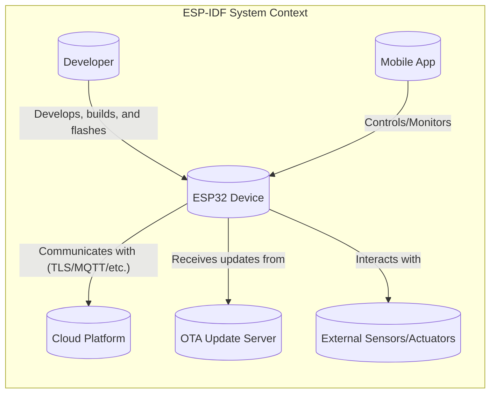
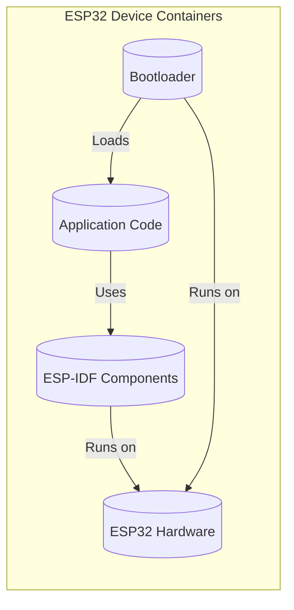
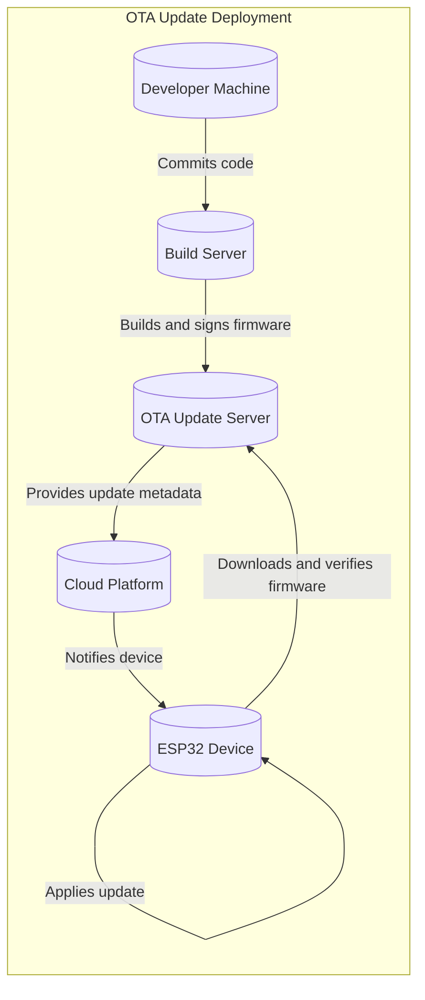
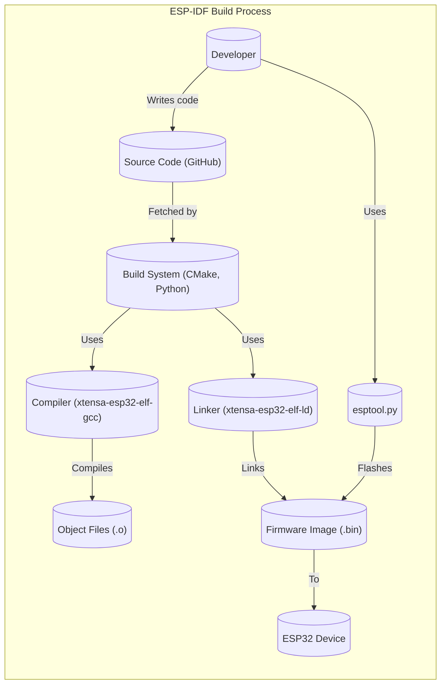

Okay, let's craft a design document for the ESP-IDF project, keeping in mind its purpose and potential security implications.

# BUSINESS POSTURE

The ESP-IDF (Espressif IoT Development Framework) is a critical project for Espressif Systems, enabling developers to build applications for their ESP32 and ESP32-S series of chips. These chips are widely used in IoT devices, ranging from consumer electronics to industrial automation.

Priorities:

*   Enable rapid and reliable development of IoT applications.
*   Provide a comprehensive and well-documented framework.
*   Support a wide range of hardware configurations and peripherals.
*   Ensure the security and stability of deployed applications.
*   Foster a strong developer community and ecosystem.
*   Maintain compatibility with various cloud platforms and services.

Goals:

*   Become the leading development framework for ESP32-based devices.
*   Reduce time-to-market for IoT products.
*   Minimize security vulnerabilities in deployed devices.
*   Maximize developer productivity and satisfaction.

Business Risks:

*   Security vulnerabilities in the framework could lead to widespread compromise of IoT devices, causing significant damage to Espressif's reputation and potential legal liabilities.
*   Incompatibility with popular cloud platforms or protocols could limit the adoption of ESP32 chips.
*   Lack of support for new hardware features or peripherals could make the platform less attractive to developers.
*   Poor performance or stability could lead to unreliable device operation.
*   A complex or poorly documented framework could hinder developer adoption.

# SECURITY POSTURE

The ESP-IDF project incorporates various security features and follows secure development practices. However, given the nature of IoT and the resource constraints of embedded systems, there are inherent security challenges.

Existing Security Controls:

*   security control: Secure Boot: ESP-IDF supports secure boot, which verifies the integrity of the bootloader and application code before execution. Implemented in bootloader and documented in ESP-IDF documentation.
*   security control: Flash Encryption: ESP-IDF provides flash encryption to protect the confidentiality of code and data stored in flash memory. Implemented in bootloader and documented in ESP-IDF documentation.
*   security control: Cryptographic Libraries: ESP-IDF includes cryptographic libraries (mbedTLS) for secure communication (TLS/SSL), data encryption, and digital signatures. Implemented as a component.
*   security control: Wi-Fi Security: ESP-IDF supports various Wi-Fi security protocols, including WPA2 and WPA3. Implemented as a component.
*   security control: Memory Protection: ESP-IDF utilizes memory protection features of the ESP32 hardware to isolate different software components and prevent unauthorized access. Implemented in hardware and OS.
*   security control: Regular Security Updates: Espressif provides regular security updates and patches to address vulnerabilities in the ESP-IDF. Implemented as part of release process.

Accepted Risks:

*   accepted risk: Resource Constraints: The limited processing power and memory of ESP32 chips can make it challenging to implement strong security measures.
*   accepted risk: Physical Attacks: IoT devices are often deployed in physically insecure environments, making them vulnerable to physical tampering and side-channel attacks.
*   accepted risk: Supply Chain Attacks: The complexity of the hardware and software supply chain introduces the risk of malicious components or code being introduced.
*   accepted risk: User Misconfiguration: Incorrect configuration of security settings by developers or end-users can create vulnerabilities.

Recommended Security Controls:

*   security control: Implement a robust software update mechanism to ensure that devices can receive security patches in a timely and reliable manner.
*   security control: Integrate with a secure element or hardware security module (HSM) for enhanced key storage and cryptographic operations.
*   security control: Provide comprehensive security guidelines and best practices for developers.
*   security control: Conduct regular security audits and penetration testing of the ESP-IDF.
*   security control: Implement runtime integrity checking to detect and prevent code tampering.

Security Requirements:

*   Authentication:
    *   Devices should support secure authentication mechanisms for connecting to networks and cloud services.
    *   User authentication should be required for accessing sensitive device functionality or data.
*   Authorization:
    *   Access control mechanisms should be implemented to restrict access to device resources and functionality based on user roles and permissions.
*   Input Validation:
    *   All input received from external sources (e.g., network, sensors) should be validated to prevent injection attacks and buffer overflows.
*   Cryptography:
    *   Strong cryptographic algorithms and protocols should be used for secure communication, data encryption, and digital signatures.
    *   Cryptographic keys should be securely generated, stored, and managed.

# DESIGN

## C4 CONTEXT

Element Descriptions:

*   Element:
    *   Name: Developer
    *   Type: Person
    *   Description: The person who writes, builds, and deploys code to the ESP32 device using the ESP-IDF.
    *   Responsibilities: Writing application code, configuring the ESP-IDF, building the firmware, flashing the firmware to the device, debugging and testing.
    *   Security controls: Uses secure development practices, strong passwords, two-factor authentication (if applicable).

*   Element:
    *   Name: ESP32 Device
    *   Type: Embedded System
    *   Description: The physical ESP32 or ESP32-S series microcontroller running the application built with ESP-IDF.
    *   Responsibilities: Running the application code, interacting with peripherals, communicating with the cloud platform, receiving OTA updates.
    *   Security controls: Secure Boot, Flash Encryption, Memory Protection, Wi-Fi Security (WPA2/WPA3), TLS/SSL for communication.

*   Element:
    *   Name: Cloud Platform
    *   Type: External System
    *   Description: A cloud service (e.g., AWS IoT, Azure IoT Hub, Google Cloud IoT) that the ESP32 device connects to for data exchange, device management, and other services.
    *   Responsibilities: Receiving data from devices, sending commands to devices, managing device identities, providing data storage and analysis.
    *   Security controls: TLS/SSL for communication, device authentication, authorization, data encryption at rest and in transit.

*   Element:
    *   Name: OTA Update Server
    *   Type: External System
    *   Description: A server that provides over-the-air (OTA) firmware updates to the ESP32 device.
    *   Responsibilities: Hosting firmware images, verifying device identity, delivering updates securely.
    *   Security controls: Code signing, secure communication (HTTPS), access control.

*   Element:
    *   Name: External Sensors/Actuators
    *   Type: External System
    *   Description: Physical sensors and actuators connected to the ESP32 device (e.g., temperature sensors, relays, motors).
    *   Responsibilities: Providing input data to the device, executing commands from the device.
    *   Security controls: Physical security, input validation on the device side.

*   Element:
    *   Name: Mobile App
    *   Type: External System
    *   Description: A mobile application that interacts with the ESP32 device, typically for control or monitoring purposes.
    *   Responsibilities: Sending commands to the device, receiving data from the device, displaying device status.
    *   Security controls: Secure communication (HTTPS), user authentication, authorization.

## C4 CONTAINER

Element Descriptions:

*   Element:
    *   Name: Application Code
    *   Type: Container
    *   Description: The user-written application code that implements the specific functionality of the IoT device.
    *   Responsibilities: Handling sensor data, controlling actuators, communicating with the cloud, managing device state.
    *   Security controls: Input validation, secure coding practices, adherence to ESP-IDF security guidelines.

*   Element:
    *   Name: ESP-IDF Components
    *   Type: Container
    *   Description: The core components of the ESP-IDF, providing drivers, libraries, and APIs for interacting with the hardware and implementing various functionalities (e.g., Wi-Fi, Bluetooth, networking, security).
    *   Responsibilities: Providing a hardware abstraction layer, managing peripherals, implementing communication protocols, providing security features.
    *   Security controls: Secure Boot support, Flash Encryption support, cryptographic libraries, Wi-Fi security protocols, memory protection.

*   Element:
    *   Name: Bootloader
    *   Type: Container
    *   Description: The first code that runs on the ESP32 chip, responsible for initializing the hardware and loading the application code.
    *   Responsibilities: Initializing hardware, verifying the integrity of the application code (Secure Boot), loading the application code into memory.
    *   Security controls: Secure Boot implementation, Flash Encryption implementation.

*   Element:
    *   Name: ESP32 Hardware
    *   Type: Container
    *   Description: The physical ESP32 microcontroller, including the CPU, memory, peripherals, and security features.
    *   Responsibilities: Executing the code, providing hardware resources.
    *   Security controls: Hardware-based memory protection, secure element (if present).

## DEPLOYMENT

ESP-IDF applications can be deployed in several ways:

1.  **Direct Flashing:** The developer directly flashes the compiled firmware image to the ESP32 device using a USB connection and the `esptool.py` utility.
2.  **Over-the-Air (OTA) Updates:** The device downloads and installs firmware updates from a remote server over a network connection (Wi-Fi, Ethernet).
3.  **Factory Provisioning:** Firmware is pre-loaded onto the device during manufacturing.

We'll describe the OTA update deployment in detail, as it's the most complex and security-sensitive.

Element Descriptions:

*   Element:
    *   Name: Developer Machine
    *   Type: Node
    *   Description: The developer's computer used for writing and committing code.
    *   Responsibilities: Code development, version control.
    *   Security controls: Secure development environment, strong passwords.

*   Element:
    *   Name: Build Server
    *   Type: Node
    *   Description: A server that automatically builds the firmware image from the source code and signs it with a private key.
    *   Responsibilities: Building the firmware, code signing, generating update metadata.
    *   Security controls: Secure access control, private key protection, build process integrity.

*   Element:
    *   Name: OTA Update Server
    *   Type: Node
    *   Description: A server that hosts the signed firmware images and provides them to ESP32 devices.
    *   Responsibilities: Storing firmware images, providing update metadata, serving firmware downloads.
    *   Security controls: HTTPS, access control, integrity checks.

*   Element:
    *   Name: ESP32 Device
    *   Type: Node
    *   Description: The ESP32 device receiving the OTA update.
    *   Responsibilities: Checking for updates, downloading firmware, verifying the signature, applying the update.
    *   Security controls: Secure Boot, Flash Encryption, TLS/SSL for communication, signature verification.

*   Element:
    *   Name: Cloud Platform
    *   Type: Node
    *   Description: The cloud platform used for device management and OTA update orchestration.
    *   Responsibilities: Notifying devices of available updates, tracking update status.
    *   Security controls: Secure communication, device authentication, authorization.

## BUILD

The ESP-IDF build process utilizes CMake and a set of Python scripts. It can be executed locally on a developer's machine or automated using a CI/CD system.

Security Controls in Build Process:

*   security control: **Source Code Management:** Using Git for version control and code review helps track changes and prevent unauthorized modifications.
*   security control: **Dependency Management:** ESP-IDF uses a component manager to manage dependencies, but it's crucial to regularly check for updates and vulnerabilities in third-party libraries.
*   security control: **Compiler Warnings and Errors:** The build process should be configured to treat warnings as errors to catch potential security issues early.
*   security control: **Static Analysis:** Integrating static analysis tools (e.g., linters, SAST scanners) into the build process can help identify potential vulnerabilities before deployment.
*   security control: **Code Signing:** The firmware image should be digitally signed to ensure its authenticity and integrity.
*   security control: **Build Environment Security:** The build environment (local machine or CI/CD server) should be secured to prevent tampering with the build process.

# RISK ASSESSMENT

Critical Business Processes:

*   Secure and reliable operation of IoT devices.
*   Maintaining the reputation and trustworthiness of Espressif Systems.
*   Protecting user data and privacy.
*   Enabling secure communication between devices and cloud platforms.

Data to Protect:

*   **Firmware Image:** High sensitivity. Contains the application code and potentially sensitive configuration data. Compromise could allow attackers to control the device.
*   **Cryptographic Keys:** High sensitivity. Used for secure communication, data encryption, and device authentication. Compromise could allow attackers to decrypt data, impersonate devices, or gain unauthorized access.
*   **User Data (if stored on the device):** Variable sensitivity, depending on the application. Could include sensor data, user credentials, or other personal information.
*   **Device Configuration Data:** Medium sensitivity. Could include network credentials, cloud platform settings, or other configuration parameters. Compromise could allow attackers to disrupt device operation or gain access to connected networks.
*   **OTA Update Metadata:** Medium sensitivity. Contains information about available firmware updates. Compromise could allow attackers to trick devices into installing malicious firmware.

# QUESTIONS & ASSUMPTIONS

Questions:

*   What specific cloud platforms are targeted for integration?
*   What are the expected deployment environments for devices using ESP-IDF? (e.g., home, industrial, outdoor)
*   What level of physical security is assumed for the devices?
*   What is the expected lifespan of the devices, and how will long-term security updates be managed?
*   Are there any specific regulatory requirements or industry standards that need to be met?
*   What is the process for reporting and handling security vulnerabilities discovered in ESP-IDF?

Assumptions:

*   BUSINESS POSTURE: Espressif prioritizes security and is willing to invest in necessary resources to mitigate risks.
*   SECURITY POSTURE: Developers using ESP-IDF will follow secure coding practices and utilize the provided security features.
*   DESIGN: The OTA update mechanism will be the primary method for deploying firmware updates to devices in the field.
*   DESIGN: Devices will have a reliable network connection for receiving OTA updates.
*   DESIGN: The build process will be automated and secured using a CI/CD system.
*   DESIGN: The cloud platform will provide secure device management and authentication capabilities.