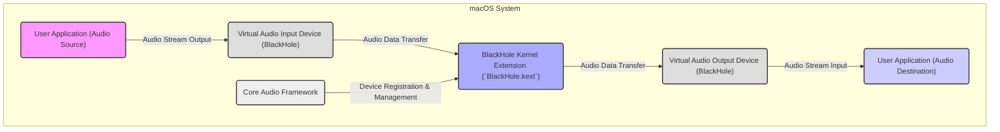
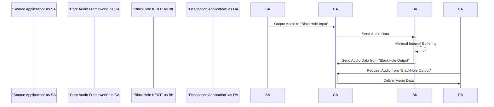

## Project Design Document: BlackHole Virtual Audio Driver

**Project Name:** BlackHole

**Project Repository:** https://github.com/existentialaudio/blackhole

**Document Version:** 1.1

**Date:** October 26, 2023

**Prepared By:** [Your Name/AI Assistant]

### 1. Introduction

BlackHole is a modern, open-source virtual audio driver for macOS, designed to facilitate seamless audio routing between applications with minimal latency. It operates as a kernel extension, integrating directly with the macOS Core Audio framework to create virtual input and output audio devices. This design document provides a comprehensive overview of BlackHole's architecture, components, and data flow, serving as a crucial foundation for subsequent security threat modeling and development efforts. Understanding this design is paramount for identifying potential vulnerabilities and ensuring the robustness and security of the driver.

### 2. Goals and Non-Goals

**2.1 Goals:**

*   **Inter-Application Audio Routing:**  Enable reliable and efficient transfer of audio streams between different applications running on macOS.
*   **Low-Latency Performance:** Achieve near-zero latency in audio signal transmission to meet the demands of real-time audio processing and performance.
*   **Multi-Channel Support:**  Provide support for routing multi-channel audio streams, catering to a variety of audio production and routing scenarios.
*   **Core Audio Integration:**  Fully integrate with the macOS Core Audio framework, leveraging its capabilities for device management and audio processing.
*   **Simplified Installation:** Offer a straightforward installation process for users with varying levels of technical expertise.
*   **Stable and Reliable Operation:** Ensure consistent and dependable audio routing functionality under normal operating conditions.

**2.2 Non-Goals:**

*   **Built-in Audio Processing:**  The driver will not include any inherent audio processing capabilities such as mixing, equalization, or effects.
*   **Advanced User Interface:** Configuration will be limited to standard macOS audio settings; a dedicated graphical user interface is not planned.
*   **Extended Audio Format Support:**  Focus will be on standard audio formats supported by Core Audio; specialized or esoteric formats are not a primary concern.
*   **Network Audio Functionality:**  Streaming audio over a network is outside the scope of this project.
*   **Cross-Platform Compatibility:**  The driver is specifically designed for macOS and will not be ported to other operating systems.

### 3. System Architecture

BlackHole functions as a kernel extension, residing within the privileged space of the macOS kernel. It interacts directly with the Core Audio framework to register and manage virtual audio input and output devices. Applications can then select these virtual devices as their audio sources or destinations, enabling the routing of audio data through the driver.

**Key Architectural Components:**

*   **User Applications (Audio Source/Destination):** These are the applications that utilize BlackHole to send or receive audio. Examples include Digital Audio Workstations (DAWs), audio editors, and streaming applications.
*   **Core Audio Framework:** The foundational audio subsystem of macOS. BlackHole registers its virtual audio devices with Core Audio, allowing the operating system and applications to recognize and interact with them.
*   **BlackHole Kernel Extension (`BlackHole.kext`):** The core of the driver, responsible for:
    *   Creating and managing the virtual audio input and output devices.
    *   Handling the transfer of audio data between these virtual devices.
    *   Interacting with the Core Audio framework for device lifecycle management and audio stream handling.
*   **Virtual Audio Input Device (BlackHole):**  A virtual input audio device presented to the system by the BlackHole kernel extension. Applications intending to send audio through BlackHole will output their audio stream to this device.
*   **Virtual Audio Output Device (BlackHole):** A virtual output audio device presented to the system by the BlackHole kernel extension. Applications intending to receive audio routed through BlackHole will select this device as their audio input.

### 4. Components

*   **`BlackHole.kext` (Kernel Extension):**
    *   **Audio Driver Core:**  Implements the core logic for capturing audio data from the virtual input device and delivering it to the virtual output device with minimal processing and latency.
    *   **Device Provider:**  Registers the virtual audio input and output devices with the Core Audio framework, defining their properties (e.g., number of channels, supported sample rates).
    *   **Audio Engine:** Manages the audio buffers and data flow between the input and output devices. This component is critical for achieving low latency.
    *   **Control Interface:** Handles control messages and configuration requests from the Core Audio framework, allowing the system to manage the driver's state.
    *   **Interrupt Service Routines (ISRs):**  Potentially used for handling time-critical audio data transfers, ensuring timely processing of audio samples.
*   **Installation Package (e.g., `.pkg` or shell script):**
    *   **Kernel Extension Deployment:** Copies the `BlackHole.kext` file to the appropriate system directory (`/Library/Extensions`).
    *   **Permissions Management:** Sets the necessary file permissions and ownership for the kernel extension to function correctly.
    *   **Kernel Extension Loading:**  May include steps to load the kernel extension into the operating system's kernel. This might involve using the `kextload` command or prompting the user to restart their system.
*   **Uninstallation Script:**
    *   **Kernel Extension Unloading:**  Unloads the `BlackHole.kext` from the kernel using the `kextunload` command.
    *   **File Removal:** Deletes the `BlackHole.kext` file from `/Library/Extensions`.

### 5. Data Flow

The following steps describe the typical flow of audio data when using BlackHole:

1. **Audio Output from Source Application:** A user application, designated as the audio source, is configured to output its audio stream to the **BlackHole Virtual Audio Input Device**.
2. **Core Audio Routing:** The macOS Core Audio framework intercepts the audio stream directed towards the BlackHole input device.
3. **Data Transfer to Kernel Extension:** Core Audio forwards the audio data to the **BlackHole Kernel Extension**.
4. **Internal Buffering (Minimal):** The BlackHole kernel extension receives the audio data. Due to the low-latency design, buffering is typically kept to a minimum.
5. **Data Transfer to Output Device:** The kernel extension immediately transfers the received audio data to the **BlackHole Virtual Audio Output Device**.
6. **Core Audio Retrieval:** The macOS Core Audio framework retrieves the audio data from the BlackHole output device when another application requests audio input from it.
7. **Audio Input to Destination Application:** The audio data is then delivered by Core Audio to the user application configured to receive audio from the **BlackHole Virtual Audio Output Device**.

### 6. Security Considerations (Detailed)

This section outlines potential security considerations associated with the BlackHole virtual audio driver. This information is crucial for identifying potential threats and informing mitigation strategies.

*   **Kernel-Level Vulnerabilities:**
    *   **Buffer Overflows/Underflows:**  Bugs in the audio data handling logic within the kernel extension could lead to buffer overflows or underflows, potentially allowing for arbitrary code execution in the kernel.
    *   **Race Conditions:** Concurrent access to shared resources within the kernel extension could create race conditions, leading to unpredictable behavior or security vulnerabilities.
    *   **Null Pointer Dereferences:** Errors in pointer handling could result in null pointer dereferences, causing kernel panics or exploitable conditions.
    *   **Integer Overflows:**  Improper handling of integer values could lead to overflows, potentially resulting in unexpected behavior or vulnerabilities.
*   **Privilege Escalation:**
    *   **IOKit Exploits:** Vulnerabilities in the driver's interaction with the IOKit framework could be exploited by user-level applications to gain elevated privileges.
    *   **Malicious Control Messages:**  Improper validation of control messages from the Core Audio framework could allow malicious applications to manipulate the driver's state or behavior.
*   **Data Security:**
    *   **Unintended Data Access:** Although BlackHole focuses on routing, vulnerabilities could potentially allow unauthorized applications to access audio data passing through the driver.
    *   **Data Corruption:** Bugs in the data transfer mechanisms could lead to corruption of the audio data being routed.
*   **Denial of Service (DoS):**
    *   **Resource Exhaustion:** A malicious application could attempt to exhaust the driver's resources (e.g., memory, processing time) by sending excessive amounts of audio data or control messages.
    *   **Kernel Panic:**  Certain input or operational sequences could potentially trigger a kernel panic, causing a system-wide denial of service.
*   **Supply Chain Security:**
    *   **Compromised Dependencies:**  If the build process relies on external libraries or tools, a compromise in those dependencies could introduce vulnerabilities into the driver.
    *   **Malicious Code Injection:**  During development or distribution, malicious actors could potentially inject malicious code into the driver.
*   **Installation and Configuration Security:**
    *   **Insecure Installation Practices:** Users might inadvertently install compromised versions of the driver from untrusted sources.
    *   **Incorrect Permissions:**  Improper file permissions on the kernel extension could allow unauthorized modification or loading of malicious code.
*   **Code Signing and Notarization:**  Lack of proper code signing and notarization would make it difficult for users to verify the authenticity and integrity of the driver, increasing the risk of installing malicious software.

### 7. Deployment

The deployment process for BlackHole typically involves the following steps:

*   **Download:** Users obtain the compiled `BlackHole.kext` file, ideally from a trusted source like the official GitHub releases page.
*   **Installation:**
    *   **Manual Installation:**
        *   Open Finder and navigate to the `/Library/Extensions` directory.
        *   Copy the `BlackHole.kext` file into this directory.
        *   Open Terminal and use the `sudo chown -R root:wheel /Library/Extensions/BlackHole.kext` command to set the correct ownership.
        *   Use the `sudo chmod -R 755 /Library/Extensions/BlackHole.kext` command to set appropriate permissions.
        *   Load the kernel extension using the command `sudo kextload /Library/Extensions/BlackHole.kext`.
    *   **Installation via Package Installer (`.pkg`):** A package installer can automate the above steps, providing a more user-friendly installation experience. The installer should handle file placement, permissions, and potentially kernel extension loading.
*   **Configuration:** After installation, users can select the "BlackHole 16ch" or "BlackHole 2ch" input and output devices within macOS's Sound settings (System Preferences > Sound) or directly within individual audio applications.
*   **Uninstallation:**
    *   Open Terminal.
    *   Unload the kernel extension using the command `sudo kextunload /Library/Extensions/BlackHole.kext`.
    *   Remove the kernel extension file using the command `sudo rm -rf /Library/Extensions/BlackHole.kext`.

**Important Considerations for Deployment:**

*   **System Integrity Protection (SIP):**  Users may need to temporarily disable SIP to install kernel extensions. Clear instructions and warnings regarding this should be provided.
*   **Code Signing and Notarization:**  The kernel extension should be properly code-signed by the developer and notarized by Apple to enhance security and user trust.
*   **User Education:**  Users should be educated about the risks of installing kernel extensions from untrusted sources and the importance of verifying the integrity of the downloaded files.

### 8. Future Considerations

*   **Enhanced Error Handling and Logging:** Implementing more comprehensive error handling and logging mechanisms within the kernel extension to aid in debugging and troubleshooting.
*   **Support for Variable Channel Counts:**  Exploring the possibility of dynamically configuring the number of audio channels supported by the virtual devices.
*   **Improved Resource Management:** Optimizing resource allocation and management within the kernel extension to enhance performance and stability.
*   **Formal Security Audit:** Conducting a thorough security audit by independent security experts to identify and address potential vulnerabilities in the codebase.
*   **Consideration of DriverKit:** Investigating the feasibility of migrating to DriverKit, Apple's modern framework for building device drivers, which offers enhanced security and stability compared to traditional kernel extensions.
*   **Community Engagement:**  Encouraging community contributions and feedback to improve the driver's functionality and security.

This revised design document provides a more detailed and comprehensive overview of the BlackHole virtual audio driver, specifically focusing on aspects relevant to security considerations and threat modeling. It aims to provide a clear understanding of the system's architecture, components, and data flow, facilitating informed discussions about potential security risks and mitigation strategies.