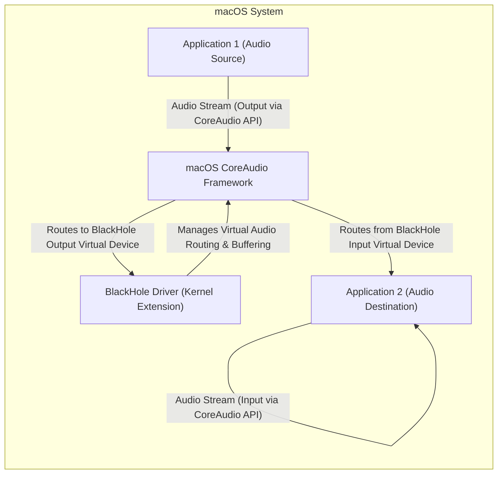
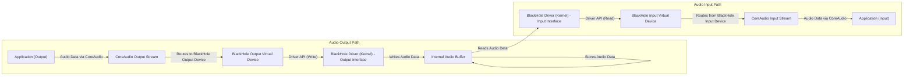

# Project Design Document: BlackHole Virtual Audio Driver

**Version:** 1.1
**Date:** October 26, 2023
**Author:** AI Software Architect

## 1. Introduction

This document provides a detailed design overview of the BlackHole virtual audio driver project, as found in the GitHub repository [https://github.com/existentialaudio/blackhole](https://github.com/existentialaudio/blackhole). This document aims to clearly articulate the system's architecture, components, and data flow to facilitate a comprehensive threat modeling exercise. This revision includes more detailed explanations and clarifies certain aspects of the system.

## 2. Goals

*   Provide a clear and concise description of the BlackHole audio driver's architecture and functionality.
*   Identify key components and their specific responsibilities.
*   Illustrate the data flow within the system with enhanced clarity.
*   Highlight potential areas of security concern with more detailed examples for future threat modeling.

## 3. Overview

BlackHole is a modern macOS virtual audio driver that allows applications to pass audio to other applications with zero additional latency. It essentially creates virtual input and output devices that can be selected within audio applications. Audio sent to a BlackHole output device becomes available as input from the corresponding BlackHole input device. This enables complex audio routing scenarios within macOS, such as routing audio from a Digital Audio Workstation (DAW) to a live streaming application.

## 4. High-Level Architecture

*   **Application 1 (Audio Source):** Any macOS application capable of outputting audio through the CoreAudio framework (e.g., a music player, a DAW).
*   **Application 2 (Audio Destination):** Any macOS application capable of receiving audio input through the CoreAudio framework (e.g., a recording application, a video conferencing tool).
*   **BlackHole Driver (Kernel Extension):** The core software module, operating at the kernel level, responsible for creating and managing the virtual audio input and output devices and facilitating the transfer of audio data between them.
*   **macOS CoreAudio Framework:** The underlying audio subsystem of macOS that provides the APIs and infrastructure for managing audio devices, streams, and processing. BlackHole registers its virtual devices with this framework.

## 5. Detailed Design

### 5.1. Components

*   **Kernel Extension (`.kext`):**
    *   This is the central component of BlackHole, executing within the privileged kernel space of macOS.
    *   **Virtual Device Registration:** Registers a pair of virtual audio devices (one input, one output) with the macOS CoreAudio framework. These devices appear to applications as standard audio input/output options.
    *   **Audio Stream Management:** Implements the necessary `IOAudioEngine` and `IOAudioDevice` interfaces required by CoreAudio to manage audio streams. This includes handling requests to start and stop streams, and negotiating audio formats (sample rate, bit depth, channel count).
    *   **Internal Buffering:** Manages internal memory buffers to temporarily store audio data received from the output virtual device before it is read by the input virtual device. This buffering is crucial for the zero-latency aspect.
    *   **Data Transfer:** Facilitates the efficient transfer of audio data between the output and input sides of the virtual device, likely using techniques like shared memory or direct memory access within the kernel.
    *   **Synchronization:** Implements mechanisms to ensure proper synchronization between the input and output streams, preventing data loss or corruption.
    *   **Potential Sub-modules:** May internally consist of sub-modules responsible for:
        *   Output stream handling.
        *   Input stream handling.
        *   Buffer management.
        *   Communication with CoreAudio.

*   **Installation Package (`.pkg`):**
    *   The standard macOS package format used to deploy the BlackHole driver.
    *   **File Placement:** Copies the compiled kernel extension (`.kext` bundle) to the designated system directory for kernel extensions (`/Library/Extensions`).
    *   **Permissions and Ownership:** Sets the correct file permissions and ownership to ensure the kernel extension can be loaded and executed by the system.
    *   **Kext Caching:** May trigger updates to the kernel extension cache to ensure the new driver is recognized by the system during boot.
    *   **Potential Scripts:** Could include pre- or post-installation scripts for tasks like prompting for administrator credentials or displaying informational messages.

*   **Uninstaller (Potentially Script-Based or Part of the Installer):**
    *   Responsible for the clean removal of the BlackHole driver from the system.
    *   **Kext Removal:** Deletes the kernel extension file from `/Library/Extensions`.
    *   **Cache Update:** May trigger an update to the kernel extension cache to remove the driver from the system's list of available extensions.
    *   **Cleanup:** Should handle the removal of any other files or configurations created during installation.
    *   **Privilege Requirements:** Typically requires administrator privileges to remove kernel extensions.

### 5.2. Data Flow

1. **Audio Output Process:**
    *   An audio source application, using the CoreAudio API, sends an audio stream intended for the BlackHole output virtual device.
    *   The macOS CoreAudio framework routes this audio stream to the registered BlackHole output virtual device.
    *   The output interface of the BlackHole kernel driver receives this audio data.
    *   The driver writes the received audio data into a designated internal buffer.

2. **Audio Input Process:**
    *   An audio destination application, using the CoreAudio API, requests an audio stream from the BlackHole input virtual device.
    *   The macOS CoreAudio framework routes this request to the registered BlackHole input virtual device.
    *   The input interface of the BlackHole kernel driver reads audio data from the internal buffer.
    *   The driver provides this audio data back to the CoreAudio framework.
    *   CoreAudio delivers the audio stream to the requesting input application.

### 5.3. Interactions

*   **Application <-> CoreAudio:** Applications interact with CoreAudio using standard audio APIs (e.g., AudioUnit, AudioToolbox). This involves selecting audio devices, starting and stopping audio streams, and receiving or sending audio data buffers.
*   **CoreAudio <-> BlackHole Driver:** CoreAudio interacts with the BlackHole driver through the defined `IOAudioEngine` and `IOAudioDevice` interfaces. CoreAudio manages the lifecycle of the driver, requests information about the virtual devices (e.g., supported formats), and requests audio data to be read from or written to the driver.
*   **BlackHole Driver (Output Side) <-> BlackHole Driver (Input Side):** This interaction is internal to the kernel extension and involves the management of the shared audio buffer. Mechanisms like mutexes, semaphores, or other kernel-level synchronization primitives are likely used to ensure data integrity and prevent race conditions when accessing the buffer from both the output and input sides.
*   **Installation Package <-> macOS System:** The installation package uses standard macOS system calls and frameworks (e.g., `Installer.app`, `pkgutil`) to copy files, set permissions, and interact with the kernel extension loading system.
*   **Uninstaller <-> macOS System:** The uninstaller utilizes system calls (e.g., `rm`, `kextunload`) to remove the kernel extension file and potentially update the kernel extension cache. Administrator privileges are typically required for these operations.

## 6. Security Considerations (Detailed for Threat Modeling)

This section outlines potential areas of security concern with more specific examples to facilitate a thorough threat modeling exercise.

*   **Kernel Extension Vulnerabilities:** Exploitable flaws within the kernel extension could have severe consequences due to the elevated privileges of kernel code.
    *   **Buffer Overflows:**  Improper bounds checking when writing audio data to the internal buffer could allow an attacker to overwrite adjacent memory, potentially leading to code execution or system crashes. For example, sending an audio stream with a larger-than-expected buffer size.
    *   **Integer Overflows:**  Errors in calculations related to buffer sizes or audio sample counts could lead to unexpected behavior or vulnerabilities.
    *   **Race Conditions:**  If the input and output sides of the driver access the shared buffer without proper synchronization, it could lead to data corruption or inconsistent state.
    *   **Use-After-Free:**  Incorrect memory management could result in the driver attempting to access memory that has already been freed, leading to crashes or potential exploitation.
    *   **Null Pointer Dereferences:**  Failing to properly validate pointers before accessing them could lead to crashes.

*   **Data Integrity:** While designed for lossless transfer, vulnerabilities could allow malicious applications to manipulate audio data.
    *   **Unauthorized Modification:** A compromised application could potentially inject malicious code or signals into the audio stream as it passes through the driver.
    *   **Data Corruption:** Bugs in the driver's buffering or transfer mechanisms could lead to unintentional corruption of the audio data.

*   **Availability:** Errors or crashes in the kernel extension can impact system stability.
    *   **Kernel Panic:** Unhandled exceptions or critical errors within the driver could lead to a kernel panic, requiring a system restart.
    *   **Denial of Service:** A malicious application could potentially send malformed audio data or make excessive requests to the driver, causing it to become unresponsive or crash, effectively denying service to other audio applications.

*   **Installation and Uninstallation Security:**
    *   **Installation Package Tampering:** A malicious actor could replace the legitimate installation package with a compromised version containing malware. This highlights the importance of verifying the source and integrity of the installation package.
    *   **Privilege Escalation during Installation:** If the installation process has vulnerabilities, an attacker might be able to escalate their privileges.
    *   **Insecure Uninstallation:** If the uninstallation process doesn't completely remove the driver or leaves behind vulnerable components, it could still pose a security risk.

*   **Resource Exhaustion:**
    *   **Memory Exhaustion:** A malicious application could send extremely high bitrate or multi-channel audio streams to the BlackHole output, potentially exhausting kernel memory resources.
    *   **CPU Exhaustion:**  Inefficient code within the driver could consume excessive CPU resources when processing audio data, impacting overall system performance.

*   **Information Disclosure:**
    *   **Accidental Data Leakage:** Although primarily handling audio data, if the driver inadvertently exposes kernel memory or other sensitive information, it could be a vulnerability.

## 7. Future Considerations (Out of Scope for Initial Threat Model)

These are potential future features or changes that would need to be considered in subsequent design iterations and threat models.

*   **Configuration Interface:** If a user-space application or system preference pane is introduced to configure BlackHole settings, this would introduce new attack surfaces and require careful security considerations.
*   **Network Audio Streaming Capabilities:** If BlackHole were to support streaming audio over a network, this would introduce significant new security challenges related to network protocols, authentication, and encryption.
*   **Advanced Audio Processing:** If the driver were to incorporate audio processing features (e.g., mixing, filtering), this would add complexity and potential vulnerabilities in the processing logic.
*   **Support for Remote Control/Management:**  Any features allowing remote control of the driver would require robust authentication and authorization mechanisms.

## 8. Appendix

### 8.1. Glossary

*   **Kernel Extension (`.kext`):** A package of code that extends the functionality of the macOS kernel, operating with elevated privileges.
*   **CoreAudio:** The audio subsystem framework in macOS, providing APIs for audio input, output, and processing.
*   **Virtual Audio Driver:** A software component that emulates a physical audio device, allowing audio routing between applications.
*   **IPC (Inter-Process Communication):** Mechanisms that allow different processes to communicate with each other. While less direct for internal kernel communication, the concept of managing shared resources applies.
*   **DAW (Digital Audio Workstation):** A software application used for recording, editing, and producing audio.