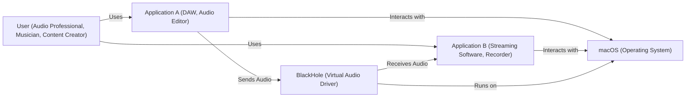
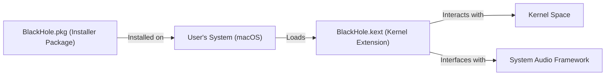

# BUSINESS POSTURE

BlackHole is an open-source virtual audio driver that allows applications to pass audio to other applications with zero additional latency. It's a tool primarily used by audio professionals, musicians, and content creators for routing audio between applications on macOS.

Business Priorities and Goals:

*   Provide a reliable and stable virtual audio driver.
*   Maintain zero additional latency for real-time audio processing.
*   Ensure compatibility with a wide range of audio applications and macOS versions.
*   Maintain a positive reputation within the audio community.
*   Provide easy installation and usage.
*   Keep the project open-source and free to use.

Business Risks:

*   Malicious modification of the driver: Since BlackHole is open-source, there's a risk of malicious actors creating modified versions that could harm users' systems or steal data.
*   Compatibility issues: Changes in macOS or audio applications could break BlackHole's functionality, leading to user frustration and potential data loss (audio routing failure).
*   Lack of support: As a free, open-source project, providing timely support to all users can be challenging.
*   Reputation damage: Negative reviews or reports of instability could harm the project's reputation and adoption.
*   Security vulnerabilities: Undiscovered vulnerabilities in the driver could be exploited by attackers.

# SECURITY POSTURE

Existing Security Controls:

*   security control: Code signing: The distributed binaries are code-signed, ensuring that the software comes from a known source and hasn't been tampered with. (Mentioned in the GitHub repository's README and build process).
*   security control: Community vigilance: Being open-source allows for community scrutiny of the code, potentially identifying vulnerabilities and bugs. (Implicit in open-source projects).
*   security control: Simple design: The core functionality is relatively simple, reducing the attack surface. (Observed from the code structure).

Accepted Risks:

*   accepted risk: Limited formal security testing: The project likely relies on user reports and community contributions for security testing, rather than dedicated professional security audits.
*   accepted risk: Dependence on macOS security: BlackHole relies on the underlying security mechanisms of macOS for its own security.
*   accepted risk: No built-in update mechanism: Users need to manually check for and install updates, potentially leaving them vulnerable to known issues.

Recommended Security Controls:

*   security control: Implement a Software Bill of Materials (SBOM) to track all components and dependencies.
*   security control: Integrate static application security testing (SAST) into the build process to identify potential vulnerabilities early.
*   security control: Consider implementing a vulnerability disclosure program to encourage responsible reporting of security issues.

Security Requirements:

*   Authentication: Not directly applicable, as BlackHole doesn't handle user authentication. It operates at the system level.
*   Authorization: Relies on the macOS system's authorization mechanisms for driver installation and access. BlackHole itself does not implement custom authorization logic.
*   Input Validation: BlackHole receives audio data as input. While it doesn't perform explicit input validation in the traditional sense (like checking for malicious strings), it must handle various audio formats and sample rates correctly to prevent crashes or unexpected behavior. The primary concern here is robustness against malformed or unexpected audio data.
*   Cryptography: Not directly applicable, as BlackHole doesn't handle sensitive data that requires encryption in transit or at rest. The audio data it handles is generally not considered confidential in the context of this driver.

# DESIGN

## C4 CONTEXT

Element Descriptions:

*   Element:
    *   Name: User
    *   Type: Person
    *   Description: A person who uses audio applications and needs to route audio between them.
    *   Responsibilities: Configures audio routing in applications, installs BlackHole.
    *   Security controls: Relies on macOS user account security.

*   Element:
    *   Name: BlackHole
    *   Type: Software System
    *   Description: A virtual audio driver that allows routing audio between applications.
    *   Responsibilities: Receives audio from one application and makes it available to other applications. Maintains zero additional latency.
    *   Security controls: Code signing.

*   Element:
    *   Name: Application A
    *   Type: Software System
    *   Description: An application that produces audio, such as a DAW or audio editor.
    *   Responsibilities: Generates audio data. Sends audio to BlackHole.
    *   Security controls: Relies on its own security measures and macOS application security.

*   Element:
    *   Name: Application B
    *   Type: Software System
    *   Description: An application that receives audio, such as streaming software or a recorder.
    *   Responsibilities: Receives audio from BlackHole. Processes audio data.
    *   Security controls: Relies on its own security measures and macOS application security.

*   Element:
    *   Name: macOS
    *   Type: Software System
    *   Description: The operating system on which BlackHole and the applications run.
    *   Responsibilities: Provides the underlying infrastructure and security mechanisms for drivers and applications.
    *   Security controls: macOS built-in security features (SIP, XProtect, Gatekeeper, etc.).

## C4 CONTAINER

In this simple case, the container diagram is essentially the same as the context diagram, as BlackHole itself is the single "container."

Element Descriptions:

*   Element:
    *   Name: User
    *   Type: Person
    *   Description: A person who uses audio applications and needs to route audio between them.
    *   Responsibilities: Configures audio routing in applications, installs BlackHole.
    *   Security controls: Relies on macOS user account security.

*   Element:
    *   Name: BlackHole
    *   Type: Software System / Container
    *   Description: A virtual audio driver that allows routing audio between applications.  This is the single container.
    *   Responsibilities: Receives audio from one application and makes it available to other applications. Maintains zero additional latency.
    *   Security controls: Code signing.

*   Element:
    *   Name: Application A
    *   Type: Software System
    *   Description: An application that produces audio, such as a DAW or audio editor.
    *   Responsibilities: Generates audio data. Sends audio to BlackHole.
    *   Security controls: Relies on its own security measures and macOS application security.

*   Element:
    *   Name: Application B
    *   Type: Software System
    *   Description: An application that receives audio, such as streaming software or a recorder.
    *   Responsibilities: Receives audio from BlackHole. Processes audio data.
    *   Security controls: Relies on its own security measures and macOS application security.

*   Element:
    *   Name: macOS
    *   Type: Software System
    *   Description: The operating system on which BlackHole and the applications run.
    *   Responsibilities: Provides the underlying infrastructure and security mechanisms for drivers and applications.
    *   Security controls: macOS built-in security features (SIP, XProtect, Gatekeeper, etc.).

## DEPLOYMENT

BlackHole is deployed as a macOS kernel extension (driver).  There are a few possible deployment scenarios:

1.  Manual Installation (using the installer package): This is the primary and recommended method.
2.  Command-line installation (for advanced users).
3.  Building from source and manual loading (for developers).

We'll describe the primary method (Installer Package):

Element Descriptions:

*   Element:
    *   Name: Installer Package
    *   Type: File
    *   Description: A standard macOS installer package (.pkg) containing the compiled kernel extension and installation scripts.
    *   Responsibilities: Installs the kernel extension to the correct location, sets appropriate permissions.
    *   Security controls: Code signing of the installer package.

*   Element:
    *   Name: User's System
    *   Type: Operating System
    *   Description: The user's macOS computer.
    *   Responsibilities: Runs the installer, loads the kernel extension.
    *   Security controls: macOS Gatekeeper, System Integrity Protection (SIP).

*   Element:
    *   Name: Kernel Space
    *   Type: Operating System Component
    *   Description: The privileged part of the macOS operating system where kernel extensions run.
    *   Responsibilities: Manages hardware resources, provides low-level system services.
    *   Security controls: macOS kernel security mechanisms.

*   Element:
    *   Name: System Audio Framework
    *   Type: Operating System Component
    *   Description: The part of macOS that handles audio input and output.
    *   Responsibilities: Manages audio devices, routes audio streams.
    *   Security controls: macOS audio framework security.

*   Element:
    *   Name: BlackHole.kext
    *   Type: Kernel Extension
    *   Description: The compiled BlackHole kernel extension.
    *   Responsibilities: Creates virtual audio devices, handles audio routing.
    *   Security controls: Code signing, macOS kernel extension security.

## BUILD

The build process for BlackHole involves compiling the source code and creating a signed installer package. The GitHub repository uses a combination of Xcode and command-line tools.

```mermaid
graph LR
    Developer["Developer"]
    SourceCode["Source Code (GitHub)"]
    Xcode["Xcode"]
    BuildScripts["Build Scripts (Shell, make)"]
    CompiledCode["Compiled Code (.kext)"]
    InstallerPackage["Installer Package (.pkg)"]
    CodeSigning["Code Signing (Developer ID)"]

    Developer -- Commits --> SourceCode
    SourceCode -- Cloned to --> Xcode
    Xcode -- Uses --> BuildScripts
    BuildScripts -- Compiles --> CompiledCode
    CompiledCode -- Packaged into --> InstallerPackage
    InstallerPackage -- Signed with --> CodeSigning
```

Element Descriptions:

*   Developer: Writes and commits code.
*   Source Code (GitHub): The BlackHole source code repository on GitHub.
*   Xcode: The integrated development environment (IDE) used for macOS development.
*   Build Scripts: Shell scripts and makefiles that automate the build process.
*   Compiled Code (.kext): The compiled kernel extension.
*   Installer Package (.pkg): The final installer package, ready for distribution.
*   Code Signing: The process of digitally signing the code to ensure its authenticity and integrity.

Security Controls in Build Process:

*   security control: Code Signing: The final installer package is signed with a Developer ID certificate, ensuring that it comes from a trusted source and hasn't been tampered with.
*   security control: Use of Build Scripts: Automating the build process reduces the risk of manual errors and ensures consistency.
*   security control: (Recommended) SAST: Static Application Security Testing tools could be integrated into the build process to scan for potential vulnerabilities.
*   security control: (Recommended) SBOM: A Software Bill of Materials should be generated to track all dependencies.

# RISK ASSESSMENT

Critical Business Processes:

*   Providing a reliable and stable virtual audio driver for routing audio between applications on macOS.
*   Maintaining the reputation of the BlackHole project as a trusted and useful tool for audio professionals.

Data:

*   Audio Data (Low Sensitivity): BlackHole handles audio streams, but this data is generally not considered sensitive in the context of the driver itself. The sensitivity of the audio data depends on the applications using BlackHole. The driver itself does not store or transmit this data persistently.
*   System Configuration (Medium Sensitivity): BlackHole interacts with the system's audio configuration, but it doesn't store any sensitive user data. Incorrect configuration could lead to audio routing issues, but not data breaches.
*   No user data or credentials handled by the driver.

# QUESTIONS & ASSUMPTIONS

Questions:

*   Are there any plans for supporting other operating systems (e.g., Windows, Linux)?
*   What is the long-term maintenance plan for BlackHole?
*   Are there any specific performance benchmarks or testing procedures used?
*   Is there a formal process for handling user bug reports and feature requests?
*   Are there any plans to implement an automatic update mechanism?

Assumptions:

*   BUSINESS POSTURE: The project prioritizes stability, reliability, and zero-latency performance over adding new features. The project aims to remain free and open-source.
*   SECURITY POSTURE: The project relies heavily on macOS's built-in security mechanisms and code signing. There is no dedicated security budget or team.
*   DESIGN: The design is intentionally simple to minimize complexity and potential vulnerabilities. The primary focus is on core functionality.