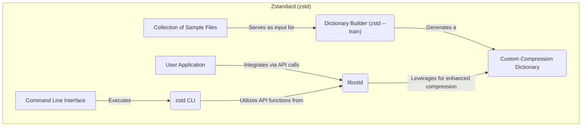
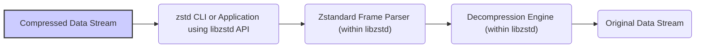

# Project Design Document: Zstandard (zstd) - Improved

**Version:** 1.1
**Date:** October 26, 2023
**Prepared By:** Gemini (AI Language Model)

## 1. Introduction

This document provides an enhanced design overview of the Zstandard (zstd) project, a high-performance lossless data compression algorithm and library developed by Facebook. This document builds upon the previous version, offering more detailed insights into the project's architecture, components, and data flow. The information is derived from the publicly accessible source code repository: [https://github.com/facebook/zstd](https://github.com/facebook/zstd). This document serves as a comprehensive resource for understanding the system's design, which is crucial for effective threat modeling.

## 2. Goals

The core objectives of the Zstandard project are:

*   Achieve high compression ratios, competitive with or exceeding zlib's performance.
*   Deliver exceptionally fast compression and decompression speeds, catering to performance-sensitive applications.
*   Offer a granular range of compression levels, enabling users to fine-tune the trade-off between compression ratio and processing speed.
*   Provide robust streaming APIs for efficient handling of large datasets that may not fit into memory.
*   Equip users with a user-friendly command-line interface (CLI) for direct file compression and decompression tasks.
*   Ensure broad portability and usability across diverse operating systems and hardware architectures.
*   Incorporate support for dictionary compression, significantly enhancing compression efficiency for small and repetitive data segments.

## 3. Architecture Overview

Zstandard's architecture comprises the following principal elements:

*   **Core Compression Library (`libzstd`):** The foundational component encompassing the core compression and decompression algorithms. It exposes APIs for seamless integration of Zstandard capabilities into external applications.
*   **Standalone Command-Line Interface (`zstd`):** An independent executable application enabling users to compress and decompress files directly through command-line interactions. It internally utilizes the core library's functionalities.
*   **Dictionary Training Utility (`zstd --train`):** A specialized tool integrated within the CLI, allowing users to generate custom dictionaries from a collection of representative sample files. These dictionaries are instrumental in optimizing compression ratios for data exhibiting similar characteristics.
*   **Cross-Platform Build System:** The project employs a build system (likely `make` or `cmake`) to facilitate the compilation of the library and command-line tools across various target platforms.
*   **Comprehensive Documentation Set:** Includes detailed API documentation, practical usage examples, and potentially in-depth design specifications.

## 4. Component Details

### 4.1. Core Compression Library (`libzstd`)

*   **Purpose:** To provide the fundamental algorithms and data structures for lossless data compression and decompression.
*   **Key Features:**
    *   Implements a spectrum of compression levels, each representing a distinct balance between compression ratio and processing speed.
    *   Offers both single-pass and multi-pass compression strategies, catering to different performance requirements.
    *   Supports streaming compression and decompression, enabling the processing of arbitrarily large data streams in manageable chunks.
    *   Manages internal memory buffers and allocation strategies for efficient compression and decompression operations.
    *   Provides mechanisms for creating, loading, and utilizing custom compression dictionaries.
    *   Exposes a well-defined C API, facilitating integration with applications developed in various programming languages.
*   **Internal Structure (Conceptual):**
    *   **Compression Engine:**  The core logic responsible for transforming input data into its compressed representation. This involves techniques like:
        *   **Match Finding:** Identifying repeating sequences within the data.
        *   **Entropy Encoding:** Encoding symbols based on their frequency (e.g., using Finite State Entropy - FSE, or Huffman coding).
        *   **Literal Compression:** Handling data that doesn't match existing patterns.
    *   **Decompression Engine:**  The counterpart to the compression engine, responsible for reconstructing the original data from its compressed form by reversing the compression steps.
    *   **Dictionary Management Module:** Handles the loading, storage, and application of compression dictionaries during both compression and decompression processes.
    *   **Frame Format Handler:**  Manages the structure of the Zstandard compressed data format, which includes metadata such as compression parameters, dictionary IDs, and integrity checksums.
    *   **Memory Management Subsystem:**  Responsible for the allocation and deallocation of memory required for internal buffers and data structures during compression and decompression.

### 4.2. Standalone Command-Line Interface (`zstd`)

*   **Purpose:** To provide a direct and user-friendly command-line interface for compressing and decompressing files.
*   **Key Features:**
    *   Accepts a wide array of command-line arguments to control compression levels, specify dictionary files, manage output file naming conventions, and configure other operational parameters.
    *   Supports reading input data from files or standard input streams.
    *   Supports writing output data to files or standard output streams.
    *   Offers capabilities for recursive compression and decompression of directory structures.
    *   Includes functionality to verify the integrity of compressed data, ensuring data consistency.
    *   Integrates the dictionary training utility (`zstd --train`).
*   **Workflow:**
    1. Parses command-line arguments provided by the user.
    2. Opens the specified input and output files (or utilizes standard input/output streams).
    3. Invokes the appropriate compression or decompression functions from the `libzstd` library based on the user's request.
    4. Manages error conditions and provides informative feedback to the user.

### 4.3. Dictionary Training Utility (`zstd --train`)

*   **Purpose:** To generate custom compression dictionaries that can significantly improve compression ratios, particularly for datasets with recurring patterns.
*   **Key Features:**
    *   Analyzes a collection of user-provided sample files to identify frequently occurring byte sequences and patterns.
    *   Generates a dictionary file containing these identified patterns.
    *   Provides options to control the size of the generated dictionary and other relevant parameters.
*   **Workflow:**
    1. Reads the content of the sample files provided by the user.
    2. Analyzes the data to identify the most frequent and statistically significant byte sequences.
    3. Selects a subset of these sequences to include in the dictionary, optimizing for compression effectiveness.
    4. Writes the generated dictionary to a specified output file.

## 5. Data Flow

The following diagrams illustrate the typical flow of data during compression and decompression operations:

### 5.1. Compression Data Flow

**Detailed Steps:**

*   **Input Data Stream:** The data intended for compression is provided either to the `zstd` CLI or to an application that utilizes the `libzstd` API.
*   **zstd CLI or Application using libzstd API:** The CLI or the application initiates the compression process, potentially specifying parameters such as the compression level and the dictionary to be used.
*   **Compression Engine (within libzstd):** The core compression algorithm within `libzstd` processes the input data stream. This involves identifying redundant patterns, applying entropy encoding techniques, and potentially leveraging a provided dictionary for enhanced compression.
*   **Zstandard Frame Formatter (within libzstd):** The compressed data is then structured into the Zstandard frame format. This format includes metadata such as compression parameters, dictionary identifiers (if applicable), and integrity checksums.
*   **Compressed Data Stream:** The resulting compressed data stream is outputted.

### 5.2. Decompression Data Flow

**Detailed Steps:**

*   **Compressed Data Stream:** The compressed data stream is provided to the `zstd` CLI or an application utilizing the `libzstd` API.
*   **zstd CLI or Application using libzstd API:** The CLI or application initiates the decompression process.
*   **Zstandard Frame Parser (within libzstd):** The Zstandard frame is parsed to extract essential metadata, including compression parameters and dictionary information.
*   **Decompression Engine (within libzstd):** The core decompression algorithm within `libzstd` reverses the compression process, utilizing the extracted metadata and potentially a dictionary to reconstruct the original data stream.
*   **Original Data Stream:** The reconstructed, original data stream is outputted.

## 6. Security Considerations (Pre-Threat Modeling)

Based on the architectural design and data flow, the following preliminary security considerations are identified:

*   **Robust Input Validation:** Both the `zstd` CLI and applications integrating `libzstd` must rigorously validate all input data (both compressed and uncompressed) to prevent vulnerabilities such as buffer overflows, format string exploits, and other injection-based attacks.
*   **Secure Memory Management:**  Potential vulnerabilities in memory allocation and deallocation routines within `libzstd` could lead to crashes, memory corruption, or exploitable conditions. Careful attention to memory safety is paramount.
*   **Protection Against Denial of Service (DoS):**  Maliciously crafted compressed data could be designed to consume excessive computational resources or memory during decompression, potentially leading to denial-of-service conditions. Rate limiting and resource management are important considerations.
*   **Mitigation of Dictionary Poisoning:** If a malicious actor can manipulate the content of a compression dictionary, they might be able to influence the compression or decompression process in unintended and potentially harmful ways. Secure dictionary distribution and validation are necessary.
*   **Prevention of Integer Overflows:**  Calculations involving buffer sizes, compression parameters, and other numerical values must be carefully implemented to prevent integer overflows, which could lead to unexpected behavior or vulnerabilities.
*   **Supply Chain Security Measures:**  Ensuring the integrity of the Zstandard source code and the build pipeline is crucial to prevent the introduction of malicious code or backdoors. Secure development practices and build verification processes are essential.
*   **Consideration of Side-Channel Attacks:** While potentially less likely, it's important to be aware of potential side-channel vulnerabilities in the compression algorithms themselves that could leak sensitive information. This might involve analyzing timing variations or other observable behaviors.

## 7. Dependencies

The Zstandard project relies on standard C libraries for its core functionality. Depending on the specific build configuration and target platform, it may have additional dependencies, including:

*   **Standard C Library (`libc`):**  Provides fundamental functions for memory management (e.g., `malloc`, `free`), input/output operations (e.g., `fread`, `fwrite`), and other essential system-level functionalities.
*   **Build System Tools:**  Tools such as `make`, `cmake`, or similar are necessary for compiling the project's source code into executable binaries and libraries.
*   **C Compiler:**  A compatible C compiler (e.g., GCC, Clang) is required to translate the C source code into machine code.

## 8. Deployment Considerations

Zstandard offers flexible deployment options:

*   **Library Integration:** Applications can link directly against the `libzstd` library to seamlessly incorporate compression and decompression capabilities within their own processes. This is the most common method for developers.
*   **Standalone Command-Line Tool Usage:** The `zstd` executable can be deployed as a standalone utility, allowing users to perform compression and decompression tasks directly from the command line without requiring any additional software. This is suitable for scripting and general-purpose file compression.
*   **Bundled within Other Software:** Other software projects may choose to bundle the `libzstd` library within their distribution packages to provide built-in compression support for their specific data formats or operations.
*   **Operating System Integration:** Some operating systems may include Zstandard as a core utility or library, making it readily available to users and applications.

## 9. Non-Goals

The Zstandard project explicitly does not aim to:

*   Provide encryption capabilities. Zstandard focuses solely on lossless data compression. Encryption would require the integration of separate cryptographic libraries.
*   Offer lossy compression algorithms. Zstandard is designed for lossless compression, ensuring that the original data can be perfectly reconstructed.
*   Replace all other compression algorithms in all use cases. While Zstandard aims for high performance and compression, specific use cases might benefit from other specialized algorithms.

## 10. Future Considerations

Potential future enhancements and areas for exploration include:

*   Further optimization of compression and decompression speeds through algorithmic improvements or hardware acceleration.
*   Exploration of new compression techniques to achieve even higher compression ratios.
*   Development of bindings for additional programming languages to broaden its accessibility.
*   Improvements to the dictionary training algorithm for more effective dictionary generation.

This enhanced design document provides a more in-depth understanding of the Zstandard project's architecture and components. This detailed information is crucial for conducting a comprehensive threat model to identify potential security vulnerabilities and develop appropriate mitigation strategies.