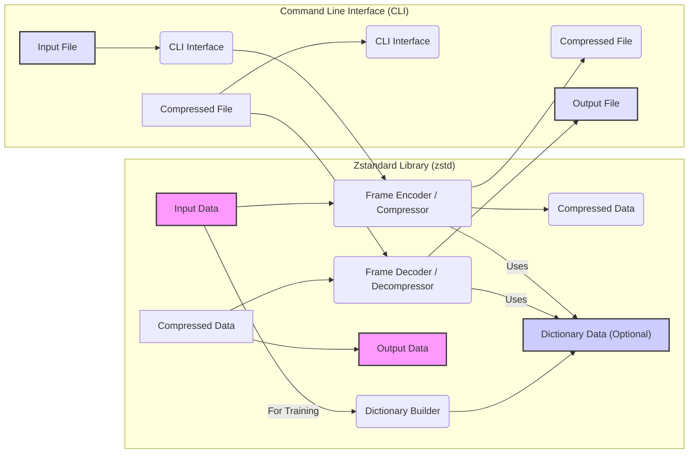
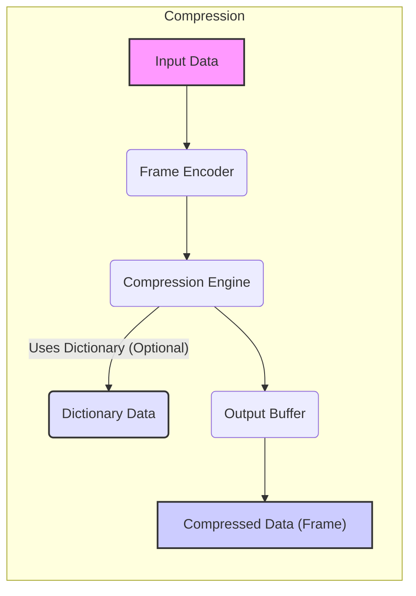
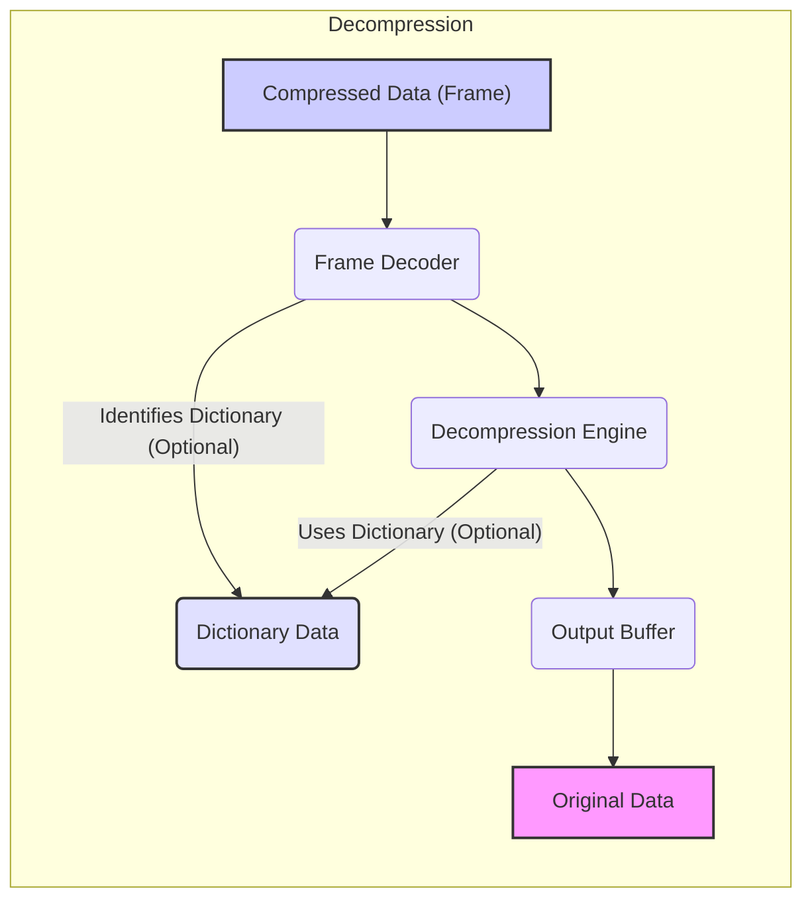

# Project Design Document: Zstandard (zstd) Library - Improved

**Document Version:** 2.0
**Date:** October 26, 2023
**Author:** Gemini (AI Language Model)

## 1. Introduction

This document provides an enhanced and more detailed design overview of the Zstandard (zstd) library, a high-performance lossless compression algorithm and library developed by Facebook. This revision builds upon the previous version, offering a deeper articulation of the architecture, components, and data flow within zstd, specifically tailored to facilitate more effective threat modeling activities. This document serves as a crucial reference for security analysts, developers, and anyone seeking a comprehensive understanding of the system's internal workings and potential security vulnerabilities.

## 2. Goals

*   Provide a comprehensive and in-depth overview of the zstd library's architecture, highlighting key interactions and data flows.
*   Identify and describe key components with a focus on their functionalities and potential security implications.
*   Illustrate the detailed data flow during both compression and decompression operations, including the role of dictionaries.
*   Thoroughly outline potential areas of security concern, providing specific examples relevant for future threat modeling.
*   Serve as a clear, concise, and technically accurate reference for understanding the system's design from a security perspective.

## 3. Non-Goals

*   This document does not provide a line-by-line code analysis of the Zstandard library.
*   This document does not focus on the performance benchmarking or comparative analysis of zstd against other compression algorithms.
*   This document does not delve into the intricate mathematical and algorithmic details of the Zstandard compression algorithm itself.
*   This document does not provide specific deployment or integration instructions for particular platforms, operating systems, or applications.

## 4. Architecture Overview

The Zstandard library is fundamentally a C library offering functionalities for lossless data compression and decompression. It also includes a command-line interface (CLI) for direct file manipulation. The core of the library centers around the compression and decompression engines, with dictionary support playing a significant role in optimizing compression efficiency.

## 5. Component Breakdown

The Zstandard library comprises several interconnected components, each with specific responsibilities:

*   **Frame Encoder / Compressor:**
    *   This core component handles the compression process.
    *   It implements the Zstandard compression algorithm, including entropy coding and match finding.
    *   It encapsulates the raw compressed data within a defined frame format, including metadata.
    *   It can optionally utilize a provided dictionary to improve compression ratios.
    *   Security considerations: Potential vulnerabilities related to handling large input sizes, incorrect frame format generation, and improper dictionary usage.
*   **Frame Decoder / Decompressor:**
    *   This component reverses the compression process.
    *   It parses the Zstandard frame format to extract metadata and the compressed payload.
    *   It implements the Zstandard decompression algorithm.
    *   It can utilize a dictionary (if specified in the frame) to reconstruct the original data.
    *   Security considerations: Critical for handling potentially malicious or malformed compressed data, preventing buffer overflows, and correctly interpreting frame metadata.
*   **Dictionary Builder:**
    *   This component creates compression dictionaries from provided sample data.
    *   These dictionaries contain frequently occurring patterns that can be referenced during compression, improving efficiency.
    *   The quality and representativeness of the training data significantly impact the dictionary's effectiveness.
    *   Security considerations: Vulnerabilities in the dictionary building process could lead to the creation of malicious dictionaries that could be exploited during decompression.
*   **Frame Format:**
    *   Zstandard defines a specific binary format for compressed data, known as a "frame."
    *   This format includes:
        *   A magic number to identify the Zstandard frame.
        *   Frame descriptor: containing information about the frame content, including presence of a dictionary ID.
        *   Compressed data blocks.
        *   Optional checksum.
    *   The frame format ensures that the decompressor can correctly interpret the compressed data.
    *   Security considerations: Vulnerabilities in the frame format definition or parsing could lead to exploitable conditions. Incorrect handling of frame sizes or metadata could cause issues.
*   **Streaming Interface:**
    *   The library provides a streaming API for compressing and decompressing data in chunks.
    *   This is essential for handling large datasets that cannot fit into memory at once.
    *   It manages internal buffers and state to maintain the compression/decompression context across multiple calls.
    *   Security considerations: Potential for buffer management errors, state corruption, and vulnerabilities related to handling incomplete or interrupted streams.
*   **Command Line Interface (CLI):**
    *   A standalone executable (`zstd`) that allows users to compress and decompress files directly from the command line.
    *   It utilizes the underlying Zstandard library functions.
    *   It handles file input/output, command-line argument parsing, and error handling.
    *   Security considerations: Vulnerabilities related to command-line argument injection, improper file handling, and reliance on potentially insecure system calls.
*   **Language Bindings:**
    *   Zstandard offers bindings for various programming languages (e.g., Python, Java, Go).
    *   These bindings provide an interface to the core C library functions from other languages, often using techniques like Foreign Function Interface (FFI).
    *   Security considerations: Potential vulnerabilities in the binding implementation itself, such as incorrect memory management or data type conversions, which could expose the underlying C library to risks.

## 6. Data Flow

The data flow within the Zstandard library differs significantly between compression and decompression operations. The use of dictionaries also influences the data flow.

### 6.1. Compression Data Flow

*   **Input Data:** The raw data intended for compression.
*   **Frame Encoder:**  The input data is processed to prepare it for the compression engine. This involves adding frame metadata, including information about whether a dictionary is being used (and its ID).
*   **Compression Engine:** The core Zstandard compression algorithm is applied. This step may involve looking up patterns in the provided dictionary (if one is used).
*   **Dictionary Data (Optional):** If dictionary compression is enabled, the compression engine utilizes the pre-built dictionary to find matching patterns in the input data, leading to better compression ratios.
*   **Output Buffer:** The compressed data, along with the frame header, is written into an output buffer.
*   **Compressed Data (Frame):** The final compressed output, conforming to the Zstandard frame format, is generated.

### 6.2. Decompression Data Flow

*   **Compressed Data (Frame):** The Zstandard compressed data frame is received as input.
*   **Frame Decoder:** The frame header is parsed to extract metadata, including information about whether a dictionary was used during compression and its identifier.
*   **Dictionary Data (Optional):** If the frame header indicates the use of a dictionary, the decompression engine retrieves the corresponding dictionary data.
*   **Decompression Engine:** The core Zstandard decompression algorithm is applied to the compressed payload. If a dictionary was used, the engine utilizes it to reconstruct the original data.
*   **Output Buffer:** The decompressed data is written into an output buffer.
*   **Original Data:** The reconstructed original data is the final output.

## 7. Security Considerations

A thorough threat model for Zstandard should consider the following potential security vulnerabilities:

*   **Input Validation Vulnerabilities:**
    *   **Malformed Compressed Data:** The decompression engine must robustly handle malformed or corrupted compressed data to prevent crashes, infinite loops, or exploitable conditions like buffer overflows. Specifically, incorrect size fields in the frame could lead to memory access violations.
    *   **Invalid Compression Parameters:**  Passing maliciously crafted or unreasonable compression parameters (e.g., extremely high compression levels) could lead to excessive resource consumption (CPU and memory), resulting in Denial of Service.
    *   **Dictionary Poisoning:**  If using external dictionaries, vulnerabilities in the dictionary loading or handling process could allow for the injection of malicious dictionary data, potentially leading to incorrect decompression or exploitable conditions during decompression. Integer overflows during dictionary size calculations are a concern.
*   **Memory Safety Issues:**
    *   **Buffer Overflows/Underflows:** The compression and decompression engines involve complex memory manipulations. Improper bounds checking could lead to buffer overflows or underflows when handling input data, compressed data, or dictionary data.
    *   **Use-After-Free:** Errors in memory management could lead to use-after-free vulnerabilities, where the library attempts to access memory that has already been freed.
    *   **Integer Overflows/Truncation:** Incorrect handling of size calculations, particularly when allocating memory for buffers, could lead to integer overflows or truncation, resulting in undersized buffers and subsequent memory corruption.
*   **Denial of Service (DoS) Attacks:**
    *   **Decompression Bomb (Zip Bomb Analogue):**  Maliciously crafted compressed data could decompress to an extremely large size, consuming excessive disk space or memory and potentially crashing the system.
    *   **Algorithmic Complexity Exploitation:**  Specific patterns in the input data or compressed data could trigger worst-case performance scenarios in the compression or decompression algorithms, leading to excessive CPU usage.
*   **Supply Chain Vulnerabilities:**
    *   **Compromised Dependencies:**  If the build process or language bindings rely on vulnerable third-party libraries, these vulnerabilities could be inherited by Zstandard.
    *   **Malicious Code Injection:**  Compromised build environments or repositories could lead to the injection of malicious code into the Zstandard library itself.
*   **Side-Channel Attacks:**
    *   **Timing Attacks:** Variations in the execution time of compression or decompression operations, depending on the input data, could potentially leak sensitive information in highly specific and controlled environments.
*   **Vulnerabilities in Language Bindings:**
    *   Incorrect memory management in the bindings could lead to memory leaks or corruption in the calling language's environment.
    *   Improper handling of exceptions or errors in the bindings could expose the underlying C library to vulnerabilities.

## 8. Deployment Considerations

The security implications of Zstandard can vary depending on how it is deployed:

*   **Integrated as a Library:** When integrated directly into applications, the security of Zstandard is intertwined with the security of the host application. Vulnerabilities in Zstandard could be exploited through the application's interface.
*   **Command-Line Tool:** As a standalone tool, Zstandard's security depends on proper handling of file permissions, command-line arguments, and interactions with the operating system. It's crucial to avoid running the CLI with elevated privileges unnecessarily.
*   **Used in Network Protocols:** When used for compressing data transmitted over a network, vulnerabilities in Zstandard could be exploited by attackers sending malicious compressed data. Secure implementation of the network protocol and proper input validation are essential.
*   **Language Bindings in Different Environments:** The security of language bindings depends on the specific language runtime environment and how memory management and error handling are implemented in the binding.

## 9. Future Considerations

Future developments in Zstandard could introduce new security considerations:

*   **New Compression Algorithms/Levels:**  Introducing new compression algorithms or levels might introduce new attack vectors or algorithmic weaknesses that need to be carefully analyzed.
*   **Hardware Acceleration:** Integrating hardware acceleration could introduce vulnerabilities related to the interaction with hardware components or drivers. Secure communication and data handling between software and hardware would be critical.
*   **Changes to the Frame Format:** Modifications to the frame format could introduce vulnerabilities if not implemented carefully, potentially breaking backward compatibility or creating parsing vulnerabilities.
*   **Integration with New Technologies:** As Zstandard is integrated with new technologies or platforms, new attack surfaces and security challenges may emerge.

This improved design document provides a more detailed and security-focused understanding of the Zstandard library. This information is essential for conducting thorough threat modeling and implementing appropriate security measures to mitigate potential risks.