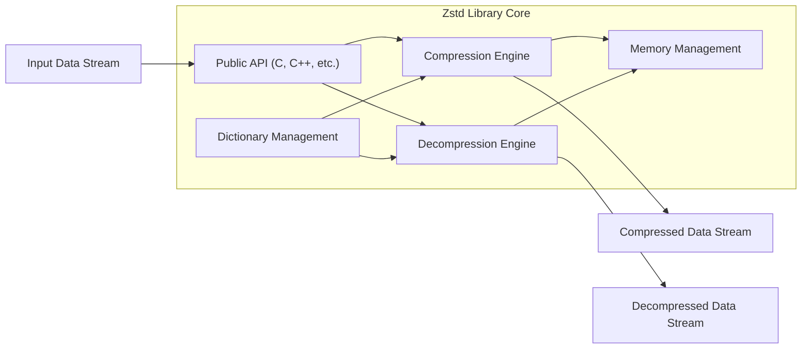
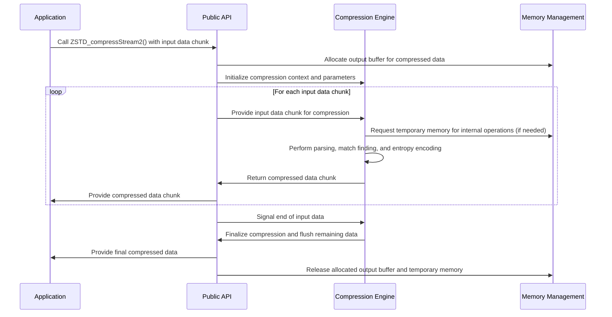
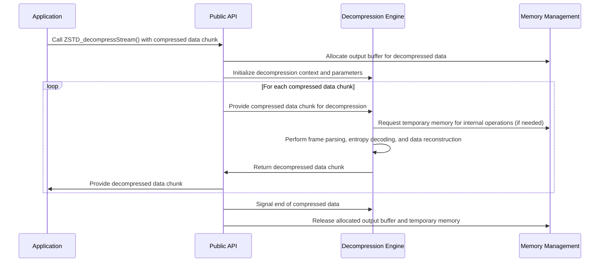

# Project Design Document: Zstandard (Zstd) Compression Library

**Version:** 1.1
**Date:** October 26, 2023
**Author:** AI Software Architect

## 1. Introduction

This document provides a detailed design overview of the Zstandard (Zstd) compression library, as represented by the project hosted on GitHub at [https://github.com/facebook/zstd](https://github.com/facebook/zstd). This document aims to capture the key architectural components, data flow, and external interfaces of Zstd, specifically to serve as a foundation for subsequent threat modeling activities.

Zstd is a high-performance lossless data compression algorithm, offering a wide spectrum of compression speed and ratio trade-offs. It is available as both a command-line interface (CLI) tool and, more importantly for this document, as a library that can be integrated into other applications. This design document will primarily focus on the library aspects of Zstd and its internal workings.

## 2. Goals

The primary goals of this design document are:

*   Clearly articulate the architecture and internal components of the Zstd library.
*   Describe the detailed data flow during both compression and decompression operations.
*   Identify all external interfaces and dependencies of the library, highlighting potential interaction points.
*   Provide a robust and detailed foundation for conducting a comprehensive threat model of the Zstd project, enabling the identification of potential security vulnerabilities.
*   Serve as a valuable reference for developers, security analysts, and anyone seeking to understand the internal workings of Zstd.

## 3. Scope

This design document covers the core functionalities of the Zstd library, including:

*   The fundamental compression and decompression algorithms implemented within the library.
*   Internal memory management strategies and data structures.
*   Key data structures used during the compression and decompression processes.
*   Public API interfaces exposed for various programming languages, with a primary focus on the C API as the underlying interface.
*   Interaction with the underlying operating system for essential functions like memory allocation and, when applicable, file input/output.

This document does not explicitly cover:

*   The intricate implementation details of every specific compression algorithm variant or optimization.
*   A detailed breakdown of the CLI tool's implementation, except where it directly interacts with the core library functions.
*   Performance benchmarking data or specific optimization techniques employed within the library.
*   In-depth analysis of specific language bindings beyond a general overview of their role as wrappers around the core C API.

## 4. High-Level Architecture

The Zstd library's architecture can be broadly represented by the following interconnected components:

*   **Public API (C, C++, etc.):** This serves as the primary interaction point for applications utilizing the Zstd library. It exposes functions for initializing compression and decompression operations, configuring parameters, executing compression and decompression, and managing associated resources.
*   **Compression Engine:** This component houses the core Zstd compression algorithm implementation. It processes raw input data and generates compressed output data, employing techniques such as entropy encoding, pattern matching, and optional dictionary compression.
*   **Decompression Engine:** This component implements the reverse process of the compression engine. It takes compressed data as input and reconstructs the original, uncompressed data.
*   **Dictionary Management:** Zstd supports dictionary-based compression, where a pre-trained dictionary can be provided to enhance compression efficiency. This component handles the loading, storage, and utilization of these dictionaries during both compression and decompression.
*   **Memory Management:** This component is responsible for the allocation and deallocation of memory required by the other components, including buffers for input and output data, internal state information, and loaded dictionaries.

## 5. Component Details

### 5.1. Public API (C, C++, etc.)

*   Provides a set of functions for interacting with the Zstd library, including:
    *   Creation and destruction of compression and decompression contexts: `ZSTD_createCStream()`, `ZSTD_freeCStream()`, `ZSTD_createDStream()`, `ZSTD_freeDStream()`.
    *   Setting and retrieving compression parameters, such as compression level and window size: `ZSTD_CCtx_setParameter()`, `ZSTD_DCtx_setParameter()`, `ZSTD_getParams()`.
    *   Performing single-pass compression and decompression operations on complete data blocks: `ZSTD_compress()`, `ZSTD_decompress()`.
    *   Enabling streaming compression and decompression for handling large datasets or continuous data flows: `ZSTD_compressStream2()`, `ZSTD_decompressStream()`.
    *   Functionality for creating and loading custom compression dictionaries: `ZSTD_trainFromBuffer()`, `ZSTD_loadDictionary()`.
    *   Mechanisms for retrieving error codes and associated error messages: `ZSTD_isError()`, `ZSTD_getErrorName()`.
*   Acts as an abstraction layer, shielding applications from the internal complexities of the compression and decompression engines.
*   Performs initial input validation and parameter sanitization to ensure data integrity and prevent misuse.

### 5.2. Compression Engine

*   Implements the core Zstd compression algorithm, which typically involves the following stages:
    *   **Parsing and Tokenization:** Analyzing the input data stream to identify literal bytes and potential matching sequences.
    *   **Match Finding:** Searching for identical or similar sequences of bytes within a defined history buffer (sliding window) or within a provided dictionary. This often involves the use of hash tables for efficient lookups.
    *   **Entropy Encoding:** Encoding the identified literals and matches using entropy coding techniques like Huffman coding or Finite State Entropy (FSE) to represent them efficiently.
    *   **Frame Formatting:** Structuring the compressed output into frames, which include metadata about the compression parameters, compressed data blocks, and integrity checks (checksums).
*   Relies on internal data structures such as:
    *   Hash tables for rapid identification of matching byte sequences.
    *   Ring buffers or similar structures to maintain the history of recently processed data for match finding.
    *   Buffers for temporary storage of input and output data during the compression process.
    *   State machines to manage the different stages of the compression algorithm.

### 5.3. Decompression Engine

*   Implements the reverse process of the compression engine to reconstruct the original data.
*   Reads the compressed data stream, interpreting the frame structure and metadata.
*   Performs the following key operations:
    *   **Frame Parsing:** Deconstructing the compressed data into its constituent parts, including metadata and compressed blocks.
    *   **Entropy Decoding:** Reversing the entropy encoding process to retrieve the original literals and match descriptions.
    *   **Data Reconstruction:** Using the decoded information to reconstruct the original data by inserting literal bytes and copying matched sequences from the history buffer.
    *   **Integrity Verification:** Utilizing checksums embedded within the compressed data to ensure the integrity of the decompressed output.
*   Utilizes internal data structures similar to the compression engine, including:
    *   Buffers for storing input (compressed) and output (decompressed) data.
    *   State machines to manage the different stages of the decompression algorithm.
*   Includes error handling mechanisms to detect and manage corrupted or invalid compressed data.

### 5.4. Dictionary Management

*   Provides functionality for creating and loading compression dictionaries to improve compression ratios, especially for repetitive data.
*   Dictionaries contain frequently occurring sequences of bytes extracted from training data.
*   Key functions include:
    *   `ZSTD_trainFromBuffer()`:  Analyzes a collection of samples to build an optimized compression dictionary.
    *   `ZSTD_loadDictionary()`: Loads a pre-existing dictionary from memory or a file.
*   Loaded dictionaries are stored in memory and accessed by both the compression and decompression engines. The compressor uses the dictionary to find matches, and the decompressor uses it to correctly reconstruct the original data.
*   The dictionary itself becomes part of the compressed data's metadata, ensuring the decompressor uses the correct dictionary.

### 5.5. Memory Management

*   Responsible for the allocation and deallocation of all memory required by the Zstd library during its operations.
*   Primarily relies on standard memory allocation functions provided by the operating system (e.g., `malloc`, `free`).
*   Manages memory for various purposes, including:
    *   Compression and decompression contexts, which hold the state of ongoing operations.
    *   Input and output buffers used to hold data being processed.
    *   Internal state information required by the compression and decompression engines.
    *   Storage for loaded compression dictionaries.
*   Improper memory management can lead to critical vulnerabilities such as buffer overflows, memory leaks, and use-after-free errors.

## 6. Data Flow

### 6.1. Compression

### 6.2. Decompression

## 7. External Interfaces

*   **Operating System:**
    *   Provides fundamental services such as memory allocation (`malloc`, `free`, and related functions).
    *   Handles file input/output operations when the library interacts with files (e.g., reading input files for compression or writing compressed output).
    *   May provide system calls for timing or other performance-related measurements.
*   **Programming Language Bindings:**
    *   Offers APIs for various programming languages (C, C++, Java, Python, Go, etc.), acting as wrappers around the core C API to enable integration into different language environments. These bindings need to correctly manage memory and handle potential errors.
*   **Input Data Stream:** The source of the data to be compressed. This can be a file, a memory buffer, or a network stream.
*   **Compressed Data Stream:** The output of the compression process. This can be written to a file, stored in memory, or transmitted over a network.
*   **Decompressed Data Stream:** The output of the decompression process, representing the reconstructed original data.
*   **Compression Dictionaries:** External files or memory buffers containing pre-built dictionaries used to enhance compression. The integrity and source of these dictionaries are important security considerations.

## 8. Security Considerations (Detailed for Threat Modeling)

*   **Input Validation Vulnerabilities:**
    *   **Buffer Overflows:**  Insufficient validation of input data sizes or compressed data structures could lead to buffer overflows when writing to fixed-size buffers during compression or decompression.
    *   **Integer Overflows:**  Improper handling of large input sizes or parameters could result in integer overflows, leading to unexpected behavior or memory corruption.
    *   **Malformed Compressed Data:**  Failure to properly validate the structure and contents of compressed data could lead to crashes, denial of service, or potentially exploitable conditions during decompression.
*   **Memory Safety Issues:**
    *   **Heap-based Buffer Overflows:** Errors in memory allocation or deallocation within the compression or decompression engines could lead to heap corruption.
    *   **Memory Leaks:** Failure to release allocated memory can lead to resource exhaustion and potential denial of service.
    *   **Use-After-Free:** Accessing memory that has already been freed can lead to unpredictable behavior and potential security vulnerabilities.
*   **Dictionary-Related Attacks:**
    *   **Dictionary Poisoning:** Maliciously crafted dictionaries could be designed to exploit vulnerabilities in the decompression process, potentially leading to code execution or information disclosure.
    *   **Denial of Service via Dictionaries:**  Very large or complex dictionaries could consume excessive memory or processing time during loading or usage, leading to denial of service.
*   **Algorithmic Complexity Attacks (CPU Exhaustion):**
    *   Specially crafted input data or compressed streams could trigger worst-case scenarios in the compression or decompression algorithms, leading to excessive CPU consumption and denial of service.
*   **Side-Channel Attacks:**
    *   Analysis of timing variations or memory access patterns during compression or decompression could potentially leak information about the input data.
*   **Dependency Vulnerabilities:**
    *   If Zstd relies on other external libraries, vulnerabilities in those dependencies could indirectly affect the security of Zstd.
*   **Concurrency Issues (if applicable):**
    *   If Zstd is used in a multithreaded environment, race conditions or other concurrency bugs could lead to memory corruption or other vulnerabilities.

## 9. Assumptions and Constraints

*   This design document primarily focuses on the core library implementation of Zstd, with less emphasis on the command-line interface.
*   The security of the underlying compression algorithms themselves is assumed to be robust, with the focus being on implementation vulnerabilities.
*   The C API is considered the foundational interface, and the security of language bindings depends on their correct implementation and memory management.
*   A basic understanding of data compression principles is assumed for the reader.

## 10. Future Considerations

*   Detailed security analysis of the specific compression algorithms employed by Zstd, including potential weaknesses and attack vectors.
*   In-depth examination of the security implications of different compression levels and configuration parameters.
*   Analysis of the security of the dictionary training process and the distribution of pre-built dictionaries.
*   Regular security audits and penetration testing of the Zstd library to identify and address potential vulnerabilities.
*   Monitoring for and addressing any reported security vulnerabilities in dependencies.