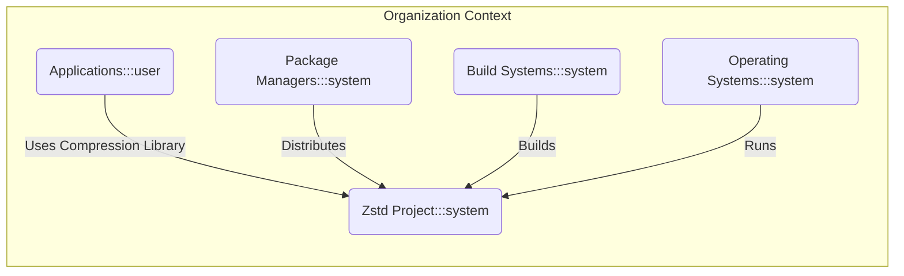
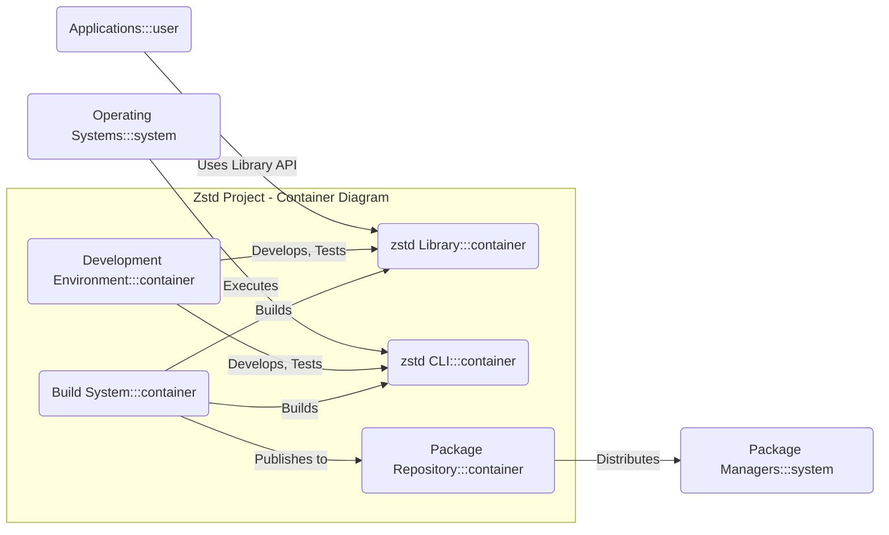
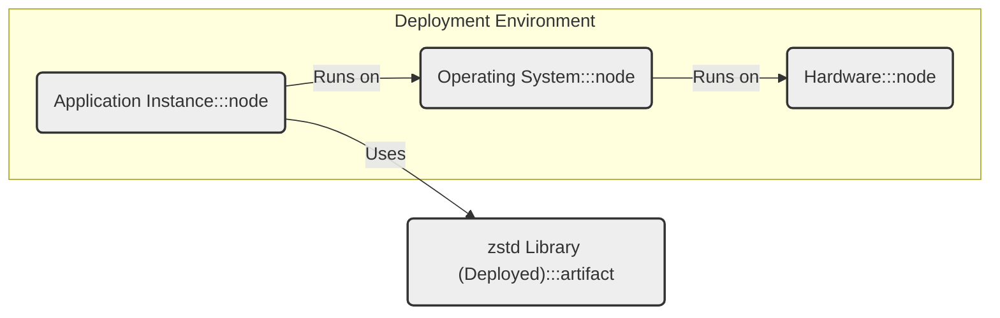

# BUSINESS POSTURE

This project, zstd, aims to provide a high-performance, lossless data compression algorithm and library. The primary business priorities are:

- Performance: zstd is designed to be fast for both compression and decompression operations.
- Efficiency: It aims to achieve a high compression ratio while maintaining speed.
- Wide Applicability: zstd is intended to be usable across a broad range of applications and systems.
- Open Source: Being open source allows for community contributions, transparency, and wider adoption.

The main business goals are:

- To establish zstd as a leading compression algorithm in terms of speed and compression ratio.
- To provide a stable and reliable library for developers to integrate into their applications.
- To foster a community around zstd for continuous improvement and support.

The most important business risks that need to be addressed are:

- Performance Degradation:  Changes to the algorithm or library could negatively impact performance, undermining a key value proposition.
- Data Corruption: Bugs in the compression or decompression logic could lead to data corruption, causing data loss or application failures.
- Security Vulnerabilities:  Security flaws in the library could be exploited by malicious actors, potentially leading to denial of service, data breaches, or other security incidents in applications using zstd.
- Adoption Risk:  If the library is not perceived as reliable, secure, or performant, adoption rates may be low, limiting its impact and success.

# SECURITY POSTURE

Existing security controls for the zstd project, based on typical open-source project practices and a review of the repository, include:

- security control: Code review process via GitHub pull requests. Implemented on GitHub.
- security control: Public issue tracker for bug reporting and feature requests. Implemented on GitHub.
- security control: Version control using Git. Implemented on GitHub.
- security control: Basic testing as part of the development process. Likely described in project documentation and CI configurations.

Accepted risks for the project include:

- accepted risk: Reliance on community contributions, which may introduce vulnerabilities if not properly vetted.
- accepted risk: Potential for undiscovered vulnerabilities due to the complexity of compression algorithms.
- accepted risk:  Security vulnerabilities in dependencies used by the build process or library itself.

Recommended security controls to implement as high priority:

- recommended security control: Automated static analysis security testing (SAST) integrated into the CI/CD pipeline.
- recommended security control: Automated dynamic analysis security testing (DAST) or fuzzing, especially for compression and decompression routines.
- recommended security control: Dependency scanning to identify and manage vulnerabilities in third-party libraries used in the build process and library.
- recommended security control:  Vulnerability disclosure policy and process to handle security vulnerability reports responsibly.
- recommended security control: Secure coding guidelines and training for contributors.

Security requirements for the zstd project:

- Authentication: Not directly applicable as zstd is a library and command-line tool, not an application with user accounts. Authentication considerations would be relevant for systems that use zstd in their authentication processes, but not for zstd itself.
- Authorization: Not directly applicable to zstd itself. Authorization is relevant in the context of applications using zstd to manage access to compressed data, but not within the zstd library.
- Input Validation: Critical. zstd must robustly handle malformed or malicious input data during both compression and decompression to prevent crashes, memory corruption, or other vulnerabilities. Input validation should be implemented at the API boundaries of the library.
- Cryptography: Not directly applicable. zstd is a compression algorithm, not an encryption algorithm. Cryptographic features are not a security requirement for zstd itself. If encryption is needed, it should be implemented separately, potentially using zstd for compression before or after encryption.

# DESIGN

## C4 CONTEXT



Elements of the context diagram:

- Name: Zstd Project
  - Type: System
  - Description: The zstd compression algorithm and library, developed as an open-source project.
  - Responsibilities: Provides fast and efficient lossless data compression and decompression functionality.
  - Security controls: Code review, testing, vulnerability management (to be improved).

- Name: Applications
  - Type: User (System in a broader context)
  - Description: Various software applications that utilize the zstd library for data compression and decompression. These can range from databases and file systems to network protocols and backup solutions.
  - Responsibilities:  Utilize zstd to improve performance and reduce storage space. Manage data security within their own application context, potentially including compressed data.
  - Security controls: Application-specific security controls.  Rely on zstd library being secure.

- Name: Package Managers
  - Type: System
  - Description: Systems like apt, yum, npm, pip, and others that distribute software packages, including zstd libraries and command-line tools.
  - Responsibilities: Package and distribute zstd to end-users and developers. Ensure integrity of packages during distribution.
  - Security controls: Package signing, repository security.

- Name: Build Systems
  - Type: System
  - Description: Tools and environments used to compile and build the zstd library and command-line tools from source code. Examples include CMake, Make, and CI/CD systems like GitHub Actions.
  - Responsibilities: Automate the build process, perform testing, and create distributable artifacts. Ensure build process integrity and prevent supply chain attacks.
  - Security controls: Secure build pipelines, dependency management, artifact signing.

- Name: Operating Systems
  - Type: System
  - Description: Operating systems on which zstd library and applications using zstd are executed.
  - Responsibilities: Provide the runtime environment for zstd and applications. Manage system-level security.
  - Security controls: OS-level security features, access controls, process isolation.

## C4 CONTAINER



Elements of the container diagram:

- Name: zstd Library
  - Type: Container (Software Library)
  - Description: The core zstd compression and decompression library, primarily written in C/C++. Provides APIs for applications to integrate zstd functionality.
  - Responsibilities: Implement the zstd compression algorithm, provide APIs for compression and decompression, handle various compression levels and parameters.
  - Security controls: Input validation, memory safety practices in code, static and dynamic analysis during development and build.

- Name: zstd CLI
  - Type: Container (Command-Line Interface)
  - Description: A command-line tool built on top of the zstd library, allowing users to compress and decompress files directly from the command line.
  - Responsibilities: Provide a user-friendly command-line interface to zstd functionality, handle file I/O, and command-line argument parsing.
  - Security controls: Input validation on command-line arguments and file paths, secure file handling, privilege separation if applicable.

- Name: Development Environment
  - Type: Container (Development Tools)
  - Description: The environment used by developers to write, test, and debug zstd code. Includes IDEs, compilers, debuggers, and testing frameworks.
  - Responsibilities: Provide tools for development and testing, ensure code quality, and facilitate collaboration among developers.
  - Security controls: Access control to development environment, secure coding practices, code review processes, developer training.

- Name: Build System
  - Type: Container (CI/CD Pipeline)
  - Description: Automated systems (e.g., GitHub Actions) that compile, test, and package the zstd library and CLI from source code.
  - Responsibilities: Automate the build process, ensure build reproducibility, run automated tests, perform security checks (SAST, dependency scanning), and publish build artifacts.
  - Security controls: Secure build pipeline configuration, access control to build system, dependency management, artifact signing, SAST/DAST integration.

- Name: Package Repository
  - Type: Container (Artifact Repository)
  - Description:  Repositories where built zstd packages (libraries, executables) are stored and made available for distribution. Examples include GitHub Releases, package registries for different operating systems.
  - Responsibilities: Store and distribute compiled zstd artifacts, ensure artifact integrity and availability.
  - Security controls: Access control to repository, artifact signing, vulnerability scanning of stored artifacts.

## DEPLOYMENT

For the zstd library, the typical deployment model is embedding within applications. The library is compiled and linked directly into the application's executable or loaded as a shared library at runtime.

Deployment Diagram (Example - Application using zstd library):



Elements of the deployment diagram:

- Name: Application Instance
  - Type: Software Instance
  - Description: A running instance of an application that utilizes the zstd library.
  - Responsibilities: Execute application logic, perform data compression/decompression using the zstd library.
  - Security controls: Application-level security controls, input validation, access control, secure configuration.

- Name: zstd Library (Deployed)
  - Type: Artifact (Shared Library/Static Library)
  - Description: The zstd library deployed as part of the application. This could be a shared library (.so, .dll) or a statically linked library.
  - Responsibilities: Provide compression and decompression functionality to the application at runtime.
  - Security controls: Inherits security from the build process and the operating system environment.  Vulnerability management through updates.

- Name: Operating System Instance
  - Type: Infrastructure (Operating System)
  - Description: The operating system (e.g., Linux, Windows, macOS) on which the application and zstd library are running.
  - Responsibilities: Provide the runtime environment, manage system resources, enforce security policies.
  - Security controls: OS-level security features, access controls, patching, security hardening.

- Name: Hardware
  - Type: Infrastructure (Physical/Virtual Hardware)
  - Description: The physical or virtual hardware infrastructure on which the operating system and application are deployed.
  - Responsibilities: Provide the physical resources for execution.
  - Security controls: Physical security, hardware security features, firmware updates.

## BUILD

Build Process Diagram:

```mermaid
flowchart LR
    DEVELOPER("Developer") -->|Code Changes, Commits| GIT_REPOSITORY("Git Repository (GitHub)")
    GIT_REPOSITORY -->|Webhook Trigger| CI_SYSTEM("CI System (GitHub Actions)")
    CI_SYSTEM -->|Checkout Code, Build, Test, SAST, Dependency Scan| BUILD_ENVIRONMENT("Build Environment")
    BUILD_ENVIRONMENT -->|Build Artifacts (Libraries, CLI)| ARTIFACT_REPOSITORY("Artifact Repository (GitHub Releases, Package Registries)")

    style DEVELOPER fill:#ccf,stroke:#333,stroke-width:2px
    style GIT_REPOSITORY fill:#f9f,stroke:#333,stroke-width:2px
    style CI_SYSTEM fill:#f9f,stroke:#333,stroke-width:2px
    style BUILD_ENVIRONMENT fill:#eee,stroke:#333,stroke-width:2px
    style ARTIFACT_REPOSITORY fill:#f9f,stroke:#333,stroke-width:2px
```

Build process description and security controls:

- Developer:
  - Description: Software developers who write and contribute code to the zstd project.
  - Responsibilities: Write secure and functional code, follow coding guidelines, participate in code reviews.
  - Security controls: Secure development workstations, code review participation, security awareness training.

- Git Repository (GitHub):
  - Description: The central code repository hosted on GitHub, used for version control and collaboration.
  - Responsibilities: Store source code, manage code history, facilitate code reviews through pull requests.
  - Security controls: Access control (authentication and authorization), branch protection, audit logging.

- CI System (GitHub Actions):
  - Description: GitHub Actions is used as the Continuous Integration system to automate the build, test, and security checks.
  - Responsibilities: Automate build process, run unit tests, perform static analysis security testing (SAST), dependency scanning, and create build artifacts.
  - Security controls: Secure CI pipeline configuration, access control to CI system, secret management for credentials, SAST and dependency scanning tools integration.

- Build Environment:
  - Description: The environment where the code is compiled and tested during the CI process.
  - Responsibilities: Provide a consistent and reproducible build environment, execute build scripts, run tests, and generate build artifacts.
  - Security controls: Hardened build environment, minimal software installed, regular patching, isolation from production environments.

- Artifact Repository (GitHub Releases, Package Registries):
  - Description: Repositories where the compiled zstd libraries and CLI tools are published. This includes GitHub Releases and package registries for different operating systems.
  - Responsibilities: Store and distribute build artifacts, ensure artifact integrity, and make artifacts available for download.
  - Security controls: Access control to repository, artifact signing, vulnerability scanning of stored artifacts.

# RISK ASSESSMENT

Critical business process we are trying to protect:

- Reliable and efficient data compression and decompression in applications that depend on zstd.  This includes processes related to data storage, data transfer, and data processing where compression is used to improve performance or reduce resource consumption.

Data we are trying to protect and their sensitivity:

- Data being compressed and decompressed by zstd. The sensitivity of this data depends entirely on the applications using zstd. It can range from publicly available data to highly sensitive personal or confidential information.  Therefore, we must assume that zstd might be used to compress sensitive data.
- Integrity of the zstd library and command-line tool.  Compromising the zstd binaries could lead to widespread impact on systems using zstd.

# QUESTIONS & ASSUMPTIONS

Questions:

- What are the specific applications that will be using zstd and what are their security requirements? (Assumption: zstd is used in a variety of applications with varying security needs.)
- Are there any specific compliance requirements (e.g., HIPAA, PCI DSS, GDPR) that apply to the applications using zstd? (Assumption: Compliance requirements are application-specific and not directly imposed on the zstd library itself, but zstd should be developed with security best practices in mind to facilitate compliance for its users.)
- What is the acceptable level of risk for vulnerabilities in the zstd library? (Assumption:  While risk tolerance varies, for a widely used library like zstd, the goal should be to minimize risk as much as practically possible through robust security practices.)

Assumptions:

- BUSINESS POSTURE: Performance and efficiency are the primary drivers for zstd's development and adoption.
- SECURITY POSTURE: Current security controls are basic open-source practices. There is room for improvement by implementing recommended security controls like SAST, DAST, dependency scanning, and a formal vulnerability disclosure process.
- DESIGN: The design is typical for a C/C++ library and command-line tool. Deployment is primarily as an embedded library within other applications. The build process utilizes standard open-source CI practices, likely GitHub Actions.