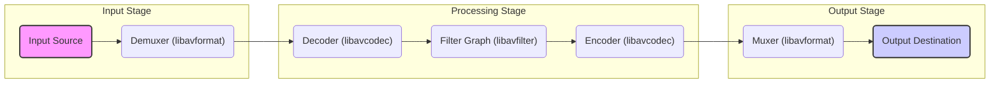

## Project Design Document: FFmpeg Multimedia Framework (Improved)

**1. Introduction**

This document provides an enhanced design overview of the FFmpeg multimedia framework, focusing on aspects relevant for threat modeling. It details the key architectural components, data flow with library involvement, and external interfaces, offering a more granular understanding of the system's workings. This document aims to be a comprehensive resource for security analysts to identify potential vulnerabilities and attack vectors within the FFmpeg framework.

**2. Project Overview**

FFmpeg remains a versatile, cross-platform solution for handling multimedia data, encompassing recording, conversion, and streaming of audio and video. It's fundamentally a collection of libraries and command-line tools. The core strength lies in its extensive support for a vast array of codecs, container formats, and protocols, making it a cornerstone for numerous multimedia processing applications.

**3. System Architecture**

FFmpeg's architecture is deliberately modular, built around a set of core libraries. These libraries provide the fundamental building blocks for multimedia manipulation. The primary user interaction often occurs through the command-line tool, `ffmpeg`, which orchestrates the functionalities of these underlying libraries.

*   **Core Libraries:**
    *   `libavformat`:  Manages the container format layer. Its responsibilities include:
        *   Demuxing: Parsing input container files to extract elementary streams.
        *   Muxing: Combining encoded elementary streams into output container files.
        *   Protocol Handling: Managing access to various input/output protocols (e.g., file, HTTP, RTSP).
    *   `libavcodec`:  The codec engine of FFmpeg, responsible for:
        *   Decoding: Converting encoded media data into raw audio/video frames.
        *   Encoding: Compressing raw audio/video frames into encoded formats.
        *   Codec Implementation: Providing implementations for a wide range of audio and video codecs.
    *   `libavfilter`:  Provides a framework for applying audio and video filters:
        *   Filter Graph Management:  Allowing users to chain multiple filters together.
        *   Filter Implementations: Offering a diverse set of filters for operations like resizing, cropping, watermarking, and audio manipulation.
    *   `libavutil`:  A foundational library offering utility functions:
        *   Memory Management: Providing functions for allocating and freeing memory.
        *   Error Handling: Defining error codes and mechanisms for reporting errors.
        *   Data Structures: Defining common data structures used across FFmpeg libraries.
        *   Mathematical Functions: Offering basic mathematical utilities.
    *   `libswresample`:  Dedicated to audio resampling and format conversion:
        *   Sample Rate Conversion: Changing the sampling rate of audio.
        *   Format Conversion: Converting between different audio sample formats (e.g., planar, packed, integer, float).
    *   `libswscale`:  Focused on video image scaling and pixel format conversion:
        *   Resolution Scaling: Changing the dimensions of video frames.
        *   Pixel Format Conversion: Converting between different pixel formats (e.g., YUV, RGB).
    *   `libavdevice`:  Provides an interface for accessing multimedia devices:
        *   Input Device Handling:  Capturing audio and video from sources like webcams and microphones.
        *   Output Device Handling:  Sending processed media to devices.

*   **Command-Line Tools:**
    *   `ffmpeg`: The primary command-line interface for multimedia processing tasks.
    *   `ffprobe`: A command-line tool for inspecting multimedia file content and displaying metadata.
    *   `ffplay`: A minimalist media player built using the FFmpeg libraries for playback.

**4. Key Components and Their Interactions**



*   **Input Source:**  The origin of the multimedia data. Examples include files on disk, network streams accessed via protocols like HTTP or RTSP, or direct input from hardware devices.
*   **Demuxer (`libavformat`):**  Parses the input container format. It identifies and separates the individual elementary streams (audio, video, subtitles, metadata) based on the container's structure. Examples of formats handled include MP4, MKV, AVI.
*   **Decoder (`libavcodec`):**  Takes the encoded elementary streams and performs the reverse process of encoding, converting the compressed data into raw, uncompressed audio or video frames. The specific decoder used depends on the codec of the input stream (e.g., H.264 decoder, AAC decoder).
*   **Filter Graph (`libavfilter`):** An optional but highly flexible component. It allows for the application of various transformations and manipulations to the decoded audio and video data. Filters are connected in a directed graph to achieve complex processing pipelines.
*   **Encoder (`libavcodec`):**  Compresses raw audio or video frames into an encoded format according to a chosen codec (e.g., H.265 encoder, MP3 encoder). The encoder aims to reduce the data size for storage or transmission.
*   **Muxer (`libavformat`):**  Combines the encoded elementary streams into a specific output container format. It structures the output data according to the rules of the chosen container (e.g., creating an MP4 file, an MKV file).
*   **Output Destination:** The final location where the processed multimedia data is sent. This could be a file written to disk, a network stream pushed over a protocol, or output to a hardware device.

**5. Data Flow with Library Involvement**

The flow of multimedia data through FFmpeg involves the coordinated interaction of its core libraries:

1. **Input Acquisition (via `libavformat`):**  The process begins with `libavformat` handling the reading of input data from the specified source. This might involve file system operations, network requests, or device access managed by `libavdevice`.
2. **Demuxing (using `libavformat`):**  `libavformat`'s demuxer analyzes the input stream's format and separates it into individual packets corresponding to different elementary streams (audio, video, etc.).
3. **Decoding (using `libavcodec`):**  For each elementary stream, the appropriate decoder from `libavcodec` is invoked. It takes the encoded packets and decodes them into raw multimedia frames (e.g., raw video frames in a specific pixel format, raw audio samples).
4. **Filtering (using `libavfilter`, optional):** If filtering is required, the raw frames are passed to the `libavfilter` framework. The configured filter graph processes these frames, applying transformations as defined by the user.
5. **Encoding (using `libavcodec`):**  The processed (or original, if no filtering) raw frames are then passed to an encoder from `libavcodec`. The encoder compresses the raw data according to the selected codec.
6. **Muxing (using `libavformat`):**  `libavformat`'s muxer takes the encoded packets from the encoders and combines them into the structure of the desired output container format. This involves adding metadata and indexing information.
7. **Output Delivery (via `libavformat` or `libavdevice`):**  Finally, `libavformat` handles writing the muxed data to the output destination. Alternatively, for device output, `libavdevice` might be involved in sending the processed data to a hardware device.

**6. External Interfaces**

FFmpeg interacts with the external environment through a variety of interfaces, creating potential points of interaction and potential vulnerabilities:

*   **File System Interfaces:**
    *   Reading various file formats for input (e.g., local files, network shares).
    *   Writing various file formats for output.
    *   Potential vulnerabilities: Path traversal, access control issues, vulnerabilities in file format parsers.
*   **Network Interfaces:**
    *   Support for numerous network protocols for input and output streaming:
        *   Protocols: HTTP, HTTPS, RTSP, RTMP, RTP, UDP, TCP, and more.
        *   Potential vulnerabilities: Protocol implementation flaws, man-in-the-middle attacks, denial-of-service attacks targeting specific protocols.
*   **Operating System APIs:**
    *   Memory management (allocation, deallocation).
    *   Threading and process management.
    *   Device access (audio and video capture devices).
    *   Potential vulnerabilities: Exploitable OS-level vulnerabilities, improper handling of system calls.
*   **Hardware Acceleration APIs:**
    *   Integration with hardware acceleration frameworks for encoding and decoding:
        *   Examples: VA-API (Linux), NVENC/NVDEC (NVIDIA), VideoToolbox (macOS/iOS), Direct3D Video Acceleration (Windows).
        *   Potential vulnerabilities: Bugs in hardware driver implementations, vulnerabilities in the acceleration API itself.
*   **External Libraries (Dependencies):**
    *   FFmpeg can be compiled with support for various external libraries for extended functionality or specific codec implementations (e.g., libx264, libvpx, OpenSSL).
    *   Potential vulnerabilities: Security flaws in these external libraries can directly impact FFmpeg.
*   **Command-Line Interface (CLI):**
    *   Parsing of command-line arguments and options provided by the user.
    *   Potential vulnerabilities: Command injection if input is not properly sanitized, buffer overflows in argument parsing.
*   **Application Programming Interface (API):**
    *   The core libraries expose C APIs for other applications to integrate FFmpeg's multimedia capabilities.
    *   Potential vulnerabilities: Improper API usage by integrating applications, leading to memory corruption or other issues.

**7. Security Considerations (Categorized)**

For threat modeling purposes, security considerations can be categorized based on the involved components and interactions:

*   **Input Handling Vulnerabilities:**
    *   **Demuxer Vulnerabilities (`libavformat`):** Buffer overflows, integer overflows, format string bugs, or logic errors when parsing malformed container headers or metadata.
    *   **Protocol Vulnerabilities (`libavformat`):**  Issues in the implementation of network protocols leading to denial-of-service or information disclosure.
*   **Codec Vulnerabilities:**
    *   **Decoder Vulnerabilities (`libavcodec`):**  Exploitable flaws in the decoding algorithms that can be triggered by crafted media streams, potentially leading to crashes or arbitrary code execution.
    *   **Encoder Vulnerabilities (`libavcodec`):** While less common, vulnerabilities in encoders could lead to unexpected output or denial-of-service.
*   **Filter Vulnerabilities (`libavfilter`):**
    *   Bugs in individual filter implementations that could be triggered by specific input data, leading to crashes or unexpected behavior.
    *   Issues in filter graph management that could lead to resource exhaustion.
*   **Memory Management Vulnerabilities (`libavutil` and other libraries):**
    *   Buffer overflows, heap overflows, use-after-free errors, and memory leaks due to incorrect memory allocation and deallocation.
*   **Integer Overflow Vulnerabilities:**
    *   Integer overflows in calculations related to buffer sizes, frame dimensions, or other parameters, potentially leading to buffer overflows or other memory corruption issues.
*   **External Interface Vulnerabilities:**
    *   **File System:** Path traversal vulnerabilities allowing access to unauthorized files.
    *   **Network:** Exploitation of vulnerabilities in underlying network libraries or protocols.
    *   **Hardware Acceleration:** Security flaws in hardware drivers or acceleration APIs.
    *   **External Libraries:**  Vulnerabilities inherited from third-party libraries.
*   **Command-Line Interface Vulnerabilities:**
    *   Command injection flaws if user-supplied input is not properly sanitized before being used in system calls.
    *   Buffer overflows in command-line argument parsing.

**8. Diagrams**

*   **High-Level Component Diagram (Mermaid):**

    ```mermaid
    graph LR
        A("Input") --> B("FFmpeg Core Libraries");
        B --> C("Output");
        style A fill:#f9f,stroke:#333,stroke-width:2px
        style C fill:#ccf,stroke:#333,stroke-width:2px
    ```

*   **Detailed Data Flow Diagram with Libraries (Mermaid):**

    ```mermaid
    graph LR
        subgraph "Input"
            A("Input Source")
        end
        subgraph "Processing"
            B("Demuxer (libavformat)") --> C("Decoder (libavcodec)");
            C --> D("Filters (libavfilter, Optional)");
            D --> E("Encoder (libavcodec)");
        end
        subgraph "Output"
            E --> F("Muxer (libavformat)");
            F --> G("Output Destination");
        end
        A --> B
        style A fill:#f9f,stroke:#333,stroke-width:2px
        style G fill:#ccf,stroke:#333,stroke-width:2px
    ```

**9. Conclusion**

This improved design document provides a more detailed and structured overview of the FFmpeg multimedia framework, specifically tailored for threat modeling. By elaborating on the data flow with library involvement, detailing external interfaces, and categorizing potential security considerations, this document aims to empower security analysts to conduct more thorough and effective threat modeling activities, ultimately contributing to a more secure and robust FFmpeg framework.