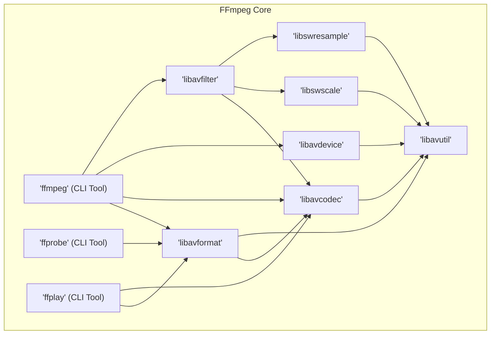
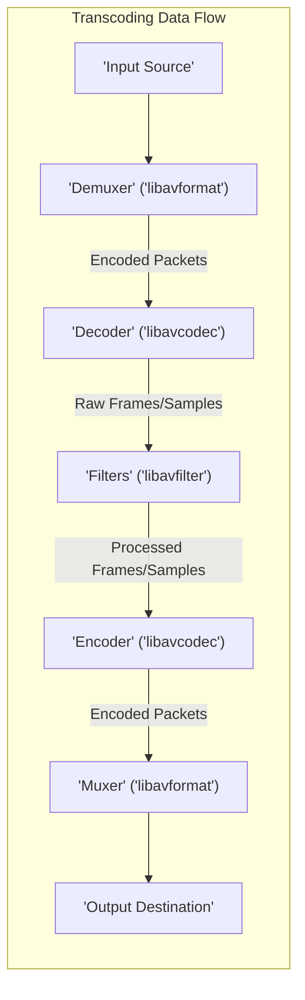

# Project Design Document: FFmpeg

**Version:** 1.1
**Date:** October 26, 2023
**Author:** AI Software Architect

## 1. Introduction

This document provides an enhanced architectural overview of the FFmpeg project, a leading open-source, cross-platform solution for handling multimedia. It details the system's design, components, and interactions, specifically tailored for use in subsequent threat modeling activities. This document aims to provide a comprehensive understanding of FFmpeg's internal workings and external interfaces.

## 2. Goals and Objectives

The core goals driving the FFmpeg project are:

*   **Broad Format Support:** To support an extensive range of audio and video formats, codecs, and container formats, ensuring compatibility with diverse media sources and destinations.
*   **Cross-Platform Compatibility:** To operate reliably and consistently across various operating systems (Linux, macOS, Windows) and hardware architectures, maximizing its usability.
*   **High Performance and Efficiency:** To provide optimized media processing capabilities, minimizing resource consumption and processing time.
*   **Modular and Extensible Design:** To facilitate the addition of new codecs, formats, protocols, and filters through a well-defined API and plugin architecture.
*   **Powerful Command-Line Interface:** To offer a versatile and scriptable command-line interface (`ffmpeg`) for advanced media manipulation tasks.
*   **Reusable Libraries:** To provide a set of robust and well-documented libraries (`libav*`) that can be integrated into other multimedia applications.

## 3. High-Level Architecture

FFmpeg's architecture is structured around a core set of libraries and command-line tools, enabling a modular and flexible approach to media processing.

*   **`ffmpeg` (CLI Tool):** The central command-line utility for performing a wide array of multimedia tasks, including encoding, decoding, transcoding, muxing, demuxing, streaming, and applying filters. It acts as a frontend to the underlying libraries.
*   **`ffprobe` (CLI Tool):** A command-line tool designed for inspecting and analyzing multimedia streams. It extracts detailed information about the format, codecs, and metadata of media files.
*   **`ffplay` (CLI Tool):** A minimalist and portable media player built using the FFmpeg libraries, primarily used for testing and basic playback.
*   **`libavformat`:** This library is responsible for handling the container format layer. It provides APIs for reading from and writing to various multimedia container formats (e.g., MP4, MKV, AVI, FLV), managing metadata, and demuxing/muxing streams.
*   **`libavcodec`:** The core of FFmpeg, containing a vast collection of audio and video codec implementations (encoders and decoders). It supports a wide range of codecs, both open and proprietary (through external libraries).
*   **`libavdevice`:** Provides an abstraction layer for accessing various capture and playback devices. This allows FFmpeg to interact with hardware like webcams, microphones, and screen capture utilities, as well as software-based virtual devices.
*   **`libavfilter`:** Enables the application of audio and video filters to modify media streams. It offers a flexible graph-based filtering framework for complex processing pipelines (e.g., scaling, cropping, color manipulation, audio mixing).
*   **`libswscale`:**  Dedicated to performing video scaling and pixel format conversion. It provides optimized algorithms for resizing video frames and converting between different pixel representations.
*   **`libswresample`:**  Handles audio resampling and format conversion. It allows for changing the sample rate, sample format, and channel layout of audio streams.
*   **`libavutil`:**  A foundational library providing essential utility functions used by other FFmpeg libraries. This includes memory management, error handling, logging, mathematical functions, and data structure implementations.

## 4. Components and Their Functionality

This section provides a more granular view of the key components and their specific functionalities within FFmpeg.

*   **Input Handling (within `libavformat`):**
    *   **Demuxers:**  Parse the input container format, identify elementary streams (audio, video, subtitles, metadata), and extract the encoded data packets. Examples include the MP4 demuxer, MKV demuxer, and HLS demuxer.
    *   **Protocols:** Implement the logic for accessing data from various input sources. This includes file protocols (reading from local disks), network protocols (HTTP, RTSP, RTMP), and device-specific protocols.
    *   **Probes:** Analyze the beginning of an input stream to automatically detect the container format and codecs used.
*   **Decoding (within `libavcodec`):**
    *   **Decoders:** Take encoded data packets from the demuxer and convert them into raw audio or video frames. Each codec has its own decoder implementation (e.g., H.264 decoder, AAC decoder, VP9 decoder).
    *   **Parser:**  Pre-processes the bitstream before decoding, handling tasks like finding start codes and extracting NAL units (for video codecs).
*   **Processing (within `libavfilter`):**
    *   **Filters:**  Individual processing units that modify audio or video frames. Filters can be chained together to form complex filter graphs. Examples include `scale`, `crop`, `overlay`, `volume`, and `aresample`.
    *   **Filter Graphs:**  Directed acyclic graphs that define the sequence of filters to be applied to the media stream.
    *   **Buffers and Unbuffers:**  Manage the flow of data between filters, handling buffering and synchronization.
*   **Encoding (within `libavcodec`):**
    *   **Encoders:**  Take raw audio or video frames and compress them into an encoded format according to the chosen codec (e.g., H.264 encoder, AAC encoder, AV1 encoder).
    *   **Rate Control:**  Algorithms that manage the bitrate of the encoded stream to meet target quality or size constraints.
*   **Output Handling (within `libavformat`):**
    *   **Muxers:** Combine encoded elementary streams into an output container format, interleaving audio and video packets and adding metadata. Examples include the MP4 muxer, MKV muxer, and FLV muxer.
    *   **Protocols:** Implement the logic for writing data to various output destinations, mirroring the input protocols.
*   **Device Interaction (within `libavdevice`):**
    *   **Input Devices:**  Implement interfaces for capturing data from hardware or software devices (e.g., video4linux2 for webcams, ALSA for audio input, X11grab for screen capture).
    *   **Output Devices:** Implement interfaces for rendering audio and video data to hardware or software devices (e.g., SDL for playback, OpenGL for video output).
*   **Utilities (within `libavutil`):**
    *   **Memory Management:** Functions for allocating and freeing memory.
    *   **Error Handling:** Mechanisms for reporting and handling errors.
    *   **Logging:**  Provides a framework for logging messages and debugging information.
    *   **Data Structures:**  Common data structures used throughout the FFmpeg libraries (e.g., linked lists, dynamic arrays).
    *   **Cryptography:**  Provides cryptographic functions for tasks like hashing and encryption (used in some protocols).

## 5. Data Flow

The typical data flow within FFmpeg for a transcoding operation involves a series of transformations applied to the media data.

1. **Input Source:** FFmpeg begins by reading multimedia data from a specified input source, which could be a local file, a network stream accessed via a protocol, or a capture device.
2. **Demuxing:** The appropriate demuxer, based on the input container format, parses the data and separates the elementary streams (audio, video, subtitles, etc.).
3. **Decoding:** The encoded data packets from each stream are passed to the corresponding decoders within `libavcodec`. The decoders convert these packets into raw, uncompressed audio samples or video frames.
4. **Filtering (Optional):** If filters are specified by the user, the raw audio and video data is passed through a filter graph defined in `libavfilter`. This stage allows for various manipulations like resizing, color correction, audio mixing, and more.
5. **Encoding:** The processed (or original, if no filtering is applied) raw audio and video data is then passed to the encoders within `libavcodec`. The encoders compress this data according to the selected output codecs.
6. **Muxing:** The encoded elementary streams are combined by the muxer in `libavformat` into the desired output container format. This involves interleaving the audio and video packets and adding necessary metadata.
7. **Output Destination:** Finally, the muxed data is written to the specified output destination, which could be a local file, a network stream, or a playback device.

## 6. External Interactions

FFmpeg's functionality relies on interactions with various external entities:

*   **Input Sources:**
    *   **Local File System:** Reading media files in various formats (e.g., `.mp4`, `.avi`, `.mkv`, `.mp3`, `.wav`).
    *   **Network Protocols:** Accessing media streams via protocols like HTTP, HTTPS (using libraries like OpenSSL or GnuTLS), RTP, RTSP, RTMP, HLS (HTTP Live Streaming), and MMS.
    *   **Capture Devices:** Interfacing with hardware devices like webcams (via V4L2 on Linux, AVFoundation on macOS, DirectShow on Windows), microphones (via ALSA, CoreAudio, WASAPI), and screen capture utilities (like X11grab or DirectShow).
    *   **Hardware Acceleration APIs:** Utilizing hardware acceleration capabilities through APIs like VA-API (for Intel GPUs), NVENC/CUDA (for NVIDIA GPUs), VideoToolbox (for Apple GPUs), and DXVA2 (on Windows).
*   **Output Destinations:**
    *   **Local File System:** Writing processed media to files in various formats.
    *   **Network Protocols:** Streaming media to servers or other clients using protocols like HTTP, RTMP, and RTP.
    *   **Playback Devices:** Sending processed media to output devices for rendering (e.g., using SDL for cross-platform playback).
    *   **Hardware Acceleration APIs:** Utilizing hardware acceleration for encoding and decoding.
*   **External Libraries:**
    *   **Codec Libraries:** Linking with external codec libraries like libx264 (for H.264 encoding), libx265 (for HEVC encoding), libvpx (for VP8/VP9 encoding), and LAME (for MP3 encoding).
    *   **Network Libraries:** Using libraries like OpenSSL, GnuTLS, and mbed TLS for secure network communication (HTTPS, TLS).
    *   **Hardware Acceleration Libraries:** Interacting with specific hardware acceleration libraries (e.g., libva, libcuda, VideoToolbox framework).
    *   **Other Libraries:**  Depending on build configuration, FFmpeg might interact with libraries for image processing (e.g., libwebp), font rendering, and other functionalities.
*   **Operating System:**
    *   **System Calls:** Relying on operating system system calls for file I/O, network operations, memory management, thread management, and device access.
    *   **Device Drivers:** Interacting with device drivers for capture and playback devices.
*   **User Input (Command Line):**
    *   Receiving commands and parameters from the user via the command-line interface, which dictates the processing operations to be performed.

## 7. Security Considerations (Detailed)

This section outlines potential security considerations that will be further analyzed during threat modeling:

*   **Input Validation Vulnerabilities:**
    *   **Buffer Overflows:**  Insufficient bounds checking when parsing input files or network streams could lead to buffer overflows, potentially allowing for arbitrary code execution.
    *   **Format String Bugs:**  Improper handling of format strings in input data could be exploited to leak information or execute arbitrary code.
    *   **Integer Overflows:**  Overflows in integer calculations when processing input data could lead to unexpected behavior or vulnerabilities.
    *   **Denial of Service (DoS):**  Maliciously crafted input files or streams could exploit parsing vulnerabilities to cause excessive resource consumption (CPU, memory), leading to crashes or hangs.
*   **Codec Vulnerabilities:**
    *   **Decoder Bugs:**  Flaws in specific codec implementations (both internal and external) could be exploited by crafted media files to cause crashes, memory corruption, or arbitrary code execution.
    *   **Encoder Bugs:**  Vulnerabilities in encoders could potentially be exploited if the encoded output is processed by a vulnerable decoder elsewhere.
*   **Protocol Vulnerabilities:**
    *   **Man-in-the-Middle Attacks:**  Lack of encryption or weak encryption in network protocols could allow attackers to intercept and modify media streams.
    *   **Protocol Implementation Flaws:**  Bugs in the implementation of network protocols could be exploited to cause crashes or other unexpected behavior.
    *   **Server-Side Vulnerabilities:** When acting as a streaming client, vulnerabilities in the remote server could be exploited.
*   **Dependency Vulnerabilities:**
    *   **Third-Party Library Flaws:** Security vulnerabilities in external libraries that FFmpeg depends on (e.g., OpenSSL, libx264) can directly impact FFmpeg's security.
    *   **Supply Chain Attacks:**  Compromised dependencies or build tools could introduce malicious code into the FFmpeg binaries.
*   **Resource Exhaustion:**
    *   **Memory Leaks:**  Failure to properly release allocated memory could lead to memory exhaustion and crashes.
    *   **CPU Exhaustion:**  Processing computationally intensive or malformed input could consume excessive CPU resources, leading to DoS.
    *   **Disk Space Exhaustion:**  Writing large amounts of data to disk without proper limits could exhaust disk space.
*   **Command Injection:**
    *   **Insecure Handling of User Input:**  Improper sanitization or validation of user-provided command-line arguments could allow attackers to inject arbitrary commands.
*   **Side-Channel Attacks:**
    *   Information leakage through timing variations or resource consumption patterns during processing.

## 8. Future Considerations

*   Continued expansion of codec and format support to accommodate emerging standards.
*   Further performance optimizations through algorithmic improvements and enhanced hardware acceleration integration.
*   Strengthening security measures by incorporating more robust input validation, fuzzing, and static analysis techniques.
*   Improved modularity and API design to facilitate easier integration and extension.
*   Exploration of new technologies and platforms, such as WebAssembly and cloud-native deployments.
*   Enhanced support for emerging media formats and protocols (e.g., AV1, HTTP/3).

This enhanced design document provides a more detailed and comprehensive understanding of the FFmpeg project's architecture, components, and interactions. This detailed information is crucial for conducting a thorough and effective threat modeling exercise to identify and mitigate potential security risks.