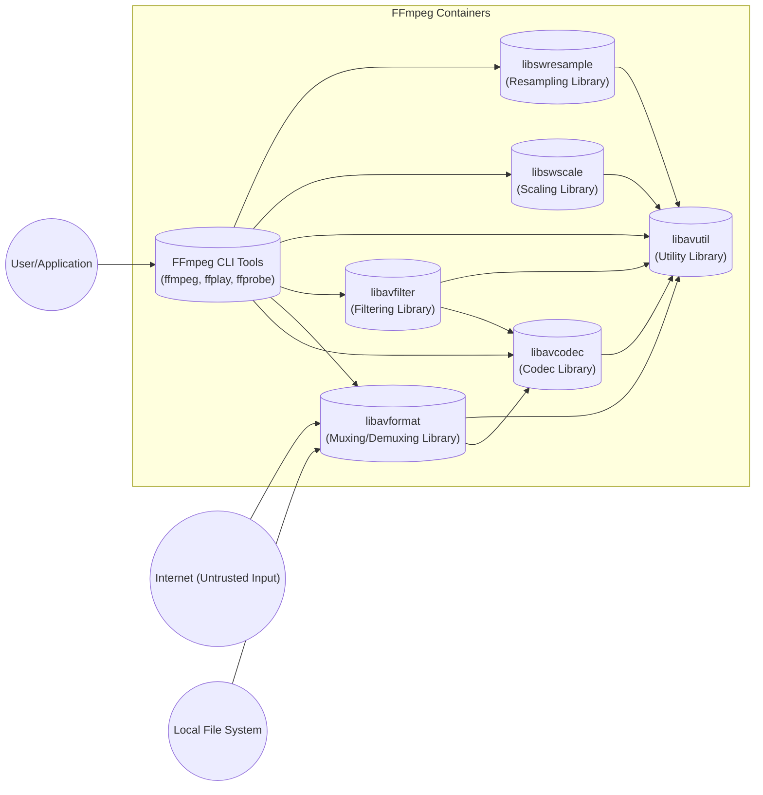
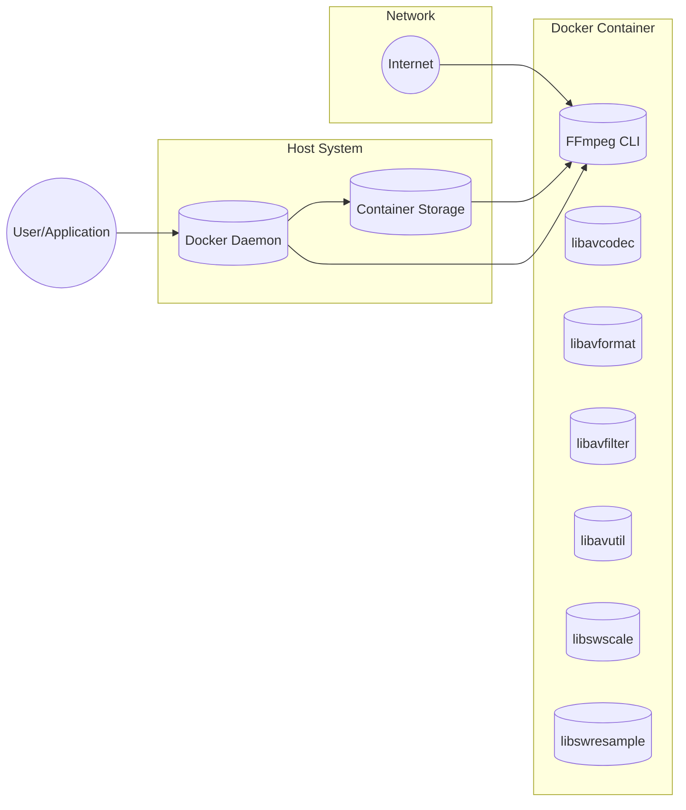
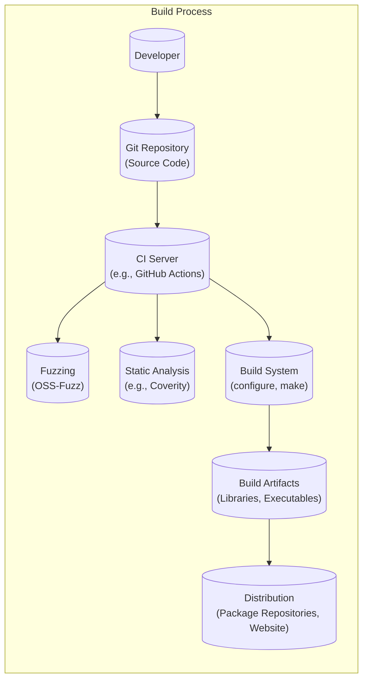

Okay, let's create a design document for FFmpeg, focusing on aspects relevant for threat modeling.

# BUSINESS POSTURE

FFmpeg is a very popular, widely used, open-source project.  It's a cornerstone of many video processing workflows, both in commercial products and individual projects.  Because of its ubiquity, its security posture has significant downstream consequences.

Priorities:

-   Maintainability:  The project must be maintainable by a diverse group of open-source contributors.
-   Performance:  FFmpeg is often used in performance-sensitive contexts (e.g., real-time video encoding).  Performance is a key consideration.
-   Compatibility:  FFmpeg supports a vast number of codecs, formats, and protocols.  Maintaining broad compatibility is crucial.
-   Functionality: Provide a comprehensive suite of tools for multimedia manipulation.
-   Ubiquity: Continue being the go-to solution for multimedia processing across various platforms and use cases.

Goals:

-   Provide a robust and reliable solution for multimedia processing.
-   Support a wide range of formats and codecs.
-   Enable efficient processing of multimedia data.
-   Facilitate integration with other software and systems.

Business Risks:

-   Vulnerabilities leading to remote code execution (RCE) in applications using FFmpeg. This is the most significant risk, given FFmpeg's widespread use in processing untrusted input.
-   Denial of service (DoS) attacks against applications using FFmpeg, disrupting video processing services.
-   Intellectual property theft (less likely, as FFmpeg is open source, but potential misuse of patented codecs is a concern).
-   Reputational damage due to security incidents involving FFmpeg.
-   Supply chain attacks targeting FFmpeg's build and distribution process.

# SECURITY POSTURE

FFmpeg, being a mature open-source project, has accumulated various security controls and accepted risks over time.

Existing Security Controls:

-   security control: Fuzzing: FFmpeg is extensively fuzzed using tools like OSS-Fuzz (integrated into the build process, and continuous). This helps identify memory corruption bugs and other vulnerabilities. Described in the `doc/security.txt` file and various online resources.
-   security control: Code Reviews: Contributions to FFmpeg are subject to code review by other developers.  This helps catch potential security issues before they are merged. Described in the contribution guidelines.
-   security control: Static Analysis: FFmpeg uses static analysis tools, although the specifics may vary over time.  These tools help identify potential coding errors that could lead to vulnerabilities. Integrated into CI workflows.
-   security control: AddressSanitizer (ASan) and other sanitizers: These memory error detectors are used during development and testing to identify memory corruption issues. Integrated into CI workflows.
-   security control: Regular Updates: The FFmpeg project releases updates to address security vulnerabilities and bugs.
-   security control: Security Policy: FFmpeg has a security policy that outlines how to report vulnerabilities. Described in the `doc/security.txt` file.

Accepted Risks:

-   accepted risk: Complexity: FFmpeg's codebase is large and complex, supporting a vast number of codecs and formats. This inherent complexity makes it challenging to guarantee the absence of all vulnerabilities.
-   accepted risk: Legacy Code: FFmpeg includes support for older and less secure codecs and formats. While this is necessary for compatibility, it introduces potential attack surface.
-   accepted risk: Third-Party Libraries: FFmpeg depends on external libraries, which may have their own vulnerabilities.
-   accepted risk: Performance Optimizations: Some performance optimizations might introduce subtle security risks, although efforts are made to balance performance and security.

Recommended Security Controls:

-   Implement a more structured approach to tracking dependencies and their known vulnerabilities.
-   Consider more aggressive deprecation of very old and insecure codecs/formats, where feasible.
-   Explore the use of memory-safe languages (e.g., Rust) for new components or critical sections of the codebase.

Security Requirements:

-   Authentication: Not directly applicable to FFmpeg itself, as it's a library/tool, not a service. Authentication is the responsibility of applications using FFmpeg.
-   Authorization: Similarly, authorization is handled by the applications using FFmpeg. FFmpeg itself doesn't manage user permissions.
-   Input Validation: This is *crucial* for FFmpeg.  All input from files, streams, and other sources must be treated as untrusted and carefully validated.  This includes:
    -   Checking for buffer overflows.
    -   Validating header fields and metadata.
    -   Enforcing format-specific constraints.
    -   Rejecting malformed or invalid input.
-   Cryptography: FFmpeg supports various cryptographic protocols and formats (e.g., for encrypted streams).  It should:
    -   Use well-vetted cryptographic libraries.
    -   Implement cryptographic protocols correctly.
    -   Avoid using weak or outdated cryptographic algorithms.

# DESIGN

## C4 CONTEXT

```mermaid
graph LR
    subgraph FFmpeg Context
        ffmpeg[("FFmpeg (Project)")]
    end

    User(("User/Application")) --> ffmpeg
    Internet(("Internet (Untrusted Input)")) --> ffmpeg
    LocalFileSystem(("Local File System")) --> ffmpeg
    OtherLibraries(("Other Libraries/Systems")) -.-> ffmpeg
    OtherLibraries(("Other Libraries/Systems")) <-- ffmpeg

```

Element Descriptions:

-   Element:
    -   Name: User/Application
    -   Type: User/External System
    -   Description: Represents a user or an application that utilizes FFmpeg for multimedia processing.
    -   Responsibilities: Initiates FFmpeg processes, provides input data, and receives output data.
    -   Security controls: Implements authentication and authorization mechanisms as needed.
-   Element:
    -   Name: Internet (Untrusted Input)
    -   Type: External Source
    -   Description: Represents network sources of multimedia data, such as streaming servers or downloaded files.
    -   Responsibilities: Provides potentially malicious or malformed input data.
    -   Security controls: Input validation, network security protocols (e.g., TLS) implemented by applications using FFmpeg.
-   Element:
    -   Name: Local File System
    -   Type: External Source
    -   Description: Represents the local file system where multimedia files may be stored.
    -   Responsibilities: Provides input data and stores output data.
    -   Security controls: File system permissions, input validation.
-   Element:
    -   Name: Other Libraries/Systems
    -   Type: External System
    -   Description: Represents other libraries or systems that FFmpeg interacts with, such as external codecs or hardware encoders.
    -   Responsibilities: Provide additional functionality or resources to FFmpeg.
    -   Security controls: Dependent on the specific library or system; FFmpeg should use secure interfaces.
-   Element:
    -   Name: FFmpeg (Project)
    -   Type: Project
    -   Description: The core FFmpeg project, encompassing its libraries and command-line tools.
    -   Responsibilities: Processing multimedia data, including decoding, encoding, transcoding, filtering, and muxing.
    -   Security controls: Input validation, fuzzing, static analysis, code reviews, sanitizers.

## C4 CONTAINER



Element Descriptions:

-   Element:
    -   Name: FFmpeg CLI Tools (ffmpeg, ffplay, ffprobe)
    -   Type: Application
    -   Description: Command-line tools for interacting with FFmpeg's libraries.
    -   Responsibilities: Provide user interface, parse command-line arguments, manage processing pipeline.
    -   Security controls: Input validation (of command-line arguments), secure handling of user-provided parameters.
-   Element:
    -   Name: libavcodec
    -   Type: Library
    -   Description: Library for encoding and decoding audio and video codecs.
    -   Responsibilities: Implement codec algorithms, handle compressed data.
    -   Security controls: Fuzzing, input validation (of compressed data), secure coding practices.
-   Element:
    -   Name: libavformat
    -   Type: Library
    -   Description: Library for muxing and demuxing multimedia containers (e.g., MP4, AVI, MKV).
    -   Responsibilities: Handle container formats, read and write streams.
    -   Security controls: Fuzzing, input validation (of container headers and metadata), secure parsing of container formats.
-   Element:
    -   Name: libavfilter
    -   Type: Library
    -   Description: Library for applying filters to audio and video streams.
    -   Responsibilities: Implement filter graphs, process data through filters.
    -   Security controls: Input validation (of filter parameters), secure handling of filter chains.
-   Element:
    -   Name: libavutil
    -   Type: Library
    -   Description: Library of utility functions used by other FFmpeg libraries.
    -   Responsibilities: Provide common functions, such as memory management, error handling, and mathematical operations.
    -   Security controls: Secure coding practices, memory safety checks.
-   Element:
    -   Name: libswscale
    -   Type: Library
    -   Description: Library for video scaling and pixel format conversion.
    -   Responsibilities: Resize and convert video frames.
    -   Security controls: Input validation (of image dimensions and pixel formats), secure handling of image data.
-   Element:
    -   Name: libswresample
    -   Type: Library
    -   Description: Library for audio resampling and sample format conversion.
    -   Responsibilities: Resample and convert audio samples.
    -   Security controls: Input validation (of audio parameters), secure handling of audio data.
-   Element:
    -   Name: User/Application
    -   Type: User/External System
    -   Description: Represents a user interacting with the FFmpeg CLI tools or an application integrating FFmpeg libraries.
    -   Responsibilities: Provides input and receives output from FFmpeg.
    -   Security controls: Depends on the specific user or application.
-   Element:
    -   Name: Internet (Untrusted Input)
    -   Type: External Source
    -   Description: Represents network sources of multimedia data.
    -   Responsibilities: Provides potentially malicious input to libavformat.
    -   Security controls: Input validation within libavformat.
-   Element:
    -   Name: Local File System
    -   Type: External Source
    -   Description: Represents the local file system.
    -   Responsibilities: Provides input files to libavformat and stores output files.
    -   Security controls: Input validation within libavformat, file system permissions.

## DEPLOYMENT

FFmpeg can be deployed in various ways:

1.  **Statically Linked Library:** FFmpeg libraries are compiled directly into an application.
2.  **Dynamically Linked Library:** FFmpeg libraries are loaded at runtime by an application.
3.  **Standalone Executables:** FFmpeg CLI tools are used directly by users or scripts.
4.  **Containerized Deployment:** FFmpeg is packaged within a container (e.g., Docker) for isolated execution.
5.  **Cloud-Based Services:** FFmpeg is used as part of a cloud service (e.g., video transcoding service).

We'll describe the *Containerized Deployment* in detail, as it's becoming increasingly common and offers good security isolation.



Element Descriptions:

-   Element:
    -   Name: FFmpeg CLI
    -   Type: Application
    -   Description: The FFmpeg command-line tool within the container.
    -   Responsibilities: Processes multimedia data as instructed by command-line arguments.
    -   Security controls: Input validation, container isolation.
-   Element:
    -   Name: libavcodec, libavformat, libavfilter, libavutil, libswscale, libswresample
    -   Type: Library
    -   Description: FFmpeg libraries within the container.
    -   Responsibilities: Provide core multimedia processing functionality.
    -   Security controls: Input validation, fuzzing, static analysis, container isolation.
-   Element:
    -   Name: Docker Daemon
    -   Type: Service
    -   Description: The Docker daemon running on the host system.
    -   Responsibilities: Manages containers, including starting, stopping, and networking.
    -   Security controls: Docker security best practices, user namespaces, seccomp profiles, AppArmor/SELinux.
-   Element:
    -   Name: Container Storage
    -   Type: Storage
    -   Description: Storage used by the container, potentially mounted from the host.
    -   Responsibilities: Provides persistent storage for the container.
    -   Security controls: Access controls on mounted volumes, container isolation.
-   Element:
    -   Name: Internet
    -   Type: Network
    -   Description: The external network.
    -   Responsibilities: Provides network access to the container (if configured).
    -   Security controls: Network policies, firewalls, input validation within FFmpeg.
-   Element:
    -   Name: User/Application
    -   Type: User/External System
    -   Description: Interacts with the Docker daemon to manage the FFmpeg container.
    -   Responsibilities: Starts, stops, and configures the container.
    -   Security controls: User authentication and authorization for Docker access.

## BUILD

FFmpeg's build process is complex and involves multiple steps and tools. A simplified overview is provided below, focusing on security-relevant aspects.


Element Descriptions:

-   Developer: Submits code changes to the Git repository.
-   Git Repository: Stores the FFmpeg source code and tracks changes. Security controls: Access controls, code review policies.
-   CI Server: Automates the build, testing, and analysis process. Security controls: Secure configuration of CI environment, access controls.
-   Fuzzing: Continuously tests FFmpeg with various inputs to identify vulnerabilities. Security controls: OSS-Fuzz integration, regular updates of fuzzing corpora.
-   Static Analysis: Analyzes the source code for potential vulnerabilities and coding errors. Security controls: Use of static analysis tools, regular scans.
-   Build System: Compiles the source code into libraries and executables. Security controls: Secure compiler flags, hardening options.
-   Build Artifacts: The compiled libraries and executables. Security controls: Code signing (if applicable), integrity checks.
-   Distribution: Makes the build artifacts available to users. Security controls: Secure download channels, package signing (if applicable).

Security Controls in Build Process:

-   Supply Chain Security: Using signed commits, verifying dependencies (though this is an area for improvement).
-   Build Automation: CI/CD pipelines ensure consistent and repeatable builds.
-   Security Checks: Fuzzing, static analysis, and sanitizers are integrated into the build process.

# RISK ASSESSMENT

Critical Business Processes:

-   Video/Audio Processing: The core function of FFmpeg is to process multimedia data.  Disruption of this process due to vulnerabilities would have significant impact.
-   Integration with Other Systems: Many applications rely on FFmpeg.  Vulnerabilities in FFmpeg can compromise these integrated systems.

Data to Protect:

-   Multimedia Data (Input): While FFmpeg itself doesn't store data persistently, it processes input data that may be sensitive (e.g., user-generated content, copyrighted material). Sensitivity: Varies greatly depending on the application using FFmpeg.
-   Multimedia Data (Output): The output of FFmpeg may also be sensitive. Sensitivity: Varies greatly depending on the application using FFmpeg.
-   No configuration data or credentials are store in FFmpeg.

# QUESTIONS & ASSUMPTIONS

Questions:

-   What are the specific threat models of the applications *using* FFmpeg? This is crucial, as FFmpeg's security is largely dependent on how it's used.
-   What level of assurance is required for different deployments of FFmpeg? (e.g., a personal project vs. a critical infrastructure component)
-   What are the specific legal and compliance requirements related to codecs and formats supported by FFmpeg?
-   What is the process for managing and verifying third-party library dependencies?
-   Are there any specific performance constraints that might limit the use of certain security controls?

Assumptions:

-   BUSINESS POSTURE: We assume a high priority on preventing RCE and DoS vulnerabilities, given FFmpeg's widespread use.
-   SECURITY POSTURE: We assume that existing security controls (fuzzing, code reviews, etc.) are in place and reasonably effective, but there's always room for improvement.
-   DESIGN: We assume a containerized deployment model for the detailed deployment description, as it's a common and relatively secure approach. We assume that build process is automated.