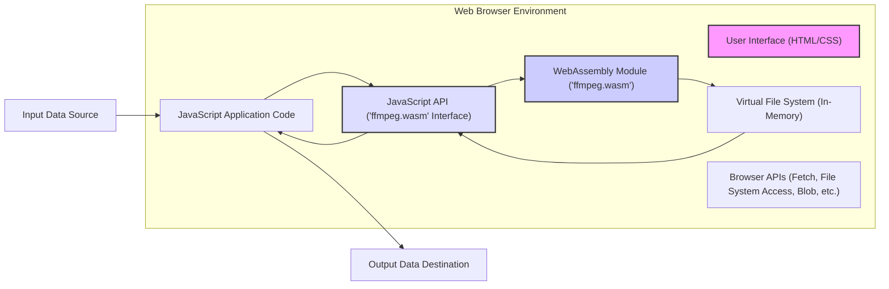
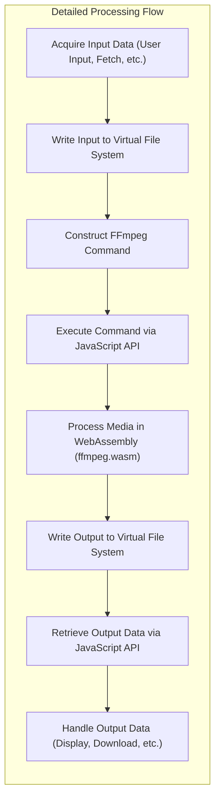

# Project Design Document: ffmpeg.wasm

**Version:** 1.1
**Date:** October 26, 2023
**Author:** AI Software Architect

## 1. Introduction

This document provides an enhanced design overview of the `ffmpegwasm/ffmpeg.wasm` project, specifically tailored for use in subsequent threat modeling activities. This project compiles the widely used FFmpeg multimedia framework into WebAssembly (Wasm), enabling its execution within web browsers. This document details the architecture, key components, data flow, and security considerations, providing a comprehensive understanding of the system's attack surface and potential vulnerabilities.

## 2. Goals and Objectives

The primary goals of the `ffmpegwasm/ffmpeg.wasm` project are:

* **Enable client-side media processing:** Empower web applications to perform complex media manipulation tasks directly within the user's browser, thereby reducing server-side load and enhancing user experience.
* **Leverage the power of FFmpeg:** Provide web developers with access to the extensive and robust functionality of the FFmpeg library within the browser environment.
* **Maintain compatibility:** Ensure a high degree of functional compatibility with existing FFmpeg command-line options and functionalities, minimizing the learning curve for developers familiar with FFmpeg.
* **Provide a usable API:** Offer a clear, well-documented, and intuitive JavaScript API for seamless interaction with the underlying WebAssembly module.

## 3. System Architecture

The `ffmpegwasm/ffmpeg.wasm` project operates entirely within the client-side web browser environment. Its architecture comprises the following key components, working in concert:

* **Web Browser:** The user's web browser serves as the runtime environment, providing the necessary infrastructure for executing the JavaScript application code and the WebAssembly module. This includes the JavaScript engine, WebAssembly runtime, and various browser APIs.
* **JavaScript Application Code:** This layer encompasses the developer's custom JavaScript code that utilizes the `ffmpeg.wasm` library. It orchestrates the media processing workflow, interacts with the user interface, and manages data flow.
* **JavaScript API (`ffmpeg.wasm` Interface):** This is the public interface provided by the `ffmpeg.wasm` library. It consists of a set of JavaScript functions and classes that abstract the complexities of interacting directly with the WebAssembly module. Key responsibilities include:
    * **Module Loading and Initialization:**  Functions to load and initialize the `ffmpeg.wasm` WebAssembly module within the browser.
    * **Virtual File System Management:**  Functions to interact with the in-memory virtual file system, allowing JavaScript to write input files and read output files.
    * **Command Execution:**  A function to execute FFmpeg commands within the WebAssembly environment, passing the command string as an argument.
    * **Event Handling and Callbacks:** Mechanisms for the WebAssembly module to communicate status updates, progress, and errors back to the JavaScript application.
* **WebAssembly Module (`ffmpeg.wasm`):** This is the core processing engine, representing the compiled FFmpeg library in WebAssembly format. It contains the complete logic for media decoding, encoding, filtering, demuxing, and muxing. It operates within the sandboxed WebAssembly environment provided by the browser.
* **Virtual File System (In-Memory):** Due to browser security restrictions on direct file system access, `ffmpeg.wasm` employs an in-memory virtual file system. This acts as a temporary storage space for input and output files during processing. Data is transferred to and from this virtual file system via the JavaScript API.
* **Browser APIs:** The project leverages various browser APIs to interact with the external environment:
    * **Fetch API:** Used for fetching media data from remote URLs.
    * **File System Access API (if available):**  Potentially used for more direct interaction with the user's file system, subject to user permissions.
    * **Blob and ArrayBuffer APIs:** Used for handling and manipulating binary media data.
    * **Download API:** Used to trigger downloads of processed media files to the user's local system.
* **Input Data:** The media data to be processed by FFmpeg. This data can originate from several sources:
    * **User-Selected Files:** Files chosen by the user through `<input type="file">` elements.
    * **Data from URLs:** Media data fetched from remote servers using the Fetch API.
    * **Programmatically Generated Data:** Media data created dynamically within the JavaScript application.
* **Output Data:** The processed media data generated by the `ffmpeg.wasm` module. This can be:
    * **Downloadable Files:**  The processed media can be offered as a download to the user's local file system.
    * **In-Memory Data (`Uint8Array`):** The output data can be accessed as a `Uint8Array` within the JavaScript environment for further manipulation, streaming, or display.
    * **Data within the Virtual File System:** Output files can remain in the virtual file system for subsequent processing steps within the same `ffmpeg.wasm` instance.

## 4. Data Flow

The typical data flow for processing media using `ffmpeg.wasm` involves the following sequence of actions:

* **Input Data Acquisition:** The JavaScript application initiates the process by acquiring the input media data. This can occur through:
    * The user selecting a file from their local file system.
    * The application fetching data from a remote server using the browser's Fetch API.
    * The application programmatically generating the media data.
* **Virtual File System Population:** The acquired input data is then written to the in-memory virtual file system. This is achieved through the JavaScript API, where the data is associated with a virtual file path.
* **FFmpeg Command Construction and Execution:** The JavaScript application constructs the desired FFmpeg command string (e.g., `-i input.mp4 -c:v libx264 output.mp4`). This command string is passed to the `ffmpeg.wasm` module via the JavaScript API's command execution function.
* **WebAssembly Processing:** The `ffmpeg.wasm` module receives the command, parses it, accesses the specified input file from the virtual file system, performs the requested media processing operations (decoding, encoding, filtering, etc.), and writes the resulting output to the virtual file system.
* **Output Data Retrieval:** Once processing is complete, the JavaScript application retrieves the output data from the virtual file system using the JavaScript API. This can involve:
    * Reading the contents of an output file as a `Uint8Array` for in-memory manipulation.
    * Triggering a download of the output file to the user's device using browser download APIs.
* **Output Data Handling:** The JavaScript application then handles the retrieved output data according to the application's requirements. This might include:
    * Displaying the processed media in a `<video>` or `<audio>` element on the web page.
    * Performing further processing or analysis of the data within the JavaScript environment.
    * Initiating a download of the processed file for the user.

## 5. Security Considerations

Given the client-side execution environment of `ffmpeg.wasm`, security is a critical concern. The following security considerations are important for threat modeling:

* **Input Validation and Sanitization:** FFmpeg, in its native form, has a history of vulnerabilities related to processing maliciously crafted input files. While `ffmpeg.wasm` operates within the browser's sandbox, rigorous input validation and sanitization are crucial. This should occur both within the WebAssembly module (inherent in the FFmpeg codebase) and potentially through pre-processing in the JavaScript application layer to filter or sanitize input before passing it to `ffmpeg.wasm`.
* **Memory Safety within the WebAssembly Environment:** WebAssembly provides a degree of memory safety compared to native code execution. However, underlying memory management issues within the compiled FFmpeg C/C++ code could still potentially lead to vulnerabilities if not handled correctly by the WebAssembly runtime. Regular updates to `ffmpeg.wasm` are essential to incorporate security patches from the upstream FFmpeg project.
* **Virtual File System Security:** The implementation of the in-memory virtual file system must be secure to prevent vulnerabilities such as path traversal attacks, where an attacker could potentially access or manipulate files outside of the intended scope. Access controls and proper isolation within the virtual file system are important.
* **JavaScript API Security:** The JavaScript API should be carefully designed to prevent misuse or exploitation. For instance, it should not expose functionalities that could allow arbitrary code execution or bypass browser security restrictions. Input validation on parameters passed to the API is also crucial.
* **Content Security Policy (CSP):** Web applications integrating `ffmpeg.wasm` should implement a strong Content Security Policy to mitigate risks such as cross-site scripting (XSS) attacks. The CSP should restrict the sources from which scripts and other resources can be loaded.
* **Cross-Origin Resource Sharing (CORS):** When fetching input data from external sources, proper CORS configuration on the remote servers is essential to prevent unauthorized access and potential data breaches. The application should also handle CORS preflight requests correctly.
* **Supply Chain Security:** The process of building and distributing `ffmpeg.wasm` must be secure to prevent the introduction of malicious code. This includes verifying the integrity of the upstream FFmpeg source code, the Emscripten toolchain used for compilation, and the distribution channels (e.g., npm). Dependency management and vulnerability scanning of build dependencies are also important.
* **Resource Limits and Denial of Service:** Consider implementing mechanisms to limit the resources (CPU, memory, execution time) consumed by the `ffmpeg.wasm` module to prevent denial-of-service (DoS) scenarios within the browser. This could involve setting timeouts or monitoring resource usage.
* **Error Handling and Information Disclosure:**  Proper error handling within the `ffmpeg.wasm` module and the JavaScript API is important to prevent the disclosure of sensitive information through error messages. Generic error messages should be used where appropriate.
* **Dependency Management:**  The `ffmpeg.wasm` project likely relies on other JavaScript libraries or dependencies. These dependencies should be carefully vetted for security vulnerabilities and kept up to date.

## 6. Deployment Considerations

`ffmpeg.wasm` is typically deployed as a set of static assets (the `.wasm` file and associated JavaScript files) alongside the web application. Common deployment strategies include:

* **Direct Inclusion:**  Including the necessary files directly within the web application's file structure, served from the same origin as the application.
* **Content Delivery Network (CDN):** Hosting the files on a CDN for improved performance, caching, and global availability. Ensure the CDN configuration includes appropriate security headers.
* **Package Managers (npm, yarn):** Distributing the library as a package through package managers like npm or yarn, allowing for easy integration into JavaScript projects and management of dependencies.

The web application then loads the `ffmpeg.wasm` module and its associated JavaScript API at runtime, typically during the application's initialization phase.

## 7. Future Considerations

Potential future enhancements and considerations for `ffmpeg.wasm` include:

* **Performance Optimizations:** Continuously exploring and implementing performance optimizations for the WebAssembly module to reduce processing time and resource consumption.
* **Feature Parity with Upstream FFmpeg:**  Maintaining and improving feature parity with the latest versions of the upstream FFmpeg project to provide access to new functionalities and bug fixes.
* **Advanced API Features:**  Developing more advanced and granular API features to provide developers with finer control over FFmpeg operations and access to more specialized functionalities.
* **Integration with Emerging Browser Features:** Exploring deeper integration with new and emerging browser features and APIs to enhance functionality and performance.
* **Security Audits and Penetration Testing:**  Regularly conducting thorough security audits and penetration testing to identify and address potential vulnerabilities.
* **Improved Error Reporting and Debugging:** Enhancing error reporting mechanisms and providing better debugging tools for developers working with `ffmpeg.wasm`.

This enhanced design document provides a more detailed and comprehensive overview of the `ffmpegwasm/ffmpeg.wasm` project's architecture, data flow, and security considerations. It serves as a robust foundation for conducting thorough threat modeling activities.