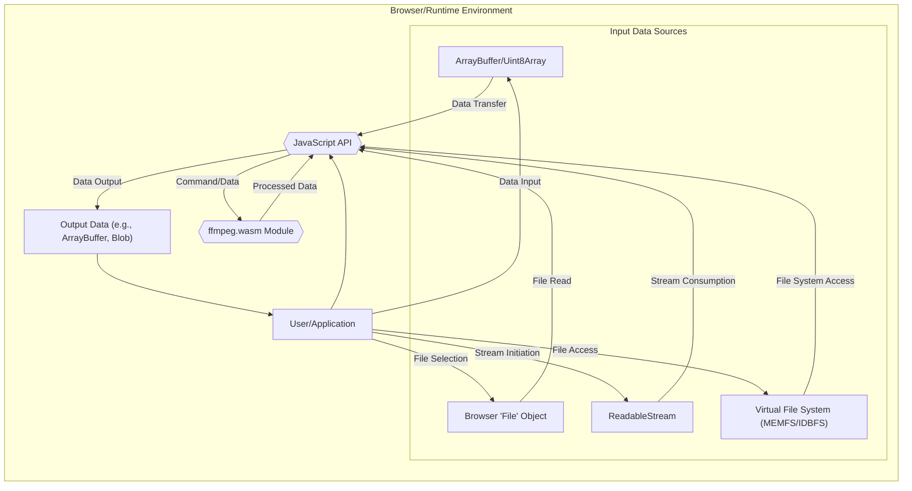

## Project Design Document: ffmpeg.wasm (Improved)

**1. Introduction**

This document provides an enhanced design overview of the `ffmpeg.wasm` project, a WebAssembly port of the robust FFmpeg multimedia framework. This detailed design serves as a critical artifact for understanding the system's architecture, individual components, and the intricate flow of data. This understanding is paramount for conducting thorough and effective threat modeling activities.

**2. Goals and Objectives**

*   **Primary Goal:** To deliver a fully functional and highly performant WebAssembly build of the FFmpeg suite, enabling comprehensive multimedia processing capabilities directly within web browsers and other JavaScript-centric runtime environments (e.g., Node.js).
*   **Key Objectives:**
    *   Successfully compile the core FFmpeg libraries (including but not limited to `libavcodec`, `libavformat`, `libavutil`, `libswscale`, `libavfilter`) into WebAssembly bytecode using tools like Emscripten.
    *   Develop a well-defined and user-friendly JavaScript API to facilitate seamless interaction with the underlying compiled WebAssembly module. This API should abstract away the complexities of WASM interaction.
    *   Establish robust and efficient mechanisms for inputting diverse multimedia data formats and retrieving processed output data in various formats.
    *   Strive for performance levels that are competitive with native FFmpeg implementations where the inherent limitations of the browser environment allow.
    *   Offer an intuitive and developer-friendly interface that simplifies the execution of common FFmpeg functionalities, mirroring the command-line interface where appropriate.
    *   Prioritize and ensure the security of the WebAssembly module and all its interactions with the host JavaScript environment, mitigating potential vulnerabilities.

**3. System Architecture**

The `ffmpeg.wasm` project is structured around the following key architectural components, each with distinct responsibilities:

*   **Core FFmpeg (WebAssembly Module):**
    *   The fundamental building block, representing the core FFmpeg libraries (e.g., `libavcodec`, `libavformat`, `libavutil`, `libswscale`, `libavfilter`) meticulously compiled into WebAssembly bytecode.
    *   Responsible for the core multimedia processing tasks, including encoding, decoding, transcoding, filtering, demuxing, and muxing of various audio and video formats.
    *   Operates within the secure and isolated sandboxed environment provided by the WebAssembly virtual machine within the web browser or JavaScript runtime. This isolation is a key security feature.
    *   Communicates and exchanges data with the surrounding JavaScript environment through a clearly defined and managed interface, often involving shared memory or function calls.

*   **JavaScript API Layer:**
    *   Serves as the primary interface for developers to interact with the `ffmpeg.wasm` module. It provides a set of JavaScript functions, classes, and potentially asynchronous operations.
    *   Handles crucial tasks such as:
        *   Dynamically loading and initializing the `ffmpeg.wasm` module, managing its lifecycle within the JavaScript environment.
        *   Precisely managing memory allocation and deallocation within the WebAssembly module's linear memory space, preventing memory leaks or corruption.
        *   Efficiently marshalling (converting and transferring) data between JavaScript data types (e.g., `ArrayBuffer`, `Uint8Array`) and the memory space accessible by the WASM module. This is critical for performance.
        *   Providing a higher-level, more abstract interface to common FFmpeg operations, often mirroring the familiar FFmpeg command-line syntax for ease of use.
        *   Facilitating the handling of events, progress updates, and callbacks originating from the WebAssembly module, allowing for asynchronous processing and user feedback.
        *   Implementing security checks and input validation before passing data to the WASM module.

*   **Input/Output Mechanisms:**
    *   Defines the various methods by which multimedia data is ingested into the `ffmpeg.wasm` module for processing and how the resulting processed data is retrieved.
    *   Commonly supported mechanisms include:
        *   **`ArrayBuffer` and `Uint8Array`:**  Transferring raw byte arrays representing multimedia data directly into the WASM module's memory. This is a common and efficient method.
        *   **Browser `File` Objects:**  Leveraging the browser's built-in `File` API to access and process multimedia files residing on the user's local file system. Security restrictions apply here.
        *   **`ReadableStream` API:**  Enabling the processing of multimedia data in a streaming fashion, which is beneficial for handling large files or real-time data.
        *   **Virtual File System (MEMFS/IDBFS):**  Emulating a file system within the browser's memory (MEMFS) or using IndexedDB (IDBFS) for persistent storage. This allows for more complex file handling scenarios within the WASM environment.

*   **Browser/JavaScript Runtime Environment:**
    *   The host environment where the `ffmpeg.wasm` module and the JavaScript API execute. This could be a web browser or a Node.js environment.
    *   Provides the necessary APIs and underlying infrastructure for the project to function correctly, including WebAssembly support, the JavaScript engine (e.g., V8), and relevant browser APIs.
    *   Enforces security restrictions and sandboxing mechanisms on the WebAssembly module, limiting its access to system resources and preventing malicious actions.

**4. Data Flow (Detailed)**

The typical process of multimedia processing using `ffmpeg.wasm` involves a well-defined sequence of steps:

**Step-by-Step Breakdown:**

1. **Input Data Acquisition:** The user or the web application initiates the process by providing multimedia data. This can occur through various means:
    *   Providing raw byte data as an `ArrayBuffer` or `Uint8Array`.
    *   Selecting a file using the browser's file input element, resulting in a `File` object.
    *   Initiating a `ReadableStream` that provides the multimedia data chunks.
    *   Accessing files already present within the virtual file system (MEMFS or IDBFS).

2. **Data Transfer and Marshalling to WASM:** The JavaScript API layer takes the acquired input data and prepares it for processing by the `ffmpeg.wasm` module. This involves:
    *   For `ArrayBuffer`/`Uint8Array`: Potentially copying the data into the WASM module's linear memory or creating a pointer to the data within JavaScript's memory space if shared memory is utilized.
    *   For `File` objects: Reading the file's contents, typically as an `ArrayBuffer`, and then transferring it to the WASM module's memory or virtual file system.
    *   For `ReadableStream`: Consuming the stream chunks and transferring them to the WASM module's memory or virtual file system incrementally.
    *   For Virtual File System:  The JavaScript API interacts with the `FS` object (provided by Emscripten) to provide the file path to the WASM module.

3. **Command Execution and FFmpeg Processing:** The JavaScript API then invokes the appropriate functions within the `ffmpeg.wasm` module. This typically involves:
    *   Passing FFmpeg command-line arguments as strings to a designated execution function within the WASM module.
    *   Providing pointers to the input data located within the WASM module's memory or providing file paths within the virtual file system.
    *   The `ffmpeg.wasm` module, upon receiving the command and input data, executes the corresponding FFmpeg logic (decoding, encoding, filtering, etc.).

4. **Output Data Generation within WASM:**  The `ffmpeg.wasm` module performs the requested multimedia processing operations and generates the processed output data (e.g., encoded video frames, decoded audio samples, extracted images). This data resides within the WASM module's memory space.

5. **Data Retrieval and Marshalling to JavaScript:** The JavaScript API layer retrieves the processed output data from the `ffmpeg.wasm` module's memory. This process may involve:
    *   Copying the data from the WASM module's linear memory into a JavaScript `ArrayBuffer` or `Uint8Array`.
    *   Reading data from files created within the virtual file system by the WASM module.

6. **Output Data Delivery:** Finally, the JavaScript API makes the processed output data available to the user or the web application. This can be in the form of:
    *   An `ArrayBuffer` or `Uint8Array` containing the raw processed data.
    *   A `Blob` object, which is useful for downloading or further processing in the browser.
    *   A URL representing a file within the virtual file system.

**5. Key Components and Interfaces (Detailed)**

*   **`load()` Function (JavaScript API):**  An asynchronous function responsible for fetching, compiling, and instantiating the `ffmpeg.wasm` module. It typically returns a promise that resolves with an object containing the API functions.
*   **`FS` Object (JavaScript API, Emscripten):**  Provides a JavaScript interface to interact with the virtual file system (MEMFS or IDBFS) managed by the Emscripten runtime within the WASM module. Allows for creating, reading, writing, and deleting files.
*   **Command Execution Function (JavaScript API, e.g., `run()`, `exec()`):**  A core function that accepts an array of strings representing FFmpeg command-line arguments. It marshals these arguments to the WASM module and triggers the execution of the corresponding FFmpeg command. Often returns a promise that resolves when the command finishes.
*   **Memory Management Functions (JavaScript API):**  Functions that provide fine-grained control over memory allocation and deallocation within the WASM module's linear memory. This might include functions like `allocate()` and `deallocate()` or more specialized memory management utilities.
*   **Data Marshalling Logic (JavaScript API):**  The underlying code responsible for efficiently converting data between JavaScript data types (numbers, strings, arrays) and their corresponding representations in the WASM module's memory. This often involves typed arrays and careful handling of memory offsets and sizes.
*   **FFmpeg Libraries (WebAssembly):**  The core FFmpeg libraries compiled to WebAssembly, each responsible for specific multimedia processing tasks:
    *   `libavcodec`:  Provides a wide range of audio and video codecs for encoding and decoding.
    *   `libavformat`:  Handles various multimedia container formats (e.g., MP4, MKV, AVI, MP3, AAC), enabling demuxing (splitting into elementary streams) and muxing (combining elementary streams).
    *   `libavutil`:  Contains essential utility functions used by other FFmpeg libraries, including memory management, error handling, and data structures.
    *   `libswscale`:  Performs video scaling and pixel format conversion, allowing for adapting video to different resolutions and formats.
    *   `libavfilter`:  Enables the application of various audio and video filters for effects, enhancements, and transformations.

**6. Security Considerations (Detailed for Threat Modeling)**

This section outlines potential security threats and vulnerabilities relevant to `ffmpeg.wasm`, crucial for informing threat modeling efforts.

*   **Input Validation Vulnerabilities:**
    *   **Threat:** Maliciously crafted input data (e.g., corrupted video files, specially designed audio streams) could exploit vulnerabilities within the FFmpeg libraries (even in the WASM version) leading to:
        *   **Buffer Overflows:** Writing data beyond allocated memory boundaries, potentially causing crashes or enabling arbitrary code execution (though limited by the WASM sandbox).
        *   **Integer Overflows:** Causing unexpected behavior or crashes due to arithmetic overflows when processing input data sizes or parameters.
        *   **Denial of Service (DoS):**  Input designed to consume excessive resources (memory, CPU), making the application unresponsive.
    *   **Mitigation Strategies:** Implement robust input validation and sanitization within the JavaScript API layer *before* passing data to the WASM module. This includes checking file headers, data sizes, and parameter ranges.

*   **Memory Management Errors:**
    *   **Threat:** Incorrect memory management within the WASM module or during data transfer between JavaScript and WASM can lead to:
        *   **Memory Corruption:** Overwriting or corrupting memory, potentially leading to crashes or unexpected behavior.
        *   **Memory Leaks:** Failing to release allocated memory, eventually leading to resource exhaustion and application instability.
    *   **Mitigation Strategies:** Employ careful memory management practices within the WASM module and the JavaScript API. Utilize tools and techniques for detecting memory leaks and buffer overflows during development. Leverage Emscripten's memory management features effectively.

*   **JavaScript API Security Flaws:**
    *   **Threat:** Vulnerabilities in the JavaScript API itself could be exploited:
        *   **Cross-Site Scripting (XSS):** If the application using `ffmpeg.wasm` doesn't properly handle output data, it could be vulnerable to XSS attacks.
        *   **Insecure Data Handling:**  Exposure of sensitive data during transfer or processing within the JavaScript environment.
        *   **API Abuse:**  Unintended or malicious use of API functions leading to unexpected behavior or security breaches.
    *   **Mitigation Strategies:**  Design the JavaScript API with security in mind. Implement proper input and output sanitization. Follow secure coding practices. Regularly audit the API for vulnerabilities.

*   **Supply Chain Attacks:**
    *   **Threat:**  Compromise of the build process or dependencies used to create `ffmpeg.wasm`:
        *   **Malicious Code Injection:**  Introduction of malicious code into the FFmpeg source code or the Emscripten toolchain.
        *   **Dependency Vulnerabilities:**  Using vulnerable versions of libraries or tools during the build process.
    *   **Mitigation Strategies:**  Verify the integrity of the FFmpeg source code and the Emscripten toolchain. Use trusted build environments. Implement secure software development lifecycle practices.

*   **Side-Channel Attacks (Less Likely in Browser):**
    *   **Threat:**  Exploiting information leaked through timing differences, resource consumption, or other indirect means.
    *   **Mitigation Strategies:** While less of a direct threat in typical browser usage, be mindful of potential performance variations that could leak information in highly sensitive contexts.

*   **Data Handling and Privacy:**
    *   **Threat:**  Improper handling of sensitive multimedia data:
        *   **Data Leakage:**  Unintentional exposure of user data during processing or storage.
        *   **Unauthorized Access:**  Gaining access to processed or intermediate data by unauthorized parties.
    *   **Mitigation Strategies:**  Implement appropriate data handling procedures. Consider encryption for sensitive data. Adhere to privacy regulations.

*   **Browser Security Policy Violations:**
    *   **Threat:**  Misconfiguration or circumvention of browser security policies (e.g., Content Security Policy - CSP):
        *   **Loading Untrusted Resources:**  Allowing the loading of malicious scripts or resources.
    *   **Mitigation Strategies:**  Properly configure and enforce browser security policies like CSP. Avoid actions that violate these policies.

**7. Deployment**

The `ffmpeg.wasm` module and its accompanying JavaScript API are typically deployed as static assets within a web application. These files are served to the user's browser, where the multimedia processing occurs entirely client-side. Deployment considerations include:

*   **File Size Optimization:**  Minimizing the size of the WASM module and JavaScript files to improve loading times.
*   **Content Delivery Network (CDN):**  Utilizing a CDN to distribute the files efficiently and reduce latency.
*   **Caching Strategies:**  Implementing appropriate caching mechanisms to reduce server load and improve performance for returning users.

**8. Future Considerations**

*   **Further Performance Optimization:**  Continuously exploring techniques to improve the execution speed of the WebAssembly module, potentially through advanced compilation techniques or WASM features.
*   **Expanded Feature Set:**  Increasing the coverage of FFmpeg functionalities accessible through the JavaScript API.
*   **Enhanced Browser API Integration:**  Exploring deeper integration with native browser APIs for media handling, such as the Media Streams API.
*   **Regular Security Audits and Vulnerability Scanning:**  Conducting periodic security assessments to identify and address potential vulnerabilities proactively.
*   **Community Engagement and Contributions:**  Fostering a strong community around the project to encourage contributions and feedback.

This improved design document provides a more detailed and comprehensive understanding of the `ffmpeg.wasm` project, specifically tailored for effective threat modeling. The enhanced descriptions of components, data flow, and security considerations will enable a more thorough assessment of potential risks and the development of appropriate mitigation strategies.