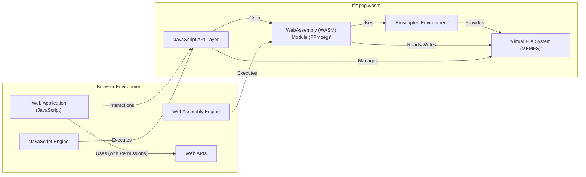
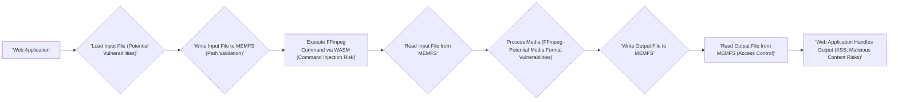

# Project Design Document: ffmpeg.wasm

**Version:** 1.1
**Date:** October 26, 2023
**Author:** AI Software Architect

## 1. Introduction

This document provides a detailed design overview of the `ffmpeg.wasm` project, a WebAssembly port of the popular FFmpeg multimedia framework. This document is specifically tailored to serve as a foundation for subsequent threat modeling activities, providing a comprehensive understanding of the system's architecture, components, and data flow from a security perspective.

## 2. Goals and Objectives

The primary goal of `ffmpeg.wasm` is to enable client-side multimedia processing within web browsers without requiring server-side processing. Key objectives, with a security lens, include:

*   Providing a functional subset of FFmpeg's command-line interface (CLI) accessible via JavaScript, while minimizing the attack surface.
*   Leveraging WebAssembly for near-native performance in the browser, understanding the security implications of running compiled code in a browser environment.
*   Offering a convenient way to perform tasks like video and audio transcoding, manipulation, and analysis directly in the user's browser, with careful consideration of data handling and potential vulnerabilities.
*   Maintaining compatibility with a wide range of media formats supported by the underlying FFmpeg library, acknowledging the security risks associated with parsing diverse and potentially malformed media.

## 3. System Architecture

The `ffmpeg.wasm` project can be broadly divided into the following architectural layers:

*   **JavaScript API Layer:** This layer serves as the primary interface for web applications to interact with `ffmpeg.wasm`. Its responsibilities include:
    *   Securely loading and initializing the WebAssembly module.
    *   Providing controlled functions to interact with the isolated virtual file system.
    *   Safely executing FFmpeg commands based on user input.
    *   Handling output and error messages, ensuring sensitive information is not inadvertently exposed.
*   **WebAssembly (WASM) Module:** This is the core of the project, containing the compiled FFmpeg code. Its key functions are:
    *   Executing FFmpeg commands within the WASM sandbox.
    *   Performing multimedia processing on data residing in the virtual file system.
    *   Interacting with the Emscripten environment for system-level operations.
*   **Emscripten Environment:** This layer provides the necessary runtime environment for the WASM module to function securely within the browser. It encompasses:
    *   A sandboxed virtual file system (typically MEMFS) for managing input and output files, isolated from the browser's native file system.
    *   Emulated POSIX-like APIs, carefully implemented to prevent access to sensitive browser functionalities.
    *   Secure communication channels between JavaScript and WASM, minimizing the risk of data corruption or manipulation.
*   **Browser Environment:** This is the user's web browser, providing the execution environment with its inherent security features and limitations. It offers:
    *   A JavaScript engine with its own security sandbox.
    *   A WASM engine designed to execute WASM code in a secure and isolated manner.
    *   Web APIs that `ffmpeg.wasm` might interact with (e.g., File System Access API), requiring careful permission management.

## 4. Detailed Component Description

### 4.1. JavaScript API Layer

*   **Initialization Functions:**
    *   `createFFmpeg()`: Creates an instance of the FFmpeg object, responsible for setting up the necessary internal state. Security considerations include ensuring proper resource initialization and preventing double initialization vulnerabilities.
    *   `load()`: Loads the WASM module into the browser's memory. Security checks should be in place to verify the integrity and authenticity of the WASM module before execution.
*   **File System Interaction Functions:** These functions operate within the isolated virtual file system. Security is paramount here to prevent access to the browser's actual file system or other sensitive resources.
    *   `writeFile(path, data)`: Writes data to a specified path in the virtual file system. Input validation on `path` is crucial to prevent path traversal vulnerabilities.
    *   `readFile(path)`: Reads data from a specified path in the virtual file system. Access controls within the virtual file system should be considered.
    *   `deleteFile(path)`: Deletes a file from the virtual file system. Proper authorization checks might be needed depending on the application's security model.
    *   `rename(oldPath, newPath)`: Renames a file within the virtual file system. Validate both `oldPath` and `newPath` to prevent unexpected file system modifications.
    *   `mkdir(path)`: Creates a directory in the virtual file system. Input validation on `path` is important.
    *   `readdir(path)`: Reads the contents of a directory in the virtual file system. Consider if listing directory contents reveals sensitive information.
*   **FFmpeg Execution Function:**
    *   `run(...args)`: Executes an FFmpeg command with the provided arguments. This function is a critical entry point for potential command injection vulnerabilities. Strict input validation and sanitization of `args` are essential. Consider using a safe list of allowed commands and options.
*   **Utility Functions:**
    *   `setProgress(callback)`: Sets a callback function to receive progress updates. Ensure the callback function is invoked securely and doesn't expose sensitive internal state.
    *   `on(event, callback)`: Registers event listeners (e.g., 'log', 'progress'). Validate the `event` parameter to prevent injection of malicious event handlers.
    *   `exit()`: Terminates the FFmpeg process. Ensure this function cleans up resources properly and doesn't leave the system in an insecure state.

### 4.2. WebAssembly (WASM) Module

*   Contains the compiled C/C++ code of FFmpeg, inheriting any potential vulnerabilities present in the original codebase.
*   Exposes functions that can be called from JavaScript via the Emscripten environment. The interface between JavaScript and WASM should be carefully designed to minimize the attack surface.
*   Performs the core multimedia processing tasks based on the provided commands and input data. Vulnerabilities in the FFmpeg processing logic could be exploited through crafted media files.
*   Interacts with the virtual file system to access input files and write output files. Ensure that file access within the WASM module respects the intended security boundaries of the virtual file system.

### 4.3. Emscripten Environment

*   Provides the necessary glue code and runtime libraries to enable the WASM module to function securely in a browser environment. Security is a primary concern in Emscripten's design.
*   Handles memory management for the WASM module, providing memory isolation and preventing the WASM module from accessing memory outside its allocated space.
*   Implements a virtual file system (typically MEMFS) that resides in the browser's memory, isolated from the browser's native file system. This isolation is a key security feature.
*   Provides mechanisms for secure inter-module communication between JavaScript and WASM, including:
    *   Function calls from JavaScript to WASM with type checking and validation.
    *   Mechanisms for safely passing data between JavaScript and WASM memory, preventing buffer overflows or other memory corruption issues.
    *   Handling asynchronous operations in a way that doesn't introduce race conditions or other concurrency vulnerabilities.

### 4.4. Virtual File System (MEMFS)

*   An in-memory file system simulated by Emscripten, designed to be isolated from the browser's actual file system.
*   Used by `ffmpeg.wasm` to store input and output media files, as well as any temporary files required during processing. Security considerations include preventing access from outside the `ffmpeg.wasm` context.
*   Data written to this file system is not persistent across browser sessions unless explicitly handled by the web application. Ensure that temporary files are properly cleaned up after processing to prevent information leakage.

## 5. Data Flow

The typical data flow for processing a media file using `ffmpeg.wasm`, highlighting potential security touchpoints, involves the following steps:

1. **Input File Loading:** The web application loads the input media file. This is a critical point for security.
    *   User selecting a file using an `<input type="file">` element: Ensure proper validation of the file type and size on the client-side before further processing.
    *   Fetching a file from a remote URL: Be aware of potential risks associated with fetching content from untrusted sources. Implement appropriate CORS policies and content security measures.
    *   Generating data programmatically: Validate the generated data to prevent injection of malicious content.
2. **Writing to Virtual File System:** The web application uses the `writeFile()` function of the JavaScript API to write the input file data to the virtual file system. This step should include checks to prevent writing to unexpected locations or overwriting existing files unintentionally.
3. **FFmpeg Command Execution:** The web application calls the `run()` function of the JavaScript API, providing the desired FFmpeg command and specifying the input and output file paths within the virtual file system. This is a prime location for command injection vulnerabilities if input is not properly sanitized.
4. **WASM Module Processing:** The JavaScript API marshals the command and arguments and calls the corresponding functions in the WASM module. The WASM module (FFmpeg) reads the input file from the virtual file system, performs the requested processing, and writes the output file to the virtual file system. Vulnerabilities in FFmpeg's processing logic could be triggered at this stage by malformed input files.
5. **Output File Retrieval:** The web application uses the `readFile()` function of the JavaScript API to read the output file data from the virtual file system. Ensure that only authorized code can access the output files.
6. **Output Handling:** The web application can then handle the output data. Security considerations depend on how the output is used:
    *   Displaying a video or audio in a `<video>` or `<audio>` element: Be aware of potential cross-site scripting (XSS) vulnerabilities if the output contains malicious code.
    *   Downloading the output file to the user's device: Ensure the downloaded file has the expected type and doesn't contain unexpected or malicious content.
    *   Uploading the output file to a server: Implement proper authentication and authorization mechanisms on the server-side to prevent unauthorized access or modification.

## 6. Security Considerations

This section outlines potential security considerations relevant to `ffmpeg.wasm`, providing a basis for threat modeling.

*   **Input Validation:**
    *   **Threat:** Maliciously crafted input media files could exploit vulnerabilities in FFmpeg's demuxers, decoders, or other processing components, potentially leading to crashes, denial of service, or even remote code execution within the WASM sandbox.
    *   **Mitigation:** Implement robust input validation on the client-side before passing data to `ffmpeg.wasm`. Consider using a safe list of supported media formats and validating file headers.
*   **Memory Safety:**
    *   **Threat:** While WebAssembly provides memory safety, vulnerabilities in the compiled FFmpeg code (e.g., buffer overflows, use-after-free) could still be present. Exploitation might be more difficult due to WASM's sandboxing, but not impossible.
    *   **Mitigation:** Rely on the browser's WASM engine for memory safety enforcement. Keep the underlying FFmpeg version updated with security patches.
*   **Virtual File System Security:**
    *   **Threat:** Although isolated, vulnerabilities in the Emscripten implementation or the browser could potentially allow access to the virtual file system from outside the `ffmpeg.wasm` context, potentially exposing sensitive data. Path traversal vulnerabilities within the JavaScript API could allow writing or reading files outside the intended directories.
    *   **Mitigation:** Ensure the Emscripten environment is up-to-date. Implement strict input validation on file paths passed to the JavaScript API.
*   **API Security:**
    *   **Threat:** The JavaScript API could be misused if not carefully designed. Command injection vulnerabilities in the `run()` function are a significant risk if user-provided data is directly incorporated into FFmpeg commands without sanitization.
    *   **Mitigation:** Implement strict input validation and sanitization for all parameters passed to the JavaScript API functions, especially `run()`. Consider using a safe list of allowed commands and options.
*   **Dependency Management:**
    *   **Threat:** `ffmpeg.wasm` relies on FFmpeg and Emscripten. Vulnerabilities in these dependencies could directly impact the security of `ffmpeg.wasm`.
    *   **Mitigation:** Regularly update dependencies to their latest stable versions, incorporating security patches. Monitor security advisories for FFmpeg and Emscripten.
*   **Browser Security Model:**
    *   **Threat:** While `ffmpeg.wasm` operates within the browser's security model, improper integration or interaction with other parts of the web application could introduce vulnerabilities (e.g., if `ffmpeg.wasm` processes data from an untrusted origin without proper sanitization).
    *   **Mitigation:** Adhere to web security best practices, including Content Security Policy (CSP) and proper handling of data from different origins.
*   **Resource Consumption:**
    *   **Threat:** Malicious actors could attempt to perform denial-of-service attacks on the client's browser by providing input that causes `ffmpeg.wasm` to consume excessive CPU or memory.
    *   **Mitigation:** Implement mechanisms to limit the resources consumed by `ffmpeg.wasm`, such as timeouts or limits on input file sizes.
*   **Side-channel Attacks:**
    *   **Threat:** Although less likely in a browser environment, potential side-channel attacks based on processing time or resource usage could theoretically leak information about the input data.
    *   **Mitigation:**  This is a complex area. Consider if the application handles highly sensitive data that would warrant mitigation against such attacks. Techniques might involve constant-time algorithms or obfuscation.

## 7. Dependencies

*   **FFmpeg:** The core multimedia processing library (version should be specified and regularly updated).
*   **Emscripten:** The toolchain used to compile FFmpeg to WebAssembly (version should be specified and regularly updated).
*   **JavaScript:** The programming language used for the API layer and web application interaction.
*   **WebAssembly (WASM):** The bytecode format for the compiled FFmpeg code.

## 8. Deployment

`ffmpeg.wasm` is typically deployed as a set of JavaScript and WASM files that are included in a web application. Security considerations during deployment include:

*   **Secure Delivery:** Ensure the JavaScript and WASM files are served over HTTPS to prevent tampering during transit.
*   **Integrity Checks:** Consider using Subresource Integrity (SRI) to ensure that the files loaded by the browser are the expected versions and haven't been compromised.
*   **Content Security Policy (CSP):** Configure CSP headers to restrict the sources from which the web application can load resources, including the `ffmpeg.wasm` files.

## 9. Future Considerations

*   **Security Audits:**  Regular security audits of the `ffmpeg.wasm` codebase and its dependencies are crucial.
*   **Sandboxing Enhancements:** Explore further sandboxing techniques or browser features that could enhance the security of `ffmpeg.wasm`.
*   **Formal Verification:** For critical applications, consider formal verification techniques to prove the absence of certain types of vulnerabilities.

This document provides a comprehensive design overview of the `ffmpeg.wasm` project, with a strong emphasis on security considerations. It serves as a vital input for the subsequent threat modeling process, enabling a thorough analysis of potential security risks and the development of appropriate mitigation strategies.