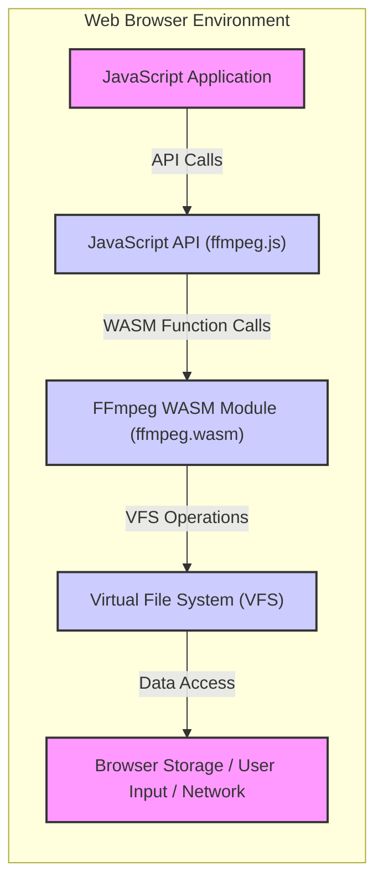

# Project Design Document: ffmpeg.wasm (Improved)

**Project Name:** ffmpeg.wasm

**Project Repository:** [https://github.com/ffmpegwasm/ffmpeg.wasm](https://github.com/ffmpegwasm/ffmpeg.wasm)

**Document Version:** 1.1
**Date:** 2023-10-27
**Author:** AI Software Architect

## 1. Introduction

This document provides an enhanced design overview of the ffmpeg.wasm project, building upon the previous version. ffmpeg.wasm is a WebAssembly port of the FFmpeg multimedia framework, enabling client-side media processing within web browsers and JavaScript environments. This document aims to provide a more detailed and refined description of the system architecture, data flow, and security considerations, serving as a robust foundation for threat modeling and security analysis.

## 2. Project Overview

ffmpeg.wasm compiles the core FFmpeg libraries into WebAssembly (WASM), allowing for efficient media manipulation directly in the browser. It offers a JavaScript API to interact with the WASM module, enabling execution of FFmpeg commands and access to its functionalities from JavaScript. This eliminates the need for server-side media processing for many use cases.

**Key Features (Expanded):**

*   **Client-Side Media Processing:** Reduces server load, latency, and bandwidth usage by performing media operations directly in the user's browser. Enhances user privacy by keeping media data client-side.
*   **Comprehensive FFmpeg Functionality:** Exposes a wide range of FFmpeg features, including encoding, decoding, transcoding, streaming protocol support, complex filtering, metadata manipulation, and more.
*   **Near-Native Performance via WebAssembly:** Leverages WebAssembly's optimized execution environment for performance comparable to native applications, significantly faster than pure JavaScript implementations.
*   **User-Friendly JavaScript API:** Provides an intuitive and well-documented JavaScript API for seamless integration into web applications, simplifying the use of complex FFmpeg commands.
*   **Abstracted Virtual File System (VFS):** Implements a flexible VFS to manage file input and output within the browser sandbox, supporting various storage backends and data sources.
*   **Modular Design:**  While based on FFmpeg, the WASM build process allows for some degree of modularity, potentially enabling smaller builds with only necessary codecs and features included (depending on build configurations).

## 3. System Architecture

The ffmpeg.wasm architecture is composed of distinct layers and components working together to provide client-side media processing.

### 3.1. High-Level Architecture Diagram (Improved)



### 3.2. Component Description (Enhanced)

*   **"JavaScript Application"**: The frontend web application or JavaScript code that initiates and controls media processing tasks using ffmpeg.wasm. It's responsible for user interaction, command construction, and handling results.
*   **"JavaScript API (ffmpeg.js)"**: This layer serves as the primary interface for developers. It provides functions to:
    *   **Load and Initialize WASM Module:**  Handles loading the `ffmpeg.wasm` file and initializing the WASM runtime environment.
    *   **Execute FFmpeg Commands:**  Provides a function (typically `ffmpeg.run()`) to execute FFmpeg commands as strings, parsing and translating them for the WASM module.
    *   **Manage Virtual File System (VFS):** Offers functions to interact with the VFS, such as `FS.writeFile()`, `FS.readFile()`, `FS.mkdir()`, etc., allowing JavaScript to pre-stage input files and retrieve output files.
    *   **Handle Events and Progress:**  Provides mechanisms to receive events from the WASM module, including progress updates during long-running operations and error messages.
    *   **Memory Management (Potentially):** May expose functions for manual memory management if needed for advanced use cases, although typically memory management is handled within the WASM environment.
*   **"FFmpeg WASM Module (ffmpeg.wasm)"**: The core of the system, this is the compiled FFmpeg library in WebAssembly format. It contains:
    *   **FFmpeg Core Libraries:**  Includes libraries like `libavcodec`, `libavformat`, `libavfilter`, `libavutil`, `libswscale`, `libswresample`, etc., providing the full range of FFmpeg's media processing capabilities.
    *   **WASM Bindings:**  Code that bridges the gap between the JavaScript API and the C/C++ FFmpeg code, allowing JavaScript to call functions within the WASM module.
    *   **Minimal Operating System Abstraction:**  Emscripten provides a minimal POSIX-like environment within the browser, allowing FFmpeg (which expects a traditional OS) to run.
*   **"Virtual File System (VFS)"**:  A crucial component for managing file access within the browser sandbox. Key aspects include:
    *   **Abstraction Layer:**  Provides a file system interface (similar to POSIX file operations) that FFmpeg WASM can use without direct access to the host file system.
    *   **Backends:**  Can be configured to use different storage backends, such as:
        *   **MEMFS (In-Memory File System):**  Stores files in JavaScript heap memory. Fast but volatile (data lost on page reload). Default backend.
        *   **IDBFS (IndexedDB File System):**  Persists files in the browser's IndexedDB storage. Slower than MEMFS but persistent across sessions.
        *   **Other Potential Backends:**  Custom backends could be implemented to integrate with other browser storage mechanisms or even remote storage (though more complex).
    *   **Path Handling:**  Manages file paths within the virtual file system, isolating FFmpeg WASM from the actual browser file system.
*   **"Browser Storage / User Input / Network"**:  The external data sources and sinks for ffmpeg.wasm:
    *   **Browser Storage (IndexedDB, LocalStorage, Cache API):** Used by VFS backends like IDBFS for persistent storage of files.
    *   **User Input (File Uploads, Drag & Drop):**  Files provided by the user through browser interactions, made accessible to the VFS via JavaScript API functions.
    *   **Network Resources (URLs, Media Streams):** Data fetched from the network using `fetch` or other browser APIs, then written to the VFS for FFmpeg processing. Output can also be streamed or uploaded to the network.

## 4. Data Flow Diagram (Improved)

This diagram provides a more detailed view of the data flow, explicitly showing data storage components.

```mermaid
graph LR
    subgraph "JavaScript Application"
        A["User Initiates FFmpeg Command"]
        B["JavaScript API Call (ffmpeg.js)"]
    end
    subgraph "ffmpeg.wasm Environment"
        C["JavaScript API Handler"]
        D["FFmpeg WASM Module"]
        E["Virtual File System (VFS)"]
    end
    subgraph "Data Storage/Input/Output"
        F["Input Data Source (User Input, Network)"]
        G["Browser Storage (IndexedDB, MEMFS)"]
        H["Output Data Destination (Download, Browser Display, Network)"]
    end

    A --> B
    B --> C
    C --> D: "Execute FFmpeg Command"
    D --> E: "VFS File I/O Requests"
    E --> G: "Read/Write VFS Files"
    G --> E
    E --> F: "Fetch External Input Data (if needed)"
    F --> E
    E --> D: "Data for FFmpeg Processing"
    D --> E: "Write Output Data (VFS)"
    E --> H: "Deliver Output Data (Download, Display, etc.)"
    H --> E
    E --> C: "Operation Complete"
    C --> B: "Return Results"
    B --> A: "Provide Results to User"

    linkStyle 0,1,2,3,4,5,6,7,8,9,10,11,12,13,14,15 stroke-width:2px;
```

**Data Flow Description (Enhanced):**

1.  **"User Initiates FFmpeg Command"**: User interaction triggers a media processing task.
2.  **"JavaScript API Call (ffmpeg.js)"**: JavaScript application calls `ffmpeg.run()` or similar API function with the FFmpeg command and input/output paths.
3.  **"JavaScript API Handler"**:  API handler receives the command, sets up the environment, and prepares to call the WASM module.
4.  **"Execute FFmpeg Command"**: The API handler invokes the FFmpeg WASM module, passing the command and initiating execution.
5.  **"VFS File I/O Requests"**: During execution, FFmpeg WASM makes requests to the VFS to read input files and write output files using virtual paths.
6.  **"Read/Write VFS Files"**: The VFS interacts with its configured backend (e.g., "Browser Storage" - IndexedDB or MEMFS) to perform file read and write operations based on the virtual paths.
7.  **"Fetch External Input Data (if needed)"**: If input files are not already in the VFS (e.g., URLs), the VFS or JavaScript API may fetch data from "Input Data Source" (Network, User Input) and write it to the VFS.
8.  **"Data for FFmpeg Processing"**: The VFS provides the requested input data to the "FFmpeg WASM Module" for processing.
9.  **"Write Output Data (VFS)"**: FFmpeg WASM writes processed output data back to the VFS using virtual paths.
10. **"Deliver Output Data (Download, Display, etc.)"**: The JavaScript application retrieves output data from the VFS and delivers it to the "Output Data Destination" (e.g., initiates a download, displays media in the browser, uploads to a server).
11. **"Operation Complete"**: FFmpeg WASM finishes processing and signals completion to the JavaScript API.
12. **"Return Results"**: The API handler returns results (e.g., exit code, output file paths) to the JavaScript application.
13. **"Provide Results to User"**: The JavaScript application handles the results and provides feedback to the user.

## 5. Security Considerations for Threat Modeling (Expanded & with Recommendations)

This section expands on security considerations and provides preliminary mitigation recommendations. A full threat model should be conducted using a methodology like STRIDE.

*   **Input Validation (Critical):**
    *   **Threat:** Malicious Media Files (DoS, RCE). FFmpeg's complexity makes it susceptible to vulnerabilities when parsing crafted media.
    *   **Recommendation:**
        *   **Strict Input Sanitization:**  While difficult to fully sanitize media files client-side, implement basic checks (file type, size limits).
        *   **FFmpeg Security Updates:**  Keep ffmpeg.wasm updated to the latest version to incorporate upstream FFmpeg security patches.
        *   **Resource Limits:**  Implement JavaScript-side resource limits (e.g., timeouts, memory usage monitoring) to mitigate DoS from excessively complex media or commands.
    *   **Threat:** Command Injection (Less likely but possible).  Improper construction of FFmpeg commands from user input could lead to unintended command execution.
    *   **Recommendation:**
        *   **Parameterization:**  If possible, design the JavaScript API to use parameterized commands rather than string concatenation of user input into commands.
        *   **Command Whitelisting/Validation:**  If dynamic command construction is necessary, strictly validate and whitelist allowed command options and arguments.

*   **WebAssembly Security:**
    *   **Threat:** WASM Sandbox Escape (Low probability but high impact). Vulnerabilities in FFmpeg WASM or the Emscripten toolchain could theoretically lead to sandbox escape.
    *   **Recommendation:**
        *   **Trust in WASM Sandbox:** Rely on the browser's WebAssembly sandbox as the primary security boundary.
        *   **Regular Updates:** Keep browser and ffmpeg.wasm versions updated to benefit from security improvements in both.
        *   **Principle of Least Privilege:**  Minimize the privileges granted to the JavaScript application and the scope of data accessible to ffmpeg.wasm.
    *   **Threat:** Memory Safety Issues in WASM (Potential DoS, Information Leakage). Memory corruption vulnerabilities in compiled C/C++ code could still exist within the WASM environment.
    *   **Recommendation:**
        *   **Memory Safety Audits (Upstream FFmpeg):** Rely on the ongoing security audits and fixes within the upstream FFmpeg project.
        *   **WASM Memory Limits:**  Browsers typically impose memory limits on WASM modules, which can help mitigate some memory-related DoS attacks.

*   **JavaScript API Security:**
    *   **Threat:** API Misuse (VFS Path Traversal, Unintended Operations). Incorrect usage of the JavaScript API by developers could introduce vulnerabilities.
    *   **Recommendation:**
        *   **Secure API Design:** Design the API to be robust and prevent common misuse patterns. Provide clear documentation and examples of secure usage.
        *   **Input Validation in API:**  Validate inputs to API functions (e.g., file paths, command arguments) in the JavaScript API layer before passing them to the WASM module.
    *   **Threat:** Cross-Site Scripting (XSS) (Information Disclosure, Account Takeover). Improper handling of output data from ffmpeg.wasm in the JavaScript application could lead to XSS.
    *   **Recommendation:**
        *   **Output Sanitization:**  Strictly sanitize any output data from ffmpeg.wasm (filenames, metadata, etc.) before displaying it in the browser or using it in DOM manipulation.
        *   **Content Security Policy (CSP):** Implement a strong CSP to mitigate the impact of potential XSS vulnerabilities.

*   **Virtual File System (VFS) Security:**
    *   **Threat:** Path Traversal in VFS (Unauthorized File Access). Vulnerabilities in the VFS implementation could allow FFmpeg WASM to access files outside its intended virtual directory.
    *   **Recommendation:**
        *   **Secure VFS Implementation:**  Thoroughly review and test the VFS implementation to prevent path traversal vulnerabilities (e.g., using canonical paths, input validation).
        *   **VFS Permissions Model (If applicable):**  If the VFS supports any form of permissions, ensure it is correctly implemented and enforced.
    *   **Threat:** Data Storage Security in VFS Backend (Data Breach, Information Leakage). If using persistent VFS backends like IDBFS, the security of browser storage becomes relevant.
    *   **Recommendation:**
        *   **Browser Storage Security:**  Understand the security characteristics of the chosen VFS backend (e.g., IndexedDB encryption).
        *   **Sensitive Data Handling:**  Avoid storing highly sensitive media data persistently in browser storage if possible. Consider using in-memory VFS (MEMFS) for temporary processing of sensitive data.

*   **Dependency Security:**
    *   **Threat:** FFmpeg Vulnerabilities (Wide range of impacts). Security flaws in upstream FFmpeg directly affect ffmpeg.wasm.
    *   **Recommendation:**
        *   **Continuous Monitoring:**  Monitor security advisories for FFmpeg and promptly update ffmpeg.wasm when patches are released.
        *   **Automated Dependency Updates:**  Implement processes for regularly updating dependencies, including the FFmpeg WASM module.

*   **Resource Exhaustion:**
    *   **Threat:** CPU and Memory DoS (Browser Unresponsiveness, Device Crash). Malicious or complex media/commands could consume excessive resources.
    *   **Recommendation:**
        *   **Resource Limits (JavaScript-side):** Implement JavaScript-side timeouts and memory usage monitoring to prevent runaway processes.
        *   **User Quotas/Limits (If applicable):** In multi-user scenarios, consider implementing quotas or limits on media processing resources per user.
        *   **Progress Indication and Cancellation:** Provide clear progress indicators and cancellation options to users for long-running operations, allowing them to stop processes if needed.

## 6. Technology Stack (No Change)

*   **Core Library:** FFmpeg (C/C++)
*   **Compilation to WASM:** Emscripten (Likely)
*   **WebAssembly Runtime:** Browser's WebAssembly Engine
*   **JavaScript:** JavaScript API and VFS implementation
*   **Browser APIs:**
    *   File API
    *   Fetch API
    *   IndexedDB/LocalStorage
    *   Web Workers API (potentially)

## 7. Deployment Model (No Change)

*   **Distribution:** npm or CDN
*   **Client-Side Execution:** Browser-based
*   **No Server-Side Dependency:** Standalone client-side processing
*   **Integration:** JavaScript library inclusion

## 8. Conclusion

This improved design document provides a more detailed and security-focused overview of ffmpeg.wasm. By elaborating on the architecture, data flow, and security considerations, particularly with added mitigation recommendations, this document strengthens the foundation for effective threat modeling.  A thorough threat modeling exercise, using methodologies like STRIDE and considering the outlined threats and recommendations, is crucial for building secure applications that leverage the powerful client-side media processing capabilities of ffmpeg.wasm. Regular security reviews and updates are essential to maintain the security posture of applications using this technology.