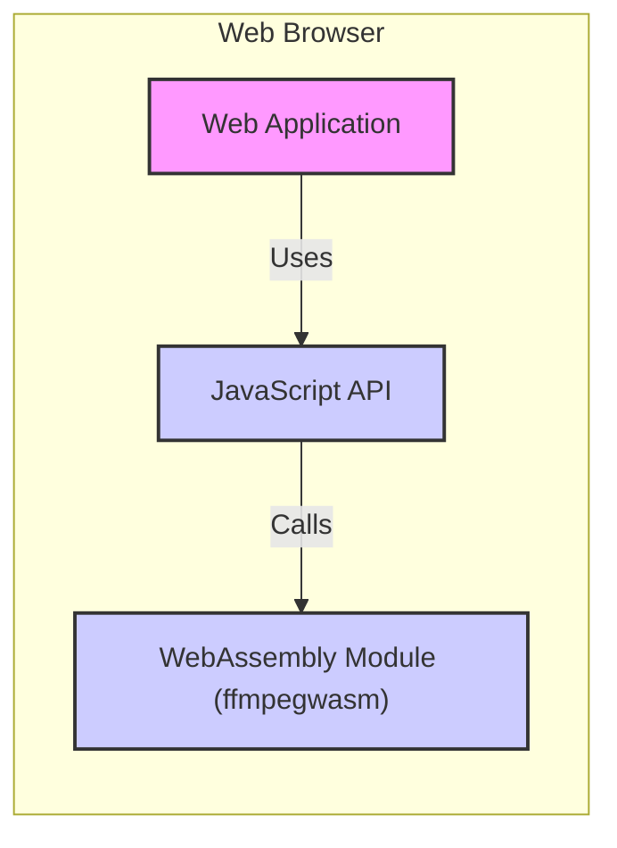

# BUSINESS POSTURE

The ffmpegwasm project aims to provide a WebAssembly build of FFmpeg, enabling client-side media processing within web browsers.

- Business Priorities and Goals:
  - Enable client-side media manipulation: Reduce reliance on server-side processing for media tasks, leading to lower server costs and improved user experience by offloading processing to the client's browser.
  - Offline media applications: Allow web applications to function offline for media processing tasks, enhancing accessibility and usability in environments with limited or no internet connectivity.
  - Broader accessibility of FFmpeg: Make FFmpeg functionalities available to web developers without requiring server-side infrastructure or complex backend setups.
  - Performance and efficiency: Provide a performant WebAssembly implementation of FFmpeg that can handle common media processing tasks efficiently within the browser environment.

- Business Risks:
  - Performance limitations: WebAssembly performance might be lower than native server-side FFmpeg, especially for complex or resource-intensive tasks. This could limit the scope of client-side processing.
  - Browser compatibility and consistency:  Reliance on web browser capabilities and WebAssembly support introduces risks related to browser compatibility issues and inconsistencies across different browsers and versions.
  - Security risks of client-side processing: Processing sensitive media data client-side introduces potential security risks if not handled properly, including data exposure within the browser environment or through insecure application implementations using ffmpegwasm.
  - Dependency on upstream FFmpeg project: The project's success and maintenance are dependent on the upstream FFmpeg project. Changes or vulnerabilities in FFmpeg could directly impact ffmpegwasm.
  - Supply chain risks:  Compromise of the build or distribution pipeline could lead to the distribution of malicious versions of ffmpegwasm, impacting users of the library.

# SECURITY POSTURE

- Security Controls:
  - security control: Browser Security Model: Web browsers enforce a security model that isolates web pages and limits access to system resources, providing a baseline level of security for client-side WebAssembly execution. Implemented by web browser vendors.
  - security control: Subresource Integrity (SRI):  SRI can be used to ensure that the ffmpegwasm library loaded from a CDN or other external source has not been tampered with. Described in web application security best practices.
  - security control: HTTPS for distribution: Serving ffmpegwasm over HTTPS ensures the integrity and confidentiality of the library during download. Implemented by CDN and web server configurations.
  - security control: Regular updates from upstream FFmpeg:  Keeping ffmpegwasm synchronized with the latest FFmpeg releases helps incorporate security patches and address known vulnerabilities in the underlying FFmpeg codebase. Implemented in project's development and release process.
  - security control: Code review process: Reviewing code changes before merging can help identify potential security vulnerabilities or coding errors. Implemented in project's development process, likely using GitHub pull requests.
  - security control: Static Analysis Security Testing (SAST): Utilizing SAST tools during the build process to automatically scan the codebase for potential vulnerabilities. Might be implemented in CI/CD pipelines.

- Accepted Risks:
  - accepted risk: Client-side data exposure: Data processed client-side within the browser is inherently more exposed than server-side processing. While browsers provide isolation, vulnerabilities in the browser or in the application using ffmpegwasm could lead to data exposure. Mitigation relies on secure application development practices and browser security.
  - accepted risk: Performance limitations impacting security features:  Performance overhead of certain security features (like extensive input validation or cryptography) in WebAssembly might lead developers to reduce or omit these features to maintain application performance. Mitigation requires careful performance optimization and balancing security with usability.
  - accepted risk: Browser vulnerabilities:  Vulnerabilities in the web browser itself could potentially be exploited to bypass security controls and compromise applications using ffmpegwasm. Mitigation relies on browser vendors' security updates and patching processes.

- Recommended Security Controls:
  - security control: Input validation and sanitization: Implement robust input validation and sanitization within ffmpegwasm's JavaScript API and potentially within the WASM module itself to prevent injection attacks and buffer overflows when processing user-provided media data.
  - security control: Memory safety checks:  Enable memory safety checks during the compilation of FFmpeg to WebAssembly to mitigate memory-related vulnerabilities like buffer overflows.
  - security control: Dependency scanning: Regularly scan dependencies (both JavaScript and C/C++ libraries used in the build process) for known vulnerabilities and update them promptly.
  - security control: Build process hardening: Secure the build environment and pipeline to prevent supply chain attacks. This includes using hardened build agents, verifying dependencies, and signing build artifacts.
  - security control: Security testing: Conduct regular security testing, including penetration testing and vulnerability scanning, of applications using ffmpegwasm to identify and address potential security weaknesses in real-world usage scenarios.

- Security Requirements:
  - Authentication: Not directly applicable to ffmpegwasm library itself. Authentication is the responsibility of the web application using ffmpegwasm to control access to its features and data.
  - Authorization: Not directly applicable to ffmpegwasm library itself. Authorization is the responsibility of the web application using ffmpegwasm to control what operations users are allowed to perform and on what data.
  - Input Validation:
    - Requirement: All input data passed to ffmpegwasm's JavaScript API and processed by the WASM module must be strictly validated to prevent injection attacks, buffer overflows, and other input-related vulnerabilities.
    - Requirement: Input validation should include checks for data type, format, range, and allowed characters, based on the expected input for each function.
    - Requirement: Error handling for invalid input should be robust and prevent further processing of potentially malicious data.
  - Cryptography:
    - Requirement: If ffmpegwasm is used to handle sensitive media data that requires confidentiality or integrity, appropriate cryptographic mechanisms should be considered.
    - Requirement:  If encryption is needed, utilize established browser-based cryptographic APIs (Web Crypto API) within the JavaScript wrapper around ffmpegwasm, rather than implementing custom cryptography within the WASM module itself unless absolutely necessary and after expert review.
    - Requirement: Ensure proper key management practices if cryptographic keys are used client-side. Consider the risks of client-side key storage and explore secure alternatives if necessary.

# DESIGN

## C4 CONTEXT

```mermaid
graph LR
    subgraph "Web Browser Environment"
        A["Web Application"]
        B["ffmpegwasm Library"]
    end
    C["Web Developer"] -- Uses --> A
    D["End User"] -- Uses --> A
    E["npm Registry / CDN"] -- Provides --> B
    F["Media Files (Local/Remote)"] -- Provides Input to --> B & A

    style A fill:#f9f,stroke:#333,stroke-width:2px
    style B fill:#ccf,stroke:#333,stroke-width:2px
    style C fill:#eee,stroke:#333,stroke-width:1px
    style D fill:#eee,stroke:#333,stroke-width:1px
    style E fill:#eee,stroke:#333,stroke-width:1px
    style F fill:#eee,stroke:#333,stroke-width:1px

    linkStyle 0,1,2,3,4,5 stroke:#333,stroke-width:1px;
```

- Context Diagram Elements:
  - Element:
    - Name: Web Application
    - Type: Software System
    - Description: A web application developed by web developers that utilizes the ffmpegwasm library to provide media processing functionalities to end users within a web browser.
    - Responsibilities:
      - Provide user interface for media processing tasks.
      - Integrate ffmpegwasm library into the application logic.
      - Handle user input and output related to media processing.
      - Manage application-specific security controls and authorization.
    - Security controls:
      - security control: Application-level authentication and authorization.
      - security control: Input validation and sanitization at the application level before passing data to ffmpegwasm.
      - security control: Secure coding practices to prevent application-specific vulnerabilities.

  - Element:
    - Name: ffmpegwasm Library
    - Type: Software System / Library
    - Description: A WebAssembly library that provides FFmpeg functionalities for client-side media processing in web browsers. It is distributed via npm registry and CDNs.
    - Responsibilities:
      - Provide FFmpeg command-line interface and functionalities accessible through a JavaScript API.
      - Process media data according to user commands and configurations.
      - Manage memory and resources within the WebAssembly environment.
    - Security controls:
      - security control: Input validation within the JavaScript API and WASM module.
      - security control: Memory safety checks during compilation.
      - security control: Regular updates from upstream FFmpeg.

  - Element:
    - Name: Web Developer
    - Type: Person
    - Description: Developers who use the ffmpegwasm library to build web applications with media processing capabilities.
    - Responsibilities:
      - Integrate ffmpegwasm into web applications.
      - Develop user interfaces and application logic around ffmpegwasm.
      - Ensure secure usage of ffmpegwasm in their applications.
    - Security controls:
      - security control: Secure development practices.
      - security control: Input validation and sanitization in application code.
      - security control: Following ffmpegwasm security guidelines.

  - Element:
    - Name: End User
    - Type: Person
    - Description: Users who interact with web applications that utilize ffmpegwasm to perform media processing tasks within their web browsers.
    - Responsibilities:
      - Provide media files as input to web applications.
      - Use the functionalities provided by web applications leveraging ffmpegwasm.
    - Security controls:
      - security control: Browser security model.
      - security control: User awareness of potential risks when processing sensitive media data in web browsers.

  - Element:
    - Name: npm Registry / CDN
    - Type: External System
    - Description:  Repositories for distributing JavaScript packages and static assets, used to host and distribute the ffmpegwasm library. Examples include npmjs.com and jsDelivr.
    - Responsibilities:
      - Host and distribute the ffmpegwasm library files.
      - Ensure availability and integrity of the library files.
    - Security controls:
      - security control: HTTPS for distribution.
      - security control: Subresource Integrity (SRI) hashes provided for library files.
      - security control: Security measures implemented by npm registry and CDN providers.

  - Element:
    - Name: Media Files (Local/Remote)
    - Type: External System / Data Store
    - Description: Media files (audio, video, images) that are processed by ffmpegwasm. These files can be located locally on the user's device or accessed remotely via URLs.
    - Responsibilities:
      - Provide input media data for processing.
      - Store processed media data (if applicable).
    - Security controls:
      - security control: Access control mechanisms for local file system (browser sandbox).
      - security control: HTTPS for remote media file access.
      - security control: Application-level access control to media files.

## C4 CONTAINER



- Container Diagram Elements:
  - Element:
    - Name: Web Application
    - Type: Container / Web Application
    - Description: The main web application code, typically written in HTML, CSS, and JavaScript, which provides the user interface and application logic. It orchestrates the use of the ffmpegwasm library.
    - Responsibilities:
      - User interface rendering and interaction.
      - Application logic and workflow management.
      - Integration with JavaScript API of ffmpegwasm.
      - Handling user input and displaying output.
    - Security controls:
      - security control: Application-level authentication and authorization.
      - security control: Input validation and sanitization before interacting with JavaScript API.
      - security control: Secure coding practices for web application development.
      - security control: Content Security Policy (CSP) to mitigate XSS attacks.

  - Element:
    - Name: JavaScript API
    - Type: Container / JavaScript Module
    - Description: A JavaScript module that acts as a wrapper around the WebAssembly module. It provides a higher-level, user-friendly API for web developers to interact with ffmpegwasm functionalities.
    - Responsibilities:
      - Expose FFmpeg functionalities as JavaScript functions.
      - Handle data conversion between JavaScript and WebAssembly.
      - Manage communication with the WebAssembly module.
      - Implement input validation and sanitization before passing data to WASM module.
    - Security controls:
      - security control: Input validation and sanitization in JavaScript API functions.
      - security control: Secure communication with WebAssembly module.
      - security control: Error handling and reporting.

  - Element:
    - Name: WebAssembly Module (ffmpegwasm)
    - Type: Container / WebAssembly Module
    - Description: The core ffmpegwasm library, compiled to WebAssembly from FFmpeg C/C++ code. It contains the actual media processing logic.
    - Responsibilities:
      - Execute FFmpeg commands and media processing tasks.
      - Manage memory and resources within the WebAssembly environment.
      - Provide core media processing functionalities.
    - Security controls:
      - security control: Memory safety enforced by WebAssembly runtime.
      - security control: Input validation within WASM module (if feasible and necessary).
      - security control: Compiled from hardened and regularly updated FFmpeg codebase.

## DEPLOYMENT

Deployment Scenario: Web Application using CDN distribution of ffmpegwasm.

```mermaid
graph LR
    A["Developer Workstation"] --> B["npm Registry / CDN"];
    B --> C["Web Server"];
    C --> D["End User Browser"];
    subgraph "npm Registry / CDN"
        B1["CDN Node 1"]
        B2["CDN Node N"]
        B -- B1 & B2
    end
    subgraph "Web Server"
        C1["Web Server Instance 1"]
        C2["Web Server Instance N"]
        C -- C1 & C2
    end
    subgraph "End User Browser"
        D1["Browser Instance 1"]
        D2["Browser Instance N"]
        D -- D1 & D2
        D -- E["ffmpegwasm Library (WASM & JS)"]
        D -- F["Web Application Code (HTML, CSS, JS)"]
    end

    style A fill:#eee,stroke:#333,stroke-width:1px
    style B fill:#eee,stroke:#333,stroke-width:1px
    style C fill:#eee,stroke:#333,stroke-width:1px
    style D fill:#f9f,stroke:#333,stroke-width:2px
    style B1 fill:#eee,stroke:#333,stroke-width:1px
    style B2 fill:#eee,stroke:#333,stroke-width:1px
    style C1 fill:#eee,stroke:#333,stroke-width:1px
    style C2 fill:#eee,stroke:#333,stroke-width:1px
    style D1 fill:#eee,stroke:#333,stroke-width:1px
    style D2 fill:#eee,stroke:#333,stroke-width:1px
    style E fill:#ccf,stroke:#333,stroke-width:2px
    style F fill:#f9f,stroke:#333,stroke-width:2px

    linkStyle 0,1,2,3,4,5,6,7,8,9,10,11 stroke:#333,stroke-width:1px;
```

- Deployment Diagram Elements:
  - Element:
    - Name: Developer Workstation
    - Type: Environment
    - Description: The development environment used by developers to build and package the ffmpegwasm library.
    - Responsibilities:
      - Development and testing of ffmpegwasm.
      - Building and packaging the library for distribution.
      - Publishing the library to npm registry/CDN.
    - Security controls:
      - security control: Secure development practices on developer workstations.
      - security control: Access control to development tools and resources.
      - security control: Code review and testing processes.

  - Element:
    - Name: npm Registry / CDN
    - Type: Infrastructure
    - Description:  Content Delivery Network and npm package registry used to distribute ffmpegwasm library files globally.
    - Responsibilities:
      - Hosting and distributing ffmpegwasm library files.
      - Providing scalable and reliable access to the library.
      - Ensuring integrity and availability of the library.
    - Security controls:
      - security control: Infrastructure security provided by CDN and npm registry providers.
      - security control: HTTPS for distribution.
      - security control: Subresource Integrity (SRI) hashes.

  - Element:
    - Name: Web Server
    - Type: Infrastructure
    - Description: Web servers hosting the web application code (HTML, CSS, JavaScript) that utilizes ffmpegwasm.
    - Responsibilities:
      - Serving web application code to end-user browsers.
      - Handling web application logic and backend services (if any).
    - Security controls:
      - security control: Web server security hardening.
      - security control: HTTPS for serving web application code.
      - security control: Web application firewalls (WAFs) if applicable.

  - Element:
    - Name: End User Browser
    - Type: Environment
    - Description: The web browser used by end users to access and run the web application. It downloads and executes the web application code and ffmpegwasm library.
    - Responsibilities:
      - Downloading and executing web application code and ffmpegwasm.
      - Providing a runtime environment for JavaScript and WebAssembly.
      - Enforcing browser security model and sandboxing.
    - Security controls:
      - security control: Browser security model and sandboxing.
      - security control: Regular browser updates and security patches.
      - security control: Browser extensions and security features.

  - Element:
    - Name: ffmpegwasm Library (WASM & JS)
    - Type: Software Component
    - Description: The ffmpegwasm library files (both WebAssembly module and JavaScript wrapper) downloaded and executed within the end-user browser.
    - Responsibilities:
      - Providing media processing functionalities within the browser.
    - Security controls:
      - security control: Input validation and memory safety within the library.
      - security control: Subresource Integrity (SRI) verification by the browser.
      - security control: Browser's WebAssembly runtime security.

  - Element:
    - Name: Web Application Code (HTML, CSS, JS)
    - Type: Software Component
    - Description: The web application's frontend code, including HTML, CSS, and JavaScript, which is served by the web server and executed in the end-user browser.
    - Responsibilities:
      - Providing user interface and application logic in the browser.
      - Integrating and utilizing ffmpegwasm library.
    - Security controls:
      - security control: Secure coding practices for web application development.
      - security control: Content Security Policy (CSP).
      - security control: Input validation and sanitization in application code.

## BUILD

```mermaid
graph LR
    A["Developer"] --> B["Code Repository (GitHub)"];
    B --> C["CI/CD System (GitHub Actions)"];
    C --> D["Build Environment"];
    D --> E["Compiler & Build Tools"];
    E --> F["ffmpegwasm Artifacts (WASM, JS)"];
    F --> G["npm Registry / CDN"];

    style A fill:#eee,stroke:#333,stroke-width:1px
    style B fill:#eee,stroke:#333,stroke-width:1px
    style C fill:#f9f,stroke:#333,stroke-width:2px
    style D fill:#eee,stroke:#333,stroke-width:1px
    style E fill:#eee,stroke:#333,stroke-width:1px
    style F fill:#ccf,stroke:#333,stroke-width:2px
    style G fill:#eee,stroke:#333,stroke-width:1px

    linkStyle 0,1,2,3,4,5 stroke:#333,stroke-width:1px;
```



- Build Process Elements:
  - Element:
    - Name: Developer
    - Type: Person
    - Description: Software developers who contribute code to the ffmpegwasm project.
    - Responsibilities:
      - Writing and committing code changes.
      - Participating in code reviews.
      - Ensuring code quality and security.
    - Security controls:
      - security control: Secure coding practices.
      - security control: Code review process.
      - security control: Access control to code repository.

  - Element:
    - Name: Code Repository (GitHub)
    - Type: System
    - Description:  GitHub repository hosting the ffmpegwasm source code, including C/C++ FFmpeg code, JavaScript wrapper, and build scripts.
    - Responsibilities:
      - Version control of source code.
      - Collaboration platform for development team.
      - Triggering CI/CD pipelines.
    - Security controls:
      - security control: Access control and authentication for repository access.
      - security control: Branch protection and code review requirements.
      - security control: Audit logging of repository activities.

  - Element:
    - Name: CI/CD System (GitHub Actions)
    - Type: System
    - Description:  GitHub Actions workflows used for automated building, testing, and publishing of ffmpegwasm.
    - Responsibilities:
      - Automating the build process.
      - Running tests and security checks.
      - Publishing build artifacts to npm registry/CDN.
    - Security controls:
      - security control: Secure configuration of CI/CD pipelines.
      - security control: Access control to CI/CD workflows and secrets.
      - security control: Audit logging of CI/CD activities.

  - Element:
    - Name: Build Environment
    - Type: Environment
    - Description:  The environment where the ffmpegwasm library is compiled and built. This could be a containerized environment managed by GitHub Actions.
    - Responsibilities:
      - Providing a consistent and reproducible build environment.
      - Isolating build processes.
    - Security controls:
      - security control: Hardened build environment.
      - security control: Minimal software installed in build environment.
      - security control: Regular updates and patching of build environment.

  - Element:
    - Name: Compiler & Build Tools
    - Type: Software
    - Description:  Compilers (e.g., Emscripten for WebAssembly), build tools (e.g., Make, CMake), and other utilities used to compile and package ffmpegwasm.
    - Responsibilities:
      - Compiling C/C++ FFmpeg code to WebAssembly.
      - Packaging JavaScript wrapper and WASM module.
      - Running static analysis security testing (SAST) and linters.
    - Security controls:
      - security control: Using trusted and verified compiler and build tools.
      - security control: SAST and linting tools integrated into build process.
      - security control: Dependency scanning during build process.

  - Element:
    - Name: ffmpegwasm Artifacts (WASM, JS)
    - Type: Software Artifact
    - Description:  The resulting build artifacts, including the WebAssembly module (.wasm file) and JavaScript wrapper files (.js files), ready for distribution.
    - Responsibilities:
      - Containing the compiled ffmpegwasm library.
      - Being published to npm registry/CDN.
    - Security controls:
      - security control: Integrity checks of build artifacts.
      - security control: Signing of build artifacts (if applicable).
      - security control: Stored securely before distribution.

  - Element:
    - Name: npm Registry / CDN
    - Type: System
    - Description:  npm registry and CDN used to distribute the built ffmpegwasm library to web developers.
    - Responsibilities:
      - Distributing ffmpegwasm library to users.
      - Ensuring availability and integrity of the library.
    - Security controls:
      - security control: HTTPS for distribution.
      - security control: Subresource Integrity (SRI) hashes.
      - security control: Security measures implemented by npm registry and CDN providers.

# RISK ASSESSMENT

- Critical Business Processes:
  - Client-side media processing: The core business process enabled by ffmpegwasm is the ability to perform media manipulation tasks directly within the user's web browser, reducing server load and enabling offline capabilities. Protecting this process means ensuring the integrity and security of the ffmpegwasm library and its usage in web applications.

- Data to Protect and Sensitivity:
  - Media Data: The primary data being processed by ffmpegwasm is media files (audio, video, images). The sensitivity of this data depends heavily on the application context.
    - Low Sensitivity: Publicly available media files, non-sensitive user-generated content.
    - Medium Sensitivity: User-generated content that is not intended for public sharing but does not contain highly confidential information.
    - High Sensitivity:  Proprietary media content, personal and private media files, media containing sensitive personal information (e.g., medical images, financial recordings).

  - Sensitivity Level Impact:
    - Low Sensitivity: Data breaches or integrity issues might have minimal impact. Focus on availability and basic integrity.
    - Medium Sensitivity: Data breaches could lead to privacy concerns and reputational damage. Require stronger confidentiality and integrity controls.
    - High Sensitivity: Data breaches could result in significant financial loss, legal repercussions, and severe reputational damage. Demand robust security controls, including encryption, strict access control, and comprehensive monitoring.

# QUESTIONS & ASSUMPTIONS

- Questions:
  - What is the intended use case and target audience for ffmpegwasm? (Assuming broad usage by web developers for various media processing tasks).
  - What are the performance requirements for ffmpegwasm? (Assuming performance is important but security should not be compromised for minor performance gains).
  - Are there any specific regulatory compliance requirements for applications using ffmpegwasm? (Assuming general web application security best practices apply, and specific compliance depends on the application context).
  - What is the process for reporting and addressing security vulnerabilities in ffmpegwasm? (Assuming standard open-source vulnerability reporting and patching process).

- Assumptions:
  - BUSINESS POSTURE: The primary business goal is to provide a useful and reliable client-side media processing library for web developers. Security is a significant concern, especially given the potential for processing user-generated content.
  - SECURITY POSTURE:  The project follows standard open-source security practices, including code review and regular updates. Security is primarily focused on preventing common web application vulnerabilities and ensuring the integrity of the library. Input validation and memory safety are critical security controls.
  - DESIGN: The design is relatively simple, consisting of a JavaScript API wrapping a WebAssembly module. Deployment is primarily via CDN and npm registry. The build process is automated using CI/CD and includes basic security checks.