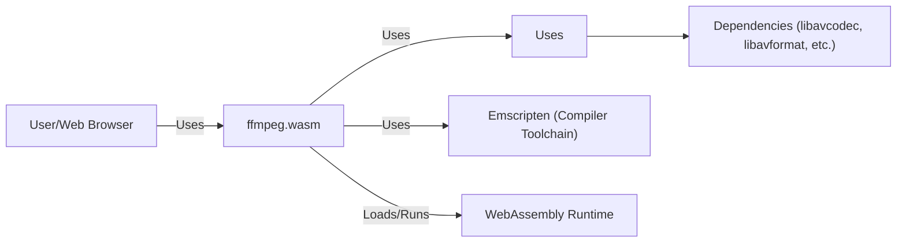
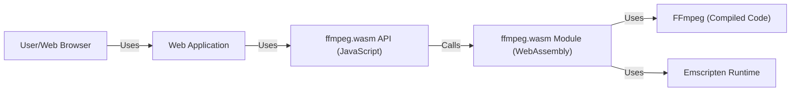
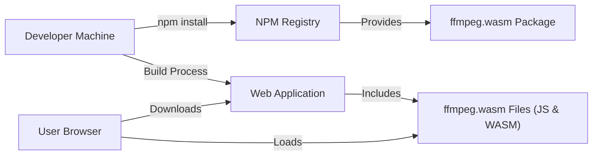
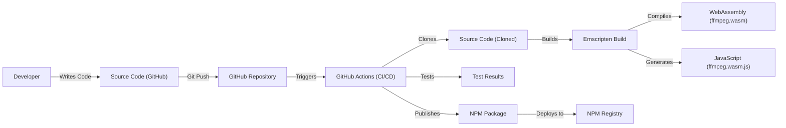

# BUSINESS POSTURE

Business Priorities and Goals:

*   Provide a JavaScript port of FFmpeg, enabling browser-based video and audio processing.
*   Minimize the need for server-side video processing, reducing infrastructure costs and latency.
*   Offer a user-friendly API for developers to integrate video/audio manipulation into web applications.
*   Maintain a high level of performance and compatibility across different browsers.
*   Foster a community-driven, open-source project.

Business Risks:

*   Security vulnerabilities in the compiled WebAssembly code could expose user data or allow malicious code execution.
*   Performance bottlenecks could lead to poor user experience, especially on low-powered devices.
*   Cross-browser compatibility issues could limit the reach and usability of the library.
*   Lack of proper input validation could lead to crashes or unexpected behavior.
*   Supply chain attacks targeting dependencies could compromise the integrity of the library.

# SECURITY POSTURE

Existing Security Controls:

*   security control: The project is open-source, allowing for community review and auditing of the codebase (implied, not explicitly stated in the repository).
*   security control: Uses Emscripten to compile C/C++ code to WebAssembly, which provides some level of sandboxing and memory safety (implied, based on Emscripten's nature).
*   security control: The project uses GitHub for version control and issue tracking, which provides some level of access control and auditability (implied).

Accepted Risks:

*   accepted risk: The inherent complexity of FFmpeg's codebase increases the risk of undiscovered vulnerabilities.
*   accepted risk: Reliance on third-party libraries (FFmpeg, Emscripten) introduces potential supply chain risks.
*   accepted risk: WebAssembly's sandboxing, while generally strong, may have limitations or undiscovered vulnerabilities.

Recommended Security Controls:

*   security control: Implement a robust Content Security Policy (CSP) to mitigate XSS and other code injection attacks.
*   security control: Regularly update dependencies (FFmpeg, Emscripten) to patch known vulnerabilities.
*   security control: Conduct regular security audits and penetration testing of the compiled WebAssembly code.
*   security control: Implement fuzz testing to identify potential vulnerabilities related to input handling.
*   security control: Use a Software Bill of Materials (SBOM) to track all dependencies and their versions.
*   security control: Implement Subresource Integrity (SRI) for any externally loaded scripts or resources.

Security Requirements:

*   Authentication: Not directly applicable, as ffmpeg.wasm is a library, not a service requiring authentication. Authentication would be the responsibility of the application using the library.
*   Authorization: Not directly applicable, as ffmpeg.wasm does not manage user roles or permissions. Authorization would be the responsibility of the application using the library.
*   Input Validation:
    *   Strictly validate all input data, including file types, sizes, and media parameters.
    *   Sanitize input to prevent command injection or other code injection vulnerabilities.
    *   Implement checks to prevent buffer overflows or other memory-related issues.
*   Cryptography:
    *   If handling sensitive data (which is not the primary use case), use appropriate cryptographic libraries for encryption and decryption. This would be the responsibility of the application using the library, not the library itself.
    *   Ensure that any cryptographic keys are securely managed (again, the responsibility of the application).

# DESIGN

## C4 CONTEXT

Element Descriptions:

*   Element:
    *   Name: User/Web Browser
    *   Type: Person/System
    *   Description: Represents the user interacting with a web application that utilizes ffmpeg.wasm.
    *   Responsibilities: Initiates video/audio processing tasks through the web application.
    *   Security controls: Browser's built-in security mechanisms (sandboxing, same-origin policy, etc.).

*   Element:
    *   Name: ffmpeg.wasm
    *   Type: System
    *   Description: The JavaScript and WebAssembly port of FFmpeg.
    *   Responsibilities: Provides an API for video/audio processing within the browser. Executes FFmpeg operations in a WebAssembly environment.
    *   Security controls: WebAssembly sandboxing, input validation (to be implemented), CSP (to be implemented).

*   Element:
    *   Name: FFmpeg (C/C++ Library)
    *   Type: Library
    *   Description: The original FFmpeg library written in C/C++.
    *   Responsibilities: Provides the core video/audio processing functionality.
    *   Security controls: Relies on inherent C/C++ security best practices and ongoing security audits of the FFmpeg project.

*   Element:
    *   Name: Emscripten (Compiler Toolchain)
    *   Type: Tool
    *   Description: The compiler toolchain used to compile FFmpeg's C/C++ code into WebAssembly.
    *   Responsibilities: Translates C/C++ code to WebAssembly, providing necessary runtime support.
    *   Security controls: Relies on Emscripten's security features and ongoing security audits of the Emscripten project.

*   Element:
    *   Name: WebAssembly Runtime
    *   Type: System
    *   Description: The browser's built-in runtime environment for executing WebAssembly code.
    *   Responsibilities: Executes the compiled WebAssembly code in a sandboxed environment.
    *   Security controls: Browser's built-in WebAssembly sandboxing mechanisms.

*   Element:
    *   Name: Dependencies (libavcodec, libavformat, etc.)
    *   Type: Library
    *   Description: External libraries that FFmpeg depends on.
    *   Responsibilities: Provide specific functionalities like codecs and format handling.
    *   Security controls: Relies on the security of each individual dependency and their respective communities.

## C4 CONTAINER

Since ffmpeg.wasm is a relatively simple project from an architectural perspective (a single library), the Container diagram is essentially an extension of the Context diagram.

Element Descriptions:

*   Element:
    *   Name: User/Web Browser
    *   Type: Person/System
    *   Description: Represents the user interacting with the web application.
    *   Responsibilities: Initiates video/audio processing tasks.
    *   Security controls: Browser's built-in security mechanisms.

*   Element:
    *   Name: Web Application
    *   Type: Container (Web Application)
    *   Description: The web application that integrates ffmpeg.wasm.
    *   Responsibilities: Provides the user interface and logic for interacting with ffmpeg.wasm.
    *   Security controls: Standard web application security best practices (input validation, output encoding, CSP, etc.).

*   Element:
    *   Name: ffmpeg.wasm API (JavaScript)
    *   Type: Container (JavaScript Code)
    *   Description: The JavaScript API exposed by ffmpeg.wasm.
    *   Responsibilities: Provides a user-friendly interface for interacting with the WebAssembly module. Handles communication between the web application and the WebAssembly module.
    *   Security controls: Input validation, sanitization, adherence to secure coding practices.

*   Element:
    *   Name: ffmpeg.wasm Module (WebAssembly)
    *   Type: Container (WebAssembly Code)
    *   Description: The compiled WebAssembly module containing the FFmpeg code.
    *   Responsibilities: Executes FFmpeg operations.
    *   Security controls: WebAssembly sandboxing, input validation (within the WebAssembly module).

*   Element:
    *   Name: FFmpeg (Compiled Code)
    *   Type: Library
    *   Description: The compiled FFmpeg code within the WebAssembly module.
    *   Responsibilities: Performs the actual video/audio processing.
    *   Security controls: Relies on the security of the original FFmpeg codebase and the compilation process.

*   Element:
    *   Name: Emscripten Runtime
    *   Type: Library
    *   Description: The runtime environment provided by Emscripten within the WebAssembly module.
    *   Responsibilities: Provides necessary functions and support for the compiled C/C++ code.
    *   Security controls: Relies on the security of the Emscripten runtime.

## DEPLOYMENT

Possible Deployment Solutions:

1.  **NPM Package:** The most common and recommended approach.  Developers install ffmpeg.wasm via npm and integrate it into their web application's build process.
2.  **CDN:**  The library could be hosted on a Content Delivery Network (CDN) and loaded directly into the browser. This simplifies integration but introduces a dependency on the CDN's availability and security.
3.  **Self-Hosting:** Developers could download the necessary files and host them on their own servers. This provides more control but requires manual updates and management.

Chosen Solution (NPM Package):

Element Descriptions:

*   Element:
    *   Name: Developer Machine
    *   Type: System
    *   Description: The developer's local machine used for development.
    *   Responsibilities: Writing code, building the application, managing dependencies.
    *   Security controls: Standard developer machine security practices.

*   Element:
    *   Name: NPM Registry
    *   Type: System
    *   Description: The public npm registry where ffmpeg.wasm is hosted.
    *   Responsibilities: Stores and serves npm packages.
    *   Security controls: npm's security measures (e.g., two-factor authentication, package signing).

*   Element:
    *   Name: ffmpeg.wasm Package
    *   Type: Package
    *   Description: The ffmpeg.wasm package downloaded from npm.
    *   Responsibilities: Contains the necessary JavaScript and WebAssembly files.
    *   Security controls: Relies on npm's security and the integrity of the package maintainers.

*   Element:
    *   Name: Web Application
    *   Type: Container (Web Application)
    *   Description: The developer's web application that uses ffmpeg.wasm.
    *   Responsibilities: Integrates and utilizes ffmpeg.wasm.
    *   Security controls: Standard web application security best practices.

*   Element:
    *   Name: ffmpeg.wasm Files (JS & WASM)
    *   Type: Files
    *   Description: The JavaScript and WebAssembly files included in the web application.
    *   Responsibilities: Provide the ffmpeg.wasm functionality.
    *   Security controls: WebAssembly sandboxing, input validation.

*   Element:
    *   Name: User Browser
    *   Type: System
    *   Description: The user's web browser.
    *   Responsibilities: Downloads and runs the web application, including ffmpeg.wasm.
    *   Security controls: Browser's built-in security mechanisms.

## BUILD

Build Process Description:

1.  **Code Development:** Developers write and modify the source code, primarily JavaScript and configuration files for building the WebAssembly module.
2.  **Version Control:** Code is committed and pushed to a GitHub repository.
3.  **Continuous Integration (CI):** GitHub Actions (or a similar CI/CD system) is triggered by pushes to the repository.
4.  **Build Environment:** The CI environment clones the repository and sets up the necessary build tools, including Emscripten.
5.  **Compilation:** Emscripten compiles the FFmpeg C/C++ code into WebAssembly (ffmpeg.wasm).  This process also generates the necessary JavaScript glue code (ffmpeg.wasm.js) for interacting with the WebAssembly module.
6.  **Testing:**  Automated tests (if present) are executed to verify the functionality of the compiled code.
7.  **Packaging:** The compiled WebAssembly module, JavaScript glue code, and any other necessary files are packaged into an npm package.
8.  **Publishing:** The npm package is published to the npm registry, making it available for developers to install.

Security Controls in Build Process:

*   security control: **Version Control (GitHub):** Provides an audit trail of code changes and access control.
*   security control: **CI/CD (GitHub Actions):** Automates the build process, ensuring consistency and reducing the risk of manual errors.
*   security control: **Emscripten:** Provides a secure compilation process from C/C++ to WebAssembly, including sandboxing.
*   security control: **Automated Testing (if implemented):** Helps identify potential bugs and vulnerabilities before release.
*   security control: **NPM Registry:** Provides security features like two-factor authentication and package signing (if enabled).
*   security control: **Dependency Management:** Regularly updating dependencies (FFmpeg, Emscripten, and other libraries) to patch known vulnerabilities is crucial. Tools like Dependabot (on GitHub) can help automate this process.
*   security control: **Static Analysis (if implemented):** Using linters and static analysis tools can help identify potential code quality and security issues.

# RISK ASSESSMENT

Critical Business Processes:

*   Providing in-browser video and audio processing capabilities.
*   Maintaining a positive user experience with good performance and reliability.
*   Protecting the reputation of the project and its maintainers.

Data to Protect and Sensitivity:

*   **User-provided video/audio data:** This data may contain personal information, copyrighted material, or other sensitive content. Sensitivity: **High**. While ffmpeg.wasm itself doesn't store this data persistently, it processes it in memory.  A vulnerability could potentially expose this data.
*   **Source code and build artifacts:**  Compromise of the source code or build process could lead to the distribution of malicious code. Sensitivity: **High**.
*   **No user accounts or credentials:** ffmpeg.wasm is a library and does not manage user accounts.

# QUESTIONS & ASSUMPTIONS

Questions:

*   What specific types of video/audio processing are most commonly used with ffmpeg.wasm? This can help prioritize security testing efforts.
*   Are there any plans to add features that might handle sensitive data more directly (e.g., encryption/decryption)?
*   What level of browser compatibility is required? This can impact the choice of security features (e.g., older browsers may not support newer CSP directives).
*   What is the process for handling security vulnerabilities reported by the community?
*   Is there a dedicated security contact or team for the project?

Assumptions:

*   BUSINESS POSTURE: The primary goal is to provide a functional and performant library, with security being a high priority but not necessarily the absolute top priority. The project is likely willing to accept some level of risk in exchange for ease of use and development speed.
*   SECURITY POSTURE: The project relies heavily on the inherent security of WebAssembly and Emscripten, as well as the security practices of the FFmpeg project. There is an implicit trust in these underlying technologies.
*   DESIGN: The design is relatively simple and straightforward, with a clear separation between the JavaScript API and the WebAssembly module. The primary attack surface is the input data provided to the library. The deployment model is assumed to be primarily through npm.