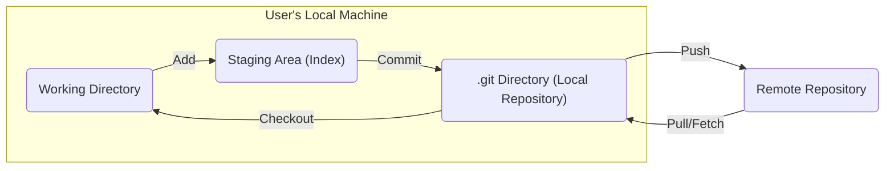

## Project Design Document: Git Version Control System

**1. Introduction**

This document provides a high-level architectural design of the Git version control system, as represented by the codebase at [https://github.com/git/git](https://github.com/git/git). This document aims to provide a clear understanding of the system's components, data flow, and key interactions, which will serve as the foundation for subsequent threat modeling activities. This document focuses primarily on the client-side aspects of Git, as that is the primary scope of the linked repository.

**2. Goals**

The primary goals of the Git system are:

*   Track changes to files over time.
*   Enable collaboration among multiple developers.
*   Allow branching and merging of different lines of development.
*   Provide a mechanism to revert to previous states of the codebase.
*   Maintain a distributed and decentralized version history.
*   Ensure data integrity and prevent data loss.

**3. High-Level Architecture**

The Git system operates on a distributed architecture, where each developer has a full copy of the repository and its history. The core components involved in a typical Git workflow are:

*   **Working Directory:** The actual files on the developer's machine that are being worked on.
*   **Staging Area (Index):** A temporary area where changes are prepared before being committed.
*   **Local Repository (.git directory):**  A hidden directory containing the entire version history, object database, and configuration for the local project.
*   **Remote Repository:** A shared repository (e.g., on GitHub, GitLab, or a self-hosted server) used for collaboration and backup.



**4. Key Components**

This section details the key components within the Git system, focusing on the client-side elements within the `.git` directory and the Git command-line interface.

*   **.git Directory Structure:**
    *   `objects/`: Stores all the Git objects (blobs, trees, commits, tags) in a content-addressable manner.
    *   `refs/`: Stores pointers (references) to commits, such as branches and tags.
        *   `heads/`: Contains references to local branches.
        *   `tags/`: Contains references to tags.
        *   `remotes/`: Contains references to remote repositories.
    *   `HEAD`: A symbolic reference to the currently checked-out branch.
    *   `config`: Contains project-specific configuration options.
    *   `index`: The staging area, a binary file that lists the next commit's contents.
    *   `logs/`: Stores logs of ref updates.
    *   `hooks/`: Contains scripts that can be run at various points in the Git workflow.

*   **Git Executables (Command-Line Interface):**
    *   `git`: The main Git executable that orchestrates various Git operations.
    *   `git add`: Adds changes from the working directory to the staging area.
    *   `git commit`: Records changes from the staging area to the local repository.
    *   `git checkout`: Switches branches or restores working tree files.
    *   `git branch`: Manages branches.
    *   `git merge`: Integrates changes from one branch into another.
    *   `git rebase`: Reapplies commits on top of another base branch.
    *   `git clone`: Copies a remote repository to the local machine.
    *   `git fetch`: Downloads objects and refs from a remote repository.
    *   `git pull`: Fetches from and integrates with a remote repository.
    *   `git push`: Uploads local commits to a remote repository.
    *   `git log`: Shows commit history.
    *   `git status`: Shows the status of the working directory and staging area.
    *   `git diff`: Shows changes between commits, working directory, and staging area.
    *   `git remote`: Manages remote repositories.

*   **Git Objects:**
    *   **Blob:** Represents a file's content.
    *   **Tree:** Represents a directory, containing references to blobs and other trees.
    *   **Commit:** Represents a snapshot of the repository at a specific point in time, containing metadata (author, committer, message, parent commits) and a pointer to the root tree.
    *   **Tag:** A named reference to a specific commit.

**5. Data Flow**

This section describes the typical data flow during common Git operations.

*   **Adding and Committing Changes:**

    ```mermaid
    graph LR
        A("Working Directory") -->|"git add"| B("Staging Area (Index)")
        B -->|"git commit"| C("Local Repository Objects")
        C -->|"Update Refs"| D(".git/refs/heads/")
    ```

    1. Changes are made to files in the **Working Directory**.
    2. `git add` stages the changes by creating or updating blob objects in the **Local Repository Objects** and updating the **Staging Area (Index)**.
    3. `git commit` creates a new commit object in the **Local Repository Objects**, referencing the staged changes (as tree objects) and the previous commit.
    4. The branch reference in `.git/refs/heads/` is updated to point to the new commit.

*   **Pushing Changes to a Remote Repository:**

    ```mermaid
    graph LR
        A("Local Repository Objects") -->|"git push"| B("Remote Repository")
        C(".git/refs/heads/") -->|"git push (updates remote refs)"| D("Remote Repository Refs")
        E("User Credentials") -->|"Authentication"| B
    ```

    1. `git push` gathers the necessary commit objects and their dependencies from the **Local Repository Objects**.
    2. **User Credentials** are used to authenticate with the **Remote Repository**.
    3. The objects are transferred to the **Remote Repository**.
    4. The remote branch references in **Remote Repository Refs** are updated to point to the newly pushed commits.

*   **Pulling Changes from a Remote Repository:**

    ```mermaid
    graph LR
        A("Remote Repository") -->|"git fetch"| B("Local Repository Objects")
        C("Remote Repository Refs") -->|"git fetch (updates local remote refs)"| D(".git/refs/remotes/")
        E("Local Repository Objects") -->|"git merge/rebase"| F(".git/refs/heads/")
        F -->|"Update Working Directory"| G("Working Directory")
    ```

    1. `git fetch` downloads objects and updates remote branch references in `.git/refs/remotes/` from the **Remote Repository** to the **Local Repository Objects**.
    2. `git merge` or `git rebase` integrates the fetched changes into the local branch, updating the branch reference in `.git/refs/heads/`.
    3. `git checkout` updates the **Working Directory** with the changes from the merged/rebased branch.

**6. Security Considerations (Initial Thoughts for Threat Modeling)**

This section outlines initial security considerations that will be further explored during the threat modeling process.

*   **Authentication and Authorization:**
    *   How are users authenticated when interacting with remote repositories? (e.g., SSH keys, passwords, tokens)
    *   How is access control managed on remote repositories?
*   **Data Integrity:**
    *   How does Git ensure the integrity of the repository history? (e.g., SHA-1/SHA-256 hashing)
    *   What mechanisms prevent tampering with commit history?
*   **Confidentiality:**
    *   How is sensitive data within the repository protected? (e.g., `.gitignore` for excluding files)
    *   Are there risks associated with storing sensitive information in the repository history?
*   **Remote Repository Security:**
    *   What are the security implications of interacting with untrusted remote repositories?
    *   How are vulnerabilities in remote repository hosting platforms addressed?
*   **Local Repository Security:**
    *   How is the local `.git` directory protected from unauthorized access?
    *   What are the risks associated with malicious hooks?
*   **Protocol Security:**
    *   What security protocols are used for communication with remote repositories (e.g., HTTPS, SSH)?
    *   Are there vulnerabilities in the Git protocols themselves?
*   **Supply Chain Security:**
    *   Risks associated with dependencies and external contributions to the Git project itself.

**7. Assumptions and Constraints**

*   This document primarily focuses on the client-side aspects of Git as represented by the linked repository. Server-side implementations of Git hosting platforms are outside the scope of this document.
*   It is assumed that users have a basic understanding of Git concepts and terminology.
*   The threat modeling process will build upon this design document and delve deeper into specific security vulnerabilities and attack vectors.

**8. Future Considerations**

*   Detailed analysis of specific Git commands and their potential security implications.
*   Examination of Git extensions and their security impact.
*   Consideration of security best practices for Git usage.

This design document provides a foundational understanding of the Git system's architecture and data flow. It will serve as a valuable resource for identifying potential threats and vulnerabilities during the subsequent threat modeling process.
