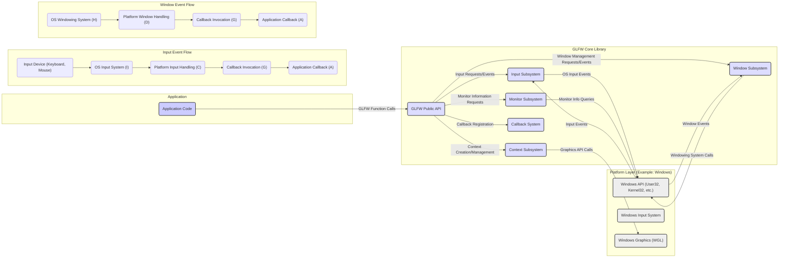

# Project Design Document: GLFW (Graphics Library Framework)

**Version:** 1.1
**Date:** October 26, 2023
**Author:** Gemini (AI Language Model)

## 1. Introduction

This document provides a detailed design overview of the GLFW (Graphics Library Framework) project. It aims to describe the architecture, key components, and data flow within GLFW. This document will serve as a foundation for subsequent threat modeling activities.

### 1.1. Purpose

The primary purpose of this document is to provide a comprehensive architectural understanding of GLFW for security analysis and threat modeling. It outlines the key components, their interactions, and the data they handle, with a focus on potential attack surfaces.

### 1.2. Scope

This document covers the core functionalities of the GLFW library, focusing on aspects relevant to security considerations. This includes:

*   Window creation and management, including window properties and event handling.
*   Input handling for keyboard, mouse, and joystick devices, encompassing raw input processing and event dispatch.
*   Monitor and video mode management, including enumeration and property retrieval.
*   OpenGL (and other graphics API) context creation and management, including pixel format selection and context sharing.
*   The platform abstraction layer and its role in isolating platform-specific implementations.

This document does not delve into the internal implementation details of specific platform drivers or the intricacies of the underlying operating system APIs beyond their interaction points with GLFW.

### 1.3. Target Audience

This document is intended for:

*   Security engineers and architects responsible for performing threat modeling on systems utilizing GLFW.
*   Software developers contributing to or maintaining the GLFW library, particularly those working on security-sensitive areas.
*   Anyone seeking a detailed understanding of GLFW's architecture from a security perspective.

## 2. Overview

GLFW is an open-source, cross-platform library written in C that provides a minimal API for creating and managing application windows, handling user input, and managing graphics contexts (primarily OpenGL). It acts as a crucial intermediary between the application and the underlying operating system's windowing and input subsystems. Its design emphasizes simplicity and portability.

### 2.1. Key Features

*   **Window Management:**  Creation, destruction, resizing, moving, focusing, and managing various window properties such as title, icon, and cursor. Includes handling window events like close requests and focus changes.
*   **Input Handling:**  Receiving and processing raw keyboard input (key presses, releases, scancodes, Unicode input), mouse input (position, button states, scrolling), and joystick/gamepad input (button presses, axis movements, hat switches). Provides mechanisms for setting input modes (e.g., cursor capture).
*   **Monitor Management:** Enumerating connected monitors, retrieving detailed monitor properties (resolution, refresh rate, physical size, position), and managing full-screen modes, including video mode switching.
*   **Graphics Context Management:** Creating and managing OpenGL, OpenGL ES, Vulkan, and other graphics rendering contexts. This includes setting pixel formats, specifying context attributes, and sharing contexts between windows.
*   **Platform Abstraction:** Providing a consistent, platform-independent API across different operating systems (Windows, macOS, Linux, FreeBSD, etc.), effectively hiding platform-specific complexities and API differences. This is achieved through platform-specific implementations.
*   **Callback Mechanism:**  Utilizing callback functions to asynchronously notify the application about significant events such as key presses, mouse movements, window resizing, and monitor connection changes. This event-driven approach is central to GLFW's operation.

## 3. Architecture

GLFW's architecture is designed around providing a clean and consistent API while abstracting away the complexities of different operating system windowing systems. The core library provides the main interface, while platform-specific implementations handle the interaction with the underlying OS.

### 3.1. Components

*   **Core Library:** The platform-independent heart of GLFW, written in C. It defines the public API (`glfw3.h`) and manages the overall state of the library. It handles the dispatching of events to registered callbacks.
*   **Platform Layer:** A set of platform-specific source files (e.g., `win32_window.c`, `cocoa_window.m`, `x11_window.c`) that implement the platform-dependent parts of the API. This layer directly interacts with the operating system's windowing, input, and graphics subsystems.
*   **Input Subsystem:** Responsible for receiving, processing, and dispatching input events. This involves platform-specific code to interface with the OS input mechanisms (e.g., Windows messages, macOS event queue, X11 events).
*   **Window Subsystem:** Manages the creation, destruction, and manipulation of application windows. This component relies heavily on the platform layer to perform the actual window operations.
*   **Monitor Subsystem:** Handles the enumeration of connected monitors and the retrieval of their properties. This also involves platform-specific implementations to query the OS for monitor information.
*   **Context Subsystem:**  Deals with the creation, management, and sharing of graphics rendering contexts. This often involves interacting with platform-specific graphics API loading mechanisms (e.g., WGL on Windows, CGL on macOS, GLX or EGL on Linux).
*   **Callback System:** A central mechanism for managing and invoking application-defined callback functions in response to various events. This system ensures that events are delivered to the application in a timely manner.

### 3.2. Interactions and Data Flow

**Data Flow Description:**

*   **Application Interaction:** The application interacts with GLFW by calling functions in its public API (B). These calls initiate actions within GLFW.
*   **Input Handling:**
    *   Raw input events (e.g., key presses, mouse movements) originate from physical input devices (IA).
    *   The operating system's input system (IB) captures these raw events.
    *   The platform layer's input handling component (IC) receives these OS-specific events and translates them into a platform-independent representation.
    *   GLFW's callback system (ID) then invokes the appropriate application-registered callback functions (IE) with the processed input data.
*   **Window Management:**
    *   When the application requests window creation or manipulation through GLFW's API (B), the request is handled by the window subsystem (D).
    *   The window subsystem interacts with the platform layer (H) to perform the actual window operations using OS-specific API calls.
    *   Window events (e.g., resize, close, focus changes) are generated by the operating system's windowing system (WA).
    *   The platform layer's window handling component (WB) intercepts these events.
    *   GLFW's callback system (WC) then invokes the relevant application callbacks (WD) to notify the application of the window event.
*   **Graphics Context Management:**
    *   When the application requests the creation of a graphics context via GLFW's API (B), the context subsystem (F) takes over.
    *   The context subsystem interacts with platform-specific graphics API loading mechanisms (J) to create and manage the context (e.g., using WGL for OpenGL on Windows).
*   **Monitor Management:**
    *   When the application queries for information about connected monitors through GLFW's API (B), the monitor subsystem (E) is involved.
    *   The monitor subsystem interacts with the platform layer (H) to retrieve the necessary monitor information from the operating system.

## 4. Security Considerations (For Threat Modeling)

This section outlines potential areas of security concern based on the architecture described above, providing a starting point for a more detailed threat modeling exercise.

*   **Input Handling Vulnerabilities:**
    *   **Buffer Overflows in Platform Input Handling:**  If the platform layer's input handling code (IC) doesn't properly validate the size of incoming input data from the OS (IB), buffer overflows could occur when copying this data into internal GLFW structures.
    *   **Integer Overflows in Input Processing:** Calculations involving input coordinates, button states, or other input parameters within the platform layer could be susceptible to integer overflows, potentially leading to unexpected behavior or memory corruption.
    *   **Input Injection/Spoofing:** While GLFW aims to provide a sanitized input stream, vulnerabilities in the platform layer or the OS itself could allow malicious actors to inject or spoof input events, potentially triggering unintended actions within the application.
    *   **Denial of Service through Input Flooding:**  An attacker might attempt to flood the application with a large volume of input events, potentially overwhelming the application or the underlying system.
*   **Window Management Vulnerabilities:**
    *   **Spoofed Window Events:**  Could a malicious process or driver forge window events (e.g., focus changes, close requests) to manipulate the application's state or behavior?
    *   **Resource Exhaustion through Window Creation:** An attacker might attempt to exhaust system resources by rapidly creating a large number of windows, potentially leading to a denial-of-service condition.
    *   **Information Disclosure through Window Properties:**  Could sensitive information be inadvertently exposed through window titles or other window properties that might be accessible to other processes?
*   **Callback Vulnerabilities:**
    *   **Unsafe Handling of User-Provided Callbacks:** While the primary responsibility lies with the application, vulnerabilities in GLFW's callback system (G) could potentially allow for the exploitation of unsafe callback functions provided by the application.
    *   **Race Conditions in Callback Invocation:**  If GLFW's internal callback management is not thread-safe, race conditions could occur when invoking callbacks from different threads, potentially leading to unpredictable behavior.
*   **Platform Layer Vulnerabilities:**
    *   **Bugs and Vulnerabilities in Platform-Specific Code:** The platform layer (H) is a significant attack surface, as it directly interacts with the OS. Bugs or vulnerabilities in this code could be exploited.
    *   **Reliance on Vulnerable System Libraries:** The platform layer depends on various system libraries. Vulnerabilities in these libraries could indirectly affect GLFW's security.
*   **Graphics Context Vulnerabilities:**
    *   While GLFW primarily manages context creation, vulnerabilities in the underlying graphics drivers or implementations could be indirectly triggered through GLFW's context management functions.
*   **Information Disclosure:**
    *   Could sensitive information be leaked through the monitor subsystem (E) when querying monitor properties?

## 5. Dependencies

GLFW has minimal external dependencies beyond the standard system libraries provided by the operating system. These dependencies are crucial for its functionality.

*   **Operating System Libraries (Examples):**
    *   **Windows:** `User32.lib`, `Kernel32.lib`, `Gdi32.lib`, `Shell32.lib`, `Dwmapi.lib`, `Version.lib`, `Winmm.lib`, `Imm32.lib`, `Ole32.lib`, `OleAut32.lib`, `Advapi32.lib`, `SetupAPI.lib`, `Hid.lib`, `Vulkan.lib`, `OpenGL32.lib` (or equivalent for other graphics APIs).
    *   **macOS:** `Cocoa.framework`, `IOKit.framework`, `CoreFoundation.framework`, `QuartzCore.framework`, `OpenGL.framework` (or equivalent for other graphics APIs).
    *   **Linux/X11:** `libX11`, `libXcursor`, `libXi`, `libXrandr`, `libXinerama`, `libXkbcommon`, `libudev`, `libm`, `dl`, `pthread`, `vulkan` (optional), `OpenGL` (or equivalent for other graphics APIs).
    *   **Linux/Wayland:** `libwayland-client`, `libwayland-server`, `libdecor`, `libxkbcommon`, `libm`, `dl`, `pthread`, `vulkan` (optional), `OpenGL` (or equivalent for other graphics APIs).

## 6. Deployment

GLFW is typically deployed as a dynamically linked library or a statically linked library, depending on the application's build configuration and deployment requirements.

*   **Dynamic Linking:** The GLFW library is compiled into a shared library (e.g., `.dll` on Windows, `.dylib` on macOS, `.so` on Linux) and loaded by the application at runtime. This is the most common deployment method, allowing for easier updates to the GLFW library.
*   **Static Linking:** The GLFW library's object code is linked directly into the application's executable. This results in a larger executable but eliminates the need to distribute the GLFW shared library separately.

## 7. Future Considerations

Understanding potential future developments can help anticipate future security challenges and ensure the library remains secure as it evolves.

*   **Enhanced Input Device Support:**  Adding support for new and more complex input devices (e.g., VR controllers, haptic devices) could introduce new attack vectors related to the handling of their specific data formats and communication protocols.
*   **Refinements to Platform Abstraction:** Changes or improvements to the platform abstraction layer, while aimed at better portability, could inadvertently introduce security vulnerabilities if not carefully implemented and reviewed.
*   **Integration with Emerging Graphics APIs:**  As new graphics APIs emerge, their integration into GLFW might bring new security considerations specific to those APIs and their interaction with the windowing system.
*   **Security Audits and Hardening:** Future efforts might include dedicated security audits and code hardening initiatives to proactively identify and address potential vulnerabilities.

This document provides a more detailed and security-focused architectural understanding of GLFW. The information presented here will serve as a valuable input for subsequent threat modeling activities, enabling a more comprehensive assessment of potential security risks.
