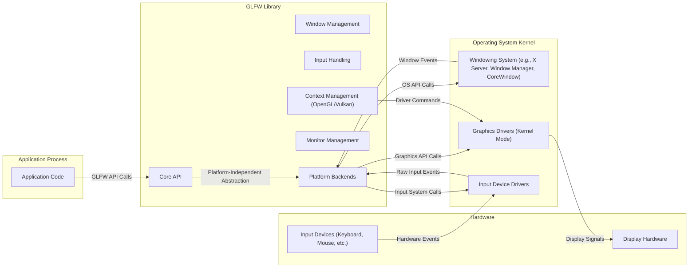
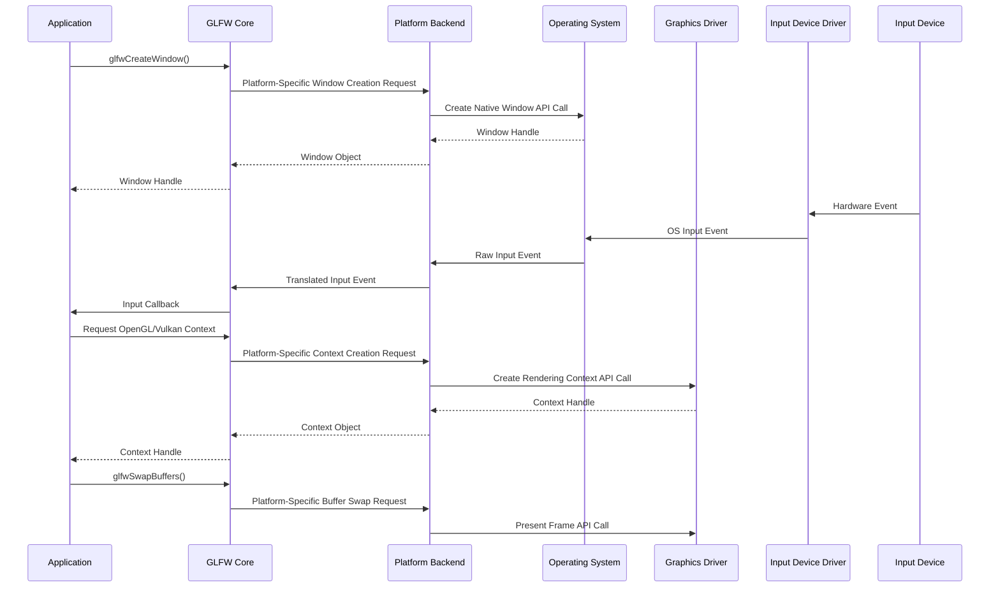

# Project Design Document: GLFW

**Version:** 1.1
**Date:** October 26, 2023
**Author:** Gemini (AI Language Model)

## 1. Project Overview

This document provides an enhanced design overview of the GLFW library (Graphics Library Framework), an open-source, multi-platform library for OpenGL, OpenGL ES, Vulkan, window and input. This revised document aims to provide a more granular and comprehensive understanding of GLFW's architecture, components, and data flow, specifically tailored for subsequent threat modeling activities.

The core purpose of GLFW remains providing a simple, platform-agnostic API for managing application windows, handling user input (keyboard, mouse, joystick, touch), and managing graphics contexts (OpenGL, OpenGL ES, and Vulkan). It abstracts away platform-specific complexities, allowing developers to concentrate on graphics rendering logic.

This document expands upon the previous version by providing more detail on component interactions and potential security implications within each area.

## 2. Goals

* Provide a clear, detailed, and improved description of GLFW's architecture and components, with a focus on security-relevant aspects.
* Elaborate on the data flow within the GLFW library and its interactions with external entities, highlighting potential attack vectors.
* Identify key areas, components, and data flows that are particularly relevant for security considerations and threat modeling.
* Serve as an enhanced reference document for understanding GLFW's internal workings from a security perspective.

## 3. Non-Goals

* This document still does not provide a detailed code-level analysis of GLFW.
* It does not delve into the intricacies of every single platform backend implementation.
* Performance benchmarks and optimization strategies remain outside the scope of this document.
* This document is not intended as a user manual or a complete API reference for GLFW.
* The specifics of OpenGL, OpenGL ES, or Vulkan API usage within an application using GLFW are not covered in detail.

## 4. Architecture Overview

GLFW's architecture maintains its modular and platform-independent design. The core library provides the main API, while platform-specific backends handle interactions with the operating system and graphics drivers. This version provides a slightly more detailed view of the interactions.

**Key Architectural Components:**

* **Core API (`glfw3.h`):** The public interface through which applications interact with GLFW. It provides functions for initialization, window and context management, input handling, and monitor management. This is the primary attack surface for applications interacting with GLFW.
* **Window Management:** Responsible for the lifecycle and properties of application windows. This component directly interfaces with the operating system's windowing system via the platform backends, making it a critical area for security considerations related to window manipulation and access.
* **Input Handling:** Manages user input from various devices. It receives raw input events from the operating system and translates them into a normalized format for the application. This is a significant area for potential vulnerabilities related to malicious or unexpected input.
* **Context Management (OpenGL/Vulkan):** Handles the creation and management of graphics rendering contexts. It interacts with the graphics drivers, making it a potential point of vulnerability if driver interactions are not handled securely.
* **Monitor Management:** Provides information about connected displays. While seemingly less critical for direct security threats, information leakage about display configurations could be a concern in certain contexts.
* **Platform Backends:** These platform-specific implementations are crucial for bridging the gap between the core API and the underlying operating system. Vulnerabilities within these backends can directly expose the application to OS-level security issues.

## 5. Component Details

This section provides a more detailed breakdown of the key components, emphasizing functionalities relevant to security.

* **Core API (`glfw3.h`):**
    * **Initialization and Termination (`glfwInit`, `glfwTerminate`):** Improper initialization or termination sequences might leave the system in an unstable state.
    * **Error handling (`glfwSetErrorCallback`):** While for debugging, the error callback mechanism itself should not introduce vulnerabilities.
    * **Time management (`glfwGetTime`, `glfwSetTime`):**  Potential for timing attacks if not used carefully in security-sensitive contexts (though unlikely within GLFW itself).
    * **Library version information (`glfwGetVersion`):** Useful for identifying known vulnerabilities in specific versions.
* **Window Management:**
    * **Window creation and destruction (`glfwCreateWindow`, `glfwDestroyWindow`):**  Potential vulnerabilities if window handles are not managed correctly, leading to dangling pointers or use-after-free issues.
    * **Window properties (title, size, position, focus, icon):**  Manipulating these properties maliciously could lead to UI spoofing or denial-of-service.
    * **Window events (resize, move, close, focus):**  Improper handling of these events in the application could lead to unexpected behavior or vulnerabilities.
    * **Cursor management (creation, visibility, position):**  Cursor manipulation could be used for UI spoofing or to mislead the user. `glfwSetCursorPos` relies on application-provided coordinates, a potential area for misuse.
    * **Framebuffer size management:** Incorrectly handling framebuffer size changes could lead to rendering issues or potential buffer overflows in application rendering code.
* **Input Handling:**
    * **Keyboard input (key presses, releases, scancodes, modifiers):** Keylogging or injection of simulated key events are potential threats. GLFW relies on the OS for initial filtering, but vulnerabilities could exist in how GLFW processes or relays these events.
    * **Mouse input (button presses, releases, cursor position, scrolling):**  Similar to keyboard input, spoofed mouse events or manipulation of cursor positions could be used for malicious purposes. `glfwSetCursorPos` is a potential point of concern if the application doesn't validate input.
    * **Joystick/gamepad input (button presses, axis values):**  Potential for exploiting vulnerabilities in joystick drivers or simulating joystick input for malicious actions.
    * **Input modes (cursor mode, sticky keys, sticky mouse buttons):**  Manipulating these modes could confuse the user or interfere with input processing.
    * **Input callbacks (setting functions to be called when input events occur):**  The security of the application's callback functions is paramount. GLFW itself needs to ensure that these callbacks are invoked safely and without allowing for control flow manipulation from malicious input events.
* **Context Management (OpenGL/Vulkan):**
    * **Context creation and destruction (`glfwCreateWindowSurface`, `glfwDestroySurface`):**  Issues in context creation could lead to driver instability or vulnerabilities.
    * **Context attributes (OpenGL version, profile, robustness):**  Requesting specific context attributes might trigger driver-specific behavior or vulnerabilities. The robustness flag is a security feature, and its proper usage is important.
    * **Context sharing:**  Sharing contexts between threads needs careful management to avoid race conditions or data corruption.
    * **Making a context current on a thread:**  Incorrect context switching could lead to rendering errors or potentially exploitable situations.
    * **Swapping buffers (presenting rendered output):**  While seemingly straightforward, issues in buffer swapping could lead to visual glitches or potentially expose vulnerabilities in the graphics driver.
    * **Extension loading:**  Dynamically loading OpenGL/Vulkan extensions introduces potential risks if extensions have vulnerabilities. GLFW's extension loading mechanism needs to be robust.
* **Monitor Management:**
    * **Retrieving connected monitors (`glfwGetMonitors`):**  Generally safe, but information about connected monitors could be used for fingerprinting or targeted attacks.
    * **Getting primary monitor (`glfwGetPrimaryMonitor`):**  Similar to getting all monitors.
    * **Getting monitor properties (name, resolution, refresh rate, physical size):**  This information could be used for fingerprinting or to tailor exploits to specific display configurations.
    * **Setting monitor gamma:**  While unlikely to be a direct security risk, unexpected gamma changes could be used for denial-of-service or to confuse the user.
    * **Getting video modes:**  Similar to getting monitor properties.
* **Platform Backends:**
    * **Windows:** Heavily relies on the Win32 API. Vulnerabilities in Win32's windowing or input subsystems can directly impact GLFW applications. Message handling within the backend is a critical area.
    * **macOS:** Uses Cocoa. Security considerations include proper handling of Objective-C objects and interactions with the window server. Sandboxing restrictions on macOS are also relevant.
    * **Linux (X11):** Interacts with the X server, which has a history of security vulnerabilities. Proper handling of X events and atom management is crucial.
    * **Linux (Wayland):** Wayland's security model differs from X11, but vulnerabilities can still exist in the compositor or in the Wayland protocol implementation.

## 6. Data Flow

This section elaborates on the data flow, highlighting potential points of interception or manipulation.

1. **Application Initialization:** The application initiates GLFW, potentially loading platform-specific libraries. This loading process itself could be a point of attack if malicious libraries are substituted.
2. **Window Creation:** The application requests a window. This involves communication with the operating system's windowing system. Malicious applications could attempt to create windows with unusual properties or attempt to interfere with the creation of other windows.
3. **Input Event Handling:**
    * Input devices generate hardware events.
    * **Operating System Input Drivers:** These drivers translate hardware signals into OS-level input events. Vulnerabilities in these drivers could lead to arbitrary code execution.
    * **Platform Backend Reception:** GLFW's platform backend receives these OS-level events. Improper handling or parsing of these events could lead to vulnerabilities.
    * **Event Translation and Normalization:** GLFW translates platform-specific events into a common format. Errors in this translation could lead to unexpected behavior.
    * **Callback Invocation:** GLFW invokes application-provided callbacks. This is a critical point; malicious input could be crafted to exploit vulnerabilities in the callback functions.
4. **Context Creation:** The request for a graphics context involves interaction with the graphics driver. Vulnerabilities in the driver or in the communication protocol could be exploited.
5. **Rendering:** The application uses the graphics context to render. While GLFW is not directly involved in the rendering pipeline, vulnerabilities in the graphics driver could be triggered by specific rendering commands.
6. **Buffer Swapping:** The process of presenting rendered frames to the display involves communication with the graphics driver and the windowing system.
7. **Window Events:** The operating system sends events related to window state changes. Improper handling of these events could lead to application instability or vulnerabilities.
8. **Application Termination:**  The cleanup process should be secure and not leave any resources in a vulnerable state.

## 7. Security Considerations (Enhanced)

This section provides a more detailed breakdown of security considerations, linking them to specific components and data flows.

* **Input Validation and Sanitization:**
    * **GLFW Level:** While GLFW normalizes input to some extent, it largely relies on the OS. Insufficient validation within GLFW's input handling could allow malicious input to reach the application.
    * **Application Level:**  Applications *must* validate and sanitize all input received through GLFW callbacks to prevent vulnerabilities like command injection, cross-site scripting (in embedded browsers), or buffer overflows in application logic.
* **Buffer Overflows:**
    * **GLFW Internals:** Potential vulnerabilities in GLFW's internal data structures if input or window data is not handled with proper bounds checking.
    * **Application Callbacks:**  Malicious input could be crafted to cause buffer overflows in application-provided callback functions if they don't handle input sizes correctly.
* **Integer Overflows:**
    * **Input Processing:** Processing input values (e.g., mouse coordinates, scroll amounts) without range checks could lead to integer overflows, potentially causing unexpected behavior or memory corruption.
    * **Size Calculations:** Incorrect calculations involving sizes (e.g., window dimensions, buffer sizes) could lead to vulnerabilities.
* **Dependency Vulnerabilities:**
    * **Operating System Libraries:** Vulnerabilities in the underlying OS APIs used by GLFW's platform backends can directly impact GLFW applications. Keeping the OS updated is crucial.
    * **Graphics Drivers:** Graphics drivers are complex and can contain vulnerabilities. Malicious applications might try to trigger driver bugs through specific GLFW calls or rendering commands.
* **Platform-Specific Vulnerabilities:**
    * **Win32 API:**  Vulnerabilities in window messaging, input handling, or other Win32 subsystems could be exploited.
    * **Cocoa:**  Issues in Objective-C runtime or interactions with the window server could pose risks.
    * **X11:**  The X server's architecture has known security weaknesses, and vulnerabilities in Xlib or XCB could be exploited.
    * **Wayland:** While more secure by design, vulnerabilities can still exist in the compositor or the Wayland protocol implementation.
* **Privilege Escalation:** While GLFW itself doesn't require elevated privileges, vulnerabilities in its interaction with the OS could potentially be leveraged to escalate privileges if the application is running with higher privileges or if there are exploitable kernel vulnerabilities.
* **Denial of Service (DoS):**
    * **Resource Exhaustion:** Malicious applications could attempt to create a large number of windows or contexts to exhaust system resources.
    * **Input Flooding:** Sending a large volume of input events could overwhelm the application or the operating system.
    * **Window Manipulation:**  Rapidly resizing or moving windows could potentially cause performance issues or crashes.
* **Information Disclosure:**
    * **Monitor Information:** While generally low risk, leaking information about connected monitors could be used for fingerprinting.
    * **Window Properties:**  Accessing properties of other applications' windows (if allowed by the OS) could lead to information disclosure. GLFW generally operates within the context of its own application.
* **Callback Security:** The security of application-provided callback functions is paramount. GLFW needs to ensure that callbacks are invoked safely and that malicious input cannot hijack the control flow.
* **DLL Hijacking (Windows):** On Windows, if GLFW is loaded as a DLL, there's a potential risk of DLL hijacking if the application doesn't load GLFW from a secure location.

## 8. Dependencies

GLFW depends on the following system-level components and libraries:

* **Core Operating System Libraries:**
    * **Windows:** Kernel32.dll, User32.dll, Gdi32.dll (and potentially others).
    * **macOS:** Core Foundation, Application Kit (Cocoa), IOKit.
    * **Linux (X11):** Xlib or XCB, Xrandr (optional).
    * **Linux (Wayland):** Wayland client library, libdecor (optional).
* **Graphics Libraries:**
    * **OpenGL:**  Platform-specific OpenGL implementation (e.g., Mesa on Linux, system OpenGL on macOS and Windows).
    * **OpenGL ES:**  Platform-specific OpenGL ES implementation.
    * **Vulkan:** Vulkan loader library (`libvulkan.so`, `vulkan-1.dll`, `libvulkan.dylib`).
* **Build System:** CMake (required for building from source).
* **Optional Dependencies:**  Dependencies for specific features or platform support (e.g., for joystick input or specific windowing system features).

## 9. Deployment Model

GLFW is typically deployed as a dynamically linked library.

* **Dynamically Linked Library:**  Applications link against GLFW at compile time, and the GLFW library is loaded at runtime by the operating system. This means the security of the GLFW library on the user's system is crucial.
* **Distribution Methods:**
    * **System Package Managers:** On Linux, GLFW is often installed via system package managers.
    * **Bundled with Applications:** Games and applications often include a specific version of the GLFW DLL/shared library.
    * **Developer-Provided Binaries:** Developers may distribute pre-compiled GLFW binaries.

## 10. Future Considerations

* **Enhanced Security Audits:** Regular security audits and penetration testing to identify potential vulnerabilities.
* **Address Sanitizer (ASan) and Undefined Behavior Sanitizer (UBSan) Integration:**  Using these tools during development and testing to detect memory safety issues.
* **Improved Input Sanitization within GLFW:**  Exploring options for adding more robust input sanitization within GLFW itself, while being mindful of performance implications.
* **Secure Defaults:**  Ensuring that default settings and configurations are secure.
* **Documentation of Security Best Practices:**  Providing clear guidance to developers on how to use GLFW securely and avoid common pitfalls.
* **Community Engagement on Security:**  Encouraging security researchers to report vulnerabilities through a responsible disclosure process.

This enhanced document provides a more detailed and security-focused overview of the GLFW library's design. This information will be crucial for conducting thorough threat modeling and implementing appropriate security measures in applications that utilize GLFW.