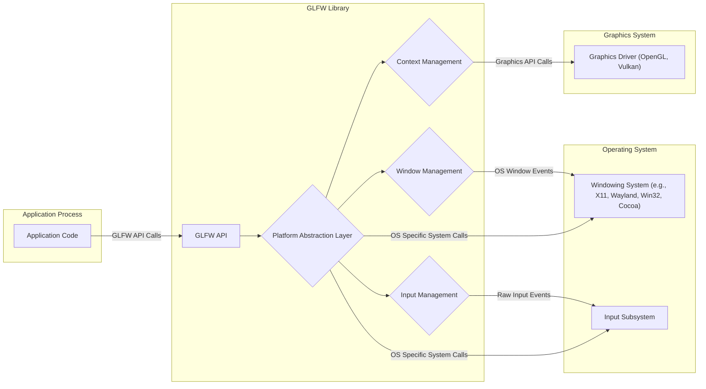
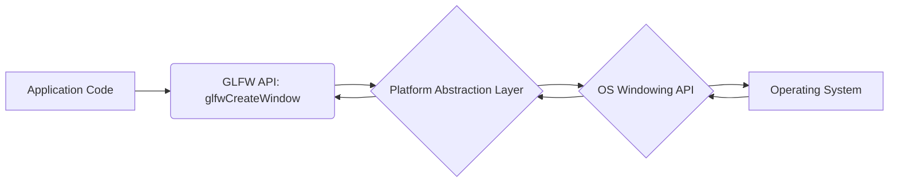
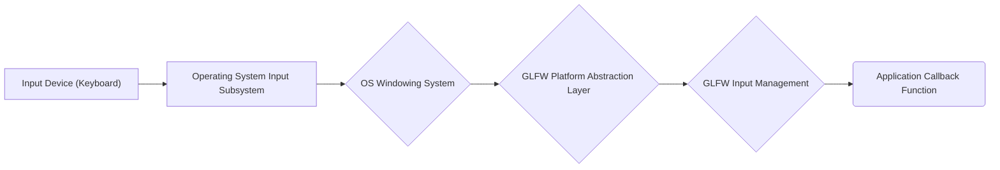
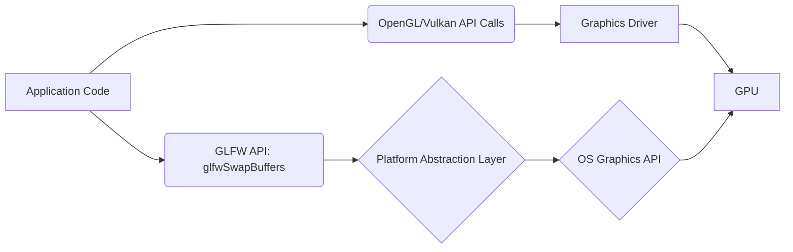

## Project Design Document: GLFW Library

**Project Name:** GLFW (Graphics Library Framework)

**Project Repository:** https://github.com/glfw/glfw

**Document Version:** 1.1

**Date:** October 26, 2023

**Author:** AI Software Architect

### 1. Introduction

This document provides a detailed design overview of the GLFW library. GLFW is an Open Source, multi-platform library for OpenGL, OpenGL ES and Vulkan development on the desktop. It offers a straightforward API for essential tasks such as creating and managing windows, handling user input, and setting up rendering contexts. This document focuses on elucidating GLFW's architectural design, component functionalities, and data flow pathways, serving as a critical foundation for subsequent threat modeling exercises.

### 2. Goals and Non-Goals

**Goals:**

*   Present a clear and in-depth description of GLFW's architecture and its constituent components.
*   Illustrate the flow of data within the library, specifically detailing input and output mechanisms.
*   Pinpoint key interfaces and the interactions occurring between different segments of the system.
*   Establish a solid basis for identifying potential security vulnerabilities during the threat modeling process.

**Non-Goals:**

*   Offer a granular, code-level implementation guide.
*   Document every individual function or API call available within GLFW.
*   Conduct a security assessment or perform a threat analysis directly within this document.
*   Delve into the intricate internal operations of the underlying operating system or graphics drivers.

### 3. High-Level Architecture

GLFW acts as a crucial intermediary, bridging the gap between the application and the underlying operating system and graphics drivers. It provides a consistent application programming interface (API) across diverse platforms, effectively abstracting away platform-specific complexities.

**Components:**

*   **Application Code:** The user-developed program that leverages the functionalities provided by the GLFW library.
*   **GLFW API:** The publicly accessible interface of the GLFW library, offering functions for managing windows, handling input events, and creating rendering contexts.
*   **Platform Abstraction Layer:** A critical layer within GLFW responsible for implementing platform-specific logic required to interact with the underlying operating system. This layer is instrumental in managing the differences between operating systems like Windows, macOS, and various Linux distributions (utilizing X11 or Wayland).
*   **Window Management:** This component handles the creation, destruction, and overall management of operating system windows. This includes processing window-related events such as resizing, moving, and closing.
*   **Input Management:** Responsible for managing input from various devices, including keyboards, mice, joysticks, and touchscreens. It receives raw input events from the operating system and standardizes them into a consistent format for use by the application.
*   **Context Management:** This component deals with the creation and management of rendering contexts for OpenGL, OpenGL ES, or Vulkan. This involves direct interaction with the graphics drivers installed on the system.
*   **Operating System:** The foundational operating system providing essential services for windowing, input handling, and other system-level operations.
*   **Graphics Driver:** The software component that enables communication between the operating system, applications, and the graphics processing unit (GPU).

### 4. Detailed Design

#### 4.1. GLFW API

*   Presents a collection of C functions that applications can invoke to interact with GLFW's functionalities.
*   Functions are logically organized into categories for window management (e.g., `"glfwCreateWindow"`, `"glfwDestroyWindow"`), input handling (e.g., `"glfwSetKeyCallback"`, `"glfwGetCursorPos"`), and context management (e.g., `"glfwMakeContextCurrent"`, `"glfwSwapBuffers"`).
*   Serves as the primary point of interaction for applications utilizing the GLFW library.
*   Performs preliminary validation of input parameters before forwarding requests to the Platform Abstraction Layer.

#### 4.2. Platform Abstraction Layer

*   Contains platform-specific implementations for core GLFW functionalities, ensuring cross-platform compatibility.
*   Employs conditional compilation or dynamic linking techniques to select the appropriate implementation based on the target operating system during runtime or compilation.
*   Illustrative examples of platform-specific implementations include:
    *   **Windows:** Utilizes the Win32 API for window creation and management, raw input processing, and OpenGL context creation via WGL.
    *   **macOS:** Leverages the Cocoa framework for window management, event handling, and OpenGL context creation using CGL, or Metal for Vulkan integration.
    *   **Linux (X11):** Interacts with the X Window System for window management, input handling, and OpenGL context creation through GLX.
    *   **Linux (Wayland):** Employs the Wayland compositor protocol for window management and input, and utilizes EGL for managing rendering context creation.
*   This layer is paramount in abstracting away the intricacies of OS-level differences, thereby providing a uniform API for developers.

#### 4.3. Window Management

*   Manages the complete lifecycle of GLFW windows, from creation to destruction.
*   Handles the creation of native operating system windows, configuring them with specified properties such as size, title, and other attributes.
*   Processes window-related events received from the operating system, including resize events, window move events, and focus changes.
*   Offers mechanisms for setting and modifying various window properties and attributes dynamically.
*   Heavily relies on the Platform Abstraction Layer for performing OS-specific windowing operations.

#### 4.4. Input Management

*   Captures raw input events originating from the operating system through the Platform Abstraction Layer.
*   Normalizes and processes these raw events into a consistent, platform-independent format.
*   Provides callback mechanisms that allow applications to receive notifications of input events, such as key presses, mouse movements, button clicks, and joystick input.
*   Manages keyboard layouts and the processing of character input.
*   Controls cursor visibility and positioning within the window.

#### 4.5. Context Management

*   Facilitates the creation of rendering contexts for OpenGL, OpenGL ES, or Vulkan.
*   Utilizes platform-specific APIs for context creation, such as WGL on Windows, CGL on macOS, and GLX/EGL on Linux.
*   Allows applications to specify various context attributes, including the desired OpenGL version and profile.
*   Manages the process of switching between different rendering contexts and sharing resources between them.
*   For Vulkan, this component handles the creation of instances and surfaces necessary for rendering.

### 5. Data Flow

#### 5.1. Window Creation Sequence

1. The application initiates the window creation process by calling a GLFW API function, for example, `"glfwCreateWindow"`.
2. The GLFW API layer performs initial validation of the provided parameters.
3. The request is then forwarded to the Platform Abstraction Layer.
4. The Platform Abstraction Layer executes OS-specific system calls to create a native window. Examples include `"CreateWindowEx"` on Windows, `"- [NSWindow alloc]"` on macOS, and `"XCreateWindow"` on X11.
5. The operating system creates the window and returns a unique identifier or handle to it.
6. GLFW stores this window handle and associates it with the internal GLFW window object representation.

#### 5.2. Input Event Handling Sequence (e.g., Key Press)

1. A user interacts with an input device, such as pressing a key on the keyboard.
2. The operating system's input subsystem detects this key press event.
3. The OS then sends an input event notification to the relevant application window through the windowing system.
4. The Platform Abstraction Layer within GLFW intercepts this OS-specific input event.
5. The Platform Abstraction Layer translates the OS-specific event into a standardized GLFW input event.
6. GLFW then invokes the appropriate callback function registered by the application (e.g., the function set using `"glfwSetKeyCallback"`), passing the relevant event data as arguments.

#### 5.3. Rendering Data Flow

1. The application initiates the rendering process by making calls to the OpenGL or Vulkan API.
2. These API calls are then processed by the installed graphics driver.
3. GLFW's primary role in rendering is the initial setup of the rendering context and ensuring the correct context is active for a given window.
4. Typically, the application calls `"glfwSwapBuffers"` to present the rendered image to the user on the window.
5. The `"glfwSwapBuffers"` function internally calls the appropriate platform-specific function to swap the front and back buffers. Examples include `"SwapBuffers"` on Windows, `"glFlush"` on macOS, `"glXSwapBuffers"` on X11, and `"eglSwapBuffers"` on Wayland.

### 6. Security Considerations (Detailed for Threat Modeling)

This section outlines potential areas of security concern, providing more specific examples to aid in threat modeling activities.

*   **Input Validation Vulnerabilities:** GLFW receives raw input from the OS. Insufficient validation of input events (e.g., keyboard input exceeding expected lengths, malformed mouse events) could lead to buffer overflows in internal GLFW buffers or unexpected program states. For example, a long string passed as a window title or in a clipboard operation could overflow a fixed-size buffer.
*   **Platform-Specific API Exploitation:** The Platform Abstraction Layer directly interacts with OS APIs. Vulnerabilities in these underlying OS APIs (e.g., in Win32 window message handling, X11 event processing, or Cocoa event dispatch) could be indirectly exploitable through GLFW if GLFW doesn't handle edge cases or errors robustly.
*   **Callback Function Risks:** Applications register callback functions for event handling. While GLFW doesn't directly control these, malicious applications could register callbacks that perform harmful actions. From GLFW's perspective, ensuring callbacks are invoked safely and without exposing internal state unnecessarily is important.
*   **Resource Management Issues:** Improper management of system resources like memory, window handles, or graphics contexts could lead to denial-of-service conditions. For instance, failing to release window handles could exhaust system resources.
*   **Dependency on External Libraries:** While GLFW has minimal external dependencies, reliance on system libraries for windowing and graphics means vulnerabilities in those libraries could impact GLFW's security. Regular updates and awareness of system library vulnerabilities are important.
*   **Integer Overflow/Underflow in Calculations:** Calculations involving window dimensions, cursor positions, or buffer sizes could be susceptible to integer overflows or underflows, potentially leading to unexpected behavior or memory corruption. For example, calculating buffer sizes based on user-provided input without proper bounds checking.
*   **Race Conditions in Event Handling:** In multi-threaded applications using GLFW, race conditions could occur when handling input events or managing window state concurrently, potentially leading to inconsistent state or crashes. Ensuring proper synchronization mechanisms within GLFW is crucial.
*   **Clipboard Handling Vulnerabilities:** Operations involving the system clipboard (setting or getting clipboard content) could be vulnerable to issues like buffer overflows if the data on the clipboard is excessively large or malformed.
*   **Gamma Ramp Exploitation:** Setting the gamma ramp (for display color correction) involves interacting with the OS. Potential vulnerabilities could arise if the provided gamma ramp data is not properly validated, potentially leading to driver crashes or other issues.

### 7. Deployment Considerations

*   GLFW is commonly distributed as a dynamically linked library (e.g., `.dll` on Windows, `.dylib` on macOS, `.so` on Linux).
*   Applications are linked against the GLFW library during the software build process.
*   The GLFW library must be present on the target system for the application to execute correctly.
*   The specific GLFW implementation loaded at runtime depends on the operating system and the application's build configuration.

### 8. Future Considerations

*   A more detailed breakdown of the Platform Abstraction Layer, potentially creating separate design documents for each supported platform, would allow for more focused security analysis.
*   A thorough examination of GLFW's internal error handling mechanisms and how errors are propagated to the application could reveal potential areas for improvement in robustness and security.
*   An in-depth analysis of GLFW's threading model, particularly concerning event handling and synchronization, would be beneficial for understanding potential concurrency-related vulnerabilities.
*   Consideration of sandboxing or other security mechanisms that could be employed when using GLFW in security-sensitive environments.

This document provides a significantly enhanced and more detailed understanding of the GLFW library's design, specifically tailored to facilitate comprehensive threat modeling activities. The added specifics in the security considerations section aim to provide concrete examples of potential vulnerabilities for further investigation.