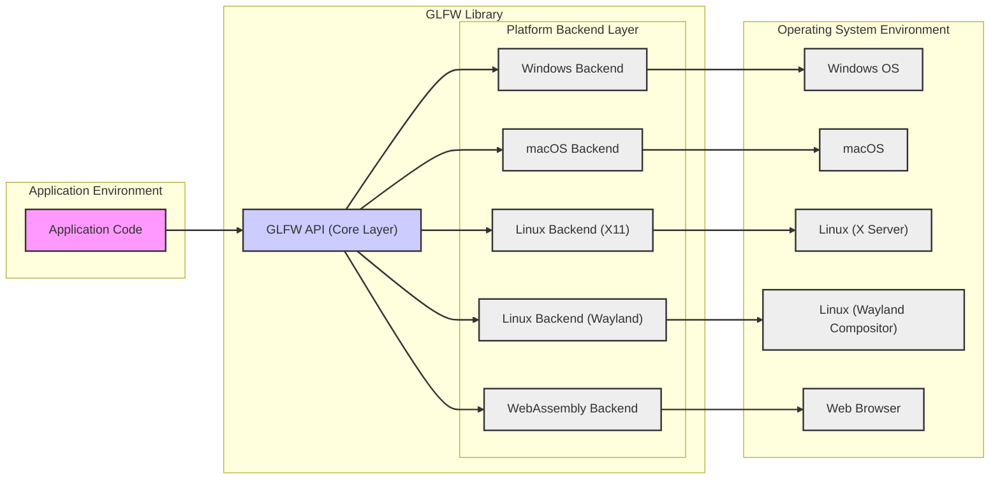
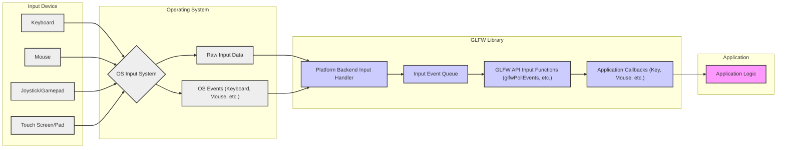
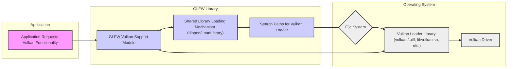

# GLFW Project Design Document for Threat Modeling (Improved)

## 1. Project Overview

**Project Name:** GLFW

**Project URL:** [https://github.com/glfw/glfw](https://github.com/glfw/glfw)

**Project Description:** GLFW is an Open Source, cross-platform library for OpenGL, OpenGL ES and Vulkan development. It provides a simple API for creating windows, contexts and surfaces, receiving input and events. GLFW is written in C and supports a wide range of operating systems including Windows, macOS, Linux, and web browsers via WebAssembly. It is primarily used in graphics applications, games, and simulations to handle window management, user input, and basic system interactions, allowing developers to focus on the core logic of their applications rather than platform-specific details. GLFW aims for simplicity and portability, making it a popular choice for cross-platform graphics development.

**Purpose of this Document:** This document serves as a detailed design overview of the GLFW library, specifically tailored to facilitate threat modeling and security analysis. It outlines the architecture, components, data flow, and technologies involved in GLFW to identify potential security vulnerabilities, attack surfaces, and areas of concern. This document will be used as a basis for subsequent threat modeling activities, including identifying threats, vulnerabilities, and mitigation strategies.

## 2. Architecture Overview

GLFW acts as an abstraction layer, mediating between the application and the underlying operating system's windowing and input systems. It provides a consistent, platform-agnostic API, shielding developers from the complexities of platform-specific implementations.

The architecture of GLFW is layered, promoting modularity and portability. Key layers include:

*   **Application Layer:** The user-developed application that directly interacts with the GLFW API to manage windows, input, and graphics contexts. This layer is outside the scope of GLFW's direct security responsibility but is a consumer of its services and thus impacted by GLFW's security posture.
*   **GLFW API (Core Layer):** This is the platform-independent core of GLFW, defining the public API functions and managing the overall library logic. It handles API calls from the application and dispatches them to the appropriate platform backend.
*   **Platform Backend Layer:** This layer contains platform-specific implementations for core functionalities like window creation, input processing, context management, and monitor handling. Each supported platform (Windows, macOS, Linux, WebAssembly) has its own backend implementation, interacting directly with the respective operating system APIs.
*   **Operating System Layer:** This is the underlying operating system, providing the fundamental windowing system, input management, graphics drivers, and system services that GLFW relies upon. This layer includes components like the Windows kernel, macOS WindowServer, Linux X Server/Wayland Compositor, and web browser environments.

**High-Level Architecture Diagram:**

## 3. Component Details

This section provides a detailed breakdown of key GLFW components, emphasizing their functionality, platform interactions, and security considerations relevant for threat modeling.

### 3.1. Window Management

*   **Functionality:**  Provides APIs for creating, destroying, and managing application windows. This includes setting window properties like size, position, title, icon, decorations, resizability, focus, and opacity. It also handles window events such as resizing, moving, minimizing, maximizing, and closing.
*   **Platform Interaction:**  Directly interfaces with platform-specific windowing system APIs:
    *   **Windows:** Win32 API (`CreateWindowExW`, `DestroyWindow`, `SetWindowLongPtrW`, window message processing via `WndProc`).
    *   **macOS:** Cocoa framework (`NSWindow`, `NSView`, delegation for event handling).
    *   **Linux (X11):** Xlib/XCB (`XCreateWindow`, `XDestroyWindow`, event handling via `XNextEvent`).
    *   **Linux (Wayland):** Wayland protocol (`wl_compositor`, `wl_surface`, `wl_shell_surface`, event handling via Wayland event queue).
    *   **WebAssembly:** Browser DOM APIs (`document.createElement('canvas')`, WebGL context management).
*   **Security Considerations:**
    *   **Window Handle Security:**  Improper management or exposure of window handles could potentially lead to unauthorized window manipulation or resource leaks. While GLFW abstracts handle management, vulnerabilities in backend implementations could expose handles.
    *   **Window Message Handling (Windows):** On Windows, the `WndProc` function is a critical entry point for window messages. Vulnerabilities in message processing logic within GLFW or the application's message handlers could be exploited.
    *   **Cross-Window Communication:** While GLFW primarily isolates window management, vulnerabilities in the underlying OS windowing system or in GLFW's backend could potentially be leveraged for cross-window attacks (e.g., information disclosure, input interception).
    *   **Window Attributes and Security Policies:** Certain window attributes (e.g., always-on-top, fullscreen) might interact with OS security policies in unexpected ways. Incorrectly setting or handling these attributes could lead to security bypasses or unintended behavior.
    *   **Input Focus and Capture:**  GLFW manages input focus. Vulnerabilities in focus management could lead to input stealing or denial-of-service attacks by manipulating window focus.

### 3.2. Input Handling

*   **Functionality:**  Handles user input from various devices: keyboard, mouse, touchpads, touch screens (where supported), and joysticks/gamepads. Provides callbacks for key events (press, release, scancodes), mouse button events (press, release, clicks), cursor movement, scrolling, and joystick axis/button events. Supports keyboard layout handling and input modes (e.g., raw input).
*   **Platform Interaction:**
    *   **Windows:** `GetKeyboardState`, `GetRawInputData`, `RegisterRawInputDevices`, `GetCursorPos`, `GetAsyncKeyState`, window message processing for input events.
    *   **macOS:** NSEvent handling, IOKit for raw input (potentially).
    *   **Linux (X11):** Xlib/XCB event handling for keyboard, mouse, and joystick events. XInput2 for advanced input features.
    *   **Linux (Wayland):** Wayland input protocol (`wl_keyboard`, `wl_pointer`, `wl_touch`, `wl_joystick`), libinput for input device abstraction.
    *   **WebAssembly:** Browser DOM event listeners (`addEventListener` for keyboard, mouse, touch, gamepad events).
*   **Security Considerations:**
    *   **Input Injection Vulnerabilities:**  Insufficient validation or sanitization of input data received from the OS could lead to input injection attacks. Maliciously crafted input events could potentially bypass application logic or trigger vulnerabilities.
    *   **Buffer Overflows in Input Buffers:**  Improper handling of input data buffers within GLFW or backend implementations could lead to buffer overflows, especially when dealing with raw input or complex input events.
    *   **Denial of Service (Input Flooding):**  An attacker could flood the application with excessive input events, potentially overwhelming the application's event processing and causing a denial of service.
    *   **Keylogging/Input Interception:**  While GLFW itself doesn't introduce keylogging, vulnerabilities in the OS or in applications using GLFW could be exploited for keylogging or input interception. Secure input handling practices are crucial.
    *   **Clipboard Interaction (Related to Input):**  Clipboard operations are often triggered by input events (e.g., Ctrl+C, Ctrl+V). Security considerations related to clipboard access (see 3.7) are relevant here.
    *   **IME (Input Method Editor) Security:**  Handling of IME input can be complex and platform-dependent. Vulnerabilities in IME handling could potentially lead to security issues, especially if input is not properly sanitized after IME processing.

### 3.3. Context Creation and Management

*   **Functionality:**  Provides APIs for creating and managing OpenGL, OpenGL ES, and Vulkan rendering contexts and surfaces. Allows setting context attributes (OpenGL version, profile, robustness, debug context, etc.), sharing contexts between windows, and making contexts current for rendering.
*   **Platform Interaction:**
    *   **Windows:** WGL (Windows Graphics Library) for OpenGL context creation, Vulkan surface extensions for Vulkan.
    *   **macOS:** CGL (Core Graphics Library) for OpenGL context creation, MoltenVK for Vulkan (via layer).
    *   **Linux (X11):** GLX (OpenGL Extension to the X Window System) for OpenGL context creation, Vulkan surface extensions (Xlib/XCB).
    *   **Linux (Wayland):** EGL (Embedded Graphics Library) for OpenGL/OpenGL ES context creation, Vulkan surface extensions (Wayland).
    *   **WebAssembly:** WebGL context creation via browser APIs (`canvas.getContext('webgl')`, `canvas.getContext('webgl2')`), WebGPU context creation (emerging).
*   **Security Considerations:**
    *   **Graphics Driver Vulnerabilities:** GLFW relies heavily on underlying graphics drivers provided by the OS vendor or GPU manufacturer. Vulnerabilities in these drivers could be indirectly exploitable through GLFW if specific API calls or context configurations trigger driver bugs.
    *   **Context Sharing Security:** Sharing OpenGL contexts between windows or threads can introduce security risks if not managed carefully. Improper context sharing could potentially allow unintended access to resources or data between contexts.
    *   **Resource Exhaustion (Context Creation):**  Creating an excessive number of graphics contexts or contexts with specific resource-intensive attributes could potentially lead to resource exhaustion and denial of service.
    *   **Context Attributes and Security:**  Certain context attributes (e.g., debug contexts, robustness features) can impact security and debugging. Incorrectly configuring or handling these attributes could have security implications.
    *   **Vulkan Loader and Instance Security:** For Vulkan, GLFW interacts with the Vulkan loader library. Security considerations related to shared library loading (see 3.6) apply to the Vulkan loader. Vulnerabilities in the Vulkan loader itself could also impact GLFW-based applications.

### 3.4. Event Handling

*   **Functionality:**  GLFW operates on an event-driven model. It receives events from the OS windowing and input systems and dispatches them to the application via registered callbacks. Event types include window events (resize, close, focus, iconify, expose), input events (keyboard, mouse, joystick), and monitor events (monitor connection/disconnection).
*   **Platform Interaction:**  GLFW's backend implementations are responsible for polling or receiving events from the OS event queues and translating them into GLFW's internal event representation.
    *   **Windows:** Message loop (`GetMessage`, `DispatchMessage`).
    *   **macOS:** Run loop, NSEvent queue.
    *   **Linux (X11):** X event queue (`XNextEvent`).
    *   **Linux (Wayland):** Wayland event queue (`wl_display_dispatch`).
    *   **WebAssembly:** Browser event loop.
*   **Security Considerations:**
    *   **Event Spoofing/Manipulation (OS Level):** While less likely to be directly exploitable via GLFW's API, vulnerabilities in the underlying OS event system could theoretically allow for event spoofing or manipulation.
    *   **Event Flooding (DoS):**  An attacker could attempt to flood the application with a large number of events, potentially causing a denial of service by overwhelming the application's event processing.
    *   **Callback Security:** The security of event handling is heavily dependent on the security of the application's callback functions. Vulnerabilities in application-provided callbacks (e.g., buffer overflows, logic errors) could be triggered by events dispatched by GLFW. GLFW itself must ensure that it calls callbacks safely and doesn't introduce vulnerabilities during callback invocation.
    *   **Event Prioritization and Filtering:**  GLFW's event handling might involve prioritization or filtering of events. Vulnerabilities in event prioritization or filtering logic could potentially be exploited to bypass certain event handling or cause unexpected behavior.

### 3.5. Monitor Management

*   **Functionality:**  Provides APIs to query connected monitors, retrieve monitor properties (name, resolution, refresh rate, physical size, position), and manage monitor configuration (e.g., gamma, video modes).
*   **Platform Interaction:**
    *   **Windows:** `EnumDisplayMonitors`, `GetMonitorInfoW`, `ChangeDisplaySettingsExW`.
    *   **macOS:** `NSScreen`, Core Graphics APIs for display information.
    *   **Linux (X11):** XRandR extension.
    *   **Linux (Wayland):**  `wl_output` protocol, potentially system APIs for monitor information.
    *   **WebAssembly:** Browser `screen` API (limited monitor information).
*   **Security Considerations:**
    *   **Information Disclosure (Monitor Information):**  While monitor information is generally not considered highly sensitive, in specific contexts, revealing detailed monitor configurations could potentially leak information about the user's setup.
    *   **EDID Data Handling:**  Monitor information often includes EDID (Extended Display Identification Data), which is retrieved from the monitor hardware. Parsing and handling of EDID data could potentially introduce vulnerabilities if not done robustly (e.g., buffer overflows in EDID parsing).
    *   **Monitor Configuration Manipulation (Less likely via GLFW API directly):**  While GLFW primarily reads monitor information, vulnerabilities in the underlying OS monitor management system or in GLFW's backend could theoretically be exploited to manipulate monitor configurations, although this is less likely to be directly exposed through GLFW's API.

### 3.6. Shared Library Loading (Vulkan, etc.)

*   **Functionality:**  GLFW dynamically loads shared libraries for certain functionalities, most notably for Vulkan support. It needs to load the Vulkan loader library (e.g., `vulkan-1.dll`, `libvulkan.so`, `libvulkan.dylib`) at runtime to access Vulkan API functions.
*   **Platform Interaction:**
    *   **Windows:** `LoadLibraryW`, `GetProcAddress`.
    *   **macOS/Linux:** `dlopen`, `dlsym`.
    *   **WebAssembly:** Not directly applicable as WebAssembly typically links against APIs at compile time or uses browser-provided APIs.
*   **Security Considerations:**
    *   **DLL Hijacking/Shared Library Injection:**  This is a significant security concern. If GLFW is not careful about how it searches for and loads shared libraries, it could be vulnerable to DLL hijacking (on Windows) or shared library injection attacks (on Linux/macOS). An attacker could place a malicious library with the same name as the expected Vulkan loader in a directory that is searched before the legitimate system directory, causing GLFW to load and execute the malicious library.
    *   **Unsafe Library Loading Paths:**  If GLFW uses insecure or predictable paths to search for shared libraries, it increases the risk of library injection. Secure library loading should involve using well-defined system paths and potentially verifying library signatures or checksums (though GLFW doesn't currently implement signature verification).
    *   **Path Traversal Vulnerabilities:**  If library loading paths are constructed from user-controlled input or environment variables without proper sanitization, path traversal vulnerabilities could potentially be exploited to load libraries from arbitrary locations.

### 3.7. Clipboard Access

*   **Functionality:**  GLFW provides APIs to get and set the system clipboard content as text.
*   **Platform Interaction:**
    *   **Windows:** `GetClipboardData`, `SetClipboardData`, `OpenClipboard`, `CloseClipboard`.
    *   **macOS:** `NSPasteboard`.
    *   **Linux (X11):** X Clipboard, selections.
    *   **Linux (Wayland):** Wayland clipboard protocol.
    *   **WebAssembly:** Browser Clipboard API (`navigator.clipboard`).
*   **Security Considerations:**
    *   **Clipboard Data Leakage:**  If an application using GLFW inadvertently copies sensitive data to the clipboard, it could be exposed to other applications or users who have access to the clipboard.
    *   **Clipboard Injection/Manipulation:**  Malicious applications or actors could potentially manipulate the clipboard content while a GLFW application is running. If the GLFW application later retrieves and processes clipboard data without proper validation, it could lead to unexpected behavior or security vulnerabilities.
    *   **Format String Vulnerabilities (Less likely in modern APIs, but historically relevant):**  In older clipboard APIs, improper handling of clipboard data formats could potentially lead to format string vulnerabilities if data is interpreted as a format string. Modern clipboard APIs are generally less susceptible to this, but careful handling of data formats is still important.
    *   **Cross-Platform Clipboard Compatibility Issues:**  Clipboard formats and handling can vary across platforms. Inconsistencies in clipboard handling across platforms could potentially lead to unexpected behavior or security issues if data is not properly converted or sanitized when transferring between platforms via the clipboard.

## 4. Data Flow Diagrams

This section provides data flow diagrams illustrating the flow of data for critical functionalities within GLFW.

### 4.1. Input Event Flow (Detailed)

**Description:** Input events originate from various input devices. The OS input system processes these inputs, generating raw input data and OS-level events. GLFW's platform backend input handler receives this data and events, translates them into a platform-independent format, and queues them in the input event queue. The application retrieves events via GLFW API functions (like `glfwPollEvents`) which then trigger registered application callbacks. Finally, the application logic processes these events within the callbacks.

### 4.2. Shared Library Loading Flow (Vulkan Loader Example)

**Description:** When an application requests Vulkan functionality, GLFW's Vulkan support module initiates the loading of the Vulkan loader shared library. GLFW uses platform-specific shared library loading mechanisms (like `dlopen` or `LoadLibrary`) and searches predefined paths to locate the Vulkan loader library in the file system. Once loaded, GLFW can access Vulkan API functions provided by the loader, which in turn interacts with the Vulkan driver. This flow highlights the shared library loading process and potential points of vulnerability like insecure search paths.

## 5. Technology Stack

*   **Primary Programming Language:** C (ANSI C90 standard, aiming for broad compatibility)
*   **Secondary Languages (Examples, Build Scripts):** C++, CMake scripting language, shell scripting.
*   **Operating System APIs:**
    *   **Windows:** Win32 API (User32, Kernel32, GDI32, Shell32, etc.) - C API.
    *   **macOS:** Cocoa Framework (Objective-C runtime, C-based Core Foundation, Core Graphics, IOKit) - Objective-C and C APIs.
    *   **Linux:** Xlib, XCB (X Window System client libraries), Wayland client libraries (libwayland-client), udev, evdev, libinput (input device handling), system libraries (libc, libm, etc.) - C APIs.
    *   **WebAssembly:** Web APIs (DOM, Canvas, WebGL, WebGPU, Clipboard API, Gamepad API, etc.) - JavaScript/WebIDL APIs accessed from C via Emscripten/WASI.
*   **Graphics APIs (Support):** OpenGL (core profile and compatibility profile), OpenGL ES, Vulkan (via loader library), WebGL, WebGPU (emerging).
*   **Build System:** CMake (cross-platform build system generator).
*   **Version Control:** Git (hosted on GitHub).
*   **Documentation:** Doxygen (API documentation generation).

## 6. Deployment Environment

GLFW is designed to be deployed as a dynamically linked or statically linked library that is integrated into applications. The deployment environment is therefore highly dependent on the application using GLFW. Common deployment environments include:

*   **Desktop Operating Systems:** Windows (various versions), macOS (various versions), Linux distributions (targeting common desktop environments like GNOME, KDE, Xfce, and Wayland compositors).
*   **Web Browsers:** Modern web browsers supporting WebAssembly and relevant Web APIs (Chrome, Firefox, Safari, Edge, etc.). Applications are deployed as web applications running within the browser sandbox.
*   **Embedded Systems (Potentially):**  If the target embedded system provides a compatible operating system (e.g., embedded Linux) and supports the required graphics APIs (OpenGL ES, Vulkan) and system libraries, GLFW could potentially be deployed on embedded platforms. However, embedded deployment is less common and might require platform-specific adaptations.

The security posture of the deployment environment is crucial. Factors influencing security include:

*   **Operating System Hardening:** OS security configurations, patch levels, and security features (ASLR, DEP, etc.).
*   **User Privileges:** The privileges under which the application using GLFW is executed. Running with least privilege is a security best practice.
*   **Network Exposure:** Whether the application is network-facing and the nature of network interactions.
*   **Browser Sandbox (WebAssembly):** WebAssembly applications in browsers are typically sandboxed, limiting their access to system resources and mitigating certain types of vulnerabilities. However, vulnerabilities within the browser or WebAssembly runtime itself could still pose risks.

## 7. Security Considerations and Recommendations

Based on the architecture, component details, and data flow analysis, the following security considerations and recommendations are identified for GLFW:

**General Recommendations:**

*   **Input Validation and Sanitization (Comprehensive):** Implement rigorous input validation and sanitization for all data received from the OS, especially input events, clipboard data, and any data used in system calls or library loading paths. Use whitelisting and input validation libraries where appropriate.
*   **Buffer Overflow Prevention (Strict):** Employ robust buffer overflow prevention techniques throughout the codebase. Use safe string handling functions (e.g., `strncpy`, `strncat`, `snprintf`), perform bounds checking on all array and buffer accesses, and consider using memory-safe programming practices.
*   **Secure Shared Library Loading (Prioritize):** Implement secure shared library loading practices to mitigate DLL hijacking and shared library injection risks.
    *   Use absolute paths or well-defined system paths for library loading where possible.
    *   Consider verifying library signatures or checksums (though this is not currently implemented in GLFW).
    *   Minimize the search paths used for library loading and ensure they are not user-writable.
    *   Be aware of DLL search order vulnerabilities on Windows and take steps to mitigate them.
*   **Clipboard Security (Cautious Handling):** Handle clipboard data with caution.
    *   Sanitize data retrieved from the clipboard before use to prevent injection attacks or unexpected behavior.
    *   Avoid placing sensitive data on the clipboard unnecessarily.
    *   Be aware of potential clipboard format inconsistencies across platforms and handle format conversions securely.
*   **Error Handling and Information Disclosure (Minimize):** Implement proper error handling to prevent information leakage through verbose error messages or stack traces. Log errors securely and avoid exposing sensitive internal details in error messages visible to users or attackers.
*   **Principle of Least Privilege (Application Level):** Encourage applications using GLFW to run with the principle of least privilege. This limits the potential impact of vulnerabilities in GLFW or the application itself.
*   **Dependency Management (Regular Updates):** Keep dependencies (including OS libraries, graphics drivers, and build tools) up-to-date to address known vulnerabilities. Monitor security advisories for GLFW and its dependencies.
*   **Regular Security Audits and Testing (Essential):** Conduct regular security audits, code reviews, and penetration testing to proactively identify and address potential vulnerabilities in GLFW. Consider both static and dynamic analysis techniques.
*   **Address Compiler Warnings and Static Analysis Findings:** Treat compiler warnings and static analysis tool findings seriously and address them promptly. These tools can often identify potential security vulnerabilities or coding errors.

**Component-Specific Recommendations:**

*   **Window Management:**
    *   Carefully review window message handling logic (especially on Windows) for potential vulnerabilities.
    *   Ensure proper validation of window attributes and parameters to prevent unexpected behavior or security policy bypasses.
    *   Implement robust input focus management to prevent input stealing attacks.
*   **Input Handling:**
    *   Implement strict validation and sanitization of all input data, including keyboard, mouse, joystick, and touch input.
    *   Pay close attention to raw input handling and ensure buffer safety.
    *   Implement rate limiting or input throttling to mitigate input flooding DoS attacks.
    *   Securely handle IME input and ensure proper sanitization after IME processing.
*   **Context Creation and Management:**
    *   Be aware of potential graphics driver vulnerabilities and test on a range of drivers.
    *   Exercise caution when sharing OpenGL contexts and ensure proper synchronization and resource management to prevent unintended access or data corruption.
    *   Implement resource limits on context creation to prevent resource exhaustion DoS.
*   **Event Handling:**
    *   Carefully review event dispatching and handling logic for potential vulnerabilities.
    *   Consider implementing event filtering or prioritization to mitigate event flooding attacks.
    *   Provide clear guidelines to application developers on how to write secure event callback functions.
*   **Monitor Management:**
    *   Implement robust EDID parsing to prevent buffer overflows or other vulnerabilities when processing monitor information.
*   **Shared Library Loading:** (See General Recommendations - Secure Shared Library Loading)
*   **Clipboard Access:** (See General Recommendations - Clipboard Security)

This improved design document provides a more detailed and security-focused foundation for threat modeling GLFW. The next step is to use this document to perform a structured threat modeling exercise, such as STRIDE, to identify specific threats, vulnerabilities, and attack vectors, and then to develop detailed mitigation strategies and security testing plans.