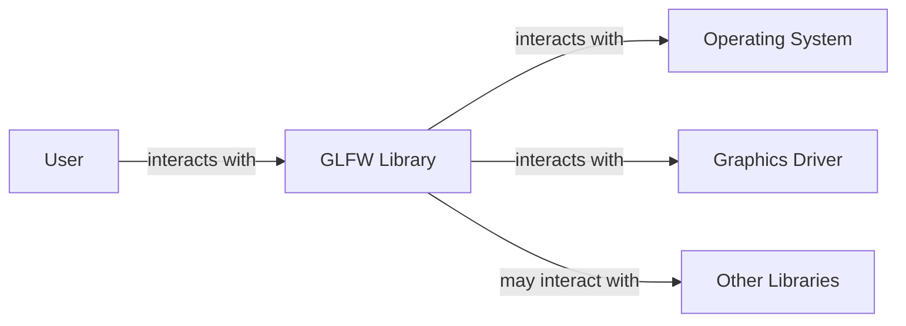
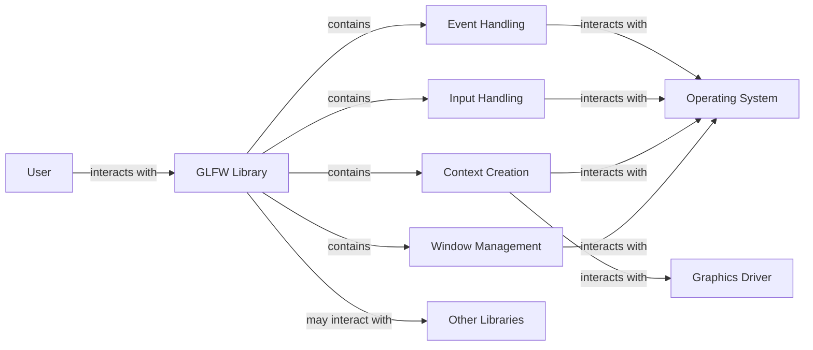
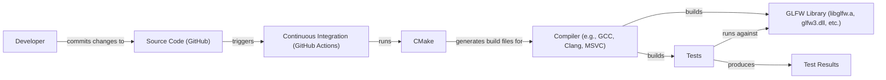
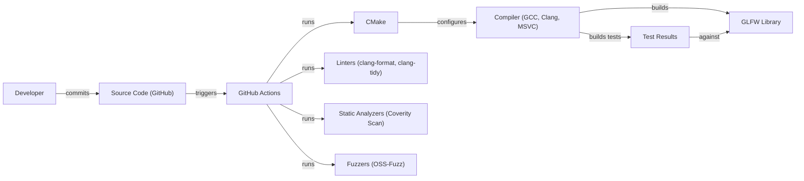

# BUSINESS POSTURE

GLFW is a library for OpenGL, OpenGL ES, and Vulkan application development. It provides a simple, cross-platform API for creating windows, contexts, and surfaces, reading input, handling events, etc.

Business Priorities and Goals:

*   Provide a stable and reliable cross-platform API for creating and managing OpenGL, OpenGL ES, and Vulkan contexts and windows.
*   Minimize external dependencies to simplify integration and reduce potential conflicts.
*   Maintain a small codebase for ease of understanding, maintenance, and auditing.
*   Support a wide range of platforms and compilers.
*   Provide excellent documentation and examples.
*   Ensure the library is easy to use and integrate into various projects.

Business Risks:

*   Vulnerabilities in the library could be exploited to compromise applications using it, potentially leading to arbitrary code execution or denial of service.
*   Compatibility issues with new graphics drivers or operating system updates could break existing applications.
*   Lack of support for new input devices or windowing system features could limit the library's usefulness.
*   Failure to maintain the library and address reported issues could lead to developers abandoning it for alternatives.

# SECURITY POSTURE

Existing Security Controls:

*   security control: The project uses CMake as a build system, allowing for configuration options that can enhance security.
*   security control: Continuous integration (CI) is used to test the library on various platforms and configurations. (GitHub Actions)
*   security control: The codebase is relatively small and well-documented, facilitating security audits.
*   security control: The library has minimal external dependencies, reducing the attack surface.
*   security control: Fuzz testing is employed to discover potential vulnerabilities. (OSS-Fuzz integration)
*   security control: Static analysis is used to identify potential code quality and security issues. (GitHub Actions, Coverity Scan)
*   security control: The project has a security policy that describes how to report vulnerabilities. (SECURITY.md)

Accepted Risks:

*   accepted risk: The library relies on the security of the underlying operating system and graphics drivers.
*   accepted risk: The library does not provide built-in protection against all types of attacks, such as those targeting the application logic itself.
*   accepted risk: The library's input handling could be vulnerable to certain types of attacks if not used carefully by the application.

Recommended Security Controls:

*   security control: Implement a more comprehensive and regular static analysis process, potentially integrating additional tools beyond Coverity.
*   security control: Consider adding dynamic analysis (e.g., using a debugger or memory analysis tool) to complement fuzzing and static analysis.
*   security control: Explore the use of memory safety techniques, such as using a safer subset of C or incorporating memory safety checks.
*   security control: Provide more detailed security guidance in the documentation, particularly regarding input handling and potential attack vectors.

Security Requirements:

*   Authentication: Not directly applicable, as GLFW is a library, not a service. Authentication is the responsibility of the application using GLFW.
*   Authorization: Not directly applicable. Authorization is the responsibility of the application using GLFW.
*   Input Validation:
    *   GLFW must properly handle all input events, including keyboard, mouse, joystick, and window events.
    *   GLFW should provide mechanisms for applications to validate and sanitize user input to prevent injection attacks.
    *   GLFW should handle invalid or unexpected input gracefully, without crashing or exposing vulnerabilities.
*   Cryptography:
    *   GLFW does not directly handle cryptographic operations.
    *   If applications using GLFW require cryptography, they should use appropriate cryptographic libraries.
*   Error Handling:
    *   GLFW must handle errors gracefully and provide informative error codes or messages to the application.
    *   Error handling should not expose sensitive information or create vulnerabilities.

# DESIGN

## C4 CONTEXT

Context Diagram Element List:

*   User:
    *   Name: User
    *   Type: Person
    *   Description: A person interacting with an application that uses GLFW.
    *   Responsibilities: Provides input to the application and receives visual output.
    *   Security controls: None (handled by the application).
*   GLFW:
    *   Name: GLFW Library
    *   Type: Software System
    *   Description: The GLFW library itself.
    *   Responsibilities: Provides an API for creating windows, contexts, and surfaces, reading input, and handling events.
    *   Security controls: Fuzz testing, static analysis, minimal external dependencies, security policy.
*   Operating System:
    *   Name: Operating System
    *   Type: Software System
    *   Description: The underlying operating system (e.g., Windows, macOS, Linux).
    *   Responsibilities: Provides system calls for window management, input handling, and graphics context creation.
    *   Security controls: OS-level security mechanisms (e.g., ASLR, DEP).
*   Graphics Driver:
    *   Name: Graphics Driver
    *   Type: Software System
    *   Description: The graphics driver for the specific GPU.
    *   Responsibilities: Provides the interface between the operating system and the graphics hardware.
    *   Security controls: Driver-level security mechanisms.
*   Other Libraries:
    *   Name: Other Libraries
    *   Type: Software System
    *   Description: Other libraries that the application using GLFW might depend on.
    *   Responsibilities: Varies depending on the specific library.
    *   Security controls: Dependent on the specific library.

## C4 CONTAINER

Since GLFW is a single library, the container diagram is essentially the same as the context diagram, with the addition of internal components within the GLFW library.

Container Diagram Element List:

*   User, Operating System, Graphics Driver, Other Libraries: Same as in the Context Diagram.
*   GLFW:
    *   Name: GLFW Library
    *   Type: Library
    *   Description: The GLFW library itself.
    *   Responsibilities: Provides an API for creating windows, contexts, and surfaces, reading input, and handling events.
    *   Security controls: Fuzz testing, static analysis, minimal external dependencies, security policy.
*   Window Management:
    *   Name: Window Management
    *   Type: Component
    *   Description: Handles window creation, resizing, closing, and other window-related operations.
    *   Responsibilities: Interacts with the operating system's windowing system.
    *   Security controls: Input validation, error handling.
*   Context Creation:
    *   Name: Context Creation
    *   Type: Component
    *   Description: Handles the creation and management of OpenGL, OpenGL ES, and Vulkan contexts.
    *   Responsibilities: Interacts with the operating system and graphics driver.
    *   Security controls: Input validation, error handling.
*   Input Handling:
    *   Name: Input Handling
    *   Type: Component
    *   Description: Processes input from keyboard, mouse, joystick, and other input devices.
    *   Responsibilities: Interacts with the operating system's input system.
    *   Security controls: Input validation, error handling, sanitization.
*   Event Handling:
    *   Name: Event Handling
    *   Type: Component
    *   Description: Manages and dispatches events to the application.
    *   Responsibilities: Interacts with the operating system's event system.
    *   Security controls: Input validation, error handling.

## DEPLOYMENT

GLFW is a library, so "deployment" in the traditional sense doesn't apply. Instead, GLFW is typically *integrated* into an application's build process. However, we can describe how GLFW itself is built and tested, and how it might be distributed.

Possible distribution methods:

1.  Source code distribution: Users download the source code and build it themselves.
2.  Pre-built binaries: Users download pre-built binaries for their specific platform and compiler.
3.  Package managers: Users install GLFW through a package manager (e.g., vcpkg, apt, brew).

Chosen method for detailed description: Source code distribution with CMake.

Deployment Diagram Element List:

*   Developer:
    *   Name: Developer
    *   Type: Person
    *   Description: A developer working on the GLFW codebase.
    *   Responsibilities: Writes code, tests changes, submits pull requests.
    *   Security controls: Code review, secure coding practices.
*   Source Code (GitHub):
    *   Name: Source Code (GitHub)
    *   Type: Git Repository
    *   Description: The GLFW source code repository hosted on GitHub.
    *   Responsibilities: Stores the source code, tracks changes, manages issues and pull requests.
    *   Security controls: Access control, branch protection rules.
*   CMake:
    *   Name: CMake
    *   Type: Build System Generator
    *   Description: A cross-platform build system generator used to configure and build GLFW.
    *   Responsibilities: Generates build files for various compilers and platforms.
    *   Security controls: Secure configuration options.
*   Compiler (e.g., GCC, Clang, MSVC):
    *   Name: Compiler (e.g., GCC, Clang, MSVC)
    *   Type: Compiler
    *   Description: The compiler used to build GLFW.
    *   Responsibilities: Compiles the source code into object files and links them into a library.
    *   Security controls: Compiler security flags (e.g., stack protection, warnings as errors).
*   GLFW Library (libglfw.a, glfw3.dll, etc.):
    *   Name: GLFW Library (libglfw.a, glfw3.dll, etc.)
    *   Type: Library File
    *   Description: The compiled GLFW library.
    *   Responsibilities: Provides the GLFW API to applications.
    *   Security controls: Result of the security controls applied during the build process.
* Tests:
    *   Name: Tests
    *   Type: Executable
    *   Description: Unit and integration tests for GLFW.
    *   Responsibilities: Verify the correctness and stability of the GLFW library.
    *   Security controls: Test coverage analysis.
* Test Results:
    *   Name: Test Results
    *   Type: Data
    *   Description: The results of running the GLFW tests.
    *   Responsibilities: Indicate whether the tests passed or failed.
    *   Security controls: None.
* Continuous Integration (GitHub Actions):
    *   Name: Continuous Integration (GitHub Actions)
    *   Type: CI System
    *   Description: GitHub Actions workflows used to automate the build and test process.
    *   Responsibilities: Automatically builds and tests GLFW on various platforms and configurations.
    *   Security controls: Secure configuration of workflows, access control.

## BUILD

Build Process Description:

1.  **Developer commits code:** A developer commits changes to the GLFW source code repository on GitHub.
2.  **GitHub Actions triggers:** The commit triggers a GitHub Actions workflow.
3.  **CMake configuration:** CMake is used to configure the build process, generating build files for the specified compiler and platform.
4.  **Compilation:** The compiler (e.g., GCC, Clang, MSVC) compiles the source code into object files and links them to create the GLFW library.
5.  **Linters:** Linters (e.g., clang-format, clang-tidy) are run to check code style and identify potential issues.
6.  **Static Analyzers:** Static analyzers (e.g., Coverity Scan) are run to perform deeper code analysis and identify potential vulnerabilities.
7.  **Fuzzers:** Fuzzers (OSS-Fuzz) are used to test the library with a wide range of inputs to discover potential crashes or vulnerabilities.
8.  **Tests execution:** Tests are build and executed against GLFW library.
9.  **Build artifacts:** The compiled GLFW library (e.g., libglfw.a, glfw3.dll) is produced as a build artifact.

Security Controls in Build Process:

*   **Linters:** Enforce coding style and identify potential code quality issues.
*   **Static Analyzers:** Detect potential vulnerabilities and code quality issues.
*   **Fuzzers:** Discover vulnerabilities by testing with a wide range of inputs.
*   **Compiler Security Flags:** Utilize compiler security flags (e.g., stack protection, warnings as errors) to enhance the security of the compiled library.
*   **Continuous Integration:** Automates the build and test process, ensuring that all changes are thoroughly tested.
*   **Code Review:** All code changes are reviewed by other developers before being merged.

# RISK ASSESSMENT

Critical Business Processes:

*   Providing a stable and reliable API for window and context creation.
*   Ensuring compatibility across different platforms and graphics drivers.
*   Maintaining the security and integrity of applications using GLFW.

Data Protection:

*   GLFW itself does not handle sensitive data directly. It primarily deals with window and context management, and input handling.
*   However, applications using GLFW *may* handle sensitive data. The security of that data is the responsibility of the application developer, but GLFW should provide mechanisms to help protect it (e.g., secure input handling).
*   Data sensitivity: Low (for GLFW itself), but potentially high for applications using GLFW.

# QUESTIONS & ASSUMPTIONS

Questions:

*   Are there any specific performance requirements for GLFW?
*   Are there any plans to support additional platforms or graphics APIs in the future?
*   What is the expected level of support for older operating systems and compilers?
*   What is the process for handling security vulnerabilities reported by external researchers?

Assumptions:

*   BUSINESS POSTURE: The primary goal is to provide a stable, reliable, and secure library for OpenGL/Vulkan development.
*   SECURITY POSTURE: The existing security controls (CI, fuzzing, static analysis) are considered adequate, but there is room for improvement.
*   DESIGN: The design is relatively simple and well-defined, with clear responsibilities for each component. The use of CMake and the availability of pre-built binaries are sufficient for most users.