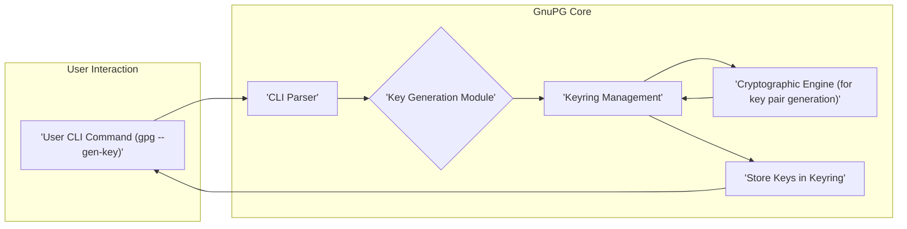
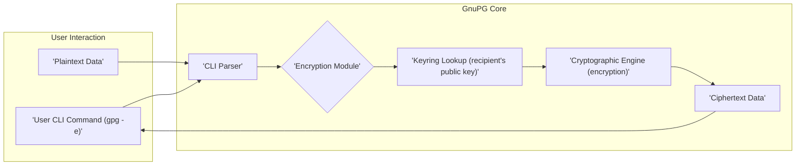
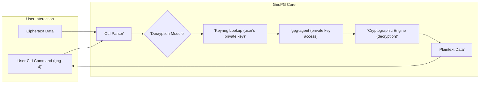
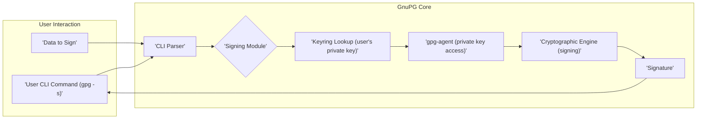
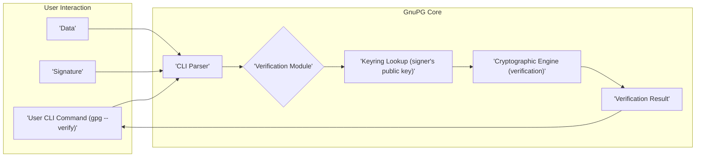

## Project Design Document: GNU Privacy Guard (GnuPG) - Improved

**1. Introduction**

This document provides an enhanced architectural design of the GNU Privacy Guard (GnuPG), a comprehensive and free software suite implementing the OpenPGP standard as defined by RFC4880 and its subsequent revisions. The primary objective of this document is to offer a detailed understanding of GnuPG's internal structure, data processing pathways, and core functionalities. This detailed design serves as a crucial foundation for conducting thorough threat modeling activities.

**2. Goals**

*   Present a more granular and detailed overview of GnuPG's architecture, including the interactions between its key components.
*   Elaborate on the primary data flows within GnuPG for essential cryptographic operations, providing a clearer picture of data transformation and movement.
*   Identify and describe key interfaces and data exchange points that are particularly relevant from a security perspective.
*   Serve as a robust and informative basis for future threat modeling exercises, enabling a more targeted and effective analysis of potential vulnerabilities.

**3. Scope**

This document focuses on the core functionalities and internal workings of GnuPG, including but not limited to:

*   **Key Generation and Management:**  Detailed processes for key creation, import, export, modification, and revocation, including the handling of different key types and attributes.
*   **Encryption and Decryption of Data:**  The flow of data during encryption and decryption operations, including the selection and application of cryptographic algorithms and modes.
*   **Signing and Verification of Data:**  The processes involved in creating and verifying digital signatures, including hash generation and signature creation/validation.
*   **Interaction with Key Servers:**  The mechanisms used for retrieving and publishing public keys from/to key servers, including the protocols and data formats involved.
*   **Basic Command-Line Interface (CLI) Operations:**  The initial processing of user commands and the orchestration of underlying functionalities.
*   **Trust Model and Web of Trust:**  The concepts and mechanisms used by GnuPG to establish and manage trust relationships between keys.

This document explicitly excludes:

*   In-depth analysis of specific cryptographic algorithms' internal workings.
*   Low-level implementation details of individual functions, libraries, or system calls.
*   Detailed descriptions of graphical user interfaces (GUIs) or third-party applications that utilize GnuPG.
*   Exhaustive documentation of all available configuration options and their nuances.

**4. Architectural Overview**

GnuPG employs a modular architecture, primarily accessed through a command-line interface. The core components work in concert to deliver its cryptographic capabilities.

*   **Command-Line Interface (CLI):**
    *   Function: The primary interface for user interaction, accepting commands and options.
    *   Process: Parses user input, validates commands, and orchestrates the execution of relevant GnuPG modules.
    *   Interaction: Communicates with other components by invoking their functionalities based on user requests.

*   **Cryptographic Engine (libgcrypt):**
    *   Function: Provides the fundamental cryptographic building blocks.
    *   Capabilities: Implements a wide range of symmetric and asymmetric encryption algorithms (e.g., RSA, ECC, EdDSA, AES, ChaCha20), hashing algorithms (e.g., SHA-256, SHA-3), and message authentication codes (MACs).
    *   Usage: Utilized by other GnuPG components for core cryptographic operations.

*   **Key Management System (Keyring):**
    *   Function:  Responsible for the secure storage, retrieval, and management of cryptographic keys.
    *   Storage:  Keys are typically stored in files within the user's GnuPG home directory (`~/.gnupg`), using formats like `pubring.kbx` (public keys) and `secring.kbx` (secret keys).
    *   Operations: Supports key generation, import, export, listing, searching, editing, and revocation. Manages key metadata and trust information.

*   **Agent (gpg-agent):**
    *   Function: A background daemon that securely holds private keys in memory, minimizing the need for repeated passphrase entry.
    *   Communication: Interacts with the GnuPG command-line tool and other applications via a Unix domain socket.
    *   Security: Designed to protect private keys from unauthorized access and exposure. Can be extended to provide SSH agent functionality.

*   **Dirmngr:**
    *   Function: A network request dispatcher responsible for handling network operations related to key management.
    *   Purpose: Used for accessing key servers (e.g., via HKP or HTTPS) to retrieve public keys and certificate revocation lists (CRLs).
    *   Security:  Provides a layer of abstraction for network communication and handles secure connections.

*   **SCD (Smart Card Daemon):**
    *   Function: An optional component that enables GnuPG to interact with smart cards for cryptographic operations.
    *   Purpose: Allows users to store private keys on tamper-resistant hardware.
    *   Interaction: Provides an interface between GnuPG and smart card readers, facilitating key access and cryptographic processing on the card.

**5. Data Flow Diagrams**

The following diagrams illustrate the flow of data during key GnuPG operations:

*   **Key Generation:**

*   **Encryption:**

*   **Decryption:**

*   **Signing:**

*   **Verification:**

**6. Key Components and Interfaces - Security Focus**

This section emphasizes the security-relevant aspects of key components and their interfaces:

*   **CLI Interface:**
    *   Input: User-provided commands and options.
    *   Output: Results of operations, status messages, and error reports.
    *   Security Relevance:  A critical attack surface. Improper input validation can lead to command injection vulnerabilities, allowing attackers to execute arbitrary commands. Careful parsing and sanitization of user input are essential.

*   **Keyring Files:**
    *   Storage: Persistent storage of public and private keys, along with associated metadata, in files within the `~/.gnupg` directory.
    *   Access Control: File system permissions are crucial for protecting the integrity and confidentiality of keyring data. Unauthorized read access to secret keyrings compromises private keys. Unauthorized write access could lead to key tampering or replacement.
    *   Security Relevance:  A primary target for attackers. Protecting these files with appropriate permissions and potentially encryption is paramount.

*   **gpg-agent Socket:**
    *   Communication:  Local inter-process communication via a Unix domain socket.
    *   Data Exchange:  Requests for private key operations, including decryption and signing, and potentially passphrases (though ideally handled via secure input methods).
    *   Security Relevance:  The socket must be protected to prevent unauthorized applications from accessing private key functionalities. Proper authentication and authorization mechanisms are necessary.

*   **Dirmngr Network Interface:**
    *   Protocols: Primarily HTTP/HTTPS for key server communication and potentially other protocols for CRL retrieval.
    *   Data Transmission: Exchange of public keys, key metadata, and certificate revocation information.
    *   Security Relevance: Susceptible to man-in-the-middle attacks if secure protocols (HTTPS) are not enforced or if server certificates are not properly validated. Compromised key servers can distribute malicious keys, leading to trust exploitation.

*   **libgcrypt API:**
    *   Functionality:  Provides the core cryptographic primitives used by GnuPG.
    *   Security Relevance:  Vulnerabilities in libgcrypt's implementations of cryptographic algorithms (e.g., buffer overflows, incorrect algorithm implementations, side-channel leaks) directly impact the security of GnuPG. Regular updates and security audits of libgcrypt are crucial.

**7. Security Considerations - Expanded**

Building upon the architectural overview and data flow, here are more detailed security considerations:

*   **Key Management Vulnerabilities:**
    *   **Weak Passphrases:** Users choosing easily guessable passphrases for protecting their private keys.
    *   **Insecure Key Generation:**  Use of weak or predictable random number generators during key creation.
    *   **Key Storage Compromise:**  Malware or unauthorized access gaining control of the keyring files.
    *   **Lack of Revocation:** Failure to revoke compromised keys promptly, allowing continued misuse.
    *   **Key Injection:**  Attackers adding malicious keys to a user's keyring to impersonate others.

*   **gpg-agent Security:**
    *   **Socket Hijacking:**  Attackers gaining control of the gpg-agent socket to perform unauthorized private key operations.
    *   **Memory Exploitation:**  Vulnerabilities in gpg-agent allowing attackers to read private keys from memory.
    *   **Passphrase Caching Issues:**  Insecure storage or handling of cached passphrases.

*   **Dirmngr Security:**
    *   **Man-in-the-Middle (MITM) Attacks:**  Interception of communication with key servers to serve malicious keys.
    *   **Compromised Key Servers:**  Attackers controlling key servers and distributing fraudulent keys.
    *   **DNS Spoofing:**  Redirecting GnuPG to malicious key servers.
    *   **Certificate Validation Failures:**  GnuPG not properly verifying the authenticity of key server certificates.

*   **libgcrypt Vulnerabilities:**
    *   **Cryptographic Algorithm Flaws:**  Implementation errors in encryption, hashing, or signing algorithms leading to weaknesses.
    *   **Buffer Overflows:**  Memory corruption vulnerabilities in libgcrypt's code.
    *   **Side-Channel Attacks:**  Exploiting information leaked through timing variations, power consumption, or electromagnetic emanations.

*   **CLI Input Validation:**
    *   **Command Injection:**  Attackers crafting malicious input that is interpreted as commands by the shell.
    *   **Path Traversal:**  Exploiting vulnerabilities to access or modify files outside of intended directories.

*   **Side-Channel Attacks (GnuPG Context):**
    *   **Timing Attacks:**  Inferring information about private keys by measuring the time taken for cryptographic operations.

*   **Supply Chain Attacks:**
    *   Compromise of the GnuPG source code repository, build infrastructure, or dependencies, leading to the distribution of backdoored versions.

**8. Future Considerations**

*   Detailed security audit of the interactions between GnuPG components, focusing on privilege separation and secure communication channels.
*   Analysis of the security implications of advanced GnuPG features, such as the trust model and cross-certification.
*   Investigation of potential vulnerabilities related to specific cryptographic algorithm choices and their configurations within libgcrypt.
*   Development of more robust mechanisms for verifying the authenticity and integrity of keys retrieved from key servers.
*   Exploration of hardware security modules (HSMs) integration for enhanced private key protection.

This improved design document provides a more comprehensive and security-focused understanding of GnuPG's architecture. It serves as a more robust foundation for subsequent threat modeling activities, enabling a deeper and more effective analysis of potential security risks.