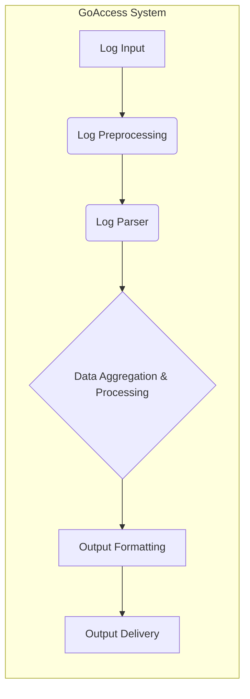
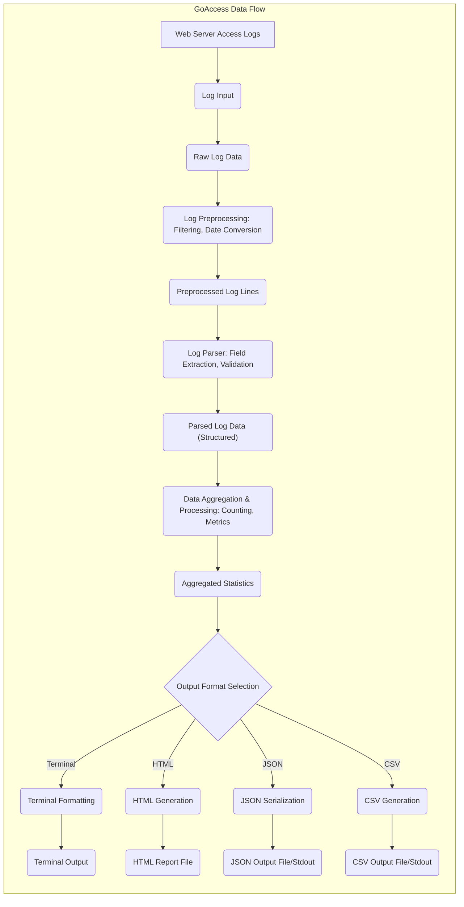

# Project Design Document: GoAccess - Real-time Web Log Analyzer

**Version:** 1.1
**Date:** October 26, 2023
**Author:** AI Software Architect

## 1. Introduction

This document provides an enhanced and detailed design overview of the GoAccess project, a real-time web log analyzer. This document aims to clearly articulate the system's architecture, components, data flow, and key considerations for security and deployment. This refined design will serve as a robust foundation for subsequent threat modeling activities.

## 2. Goals

* Provide a clear and comprehensive understanding of the GoAccess architecture, with increased granularity.
* Identify key components and their interactions, detailing sub-components where appropriate.
* Describe the data flow within the system with more precision, including data transformations.
* Highlight potential security considerations and attack surfaces with specific examples and mitigation suggestions.
* Outline different deployment scenarios, elaborating on their security implications.

## 3. Non-Goals

* Detailed code-level implementation specifics beyond architectural relevance.
* Performance benchmarking and optimization strategies unless directly impacting security.
* Specific user interface/experience design details beyond the fundamental output formats.
* In-depth analysis of highly specific or esoteric log formats beyond demonstrating general parsing principles.

## 4. Architecture Overview

GoAccess is a command-line tool that parses web server access logs and generates interactive HTML reports or outputs data to the terminal. It can process logs in various formats and provides real-time analysis capabilities. The architecture emphasizes modularity for input, processing, and output.

## 5. Component Details

This section details the key components of the GoAccess system and their functionalities, with added detail.

* **Log Input:**
    * **Description:** This component is the entry point for web server access log data into the GoAccess system.
    * **Functionality:**
        * **File Reading:** Reads log data from one or more files specified by the user via command-line arguments.
        * **Standard Input (stdin):** Accepts log data streamed through pipes from other processes.
        * **Compressed File Handling:**  Detects and decompresses supported compressed log files (e.g., gzip, bzip2).
        * **Log Format Detection:** Attempts to automatically detect the log format or uses the format specified by the user.
    * **Key Considerations for Threat Modeling:**
        * **Malicious Log Injection:**  If processing logs from untrusted sources, there's a risk of injecting crafted log entries to exploit vulnerabilities in subsequent components.
        * **Decompression Vulnerabilities:**  Vulnerabilities in the underlying decompression libraries could be exploited by providing specially crafted compressed files.
        * **Resource Exhaustion (Large Files):** Processing extremely large log files could lead to excessive memory consumption or disk I/O, causing denial of service.

* **Log Preprocessing:**
    * **Description:** This component performs initial transformations and filtering on the raw log data before parsing.
    * **Functionality:**
        * **Filtering:** Applies user-defined filters (e.g., exclude specific IP addresses, user agents, or URLs) to the log lines.
        * **Date/Time Conversion:** Standardizes date and time formats if necessary.
        * **Line Buffering:**  May buffer log lines for more efficient processing.
    * **Key Considerations for Threat Modeling:**
        * **Filter Bypass:**  Vulnerabilities in the filtering logic could allow malicious log entries to bypass filters and be processed.
        * **Regular Expression Vulnerabilities:** If filters are implemented using regular expressions, poorly written expressions could lead to ReDoS (Regular expression Denial of Service) attacks.

* **Log Parser:**
    * **Description:** This component is responsible for dissecting individual log lines into structured data.
    * **Functionality:**
        * **Format Interpretation:**  Interprets the log format string to identify and extract relevant fields.
        * **Field Extraction:** Extracts fields such as IP address, timestamp, request method, URL, status code, user agent, referrer, etc.
        * **Data Type Conversion:** Converts extracted fields into appropriate data types (e.g., string, integer, timestamp).
        * **Basic Validation:** Performs basic validation on extracted data (e.g., checking for valid IP address format).
    * **Key Considerations for Threat Modeling:**
        * **Parsing Logic Vulnerabilities:** Errors in the parsing logic could lead to incorrect data interpretation or crashes.
        * **Malformed Log Handling:**  Improper handling of malformed or unexpected log lines could lead to vulnerabilities.
        * **Buffer Overflows/Memory Safety:**  Potential for buffer overflows or other memory safety issues in the parsing implementation, especially when handling variable-length fields.

* **Data Aggregation & Processing:**
    * **Description:** This component aggregates the parsed log data and performs calculations to generate statistics.
    * **Functionality:**
        * **Counter Management:** Maintains counters for various metrics (e.g., total requests, unique visitors, hits per URL).
        * **Data Structures:** Uses in-memory data structures (e.g., hash maps, trees) to store and aggregate data.
        * **Statistical Calculations:** Calculates metrics like hit ratio, bandwidth usage, average response time, etc.
        * **Sorting and Ordering:**  Sorts aggregated data based on different criteria for output.
    * **Key Considerations for Threat Modeling:**
        * **Denial of Service (DoS):**  Crafted log entries could be designed to cause excessive memory consumption in the aggregation data structures, leading to DoS.
        * **Integer Overflow:**  Potential for integer overflows in counters or calculations if not handled carefully.
        * **Logic Errors:**  Errors in the aggregation logic could lead to inaccurate statistics, potentially masking malicious activity.

* **Output Formatting:**
    * **Description:** This component transforms the aggregated data into the desired output format.
    * **Functionality:**
        * **Terminal Formatting:**  Formats data for display in the terminal, including color coding and layout.
        * **HTML Generation:** Generates the HTML structure, CSS styles, and JavaScript code for the interactive report.
        * **JSON Serialization:** Serializes the aggregated data into JSON format.
        * **CSV Generation:** Formats the data into comma-separated values.
    * **Key Considerations for Threat Modeling:**
        * **Cross-Site Scripting (XSS):**  If generating HTML, failure to properly sanitize user-provided data (from log entries) before including it in the HTML can lead to XSS vulnerabilities.
        * **HTML Injection:**  Similar to XSS, but focuses on injecting arbitrary HTML elements.
        * **Information Disclosure:**  Including sensitive information in the output (e.g., internal IP addresses, error messages) without proper safeguards could lead to information disclosure.
        * **Terminal Injection:**  If directly printing unsanitized data to the terminal, there's a risk of terminal injection attacks.

* **Output Delivery:**
    * **Description:** This component handles the delivery of the formatted output to the user or a destination.
    * **Functionality:**
        * **Standard Output (stdout):** Writes terminal output, JSON, or CSV data to the standard output stream.
        * **File Writing:** Writes HTML, JSON, or CSV output to files specified by the user.
        * **Real-time HTML Updates (via file):**  Periodically updates the HTML report file for real-time viewing.
    * **Key Considerations for Threat Modeling:**
        * **Path Traversal:**  If the output file path is user-controlled, there's a risk of writing output to arbitrary locations on the file system.
        * **Information Disclosure (File Output):**  If output files are not properly secured with appropriate permissions, sensitive information could be exposed.
        * **Denial of Service (Disk Space):**  Repeatedly writing large output files could exhaust disk space.

## 6. Data Flow Diagram

This diagram illustrates the flow of data through the GoAccess system with more detail on transformations.

## 7. Security Overview

GoAccess, while primarily a command-line tool, requires careful consideration of security, especially when handling potentially untrusted log data or generating web-accessible reports.

* **Input Validation and Sanitization:**  Rigorous validation of log data at the input stage is paramount. This includes:
    * **Log Format Enforcement:** Strictly adhere to the expected log format and reject or sanitize deviations.
    * **Data Type Validation:** Ensure extracted fields conform to expected data types (e.g., IP addresses, timestamps).
    * **Length Limitations:** Impose limits on the length of log fields to prevent buffer overflows.
* **Output Encoding and Sanitization:** When generating HTML reports, comprehensive output encoding and sanitization are crucial to prevent XSS vulnerabilities. This includes:
    * **HTML Entity Encoding:** Encoding special characters (e.g., `<`, `>`, `&`, `"`, `'`) to their HTML entities.
    * **Attribute Encoding:** Properly encoding data within HTML attributes.
    * **JavaScript Context Escaping:**  Escaping data when embedding it within JavaScript code.
* **Dependency Management:** Regularly audit and update dependencies (ncurses, glib, GeoIP, libtokyocabinet) to patch known vulnerabilities. Utilize dependency management tools to track and manage versions.
* **Resource Management and Limits:** Implement safeguards to prevent resource exhaustion:
    * **Memory Limits:**  Set limits on the amount of memory GoAccess can consume.
    * **Processing Limits:**  Potentially limit the number of log entries processed or the time spent processing.
* **Permissions and Least Privilege:** When deploying GoAccess, adhere to the principle of least privilege:
    * **File System Permissions:** Ensure GoAccess runs with the minimum necessary permissions to read log files and write output files.
    * **User Privileges:** Avoid running GoAccess with elevated privileges (e.g., root) unless absolutely necessary.
* **Configuration Security:** Secure any configuration files used by GoAccess, protecting them from unauthorized access or modification.
* **Secure Deployment Practices:**
    * **HTML Report Security:** If serving HTML reports via a web server, implement strong authentication and authorization mechanisms. Ensure the web server is properly configured and secured.
    * **Log Source Security:**  If processing logs from remote sources, ensure secure transfer mechanisms (e.g., TLS/SSL) are used.

## 8. Deployment Considerations

The security implications of deploying GoAccess vary significantly depending on the chosen method.

* **Local Analysis (Command Line):**
    * **Security Considerations:** Primarily relies on the security of the local system and the permissions of the user running GoAccess. Ensure the user has appropriate read access to log files and write access to the desired output location. Protect the output files with appropriate permissions.
* **Centralized Log Analysis:**
    * **Security Considerations:** Introduces risks associated with log collection and storage. Secure the log collection pipeline (e.g., using secure protocols like rsyslog with TLS). Implement access controls on the central log storage. Secure the server where GoAccess is running. Consider the potential for sensitive data exposure in the centralized logs.
* **Real-time Analysis via Pipe:**
    * **Security Considerations:** The security of this method heavily depends on the security of the process piping the data to GoAccess. Ensure the piping process is not vulnerable to injection attacks or unauthorized access. Be cautious about piping data from untrusted sources.
* **Integration with Web Servers (for Real-time HTML Output):**
    * **Security Considerations:** This is the most security-sensitive deployment scenario.
        * **Authentication and Authorization:** Implement robust authentication (verifying user identity) and authorization (controlling access to resources) for the web server serving the HTML reports.
        * **HTTPS:**  Enforce HTTPS to encrypt communication between the client and the web server, protecting the report content from eavesdropping.
        * **Content Security Policy (CSP):**  Configure CSP headers to mitigate XSS attacks by controlling the sources from which the browser is allowed to load resources.
        * **Regular Security Audits:**  Conduct regular security audits of the web server and GoAccess configuration.
        * **Input Sanitization (Re-emphasized):**  Double-down on input sanitization as any unsanitized data will be directly rendered in a web browser.

## 9. Dependencies

GoAccess relies on external libraries, and their security is crucial.

* **ncurses:**  Potential vulnerabilities in the terminal handling library could be exploited if GoAccess processes malicious input intended for terminal rendering.
* **glib:** A widely used utility library; staying updated is essential to address any discovered vulnerabilities.
* **GeoIP (optional):** If used, ensure the GeoIP database is regularly updated and the library itself is patched against vulnerabilities.
* **libtokyocabinet (optional):** If used for on-disk persistence, ensure the library is secure and access to the persistent data is controlled.

Regularly review the security advisories for these dependencies and update them promptly. Consider using tools that automate dependency vulnerability scanning.

## 10. Future Considerations

* **Enhanced Security Features:**
    * **Sandboxing:** Explore sandboxing techniques to isolate GoAccess processes and limit their access to system resources.
    * **Improved Input Validation Libraries:** Integrate with robust input validation libraries to strengthen log data validation.
    * **Context-Aware Output Encoding:** Implement context-aware output encoding to further mitigate XSS risks in HTML reports.
* **Role-Based Access Control for HTML Reports (Detailed):** Implement a system where different users or roles have different levels of access to the information presented in the HTML reports.
* **Integration with Security Information and Event Management (SIEM) Systems:** Develop connectors or plugins to seamlessly integrate GoAccess output with SIEM platforms for centralized security monitoring and alerting. This could involve outputting data in formats readily consumed by SIEMs (e.g., syslog, CEF).
* **Anomaly Detection:** Explore incorporating basic anomaly detection capabilities to highlight unusual patterns in the log data that might indicate security threats.

This improved document provides a more granular and detailed design overview of the GoAccess project, with a strong focus on security considerations relevant for threat modeling. By understanding the intricacies of each component, the data flow, and the potential attack surfaces, developers and security professionals can better assess and mitigate risks associated with GoAccess deployments.