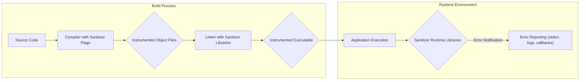
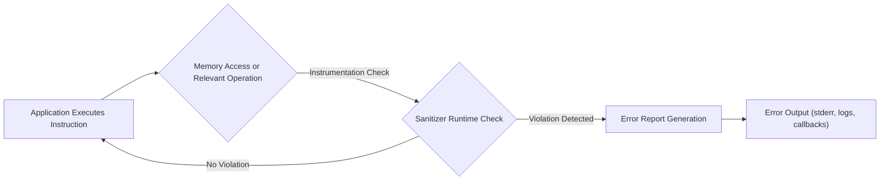

# Project Design Document: Google Sanitizers

**Version:** 1.1
**Date:** October 26, 2023
**Author:** Gemini (AI Language Model)

## 1. Introduction

This document provides an enhanced architectural design of the Google Sanitizers project, as found on GitHub ([https://github.com/google/sanitizers](https://github.com/google/sanitizers)). This revised document aims to offer a more detailed and refined understanding of the project's components, their interactions, and the overall system architecture, specifically tailored for subsequent threat modeling activities.

The Google Sanitizers project is a suite of powerful runtime instrumentation libraries. These libraries are designed to detect a wide range of software defects, with a strong emphasis on memory safety and concurrency issues, primarily within C/C++ and other languages. The core principle involves modifying the application's code during the build process to inject runtime checks, enabling the detection and reporting of errors as they occur.

## 2. Goals

The primary goals of the Google Sanitizers project are:

*   To provide highly effective and reliable runtime detection of critical memory errors, such as buffer overflows, use-after-free vulnerabilities, and memory leaks.
*   To identify instances of undefined behavior in C/C++ programs, which can lead to unpredictable and potentially exploitable outcomes.
*   To detect data races and other concurrency-related issues in multithreaded applications, ensuring thread safety.
*   To empower developers by providing them with immediate feedback on bugs during testing and development, facilitating early detection and resolution.
*   To minimize the performance impact introduced by the instrumentation, making the sanitizers practical for a wide range of testing scenarios.
*   To offer a modular and extensible architecture, allowing for the addition of new sanitizers to address emerging bug patterns.

## 3. Target Audience

This document is intended for a technical audience, including:

*   Security engineers responsible for performing threat modeling and security assessments of systems utilizing the Sanitizers.
*   Software architects and developers who need a comprehensive understanding of the Sanitizers' architecture for integration and debugging purposes.
*   Quality assurance engineers who leverage the Sanitizers as part of their testing strategies.

## 4. Scope

This design document focuses on the core architectural elements of the Google Sanitizers project, emphasizing aspects relevant for security analysis. The scope includes:

*   Detailed descriptions of the major sanitizers: AddressSanitizer (ASan), MemorySanitizer (MSan), UndefinedBehaviorSanitizer (UBSan), ThreadSanitizer (TSan), and LeakSanitizer (LSan).
*   An explanation of the runtime instrumentation mechanism and how it integrates with the target application.
*   A clear depiction of the interaction between the sanitizer libraries and the application under test during runtime.
*   A description of the error reporting mechanisms and the information they provide.

This document will not delve into the low-level implementation details of each sanitizer's algorithms or the specific compiler transformations involved in the instrumentation process.

## 5. High-Level Architecture

The Google Sanitizers operate through a process of instrumenting the target application's code during the compilation or linking phase. This instrumentation injects additional code that performs runtime checks on memory accesses, thread synchronization primitives, and other operations. When a violation is detected, the corresponding sanitizer library triggers an error report, providing valuable debugging information.

Key components in the architecture:

*   **Source Code:** The original source code of the application intended for testing and analysis.
*   **Compiler with Sanitizer Flags:** The compiler (e.g., Clang, GCC) invoked with specific flags (e.g., `-fsanitize=address`) to enable the desired sanitizers.
*   **Instrumented Object Files:** The output of the compilation process, containing the original code augmented with instrumentation instructions.
*   **Linker with Sanitizer Libraries:** The linker responsible for combining the instrumented object files and linking them with the appropriate sanitizer runtime libraries.
*   **Instrumented Executable:** The final executable file, which includes both the application's code and the sanitizer runtime libraries.
*   **Application Execution:** The runtime execution of the instrumented executable.
*   **Sanitizer Runtime Libraries:** The core shared libraries provided by the Sanitizers project. These libraries contain the logic for performing runtime checks and managing error reporting.
*   **Error Reporting:** The mechanism through which the sanitizers report detected errors. This typically involves printing messages to standard error, logging to files, or invoking user-defined callback functions.

## 6. Component Details

This section provides a more detailed description of the individual sanitizers:

*   **AddressSanitizer (ASan):**
    *   **Functionality:** Detects memory safety violations related to incorrect memory access.
    *   **Mechanism:** Employs "shadow memory," a separate memory region used to track the validity and accessibility of application memory. Instrumentation checks this shadow memory before each memory access.
    *   **Detectable Errors:** Heap buffer overflows, stack buffer overflows, use-after-free, use-after-return, double-free, and invalid free operations. It can also optionally detect memory leaks.

*   **MemorySanitizer (MSan):**
    *   **Functionality:** Detects reads of uninitialized memory.
    *   **Mechanism:** Tracks the initialization state of memory locations using bitmasks. Requires whole-program compilation for accurate tracking.
    *   **Detectable Errors:**  Reading from memory that has not been properly initialized.

*   **UndefinedBehaviorSanitizer (UBSan):**
    *   **Functionality:** Detects various forms of undefined behavior as defined by the C/C++ standards.
    *   **Mechanism:** Uses a combination of compile-time and runtime checks inserted at potentially problematic code locations.
    *   **Detectable Errors:** Integer overflows, division by zero, reaching the end of a non-void function without a return value, dereferencing null pointers, alignment violations, and more.

*   **ThreadSanitizer (TSan):**
    *   **Functionality:** Detects data races in multithreaded programs.
    *   **Mechanism:** Intercepts memory accesses and synchronization operations (e.g., mutex locks/unlocks, atomic operations). It analyzes the "happens-before" relationship between threads to identify potential race conditions.
    *   **Detectable Errors:** Data races where multiple threads access the same memory location without proper synchronization, and at least one access is a write.

*   **LeakSanitizer (LSan):**
    *   **Functionality:** Detects memory leaks.
    *   **Mechanism:**  Periodically scans the heap or performs a scan at program exit to identify memory blocks that are no longer reachable by the program.
    *   **Detectable Errors:** Memory that has been allocated but not freed by the program. Can be used independently or in conjunction with ASan.

## 7. Data Flow

The data flow within an application instrumented with the Sanitizers can be broken down as follows:

Detailed explanation of the data flow:

*   **Application Executes Instruction:** The instrumented application proceeds with its normal execution flow.
*   **Memory Access or Relevant Operation:** When the application performs an operation that is monitored by the enabled sanitizers (e.g., reading or writing to memory, acquiring a lock), the instrumentation code is triggered.
*   **Sanitizer Runtime Check:** The instrumentation code calls into the appropriate sanitizer runtime library. The sanitizer performs checks based on its specific logic (e.g., checking shadow memory in ASan, tracking initialization in MSan).
*   **Violation Detected:** If the sanitizer detects a violation of memory safety, undefined behavior, or a data race, it proceeds to generate an error report.
*   **No Violation:** If no violation is detected, the application's execution continues normally.
*   **Error Report Generation:** The sanitizer generates a detailed error report, typically including the type of error, the memory address involved (if applicable), the thread ID, and the source code location where the error occurred (if debug information is available).
*   **Error Output:** The generated error report is outputted through the configured reporting mechanism, which can be standard error, log files, or user-defined callback functions.

## 8. Deployment

The Google Sanitizers are integrated into the software development workflow primarily through compiler and linker flags.

*   **Compilation Phase:**  Compiler flags such as `-fsanitize=address`, `-fsanitize=memory`, `-fsanitize=undefined`, and `-fsanitize=thread` are used to instruct the compiler to insert the necessary instrumentation code into the generated object files. Multiple sanitizers can often be enabled simultaneously.
*   **Linking Phase:** The linker automatically includes the corresponding sanitizer runtime libraries when the appropriate compiler flags are used. Alternatively, the libraries can be linked explicitly.

The sanitizers can be enabled or disabled at the build level, allowing developers to selectively apply them during testing or development. Environment variables can also be used to configure the behavior of the sanitizers at runtime (e.g., suppressing specific error reports, controlling memory usage).

## 9. Security Considerations

The Google Sanitizers, while primarily focused on bug detection, have significant implications for security:

*   **Early Vulnerability Detection:** By identifying memory safety issues and undefined behavior early in the development cycle, the Sanitizers help prevent these flaws from becoming exploitable vulnerabilities in production software.
*   **Reduced Attack Surface:**  Addressing the bugs detected by Sanitizers reduces the potential attack surface of the application.
*   **Information Disclosure in Error Reports:** Error reports, while helpful for debugging, can potentially leak sensitive information about the application's internal state, memory layout, and code paths. This is a concern if error reports are not properly secured or if an attacker can trigger specific errors to gain information.
*   **Performance Overhead in Production:** While generally not recommended for production due to performance overhead, if Sanitizers are inadvertently left enabled or used in a production environment, the performance impact could be exploited for denial-of-service attacks.
*   **Bypass Techniques:**  Sophisticated attackers might attempt to develop techniques to bypass the sanitizer instrumentation or exploit vulnerabilities in the sanitizer libraries themselves (though this is less common due to the project's maturity and scrutiny).
*   **Resource Consumption:**  The instrumentation and runtime checks performed by the Sanitizers consume additional CPU and memory resources. In resource-constrained environments, this could be a concern.
*   **False Positives/Negatives:** While generally accurate, Sanitizers might occasionally produce false positive error reports or, in rare cases, fail to detect certain types of bugs (false negatives). Understanding the limitations of each sanitizer is crucial.

## 10. Assumptions and Constraints

The following assumptions and constraints are relevant to this design document:

*   It is assumed that the reader possesses a working knowledge of software development principles, particularly in C/C++.
*   This document primarily focuses on the core sanitizers provided by the Google Sanitizers project. Experimental or less widely used sanitizers are not covered in detail.
*   The document assumes the use of standard, supported compilers (e.g., Clang, GCC) that have built-in support for the Sanitizers.
*   The performance overhead introduced by the sanitizers is acknowledged as a trade-off for increased bug detection capabilities. Detailed performance analysis is outside the scope of this document.
*   The document assumes that the sanitizers are used in controlled testing and development environments, and that the implications of enabling them in production are understood.

## 11. Future Considerations

Potential future enhancements and considerations for the Google Sanitizers project include:

*   **Further Performance Optimization:** Continuous efforts to reduce the runtime overhead of the instrumentation, making them more suitable for broader use cases.
*   **Improved Error Reporting and Diagnostics:** Providing richer and more context-aware error reports to aid in faster debugging.
*   **Broader Language Support:** Expanding the availability of sanitizers to other programming languages beyond C/C++.
*   **Enhanced Integration with Development Tools:** Deeper integration with IDEs, debuggers, and CI/CD pipelines for a more seamless development experience.
*   **Customizable Sanitizer Policies:** Allowing developers to define custom rules and thresholds for sanitizer checks, tailoring them to specific project needs.
*   **Static Analysis Integration:** Exploring tighter integration with static analysis tools to provide a more comprehensive bug detection strategy.

This enhanced design document provides a more detailed and nuanced understanding of the Google Sanitizers project's architecture, specifically focusing on aspects relevant for security analysis and threat modeling. The information presented here serves as a solid foundation for identifying potential security risks and vulnerabilities associated with the project and its application.
