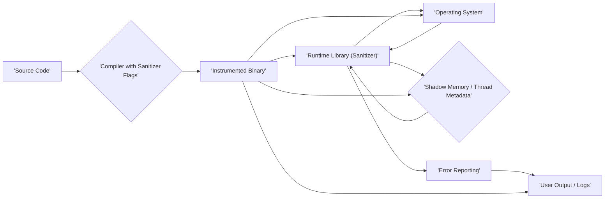

## Project Design Document: Google Sanitizers - Improved

**1. Introduction**

This document provides a detailed design overview of the Google Sanitizers project, focusing on its architecture, components, and data flow. This document is intended to serve as a foundation for subsequent threat modeling activities.

**1.1. Purpose**

The purpose of this document is to provide a comprehensive and precise understanding of the Google Sanitizers project's design and functionality. This detailed understanding is crucial for effectively identifying potential security vulnerabilities and developing appropriate mitigation strategies during the threat modeling process.

**1.2. Scope**

This document covers the core functionalities of the primary sanitizers within the project, including:

*   AddressSanitizer (ASan): Focusing on memory safety error detection.
*   MemorySanitizer (MSan): Focusing on uninitialized memory usage detection.
*   UndefinedBehaviorSanitizer (UBSan): Focusing on detecting violations of the C/C++ language standard.
*   ThreadSanitizer (TSan): Focusing on data race detection in multithreaded applications.
*   LeakSanitizer (LSan): Focusing on memory leak detection.

While the project may contain other tools, utilities, and configurations, this document primarily focuses on the runtime error detection mechanisms provided by these core sanitizers and their interaction with the target application and the operating system.

**1.3. Goals**

The primary goals of this document are to:

*   Clearly and precisely describe the architecture and individual components of the Google Sanitizers project.
*   Illustrate the data flow and interactions between these components with sufficient detail.
*   Provide a robust foundation of information to facilitate effective and targeted threat modeling.
*   Serve as a reliable reference point for security analysis, design discussions, and future development considerations.

**1.4. Threat Model Scope**

The subsequent threat modeling exercise, based on this document, will primarily focus on:

*   Potential vulnerabilities introduced by the sanitizer instrumentation process.
*   Security weaknesses within the sanitizer runtime libraries themselves.
*   The potential for information leakage through sanitizer error reporting.
*   The possibility of malicious applications bypassing or interfering with sanitizer checks.
*   The security implications of the sanitizer's interactions with the operating system.

**2. Overview**

Google Sanitizers is a sophisticated suite of runtime error detectors specifically designed for C/C++. These sanitizers operate by augmenting the standard compilation and linking process to inject specialized instrumentation code directly into the target application's binary. This injected code actively monitors the application's execution at runtime, meticulously detecting a wide range of memory safety and concurrency errors that might otherwise go unnoticed. When a potential error is detected, the sanitizer typically generates a detailed report, providing valuable information about the location in the code and the specific nature of the error.

The fundamental principle underpinning the sanitizers is a deliberate trade-off: accepting a degree of performance overhead during execution in exchange for significantly enhanced reliability and security. This proactive error detection early in the development lifecycle helps prevent subtle bugs from becoming critical vulnerabilities in production.

**3. Components**

The Google Sanitizers project can be broken down into the following key components, each with specific responsibilities:

*   **Compiler Integration:** This critical component involves modifications and extensions to the compiler infrastructure (primarily Clang or GCC) to seamlessly enable the sanitizers. This integration includes:
    *   **Command-line Flags:** Specific compiler flags (e.g., `-fsanitize=address`, `-fsanitize=memory`) that instruct the compiler to enable the desired sanitizers.
    *   **Compiler Intrinsics and Built-in Functions:** Special functions and instructions recognized by the compiler that are used by the sanitizer runtime for low-level operations and data access.
    *   **Code Generation Changes:** Modifications to the compiler's code generation pipeline to insert the necessary instrumentation code at appropriate points in the compiled binary. This instrumentation performs checks and interacts with the runtime library.
*   **Runtime Library:** Each individual sanitizer (ASan, MSan, UBSan, TSan, LSan) has a dedicated runtime library that is dynamically linked with the instrumented application at runtime. This library contains the core logic and data structures for:
    *   **Memory Management Interception (ASan, MSan):** Overriding standard memory allocation and deallocation functions (e.g., `malloc`, `free`, `new`, `delete`) to track memory usage and detect errors.
    *   **Shadow Memory Management (ASan, MSan):** Managing a separate region of memory (shadow memory) used to store metadata about the state of application memory (e.g., allocated, freed, poisoned, initialized).
    *   **Thread Management Interception (TSan):** Intercepting thread creation, termination, and synchronization primitives (e.g., mutexes, condition variables) to monitor thread interactions.
    *   **Undefined Behavior Detection Logic (UBSan):** Implementing checks for various forms of undefined behavior as defined by the C/C++ standard, such as integer overflows, division by zero, and out-of-bounds array accesses.
    *   **Leak Detection Logic (LSan):** Tracking memory allocations and identifying memory blocks that are no longer reachable when the program exits.
    *   **Error Reporting Mechanisms:** Formatting and outputting detailed error reports when a sanitizer detects an issue. These reports typically include the type of error, the memory address involved (if applicable), and the source code location where the error occurred.
*   **Shadow Memory (ASan, MSan):** This is a distinct and crucial region of memory, separate from the application's regular memory space. It is exclusively used by ASan and MSan to maintain metadata about the state of each byte of the application's memory. Each byte of application memory typically has corresponding "shadow" bytes that store information such as:
    *   Whether the memory is currently allocated or freed.
    *   The boundaries of allocated memory regions.
    *   Whether the memory has been initialized (for MSan).
*   **Thread Metadata (TSan):** TSan maintains internal metadata structures to track the history of memory accesses performed by different threads. This metadata is used to determine the "happens-before" relationship between memory accesses and detect potential data races. This includes information about:
    *   Thread creation and termination events.
    *   Acquisition and release of locks and other synchronization primitives.
    *   Memory access timestamps and thread identifiers.
*   **Operating System Interaction:** The sanitizers rely on interactions with the underlying operating system for several essential functions:
    *   **Memory Allocation and Deallocation Interception:**  Hooking into the OS's memory management functions to gain control over memory operations.
    *   **Thread Creation and Synchronization Interception:**  Using OS-specific APIs to intercept thread-related events.
    *   **Signal Handling:** Registering signal handlers to intercept signals that might indicate errors (e.g., segmentation faults).
    *   **Accessing System Information:** Querying the OS for information about memory maps, thread states, and other relevant system details.
*   **User Application:** This is the target C/C++ application whose code is being compiled and executed with the sanitizers enabled. The sanitizers' instrumentation is directly embedded within this application's binary.

**4. Data Flow**

The following diagram illustrates the general data flow when using Google Sanitizers:

Detailed data flow for specific sanitizers:

*   **AddressSanitizer (ASan):**
    *   During compilation, the compiler inserts instrumentation code before and after instructions that access memory (read or write).
    *   At runtime, when the instrumented application attempts to access a memory location, the inserted code checks the corresponding shadow memory.
    *   The shadow memory check determines if the memory access is valid (e.g., within allocated bounds, not a use-after-free, not a double-free).
    *   If an invalid memory access is detected, the ASan runtime library generates a detailed error report, including the type of error and the memory address.
*   **MemorySanitizer (MSan):**
    *   MSan tracks the initialization status of memory locations. Instrumentation is added to propagate the "uninitialized" status through operations.
    *   When an uninitialized value is used in a way that could influence program output (e.g., as a function argument, in a conditional statement), MSan reports an error.
    *   The runtime library maintains information about which memory locations have been initialized.
*   **UndefinedBehaviorSanitizer (UBSan):**
    *   UBSan inserts checks for various forms of undefined behavior as defined by the C/C++ standard.
    *   At runtime, these checks are executed. For example, a check for integer overflow might be inserted before an arithmetic operation.
    *   If undefined behavior is detected, the UBSan runtime library generates an error report indicating the type of undefined behavior and the location in the code.
*   **ThreadSanitizer (TSan):**
    *   TSan intercepts thread creation, synchronization operations (like mutex locks and unlocks), and memory accesses.
    *   It uses the "happens-before" relationship to detect data races. TSan maintains metadata about when and how memory locations are accessed by different threads.
    *   If TSan detects concurrent access to the same memory location by multiple threads without proper synchronization, it reports a data race, including information about the involved threads and memory locations.
*   **LeakSanitizer (LSan):**
    *   LSan tracks all memory allocations performed by the application (through intercepted `malloc`, `new`, etc.).
    *   At the end of the program's execution (or when explicitly triggered), LSan performs a garbage collection-like process to identify allocated memory blocks that are no longer reachable from any global variables or the stack.
    *   Any unreachable allocated memory is considered a memory leak, and LSan reports the allocation sites of these leaked blocks.

**5. Interactions**

The key interactions within the Google Sanitizers ecosystem include:

1. **Compiler and User Code:** The compiler, guided by specific sanitizer flags provided during compilation, directly modifies the user's original source code by inserting instrumentation instructions. This instrumentation is tailored to the specific sanitizer being used.
2. **Compiler and Runtime Library:** The compiler ensures that the appropriate sanitizer runtime library (e.g., `libclang_rt.asan-*.so`, `libclang_rt.tsan-*.so`) is linked with the instrumented application during the linking phase. This allows the instrumented code to call functions and access data structures provided by the runtime library.
3. **Instrumented Application and Runtime Library:** The instrumentation code embedded within the application's binary directly calls functions and utilizes data structures provided by the linked sanitizer runtime library. This interaction is the core mechanism for performing error detection at runtime. For example, instrumented memory access instructions will call runtime library functions to check shadow memory.
4. **Runtime Library and Operating System:** The runtime library interacts extensively with the underlying operating system. This includes intercepting system calls related to memory management (e.g., `mmap`, `munmap`), thread management (e.g., `pthread_create`, `pthread_mutex_lock`), and signal handling (`sigaction`).
5. **Runtime Library and Shadow Memory / Thread Metadata:** The runtime libraries for ASan and MSan are responsible for managing and accessing the dedicated shadow memory region. They write metadata to the shadow memory to track the state of application memory and read from it to perform checks. Similarly, TSan's runtime library manages and accesses its internal thread metadata structures.
6. **Runtime Library and User Output:** When a sanitizer detects an error, the runtime library formats a detailed error report. This report is typically outputted to the standard error stream (`stderr`), providing information to the user or developer about the detected issue.

**6. Security Considerations (Detailed for Threat Modeling)**

This section outlines potential security considerations that should be thoroughly explored during the threat modeling process:

*   **Compiler Vulnerabilities Exploited Through Instrumentation:**
    *   **Threat:** A vulnerability in the compiler's instrumentation logic could be exploited to inject malicious code into the compiled binary.
    *   **Example:** A flaw in the code generation for ASan instrumentation could allow an attacker to overwrite arbitrary memory locations when the instrumented code is executed.
*   **Runtime Library Vulnerabilities:**
    *   **Threat:** Vulnerabilities within the sanitizer runtime libraries themselves could be exploited by a malicious application.
    *   **Example:** A buffer overflow in the ASan runtime's error reporting function could be triggered by a carefully crafted memory error in the target application, allowing an attacker to gain control.
*   **Information Leakage Through Error Reports:**
    *   **Threat:** Error reports generated by the sanitizers might inadvertently reveal sensitive information about the application's internal state or memory layout.
    *   **Example:** ASan's error reports include memory addresses. If Address Space Layout Randomization (ASLR) is not properly implemented or if the information is too detailed, it could aid an attacker in bypassing memory protection mechanisms.
*   **Performance Impact as a Denial-of-Service Vector:**
    *   **Threat:** A malicious actor could intentionally trigger scenarios that cause excessive overhead due to sanitizer instrumentation, leading to a denial-of-service.
    *   **Example:** Repeatedly allocating and freeing large amounts of memory in a tight loop with ASan enabled could significantly slow down the application.
*   **Bypassing Sanitizer Checks:**
    *   **Threat:** Attackers might find ways to craft input or manipulate the application's state to bypass the sanitizer's checks and trigger errors without being detected.
    *   **Example:**  Exploiting subtle differences in how memory is managed by the application versus how it's tracked by ASan could allow for use-after-free vulnerabilities to go undetected.
*   **Dependencies and Third-Party Library Interactions:**
    *   **Threat:** Vulnerabilities in third-party libraries used by the application could interact unexpectedly with the sanitizers, potentially leading to bypasses or crashes.
    *   **Example:** A third-party library might perform memory management operations in a way that is not fully understood or correctly handled by ASan, leading to false negatives or crashes in the sanitizer.
*   **Signal Handling Interference:**
    *   **Threat:** A malicious application could interfere with the signal handlers used by the sanitizers to prevent error detection.
    *   **Example:** The application could register its own signal handler for `SIGSEGV`, preventing ASan's handler from being invoked when a segmentation fault occurs due to a memory error.
*   **Shadow Memory Security (ASan, MSan):**
    *   **Threat:** If the shadow memory is not properly protected, a malicious application could potentially gain access to or manipulate it, undermining the sanitizer's effectiveness.
    *   **Example:** A memory corruption vulnerability in the application could be exploited to overwrite shadow memory, causing ASan to report incorrect information or miss actual errors.
*   **Thread Metadata Security (TSan):**
    *   **Threat:** If the thread metadata maintained by TSan is not properly protected, a malicious thread could potentially manipulate it, leading to incorrect data race detection or missed vulnerabilities.

**7. Deployment Considerations**

Google Sanitizers are primarily intended for use during the development and testing phases of the software lifecycle. Their integration typically occurs within:

*   **Local Development Environments:** Developers enable sanitizers during local builds and testing to proactively identify and fix errors early in the development process. This often involves using compiler flags directly in their build systems or IDE configurations.
*   **Continuous Integration (CI) Systems:** Sanitizers are frequently integrated into CI pipelines to automatically detect errors in code changes as they are introduced. This ensures that new bugs are caught before they reach later stages of development. CI systems often use build scripts or configuration files to enable sanitizers.
*   **Fuzzing:** Sanitizers are a crucial component of effective fuzzing. When used with fuzzing tools, they allow for the detection of crashes and errors caused by unexpected or malformed inputs generated by the fuzzer. The sanitizer provides detailed information about the cause of the crash.

While generally not recommended for production environments due to the inherent performance overhead, there might be specific, carefully considered scenarios where certain sanitizers (or lightweight, optimized versions) could be used for limited production debugging or monitoring purposes. However, this is typically an exception rather than the rule.

**8. Future Considerations**

*   Ongoing monitoring of the Google Sanitizers project for updates and changes that might impact the security considerations outlined in this document.
*   Further in-depth analysis of the security implications of specific sanitizer implementations and their interactions with different operating systems and architectures.
*   Investigation into potential mitigation strategies for the identified security concerns, such as sandboxing the sanitizer runtime or implementing stricter access controls for shadow memory.
*   Exploration of the security implications of combining multiple sanitizers during the same execution.
*   Regular review and updates to this document to reflect the evolving landscape of the Google Sanitizers project and emerging security threats.