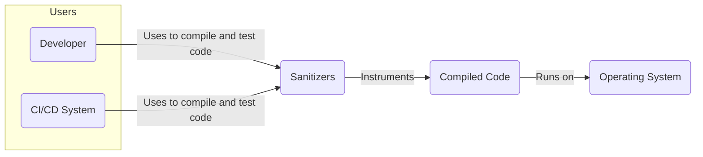
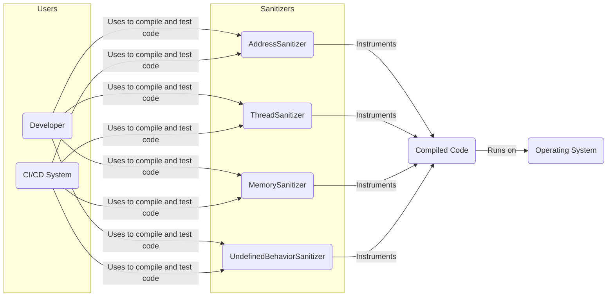
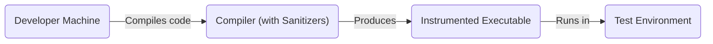
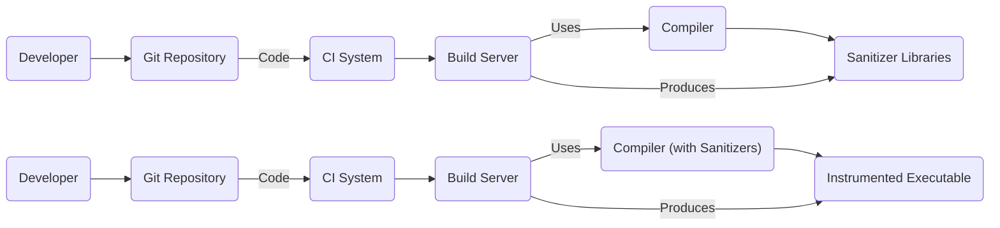

Okay, let's create a design document for the Google Sanitizers project, keeping in mind its purpose and potential users.

# BUSINESS POSTURE

The Google Sanitizers project is an open-source collection of dynamic analysis tools.  The primary business goal is to improve the security and reliability of software, particularly C/C++ code, by providing developers with tools to detect common programming errors at runtime.  These errors often lead to vulnerabilities or crashes.  The project is likely aimed at both internal Google developers and the broader software development community.  The project's success is measured by its adoption and its effectiveness in finding real-world bugs.

Business Priorities:

*   Improve software quality (reduce bugs and crashes).
*   Enhance software security (reduce vulnerabilities).
*   Promote secure coding practices.
*   Support a wide range of platforms and compilers.
*   Maintain high performance (minimal runtime overhead).
*   Provide clear and actionable diagnostic information.
*   Foster community contributions and engagement.

Business Goals:

*   Become a standard toolset for C/C++ developers.
*   Integrate into continuous integration/continuous delivery (CI/CD) pipelines.
*   Reduce the cost of finding and fixing bugs.
*   Prevent security vulnerabilities from reaching production.

Most Important Business Risks:

*   False positives: The sanitizers report errors that are not actually problems, wasting developer time and potentially leading to distrust of the tools.
*   Performance overhead: The sanitizers significantly slow down the execution of the code, making them impractical for use in some scenarios.
*   Limited platform support: The sanitizers do not work on all platforms or with all compilers, limiting their applicability.
*   Missed bugs: The sanitizers fail to detect certain types of errors, leading to a false sense of security.
*   Complexity: The sanitizers are difficult to use or understand, hindering adoption.
*   Lack of community adoption: If the broader development community doesn't adopt the tools, their impact will be limited.

# SECURITY POSTURE

The sanitizers themselves are not network-facing services, so traditional network security controls are less relevant. The primary security concerns relate to the integrity of the sanitizers themselves and the secure development practices used in their creation.

Existing Security Controls:

*   security control: Code reviews: All code changes are reviewed by other developers before being merged. (Implicit in the open-source nature and Google's development practices).
*   security control: Static analysis: Static analysis tools are likely used to identify potential bugs and vulnerabilities before runtime. (Common practice in Google's development workflow).
*   security control: Fuzzing: Fuzzing is likely used to test the sanitizers themselves and the instrumented code. (Common practice for security-critical tools).
*   security control: Open-source model: The open-source nature of the project allows for community scrutiny and contributions, potentially leading to faster identification and resolution of security issues.

Accepted Risks:

*   accepted risk: Runtime overhead: Sanitizers inherently add some runtime overhead, which is accepted as a trade-off for improved error detection.
*   accepted risk: Potential for false positives: While efforts are made to minimize false positives, they are an accepted risk of dynamic analysis tools.
*   accepted risk: Limited scope of detection: Sanitizers are designed to detect specific classes of errors, and other types of errors may go undetected.

Recommended Security Controls:

*   security control: Supply chain security: Implement measures to ensure the integrity of dependencies and build tools. This could include using signed packages, verifying checksums, and scanning for known vulnerabilities in dependencies.
*   security control: Hardening build process: Use compiler flags and build options that enhance security, such as stack canaries, address space layout randomization (ASLR), and data execution prevention (DEP).
*   security control: Regular security audits: Conduct regular security audits of the sanitizer codebase to identify potential vulnerabilities.

Security Requirements:

*   Authentication: Not directly applicable, as the sanitizers are tools, not services.
*   Authorization: Not directly applicable.
*   Input Validation: The sanitizers themselves take compiled code as input. The integrity of this input (the compiled code) is crucial. While the sanitizers don't perform traditional input validation, they *detect* the consequences of invalid input in the *target* code (e.g., buffer overflows).
*   Cryptography: Not directly used by the core sanitizers. However, if the sanitizers are integrated into a system that uses cryptography, they should not interfere with its correct operation.
*   Error Handling: Sanitizers should handle errors gracefully, providing clear and informative error messages without crashing.
*   Logging: Sanitizers should log detected errors in a way that is easy to understand and use for debugging.

# DESIGN

The Google Sanitizers project is a collection of dynamic analysis tools that are integrated into the compilation process. They work by instrumenting the code being compiled, adding extra checks that are executed at runtime.

## C4 CONTEXT

Context Diagram Element Descriptions:

*   Element:
    *   Name: Developer
    *   Type: Person
    *   Description: A software developer who writes and tests code.
    *   Responsibilities: Writing code, compiling code with sanitizers, running tests, analyzing sanitizer reports.
    *   Security controls: Code reviews, secure coding practices.

*   Element:
    *   Name: CI/CD System
    *   Type: System
    *   Description: A continuous integration/continuous delivery system that automatically builds and tests code.
    *   Responsibilities: Building code, running tests, reporting results.
    *   Security controls: Access controls, build process hardening, vulnerability scanning.

*   Element:
    *   Name: Sanitizers
    *   Type: System
    *   Description: The collection of Google Sanitizers (ASan, TSan, MSan, UBSan).
    *   Responsibilities: Instrumenting code, detecting runtime errors, reporting errors.
    *   Security controls: Code reviews, static analysis, fuzzing, supply chain security.

*   Element:
    *   Name: Compiled Code
    *   Type: System
    *   Description: The code being compiled and tested, instrumented by the sanitizers.
    *   Responsibilities: Executing the application logic.
    *   Security controls: Dependent on the code itself, but enhanced by the sanitizers.

*   Element:
    *   Name: Operating System
    *   Type: System
    *   Description: The operating system on which the compiled code runs.
    *   Responsibilities: Providing the runtime environment for the compiled code.
    *   Security controls: OS-level security features (ASLR, DEP, etc.).

## C4 CONTAINER

In this case, the container diagram is very similar to the context diagram, as the "containers" are essentially the different sanitizers themselves.

Container Diagram Element Descriptions:

*   Element:
    *   Name: Developer
    *   Type: Person
    *   Description: A software developer.
    *   Responsibilities: Writing, compiling, and testing code.
    *   Security controls: Code reviews, secure coding practices.

*   Element:
    *   Name: CI/CD System
    *   Type: System
    *   Description: Automated build and test system.
    *   Responsibilities: Building and testing code.
    *   Security controls: Access controls, build process hardening.

*   Element:
    *   Name: AddressSanitizer (ASan)
    *   Type: Container
    *   Description: Detects memory errors like use-after-free and buffer overflows.
    *   Responsibilities: Instrumenting memory access, detecting errors.
    *   Security controls: Code reviews, fuzzing.

*   Element:
    *   Name: ThreadSanitizer (TSan)
    *   Type: Container
    *   Description: Detects data races in multithreaded code.
    *   Responsibilities: Instrumenting thread operations, detecting races.
    *   Security controls: Code reviews, fuzzing.

*   Element:
    *   Name: MemorySanitizer (MSan)
    *   Type: Container
    *   Description: Detects use of uninitialized memory.
    *   Responsibilities: Tracking memory initialization, detecting errors.
    *   Security controls: Code reviews, fuzzing.

*   Element:
    *   Name: UndefinedBehaviorSanitizer (UBSan)
    *   Type: Container
    *   Description: Detects undefined behavior like integer overflows and null pointer dereferences.
    *   Responsibilities: Instrumenting code, detecting undefined behavior.
    *   Security controls: Code reviews, fuzzing.

*   Element:
    *   Name: Compiled Code
    *   Type: System
    *   Description: The instrumented code.
    *   Responsibilities: Executing application logic.
    *   Security controls: Enhanced by sanitizers.

*   Element:
    *   Name: Operating System
    *   Type: System
    *   Description: The OS.
    *   Responsibilities: Providing runtime environment.
    *   Security controls: OS-level security features.

## DEPLOYMENT

The sanitizers are typically integrated into the build process and do not have a separate "deployment" in the traditional sense. However, the *instrumented* code produced by the sanitizers can be deployed in various ways.

Possible Deployment Solutions:

1.  Development/Testing Environment: The instrumented code is run locally by developers or on testing servers.
2.  Staging Environment: The instrumented code is deployed to a staging environment for further testing.
3.  Production (with limitations): In some cases, instrumented code (particularly with UBSan) might be deployed to production with reduced sampling rate to catch rare errors. This carries a performance risk.
4.  Canary Deployment: Instrumented code can be deployed to small subset of production servers.

Chosen Deployment Solution (Development/Testing Environment):

Deployment Diagram Element Descriptions:

*   Element:
    *   Name: Developer Machine
    *   Type: Node
    *   Description: The developer's workstation.
    *   Responsibilities: Running the compiler, running tests.
    *   Security controls: Local security policies, access controls.

*   Element:
    *   Name: Compiler (with Sanitizers)
    *   Type: Node
    *   Description: The compiler (e.g., Clang, GCC) with the sanitizers integrated.
    *   Responsibilities: Compiling code, instrumenting code.
    *   Security controls: Compiler security flags, build process hardening.

*   Element:
    *   Name: Instrumented Executable
    *   Type: Artifact
    *   Description: The compiled code with sanitizer instrumentation.
    *   Responsibilities: Executing the application logic and runtime checks.
    *   Security controls: Inherited from the sanitizers and compiler.

*   Element:
    *   Name: Test Environment
    *   Type: Node
    *   Description: The environment where the instrumented code is executed (e.g., local machine, test server).
    *   Responsibilities: Providing the runtime environment for testing.
    *   Security controls: OS-level security, network security (if applicable).

## BUILD

The build process for the sanitizers themselves is crucial for their integrity. The build process for code *using* the sanitizers is also important.

Build Process Description:

1.  Developer commits code to the Git repository.
2.  The CI system (e.g., GitHub Actions, Jenkins) triggers a build.
3.  The build server checks out the code.
4.  The build server uses the compiler (with sanitizer integration) to compile the code.
5.  The compiler produces the sanitizer libraries (for the sanitizers themselves) or the instrumented executable (for code using the sanitizers).
6.  Tests are run (for both the sanitizers and the instrumented code).
7.  Build artifacts (libraries or executables) are stored.

Security Controls in Build Process:

*   security control: Code reviews: All code changes are reviewed before merging.
*   security control: Static analysis: Static analysis tools are run as part of the build process.
*   security control: Dependency management: Dependencies are carefully managed and scanned for vulnerabilities.
*   security control: Build automation: The build process is automated to ensure consistency and repeatability.
*   security control: Signed builds: Build artifacts can be digitally signed to ensure their integrity.
*   security control: Reproducible builds: The build process should be reproducible, meaning that the same source code should always produce the same build artifacts.

# RISK ASSESSMENT

Critical Business Processes:

*   Software development: The sanitizers are directly involved in the software development process.
*   Testing: The sanitizers are a key part of the testing process.
*   Security vulnerability detection: The sanitizers are designed to find security vulnerabilities.

Data to Protect:

*   Source code: The source code of the software being tested is sensitive.
*   Test results: Test results may reveal information about vulnerabilities.
*   Sanitizer reports: Sanitizer reports contain detailed information about detected errors, which could be exploited by attackers if they were to fall into the wrong hands.

Data Sensitivity:

*   Source code: High sensitivity, as it represents the intellectual property of the organization.
*   Test results: Medium to high sensitivity, depending on the nature of the vulnerabilities found.
*   Sanitizer reports: High sensitivity, as they provide a roadmap for exploiting vulnerabilities.

# QUESTIONS & ASSUMPTIONS

Questions:

*   What specific CI/CD systems are used or intended to be used with the sanitizers?
*   What are the specific performance requirements and constraints for code instrumented with the sanitizers?
*   Are there any specific compliance requirements (e.g., GDPR, HIPAA) that need to be considered?
*   What is the process for handling reported vulnerabilities in the sanitizers themselves?
*   What level of support is provided for different platforms and compilers?

Assumptions:

*   BUSINESS POSTURE: The primary goal is to improve software quality and security, both internally at Google and for the broader community.
*   SECURITY POSTURE: Google's internal development practices include strong security measures. The open-source nature of the project encourages community contributions and scrutiny.
*   DESIGN: The sanitizers are integrated into the compilation process and do not have a separate deployment. The primary users are developers and CI/CD systems. The build process is automated and includes security checks.