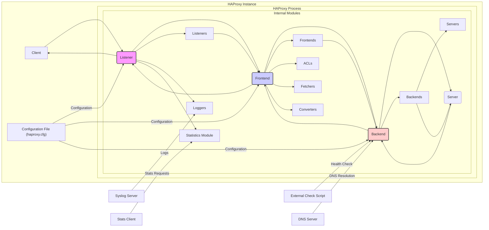
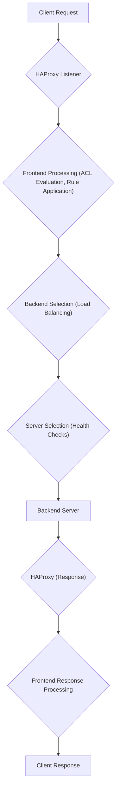

## Project Design Document: HAProxy (Improved)

**1. Introduction**

This document provides a detailed design overview of the HAProxy software, a widely adopted open-source load balancer and proxy server. It is specifically crafted to serve as a foundation for subsequent threat modeling exercises, offering a comprehensive understanding of HAProxy's architecture, components, and data flow to facilitate the identification of potential security vulnerabilities and attack vectors.

**2. Project Overview**

HAProxy (High Availability Proxy) is a high-performance and reliable solution providing load balancing, reverse proxying, and high availability for TCP and HTTP-based applications. It distributes network traffic across multiple backend servers, enhancing application performance, resilience, and scalability. Key functionalities include:

*   Intelligent load balancing across various backend servers.
*   High availability through robust health checks and automatic failover.
*   Secure SSL/TLS termination and offloading.
*   Flexible request routing and manipulation based on diverse criteria (e.g., HTTP headers, cookies, URL paths).
*   Efficient connection management and optimization techniques.
*   Detailed observability through comprehensive logging and real-time statistics.

**3. System Architecture**

HAProxy operates as a single, multi-threaded process managing incoming connections and their distribution to backend servers. The architecture comprises the following core components:

*   **Client:** The initiator of a network connection destined for the services proxied by HAProxy. This can be a web browser, a mobile application, another server, or any network-enabled device.
*   **HAProxy Process:** The central process responsible for all traffic handling. It internally organizes functionality into distinct modules:
    *   **Listeners:** Define the network interfaces (IP addresses) and ports on which HAProxy accepts incoming client connections. Each listener is associated with a specific protocol (TCP or HTTP/S).
    *   **Frontends:** Configure how incoming requests are processed. They define Access Control Lists (ACLs), request processing rules (e.g., redirects, header manipulation), and the selection of appropriate backends. Frontends act as the entry point for client requests.
    *   **Backends:** Represent groups of one or more backend servers that will receive forwarded requests. Backends specify load balancing algorithms, health check configurations, connection settings, and server-specific parameters.
    *   **Servers:** Individual backend servers within a defined backend. Each server is identified by its network address (IP and port) and associated attributes like weight, health check status, and administrative state.
    *   **ACLs (Access Control Lists):**  A set of rules used to match specific conditions within incoming requests or connection attributes (e.g., source IP, HTTP headers, requested URL). ACLs are evaluated in frontends and backends to make routing, access control, and request manipulation decisions.
    *   **Fetchers:** Functions used within ACL expressions to extract specific information from requests, responses, or the environment (e.g., `req.hdr` to fetch a request header, `src` to get the source IP address).
    *   **Converters:** Functions used to modify or transform the data extracted by fetchers before it's used in ACL comparisons or other processing logic.
    *   **Loggers:**  Modules responsible for recording events, traffic details, and errors. HAProxy can log to syslog, files, or other destinations.
    *   **Statistics Module:** Provides real-time metrics about HAProxy's performance, the status of backend servers, and connection statistics. This data is typically accessible via a web interface or a dedicated stats socket.
*   **Configuration File (haproxy.cfg):** A plain text file that dictates the behavior of the HAProxy process. It defines listeners, frontends, backends, global settings, and other operational parameters.
*   **Optional External Services:** HAProxy can interact with external systems for extended functionality:
    *   **Syslog Server:** For centralized logging of events and traffic.
    *   **Stats Socket Client:** Applications can connect to this socket to retrieve real-time statistics programmatically.
    *   **External Check Scripts:** Custom scripts can be configured for more sophisticated health checks beyond basic TCP or HTTP probes.
    *   **DNS Resolver:** Used to resolve the hostnames of backend servers defined in the configuration.

**4. Data Flow**

A typical request processed by HAProxy follows these steps:

1. **Client Connection Initiation:** A client establishes a network connection to HAProxy on a configured listener's IP address and port.
2. **Listener Acceptance:** The designated HAProxy listener accepts the incoming connection.
3. **Frontend Processing and Rule Application:** The connection is handed off to the appropriate frontend based on the listener configuration. The frontend evaluates configured ACLs and applies matching rules to the incoming request. This may involve actions like request redirection, header modification, or the selection of a specific backend.
4. **Backend Selection:** Based on the frontend's configuration, load balancing algorithm, and the availability of backend servers, a suitable backend is selected to handle the request.
5. **Server Selection within Backend:** Within the chosen backend, a specific server is selected according to the configured load balancing algorithm (e.g., round-robin, least connections) and the health status of the servers.
6. **Forwarding Request to Backend:** HAProxy forwards the client's request to the selected backend server. This may involve modifications to the request headers or other aspects of the request based on the configuration.
7. **Backend Server Processing:** The backend server processes the received request and generates a response.
8. **Forwarding Response to HAProxy:** The backend server sends the generated response back to the HAProxy process.
9. **Frontend Response Processing:** The frontend may perform actions on the response, such as adding or modifying headers, before forwarding it to the client.
10. **Client Response Delivery:** HAProxy forwards the processed response back to the original client, completing the request-response cycle.

**5. Security Considerations**

Security is paramount for any system handling network traffic. Here are key security considerations for HAProxy:

*   **Configuration Security:** The `haproxy.cfg` file is a critical asset containing sensitive configuration details.
    *   **Threat:** Unauthorized access or modification of the configuration can lead to service disruption, data breaches, or the introduction of malicious configurations (e.g., routing traffic to attacker-controlled servers).
    *   **Mitigation:** Restrict file system permissions to ensure only the HAProxy process user and authorized administrators can read and write to the configuration file. Store sensitive information like API keys or database credentials securely (consider using environment variables or a secrets management system instead of hardcoding them in the configuration). Regularly back up the configuration file.
*   **TLS/SSL Termination Security:** When HAProxy handles TLS termination, it decrypts traffic, making secure key management crucial.
    *   **Threat:** Compromised private keys can lead to the decryption of sensitive traffic, allowing attackers to eavesdrop on communications. Weak cipher suites can be vulnerable to attacks.
    *   **Mitigation:** Use strong, regularly rotated TLS certificates from trusted Certificate Authorities. Configure strong cipher suites and disable insecure protocols (e.g., SSLv3, TLS 1.0). Securely store and manage private keys, limiting access. Implement proper SNI (Server Name Indication) handling to prevent certificate mismatches and potential attacks.
*   **Access Control (ACLs):** ACLs are fundamental for controlling access to backend services.
    *   **Threat:** Poorly configured or overly permissive ACLs can allow unauthorized access to backend servers or specific application functionalities.
    *   **Mitigation:** Design ACLs with the principle of least privilege. Regularly review and audit ACL configurations to ensure they are still appropriate and effective. Use specific criteria for matching requests (e.g., source IP ranges, HTTP headers, URL patterns). Avoid overly broad or default-allow rules.
*   **Health Check Security:** While primarily for availability, health checks can be exploited.
    *   **Threat:**  Malicious actors could potentially manipulate health check requests to trigger unintended actions on backend servers or expose sensitive information.
    *   **Mitigation:** Ensure health check endpoints are designed to be resilient and do not perform any actions that could have negative security implications if triggered by an attacker. Authenticate health check requests if necessary. Avoid exposing sensitive information in health check responses.
*   **Logging Security:** Comprehensive logging is vital for security monitoring and incident response.
    *   **Threat:** Insufficient logging can hinder the detection and investigation of security incidents. Log files themselves can be targets for tampering or unauthorized access.
    *   **Mitigation:** Configure logging to capture relevant information, including client IPs, request details, response codes, and error messages. Securely store log files and restrict access to authorized personnel. Consider using a centralized logging system for better management and analysis.
*   **Input Validation and Sanitization:** While HAProxy primarily proxies traffic, it can perform request manipulation.
    *   **Threat:** Improper handling of request data during manipulation (e.g., header insertion) could introduce vulnerabilities like header injection.
    *   **Mitigation:** Exercise caution when manipulating request data. Ensure proper encoding and sanitization of any data inserted into requests.
*   **Denial of Service (DoS) Protection:** HAProxy can be a target for DoS attacks.
    *   **Threat:** Attackers can overwhelm HAProxy with a large volume of requests, making it unavailable to legitimate users and potentially impacting backend servers.
    *   **Mitigation:** Configure rate limiting to restrict the number of requests from a single source. Set appropriate connection limits. Consider using SYN cookies to mitigate SYN flood attacks. Deploy HAProxy behind a network infrastructure with DDoS mitigation capabilities.
*   **Vulnerability Management:** Keeping HAProxy up-to-date is crucial.
    *   **Threat:** Unpatched vulnerabilities in HAProxy can be exploited by attackers to gain unauthorized access or disrupt service.
    *   **Mitigation:** Regularly update HAProxy to the latest stable version to patch known security vulnerabilities. Subscribe to security advisories and monitor for new releases.
*   **Secure Communication with Backend Servers:** Communication between HAProxy and backend servers should be secured, especially in untrusted networks.
    *   **Threat:** If communication between HAProxy and backend servers is unencrypted, sensitive data could be intercepted.
    *   **Mitigation:** Consider using TLS (HTTPS) for communication between HAProxy and backend servers (option `server-ssl`).
*   **Statistics Interface Security:** The statistics interface exposes information about HAProxy's status and backend servers.
    *   **Threat:** Unauthorized access to the statistics interface could reveal sensitive information about the infrastructure, potentially aiding attackers in reconnaissance.
    *   **Mitigation:** Restrict access to the statistics interface to authorized networks or users using authentication mechanisms. Avoid exposing the statistics interface publicly.

**6. Deployment Considerations**

The deployment environment significantly impacts HAProxy's security posture:

*   **Network Segmentation:** Deploying HAProxy within a well-segmented network can limit the blast radius of a potential compromise. Place HAProxy in a DMZ (Demilitarized Zone) to isolate it from internal networks.
*   **Operating System Security:** The security of the underlying operating system is critical. Keep the OS patched, hardened, and configured according to security best practices.
*   **User Permissions:** Run the HAProxy process with the least privileges necessary to minimize the impact of a potential compromise. Avoid running it as root.
*   **Containerization Security:** When deployed in containers, adhere to secure container image building and deployment practices. Regularly scan container images for vulnerabilities. Implement resource limits and network policies for containers.

**7. Dependencies**

HAProxy has relatively few external dependencies:

*   **Operating System:**  Compatible with various operating systems, including Linux distributions, FreeBSD, and others.
*   **Standard C Library (libc):** A fundamental dependency for core functionality.
*   **PCRE (Perl Compatible Regular Expressions):**  Used for advanced pattern matching in ACLs and other configurations (optional, but highly recommended).
*   **OpenSSL or LibreSSL:** Required for SSL/TLS functionality (optional if SSL/TLS termination is not used).
*   **zlib:** Used for compression (optional).

**8. Future Considerations**

*   **Integration with Security Information and Event Management (SIEM) systems:** Enhance real-time security monitoring and alerting capabilities by integrating HAProxy logs with SIEM platforms.
*   **Dynamic Configuration Management and Updates:** Explore methods for dynamically updating the HAProxy configuration without requiring full restarts to minimize service disruption during changes.
*   **Web Application Firewall (WAF) Integration:** Investigate integrating HAProxy with WAF solutions to provide an additional layer of security against application-level attacks.
*   **Mutual TLS (mTLS) for Backend Communication:** Implement mTLS for enhanced security and authentication between HAProxy and backend servers.

This improved design document provides a more detailed and security-focused overview of HAProxy, intended to be a valuable resource for threat modeling activities. It highlights potential security risks and suggests mitigation strategies to ensure the secure and reliable operation of HAProxy.