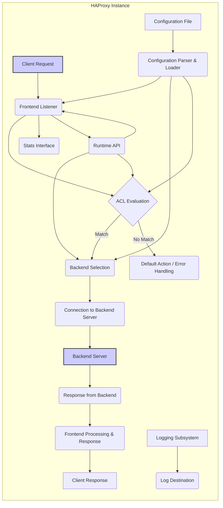

## Project Design Document: HAProxy

**Version:** 1.1
**Date:** October 26, 2023
**Author:** AI Software Architect

### 1. Introduction

This document provides an enhanced architectural overview of HAProxy (High Availability Proxy), a widely adopted open-source solution for load balancing, reverse proxying, and TCP/HTTP proxying. It is specifically tailored to facilitate comprehensive threat modeling by clearly delineating the system's components, data pathways, and core functionalities with a focus on security implications. The information herein is derived from the project's public resources and source code available at [https://github.com/haproxy/haproxy](https://github.com/haproxy/haproxy).

### 2. Goals and Objectives

HAProxy is designed with the following primary goals:

*   **Traffic Distribution:** Efficiently distribute incoming network traffic across multiple backend servers to optimize resource utilization and prevent overload.
*   **High Availability:** Improve application resilience and uptime by automatically routing traffic away from failing servers.
*   **Performance Optimization:** Enhance application responsiveness and throughput through load balancing, connection multiplexing, and caching (in some configurations).
*   **Security Enhancement:** Provide security features such as SSL/TLS termination, request filtering, and protection against common web attacks.
*   **Observability and Monitoring:** Offer detailed insights into system performance and backend server health through comprehensive statistics and logging.

### 3. High-Level Architecture

HAProxy functions as a process that listens for connections on designated network ports and intelligently forwards them to backend servers based on pre-defined rules and algorithms. The fundamental architectural elements are:

*   **Frontends:** These define the entry points for client connections. They specify the listening IP addresses and ports, the accepted protocols (HTTP, TCP, etc.), and associated Access Control Lists (ACLs) for initial traffic filtering.
*   **Backends:** These represent groups of one or more backend servers that will receive the proxied traffic. They define server addresses, ports, health check configurations, load balancing algorithms, and persistence mechanisms.
*   **Listeners:** A simplified configuration combining a frontend and a default backend. This is used when a frontend should always direct traffic to a specific backend unless overridden by ACLs.
*   **Proxy Core:** The central engine responsible for processing connections, evaluating ACLs, selecting backends, and managing the flow of data between clients and servers. Different proxy modes (`http`, `tcp`) dictate how traffic is handled.
*   **ACLs (Access Control Lists):**  A powerful rule-based system used to match traffic based on a wide array of criteria (HTTP headers, IP addresses, cookies, request methods, etc.). ACLs trigger actions like backend selection, request rejection, or header manipulation.
*   **Tasks/Sessions:** Internal units of work representing individual client connections or requests being processed by the HAProxy instance.

### 4. Detailed Component Description

*   **Frontend Listener:**
    *   Accepts incoming client connections on configured IP addresses and ports.
    *   Handles protocol negotiation (e.g., for HTTP/2, TLS).
    *   Performs initial connection management, including setting timeouts and enforcing connection limits.
    *   Can perform SSL/TLS termination, decrypting incoming HTTPS traffic.
    *   May apply basic traffic filtering based on connection properties.

*   **ACL Evaluation Engine:**
    *   Evaluates configured Access Control List (ACL) rules against the current request or connection.
    *   Supports a rich set of criteria for matching traffic characteristics.
    *   Determines the subsequent actions based on whether ACL conditions are met.
    *   Plays a crucial role in routing, security filtering, and content switching.

*   **Backend Selection Logic:**
    *   Chooses the appropriate backend server to forward the request to based on configured rules and algorithms.
    *   Implements various load balancing algorithms (roundrobin, leastconn, source IP hashing, URI hashing, etc.).
    *   Considers the health status of backend servers as determined by health checks.
    *   Can be influenced by ACL matches to implement content-based routing or stickiness.

*   **Connection to Backend Server:**
    *   Establishes a new connection or reuses an existing persistent connection (keep-alive) to the selected backend server.
    *   Can use different protocols for communication with backend servers (e.g., HTTP/1.1, HTTP/2).
    *   Manages connection pooling to optimize resource utilization and reduce latency.
    *   May involve protocol upgrades or downgrades.

*   **Backend Server:**
    *   The actual application server responsible for processing the client's request.
    *   HAProxy acts as an intermediary, abstracting the backend infrastructure from the client.

*   **Response Processing:**
    *   Receives the response from the backend server.
    *   Can perform response manipulation, such as adding or modifying headers.
    *   May involve caching mechanisms (if configured).

*   **Frontend Processing & Response:**
    *   Processes the response before sending it back to the client.
    *   Applies any final modifications or security measures.
    *   Sends the response to the originating client connection.

*   **Stats Interface:**
    *   Provides real-time statistics about HAProxy's performance, including connection rates, traffic volume, error counts, and backend server status.
    *   Typically accessible via an HTTP endpoint or a Unix socket.
    *   Used for monitoring, alerting, and performance analysis.

*   **Runtime API:**
    *   Allows for dynamic management and configuration changes to the HAProxy instance without requiring a full restart.
    *   Accessible via a Unix socket or a TCP port.
    *   Provides commands for managing servers, backends, weights, and other settings.

*   **Configuration Parser & Loader:**
    *   Reads and parses the HAProxy configuration file (`haproxy.cfg`).
    *   Validates the syntax and semantics of the configuration.
    *   Loads the configuration into HAProxy's internal data structures, defining the behavior of the proxy.

*   **Logging Subsystem:**
    *   Records events, transactions, and errors generated by the HAProxy instance.
    *   Supports various log formats (e.g., syslog, custom formats) and destinations (files, remote servers).
    *   Configurable to log different levels of detail, providing valuable information for debugging, auditing, and security analysis.

### 5. Data Flow

The typical flow of a client request through HAProxy is as follows:

1. A client initiates a connection and sends a request to the IP address and port configured on the **Frontend Listener**.
2. The **Frontend Listener** accepts the connection and initiates processing.
3. The **ACL Evaluation Engine** evaluates the request against the configured ACL rules.
4. Based on the outcome of the ACL evaluation and the configured load balancing algorithm, the **Backend Selection Logic** determines the target **Backend Server**.
5. HAProxy establishes a connection to the selected **Backend Server** (or reuses an existing one).
6. The client's request is forwarded to the **Backend Server**.
7. The **Backend Server** processes the request and generates a response.
8. The response is received by HAProxy's **Response Processing** component.
9. The **Frontend Processing & Response** component prepares and sends the response back to the originating client.
10. Throughout this process, the **Logging Subsystem** can record details of the transaction, and the **Stats Interface** is updated with relevant metrics. The initial configuration is loaded by the **Configuration Parser & Loader**, and the **Runtime API** can be used to make dynamic changes.

### 6. Security Considerations (Pre-Threat Modeling)

Identifying potential security concerns before formal threat modeling is crucial:

*   **Configuration Vulnerabilities:**
    *   **Overly Permissive ACLs:** Allowing unintended access or bypassing security checks.
    *   **Exposure of Sensitive Data:** Including secrets or credentials directly in the configuration file.
    *   **Insecure Defaults:** Relying on default settings that may not be secure.
*   **Access Control Weaknesses:**
    *   **Unprotected Stats Interface:** Exposing sensitive performance and status information without authentication.
    *   **Insecure Runtime API Access:** Allowing unauthorized modification of HAProxy's configuration and behavior.
*   **SSL/TLS Related Issues:**
    *   **Use of Weak Ciphers:**  Susceptibility to cryptographic attacks.
    *   **Improper Certificate Management:** Expired or invalid certificates leading to man-in-the-middle attacks.
    *   **Vulnerabilities in SSL/TLS Implementation:** Exploitable flaws in the underlying TLS library.
*   **Logging and Auditing Deficiencies:**
    *   **Insufficient Logging:** Lack of detailed logs hindering incident investigation.
    *   **Exposure of Sensitive Information in Logs:**  Accidental logging of passwords or other confidential data.
    *   **Inadequate Log Protection:** Logs being accessible to unauthorized individuals.
*   **Input Validation Failures:**
    *   **Header Injection Vulnerabilities:** Allowing attackers to inject malicious headers.
    *   **Bypass of Security Checks:**  Crafted input evading intended security mechanisms.
*   **Denial of Service (DoS) Attacks:**
    *   **Resource Exhaustion:** Attackers overwhelming HAProxy with excessive connections or requests.
    *   **Amplification Attacks:** Leveraging HAProxy to amplify malicious traffic towards backend servers.
*   **Backend Security Dependencies:**
    *   Vulnerabilities in backend servers can still be exploited even with a secure HAProxy configuration.
    *   HAProxy's effectiveness is limited by the security posture of the backend infrastructure.
*   **Software Vulnerabilities:**
    *   Like any software, HAProxy may contain undiscovered vulnerabilities that could be exploited by attackers. Regular updates are crucial.

### 7. Deployment Scenarios

HAProxy is versatile and can be deployed in various scenarios:

*   **Web Application Load Balancing:** Distributing HTTP/HTTPS traffic across multiple web servers to improve performance and availability.
*   **API Gateway:** Acting as a single entry point for backend APIs, providing load balancing, security, and routing capabilities.
*   **TCP Proxying:** Forwarding generic TCP traffic for applications that don't use HTTP, such as databases or custom network services.
*   **High Availability Setup:** Deploying multiple HAProxy instances in active-passive or active-active configurations for redundancy and failover.
*   **Microservices Environments:**  Routing traffic to different microservices based on path, headers, or other criteria.

### 8. Future Considerations

Potential areas for future development and deeper analysis include:

*   Detailed sequence diagrams illustrating specific request flows and interactions between components.
*   In-depth analysis of specific features like the stickiness mechanisms and their security implications.
*   Exploration of integration points with other security tools, such as Web Application Firewalls (WAFs) and Intrusion Detection/Prevention Systems (IDPS).
*   Further examination of different deployment architectures and their respective security considerations.

This enhanced design document provides a more detailed and security-focused understanding of HAProxy's architecture, serving as a solid foundation for comprehensive threat modeling exercises. By clearly outlining the components, data flow, and potential security vulnerabilities, this document empowers security professionals to identify and mitigate risks effectively.
