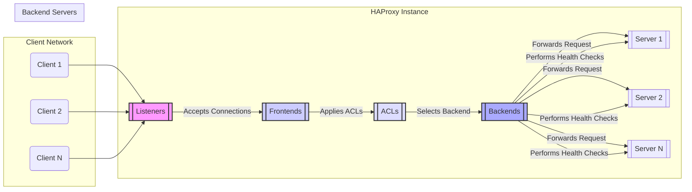

# Project Design Document: HAProxy

**Version:** 1.1
**Date:** October 26, 2023
**Author:** AI Software Architect

## 1. Introduction

This document provides a detailed design overview of the HAProxy (High Availability Proxy) software, focusing on aspects relevant to security and threat modeling. It outlines the key architectural components, data flow, and deployment considerations to facilitate a comprehensive understanding of the system's functionality and potential security vulnerabilities.

## 2. Project Overview

HAProxy is a robust, open-source load balancer and proxy server for TCP and HTTP-based applications. It is widely adopted to enhance the performance, reliability, and security of web services by distributing traffic across multiple backend servers. Key functionalities include:

*   Intelligent load balancing across various backend server pools.
*   High availability and fault tolerance through health checks and automatic failover.
*   Secure Socket Layer/Transport Layer Security (SSL/TLS) termination and offloading.
*   Advanced request routing based on headers, cookies, and other criteria.
*   Real-time monitoring and observability through statistics and logging.
*   Built-in mechanisms for protection against common web attacks.

Examples of common use cases include:

*   Distributing web traffic across multiple application servers.
*   Providing high availability for critical services.
*   Securing web applications by terminating SSL/TLS at the load balancer.
*   Routing traffic based on geographical location or user attributes.

## 3. System Architecture

The core of HAProxy involves processing incoming client requests and intelligently forwarding them to appropriate backend servers based on a set of configurable rules. The following diagram illustrates the high-level architecture and key interactions:

## 4. Component Breakdown

This section provides a detailed breakdown of the key components within the HAProxy architecture, highlighting their functionalities and security implications:

*   **Listeners:**
    *   **Functionality:**  Accept incoming client connections on specified IP addresses and ports. Define the entry points for network traffic into the HAProxy instance. Can be configured for various protocols (e.g., HTTP, HTTPS, TCP).
    *   **Security Implications:**  Misconfigured listeners can expose services unnecessarily. Properly configuring SSL/TLS settings (ciphers, protocols) is crucial for secure communication. Vulnerabilities in the underlying network stack could be exploited at this level.

*   **Frontends:**
    *   **Functionality:** Process incoming requests received from listeners. Apply Access Control Lists (ACLs) to make routing and other decisions. Can perform actions like request header manipulation, redirection, and content switching. Often handles SSL/TLS termination.
    *   **Security Implications:**  Incorrectly configured frontends can lead to bypassing security checks or exposing sensitive information through header manipulation. Vulnerabilities in SSL/TLS termination logic could be exploited.

*   **Access Control Lists (ACLs):**
    *   **Functionality:** Define conditions for matching requests based on various criteria, including source IP address, request headers, URL paths, cookies, and more. Used by frontends to make routing, blocking, and other policy decisions.
    *   **Security Implications:**  Weak or overly permissive ACLs can allow unauthorized access or bypass security controls. Complex ACL logic can be difficult to audit and may contain unintended consequences. Injection vulnerabilities in ACL expressions are possible.

*   **Backends:**
    *   **Functionality:** Represent a group of backend servers that will receive traffic. Define the load balancing algorithm (e.g., roundrobin, leastconn, source IP hashing). Configure health checks to monitor the availability and responsiveness of backend servers. Manage connections to backend servers, including connection pooling and timeouts.
    *   **Security Implications:**  Misconfigured health checks can lead to routing traffic to unhealthy servers. Insecure communication protocols with backend servers (e.g., unencrypted HTTP) can expose data in transit. Load balancing algorithms can have security implications (e.g., session fixation if not properly configured).

*   **Servers:**
    *   **Functionality:** Individual backend servers within a backend group. HAProxy forwards requests to these servers based on the configured load balancing algorithm and the health check status.
    *   **Security Implications:**  The security of the backend servers is paramount. HAProxy's security is only as strong as the weakest link in the chain.

## 5. Data Flow

The typical flow of a request through an HAProxy instance is as follows:

1. A client initiates a connection to the HAProxy instance on a configured listener (e.g., port 80 or 443).
2. The listener accepts the incoming connection.
3. The associated frontend receives the request.
4. The frontend evaluates configured ACLs against the request attributes (e.g., source IP, headers, URL).
5. Based on the matching ACLs and configured rules, the frontend selects a specific backend to handle the request.
6. The selected backend chooses a healthy server from its pool based on the configured load balancing algorithm.
7. HAProxy establishes a connection to the chosen backend server (if not already established via connection pooling).
8. HAProxy forwards the client's request to the selected backend server.
9. The backend server processes the request and generates a response.
10. The backend server sends the response back to HAProxy.
11. HAProxy forwards the response back to the originating client.

Error handling and specific routing scenarios can alter this flow. For example, if a backend server is unhealthy, HAProxy will avoid routing traffic to it. Redirections configured in the frontend can also change the flow.

## 6. Security Considerations

Security is a fundamental aspect of HAProxy's design and operation. Understanding these considerations is crucial for effective threat modeling:

*   **SSL/TLS Termination:**
    *   **Details:** HAProxy can terminate SSL/TLS connections, decrypting traffic before forwarding it to backend servers. This centralizes certificate management and can improve performance.
    *   **Threats:**  Vulnerabilities in the SSL/TLS implementation (e.g., older protocol versions, weak ciphers), improper certificate management (e.g., private key exposure), and man-in-the-middle attacks if backend communication is not also secured.

*   **Access Control:**
    *   **Details:** ACLs provide granular control over which requests are allowed or denied based on various criteria.
    *   **Threats:**  Bypassing access controls due to weak or incorrect ACL configurations, unauthorized access to sensitive resources, and potential for ACL injection attacks.

*   **Rate Limiting and Connection Limits:**
    *   **Details:** HAProxy can limit the rate of incoming requests and the number of concurrent connections.
    *   **Threats:**  Denial-of-service (DoS) and distributed denial-of-service (DDoS) attacks can overwhelm the HAProxy instance or backend servers if limits are not properly configured.

*   **Request Header Manipulation:**
    *   **Details:** Frontends can modify request headers before forwarding them to backend servers.
    *   **Threats:**  Introducing vulnerabilities through incorrect header manipulation (e.g., HTTP response splitting), bypassing security checks based on header values, and information leakage through unintended header additions.

*   **Logging and Auditing:**
    *   **Details:** HAProxy can generate detailed logs of requests, connections, and errors.
    *   **Threats:**  Insufficient logging can hinder security monitoring and incident response. Logs themselves can be targets for tampering or unauthorized access if not properly secured.

*   **Vulnerability Management:**
    *   **Details:** Regularly updating HAProxy to the latest version is crucial to patch known security vulnerabilities.
    *   **Threats:**  Exploitation of known vulnerabilities in outdated versions of HAProxy.

*   **Configuration Security:**
    *   **Details:** Securely storing and managing the HAProxy configuration file is essential.
    *   **Threats:**  Unauthorized modification of the configuration can lead to severe security breaches. Exposure of sensitive information (e.g., backend server credentials) within the configuration.

## 7. Technology Stack

HAProxy is primarily built using the following technologies:

*   **Core Language:** C (for performance and efficiency)
*   **Operating System Compatibility:**  Designed to run on various Linux distributions, FreeBSD, and other Unix-like operating systems.
*   **Configuration Format:**  Plain text configuration files with a specific syntax.

## 8. Deployment Options

The deployment architecture of HAProxy significantly impacts its security posture. Common deployment options include:

*   **Standalone Load Balancer:**
    *   **Description:** A single HAProxy instance acts as the primary entry point for traffic.
    *   **Security Implications:**  Single point of failure. Security of this single instance is critical.

*   **Active-Passive High Availability:**
    *   **Description:** Two HAProxy instances, where one is active and the other is on standby, taking over in case of failure.
    *   **Security Implications:**  Improved availability. Security configurations must be consistent across both instances. Secure failover mechanisms are essential.

*   **Active-Active High Availability:**
    *   **Description:** Multiple HAProxy instances distribute traffic concurrently.
    *   **Security Implications:**  Increased resilience and scalability. Requires careful management of configuration synchronization and potential for inconsistencies.

*   **Containerized Deployment (e.g., Docker, Kubernetes):**
    *   **Description:** Running HAProxy within containers.
    *   **Security Implications:**  Benefits of container isolation. Requires secure container image management and orchestration platform security.

*   **Cloud-Based Deployment (e.g., AWS, Azure, GCP):**
    *   **Description:** Deploying HAProxy on cloud infrastructure.
    *   **Security Implications:**  Leverages cloud provider security features. Requires proper configuration of cloud security groups and network access controls.

## 9. Threat Modeling Focus

This design document provides the necessary context for conducting a thorough threat modeling exercise. The focus of the threat modeling will be on identifying potential threats to the assets described within this document. Specifically, we will consider threats against:

*   **Listeners:**  DoS attacks, unauthorized access attempts.
*   **Frontends:**  Bypassing security controls, header injection attacks.
*   **ACLs:**  ACL injection, logic errors leading to unintended access.
*   **Backends:**  Compromise of backend servers, insecure communication.
*   **HAProxy Instance:**  Exploitation of vulnerabilities in the HAProxy software itself, configuration errors.
*   **Data in Transit:**  Interception of sensitive data if SSL/TLS is not properly configured.
*   **Configuration Data:**  Unauthorized access or modification of the HAProxy configuration.
*   **Logs:**  Tampering with logs, unauthorized access to sensitive log data.

By systematically analyzing these components and their interactions, we can identify potential vulnerabilities and develop appropriate mitigation strategies. This document serves as a critical foundation for ensuring the security and resilience of systems utilizing HAProxy.