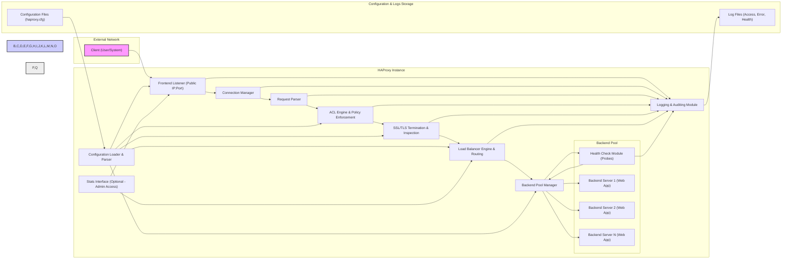

# Project Design Document: HAProxy Load Balancer (Improved)

**Project Name:** HAProxy Deployment Design for Threat Modeling

**Version:** 1.1
**Date:** 2023-10-27
**Author:** AI Cloud & Security Architect

## 1. Introduction

This document provides an enhanced and more detailed design overview of a typical HAProxy (High Availability Proxy) deployment, specifically tailored for comprehensive threat modeling. Building upon the previous version, this document aims to provide even greater clarity and actionable insights for security analysis. It outlines the architecture, components, data flow, and key security considerations of HAProxy, serving as a robust foundation for identifying potential vulnerabilities and designing effective security controls.

HAProxy is a critical component in modern application delivery, acting as a gatekeeper for backend services. Understanding its architecture and potential weaknesses is crucial for maintaining a secure and resilient infrastructure. This document focuses on a common scenario: HAProxy as a load balancer for web applications, but the principles are applicable to other use cases as well.

## 2. Project Overview

**Project Goal:** To provide a refined and more detailed representative HAProxy deployment architecture specifically designed for in-depth threat modeling, enabling the identification of a broader range of potential security risks and vulnerabilities.

**Scope:** This document covers the design of a single HAProxy instance acting as a load balancer in front of a pool of backend web servers. It includes:

*   Enhanced high-level architecture diagram with more detail.
*   Detailed and refined description of each component, emphasizing security aspects.
*   Comprehensive data flow analysis, highlighting security-relevant data paths.
*   Expanded and categorized key security considerations, providing more specific threat examples and mitigation strategies.
*   Assumptions and Context for the design.
*   Guidance on using this document for threat modeling.

**Out of Scope:** (Same as Version 1.0, but reiterated for clarity)

*   Specific configuration details of HAProxy (e.g., ACL rules, backend server configurations).
*   Deployment instructions or scripts.
*   Performance tuning or optimization.
*   High Availability (HA) configurations involving multiple HAProxy instances (clustering, VRRP, etc.).
*   Integration with specific monitoring or logging systems (beyond general logging principles).
*   Detailed security hardening guidelines (beyond high-level considerations).

## 3. Architecture Diagram

## 4. Component Description (Enhanced)

This section provides enhanced descriptions of each component, focusing on their security relevance and potential vulnerabilities.

**4.1. External Network**

*   **A. Client (User/System):** Represents any external entity initiating requests. This could be legitimate users, malicious actors, automated bots, or other systems.  Threats originate from this zone.

**4.2. HAProxy Instance**

*   **B. Frontend Listener (Public IP:Port):** The publicly exposed entry point. Listens on configured IP addresses and ports, accepting incoming connections. Vulnerable to network-level attacks (DoS, DDoS, port scanning). Misconfiguration can expose internal services.
*   **C. Connection Manager:** Manages incoming connections, handling connection limits and timeouts.  Improperly configured limits can lead to DoS. Vulnerable to connection exhaustion attacks.
*   **D. Request Parser:** Parses incoming requests (HTTP, TCP). Vulnerable to parsing vulnerabilities if not robustly implemented (e.g., HTTP request smuggling, buffer overflows in older versions).
*   **E. ACL Engine & Policy Enforcement:** Evaluates Access Control Lists (ACLs) to enforce security policies, routing rules, and access control.  ACL misconfigurations are a major source of vulnerabilities, leading to bypasses, unintended access, or denial of service.  ACL logic flaws can be exploited.
*   **F. SSL/TLS Termination & Inspection:** Handles SSL/TLS handshake, decryption, and optionally, re-encryption.  Vulnerable to SSL/TLS vulnerabilities (protocol weaknesses, cipher suite issues, certificate validation flaws).  If configured for inspection, introduces complexity and potential for bypasses or errors. Private key compromise is a critical risk.
*   **G. Load Balancer Engine & Routing:** Distributes traffic to backend servers based on algorithms and health checks. Routing misconfigurations can lead to information disclosure or access to unintended backends. Load balancing algorithm weaknesses could be exploited for DoS or uneven load distribution.
*   **H. Backend Pool Manager:** Manages the pool of backend servers, including health checks and server selection.  Health check misconfigurations can lead to routing traffic to unhealthy servers or removing healthy servers from rotation.  Backend pool vulnerabilities can impact overall application availability.
    *   **I. Health Check Module (Probes):** Periodically probes backend servers to determine their health.  Vulnerable to health check bypasses or manipulation, leading to incorrect health status reporting.  Insecure health check probes can themselves be exploited.
    *   **J, K, L. Backend Server 1, 2, N (Web App):** The actual application servers. While not HAProxy components, their security is directly impacted by HAProxy's configuration and routing. Vulnerabilities in backend servers are exposed through HAProxy if not properly secured.
*   **M. Configuration Loader & Parser:** Loads and parses the HAProxy configuration. Vulnerable to configuration injection vulnerabilities if configuration loading process is not secure.  Configuration file access control is critical.
*   **N. Logging & Auditing Module:** Logs events for monitoring, security analysis, and auditing.  Insufficient logging can hinder incident response and security analysis.  Log injection vulnerabilities are possible if logging is not properly sanitized.  Logs themselves need to be secured.
*   **O. Stats Interface (Optional - Admin Access):** Provides a web/API interface for monitoring.  If enabled, it's a high-value target for attackers.  Requires strong authentication and authorization.  Vulnerable to web application vulnerabilities if not properly secured. Should be disabled in production if not essential.

**4.3. Configuration & Logs Storage**

*   **P. Configuration Files (haproxy.cfg):** Stores sensitive configuration data.  Requires strict access control.  Vulnerable to unauthorized access, modification, or deletion.
*   **Q. Log Files (Access, Error, Health):** Contains valuable security and operational information.  Requires secure storage and access control.  Vulnerable to unauthorized access, modification, or deletion.

## 5. Data Flow (Security Focused)

The data flow, viewed through a security lens, highlights potential points of interception, manipulation, and vulnerability.

1.  **Client Request (A -> B):**  Initial point of entry. Network traffic is exposed to the external network. Potential for network sniffing, man-in-the-middle attacks (if not HTTPS), and DoS attacks.
2.  **Connection Handling (B -> C):** Connection management phase. Vulnerable to connection exhaustion attacks.  Improper timeouts can lead to resource starvation.
3.  **Request Parsing (C -> D):** Request interpretation. Vulnerable to parsing exploits (e.g., HTTP request smuggling, buffer overflows). Input validation weaknesses can be exploited.
4.  **ACL & Policy Enforcement (D -> E):** Policy decision point. ACL bypasses, logic flaws, and misconfigurations can lead to unauthorized access or actions.
5.  **SSL/TLS Processing (E -> F):** Encryption/Decryption point. Vulnerable to SSL/TLS protocol vulnerabilities, cipher suite weaknesses, certificate validation errors, and private key compromise.  Inspection adds complexity and potential bypasses.
6.  **Load Balancing & Routing (F -> G):** Routing decision. Misrouting can expose unintended backends or information. Load balancing algorithm weaknesses can be exploited for DoS.
7.  **Backend Health Checks (G -> H -> I):** Backend availability monitoring. Health check bypasses or manipulation can lead to routing traffic to unhealthy servers or removing healthy ones. Insecure health checks can be exploited.
8.  **Request to Backend (H -> J/K/L):** Forwarding to backend servers.  If internal network is not secured, traffic between HAProxy and backends can be vulnerable to interception.
9.  **Response from Backend (J/K/L -> H):** Response path back to HAProxy.  Same internal network security concerns as request forwarding.
10. **Response Processing & Encryption (H -> G -> F):** Response processing and encryption (if SSL termination).  Potential for response manipulation or injection vulnerabilities.
11. **Response to Client (F -> B -> A):** Response delivery to client.  Output filtering weaknesses can be exploited.
12. **Logging (B/C/D/E/F/G/I -> N -> Q):** Logging of events.  Insufficient logging hinders security analysis. Log injection vulnerabilities are possible.  Logs themselves need to be secured.
13. **Configuration Loading (P -> M -> B/E/F/G/H):** Configuration loading process.  Configuration injection vulnerabilities are possible.  Configuration file access control is critical.
14. **Stats Interface Access (O -> B/G):** Monitoring interface access.  If enabled, it's a high-value target.  Requires strong authentication and authorization.

## 6. Security Considerations for Threat Modeling (Expanded & Categorized)

This section expands on security considerations, categorizing them for a more structured threat modeling approach.

**6.1. Configuration Security**

*   **Threats:**
    *   **Unauthorized Configuration Access/Modification:** Attackers gaining access to `haproxy.cfg` could modify routing rules, disable security features, or inject malicious configurations.
    *   **Configuration Injection:** Exploiting vulnerabilities in the configuration loading process to inject malicious configurations.
    *   **Misconfiguration:** Accidental or intentional misconfigurations leading to security vulnerabilities (e.g., overly permissive ACLs, weak SSL/TLS settings).
    *   **Exposure of Secrets in Configuration:** Storing sensitive information (credentials, keys) directly in the configuration file.
*   **Mitigations:**
    *   **Strict Access Control (RBAC):** Implement role-based access control to restrict access to configuration files and HAProxy administration.
    *   **Configuration Validation & Auditing:** Implement automated configuration validation and auditing processes. Use version control for configuration files.
    *   **Secure Configuration Templates:** Use secure configuration templates and best practices.
    *   **Secrets Management:** Utilize dedicated secrets management solutions (e.g., HashiCorp Vault, AWS Secrets Manager) to store and manage sensitive information separately from the configuration.

**6.2. Access Control**

*   **Threats:**
    *   **Frontend Listener Exposure:**  Unrestricted access to the Frontend Listener from untrusted networks.
    *   **Stats Interface Exploitation:** Unauthorized access to the Stats Interface, leading to information disclosure or potential control plane attacks.
    *   **ACL Bypass:**  Exploiting weaknesses in ACL logic or misconfigurations to bypass access controls.
    *   **Administrative Access Compromise:**  Compromise of administrative credentials for HAProxy server or management interfaces.
*   **Mitigations:**
    *   **Network Segmentation & Firewalls:** Use firewalls and network segmentation to restrict access to the Frontend Listener and HAProxy instance from trusted networks only.
    *   **Strong Authentication & Authorization for Stats Interface:** Secure the Stats Interface with strong authentication (e.g., multi-factor authentication) and role-based authorization. Consider disabling it in production.
    *   **Robust ACL Design & Testing:** Design ACLs with a "deny by default" approach. Thoroughly test ACL rules to prevent bypasses. Regularly review and update ACLs.
    *   **Secure Administrative Access:** Enforce strong passwords, SSH key-based authentication, and multi-factor authentication for administrative access. Implement jump servers and bastion hosts for secure remote administration.

**6.3. Data Security**

*   **Threats:**
    *   **SSL/TLS Vulnerabilities:** Exploiting weaknesses in SSL/TLS protocols, cipher suites, or certificate validation to intercept or decrypt traffic.
    *   **Private Key Compromise:**  Compromise of SSL/TLS private keys, allowing decryption of past and future traffic.
    *   **Information Disclosure:**  Misconfigurations or vulnerabilities leading to the exposure of sensitive data in logs, error messages, or through the Stats Interface.
    *   **Log Data Breaches:**  Unauthorized access to or leakage of log files containing sensitive information.
*   **Mitigations:**
    *   **Strong SSL/TLS Configuration:**  Use strong cipher suites, disable weak protocols (SSLv3, TLS 1.0, TLS 1.1), and enforce TLS 1.2 or higher. Regularly update SSL/TLS libraries.
    *   **Secure Certificate Management:**  Use reputable Certificate Authorities (CAs). Implement secure key generation, storage, and rotation practices. Use Hardware Security Modules (HSMs) for private key protection if highly sensitive.
    *   **Data Minimization in Logs:**  Avoid logging sensitive data unnecessarily. Implement data masking or anonymization in logs where possible.
    *   **Secure Log Storage & Access:**  Encrypt log files at rest and in transit. Implement strict access control to log files. Use Security Information and Event Management (SIEM) systems for centralized and secure log management.

**6.4. Operational Security**

*   **Threats:**
    *   **Denial of Service (DoS) & Distributed Denial of Service (DDoS):** Overwhelming HAProxy with requests, connections, or slowloris attacks, leading to service disruption.
    *   **Health Check Manipulation:**  Exploiting vulnerabilities in health checks to manipulate backend server status, leading to misrouting or service disruption.
    *   **Insufficient Monitoring & Logging:**  Lack of adequate monitoring and logging hindering incident detection, response, and forensic analysis.
    *   **Vulnerability Exploitation (Software Bugs):** Exploiting known or zero-day vulnerabilities in HAProxy software.
*   **Mitigations:**
    *   **Rate Limiting & Connection Limits:** Implement rate limiting and connection limits in HAProxy to mitigate DoS/DDoS attacks.
    *   **Robust Health Check Design:**  Design health checks that are difficult to bypass or manipulate. Use multiple types of health checks. Secure health check probes.
    *   **Comprehensive Monitoring & Alerting:**  Implement robust monitoring of HAProxy performance, health, and security events. Set up alerts for anomalies and security-related events. Integrate with SIEM systems.
    *   **Regular Security Updates & Patching:**  Keep HAProxy software up-to-date with the latest security patches. Subscribe to security advisories and promptly apply patches. Implement a vulnerability management program.

## 7. Assumptions and Context

*   **Single HAProxy Instance:** This design focuses on a single HAProxy instance for simplicity. High Availability (HA) configurations with multiple HAProxy instances are not covered but should be considered for production deployments.
*   **Web Application Load Balancing:** The primary use case assumed is load balancing for web applications (HTTP/HTTPS traffic). However, the principles are applicable to other TCP/UDP-based applications.
*   **Typical Network Environment:**  It's assumed that HAProxy is deployed in a typical network environment with firewalls and network segmentation in place.
*   **Focus on Software Configuration:** The document primarily focuses on security aspects related to HAProxy software configuration and deployment. Infrastructure security (OS hardening, network security) is assumed to be addressed separately.

## 8. Threat Modeling Guidance

This design document is intended to be used as a basis for conducting threat modeling exercises. Here are some steps and methodologies you can use:

1.  **Choose a Threat Modeling Methodology:** Select a suitable threat modeling methodology such as STRIDE (Spoofing, Tampering, Repudiation, Information Disclosure, Denial of Service, Elevation of Privilege), PASTA (Process for Attack Simulation and Threat Analysis), or others.
2.  **Identify Assets:** Identify the key assets in the HAProxy deployment, such as the HAProxy instance itself, configuration files, log files, backend servers, and the data being processed.
3.  **Decompose the System:** Use the architecture diagram and component descriptions in this document to understand the system's components, data flow, and interactions.
4.  **Identify Threats:** For each component and data flow path, brainstorm potential threats using the chosen methodology (e.g., STRIDE categories). Consider the security considerations outlined in Section 6.
5.  **Rank Threats:** Assess the likelihood and impact of each identified threat to prioritize them.
6.  **Identify Mitigations:** For each high-priority threat, identify existing security controls and potential mitigations. Refer to the mitigation strategies suggested in Section 6.
7.  **Document and Review:** Document the threat model, including identified threats, rankings, and mitigations. Regularly review and update the threat model as the system evolves.

By using this design document and following a structured threat modeling approach, you can proactively identify and address security risks in your HAProxy deployments, enhancing the overall security posture of your applications and infrastructure.