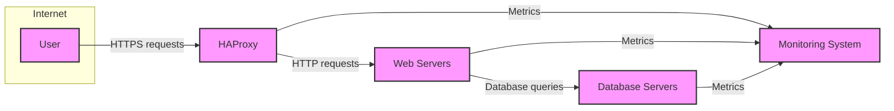
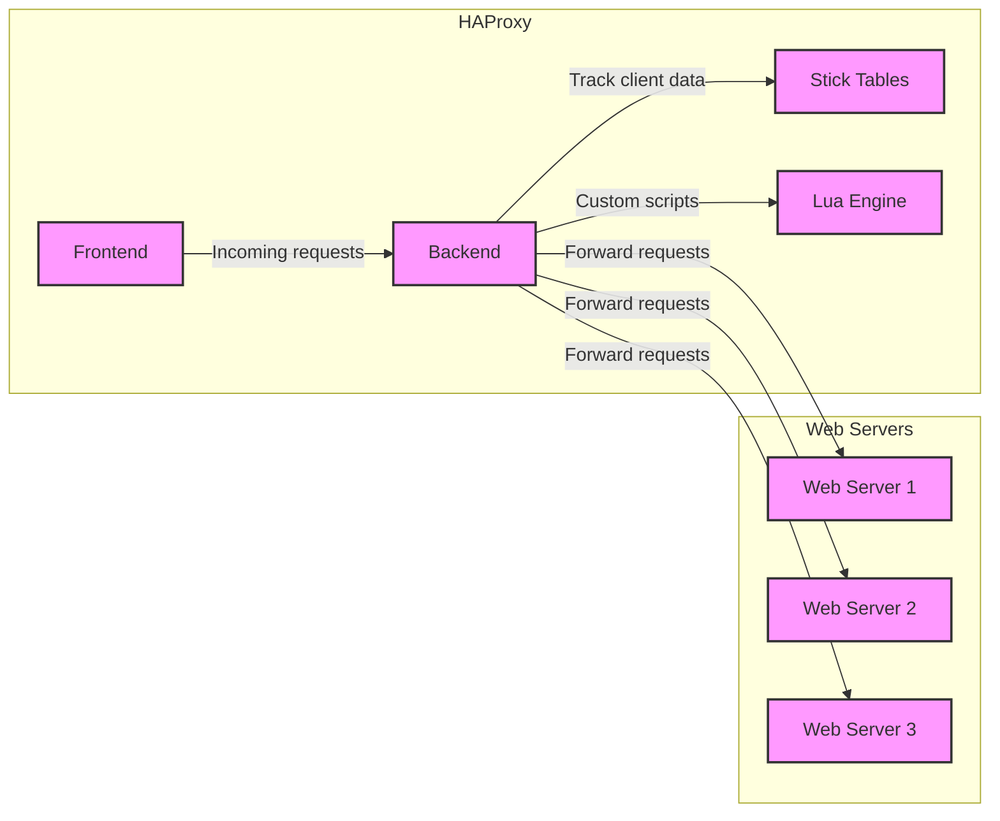

Okay, let's create a design document for the HAProxy project, focusing on aspects relevant for threat modeling.

# BUSINESS POSTURE

HAProxy is a mature, widely-used, and critical piece of infrastructure for many organizations, ranging from small startups to large enterprises.  It's often the first line of defense and a key component for ensuring high availability and performance.

Priorities and Goals:

*   High Availability: Ensure continuous service availability even in the face of server failures or network disruptions.  This is HAProxy's *primary* function.
*   Performance: Minimize latency and maximize throughput for client requests.  HAProxy must be extremely efficient.
*   Scalability: Handle increasing traffic loads, often through horizontal scaling (adding more HAProxy instances).
*   Security: Protect backend servers from direct exposure to the internet, mitigating common attacks and providing a point for implementing security policies.
*   Flexibility: Support a wide range of protocols (HTTP, HTTPS, TCP, etc.) and configuration options to adapt to diverse deployment scenarios.
*   Observability: Provide detailed logging and statistics to enable monitoring and troubleshooting.
*   Maintainability: Offer a stable and well-documented configuration syntax, making it easy to manage and update deployments.

Business Risks:

*   Single Point of Failure: If HAProxy itself fails, it can cause a complete service outage. This is the most critical risk.
*   Configuration Errors: Incorrect configurations can lead to service disruptions, security vulnerabilities, or performance bottlenecks.
*   Resource Exhaustion: HAProxy, like any software, can be overwhelmed by excessive traffic or malicious attacks (e.g., DDoS), leading to denial of service.
*   Vulnerabilities: Although HAProxy has a strong security record, undiscovered vulnerabilities could be exploited to compromise the system or backend servers.
*   Outdated Versions: Running older, unsupported versions of HAProxy can expose the system to known vulnerabilities.
*   Supply Chain Attacks: Compromise of the HAProxy build process or distribution channels could lead to the deployment of malicious code.

# SECURITY POSTURE

Existing Security Controls (based on the HAProxy project and common deployment practices):

*   security control: Access Control Lists (ACLs): HAProxy's configuration language allows for fine-grained control over which clients can access which backend servers, based on various criteria (source IP, headers, etc.). Implemented within HAProxy's configuration.
*   security control: Rate Limiting: HAProxy can limit the rate of requests from individual clients or networks, mitigating DoS attacks. Implemented within HAProxy's configuration.
*   security control: SSL/TLS Termination: HAProxy can handle SSL/TLS encryption and decryption, offloading this burden from backend servers and providing a central point for managing certificates. Implemented within HAProxy's configuration and through integration with OpenSSL or other TLS libraries.
*   security control: HTTP Header Manipulation: HAProxy can add, remove, or modify HTTP headers, allowing for security enhancements (e.g., adding HSTS headers) and mitigating certain attacks. Implemented within HAProxy's configuration.
*   security control: Connection Management: HAProxy efficiently manages TCP connections, preventing resource exhaustion from slow clients or malicious connection attempts. Implemented within HAProxy's core functionality.
*   security control: Health Checks: HAProxy continuously monitors the health of backend servers, automatically removing unhealthy servers from the load balancing pool. Implemented within HAProxy's configuration.
*   security control: Stick Tables: HAProxy's stick tables can track client sessions and attributes, enabling features like session persistence and abuse detection. Implemented within HAProxy's core functionality.
*   security control: Regular Security Audits and Penetration Testing: The HAProxy project undergoes regular security reviews and testing. Described in project documentation and community communications.
*   security control: Active Community and Rapid Response to Vulnerabilities: The HAProxy community is active in identifying and addressing security issues. Described in project documentation and community communications.
*   security control: Well-Defined Configuration Syntax: The configuration language is designed to be clear and unambiguous, reducing the risk of misconfiguration. Described in project documentation.
*   security control: Extensive Logging: HAProxy provides detailed logs that can be used for security monitoring and auditing. Implemented within HAProxy's core functionality.

Accepted Risks:

*   accepted risk: Complexity: HAProxy's configuration can become complex, especially in large deployments, increasing the risk of human error.
*   accepted risk: Zero-Day Vulnerabilities: Like all software, HAProxy is susceptible to undiscovered vulnerabilities.
*   accepted risk: Dependence on Underlying OS and Libraries: HAProxy relies on the security of the operating system and libraries (e.g., OpenSSL) it runs on.

Recommended Security Controls:

*   Implement a Web Application Firewall (WAF) in front of or integrated with HAProxy (e.g., using HAProxy's Lua scripting capabilities or a separate WAF appliance).
*   Use a dedicated network segment (DMZ) for HAProxy instances.
*   Implement strict firewall rules to limit access to HAProxy's management interface.
*   Regularly review and update HAProxy configurations to ensure they adhere to best practices.
*   Implement automated configuration validation and testing.
*   Enable and monitor security-relevant logs.
*   Consider using a configuration management tool (e.g., Ansible, Chef, Puppet) to manage HAProxy deployments consistently and securely.
*   Implement intrusion detection/prevention systems (IDS/IPS) to monitor network traffic to and from HAProxy.

Security Requirements:

*   Authentication:
    *   HAProxy's management interface should require strong authentication.
    *   If HAProxy is used for client authentication (e.g., HTTP Basic Auth), it should be configured securely (e.g., using HTTPS, strong passwords).
*   Authorization:
    *   HAProxy's ACLs should be used to enforce the principle of least privilege, granting only necessary access to clients and backend servers.
*   Input Validation:
    *   HAProxy should be configured to validate incoming requests, rejecting malformed requests or requests that violate security policies.  This is particularly important for HTTP traffic.
    *   Use of stick-table can help validate sequence of requests.
*   Cryptography:
    *   HAProxy should use strong cryptographic algorithms and protocols for SSL/TLS termination.
    *   Certificates should be managed securely and rotated regularly.
    *   HAProxy should be configured to prefer secure cipher suites and disable weak or outdated ones.

# DESIGN

## C4 CONTEXT



C4 Context Element List:

*   Element:
    *   Name: User
    *   Type: Person
    *   Description: End-users accessing the application through web browsers or other clients.
    *   Responsibilities: Initiates requests to the application.
    *   Security controls: Browser security settings, antivirus software, user awareness training.

*   Element:
    *   Name: HAProxy
    *   Type: Software System
    *   Description: The HAProxy load balancer.
    *   Responsibilities: Load balancing, SSL/TLS termination, request filtering, health checks.
    *   Security controls: ACLs, rate limiting, SSL/TLS configuration, header manipulation, connection management, health checks, stick tables.

*   Element:
    *   Name: Web Servers
    *   Type: Software System
    *   Description: Servers hosting the application's web content and logic.
    *   Responsibilities: Serving web pages, handling application logic.
    *   Security controls: Web server security configuration, application-level security controls, input validation, output encoding.

*   Element:
    *   Name: Database Servers
    *   Type: Software System
    *   Description: Servers hosting the application's database.
    *   Responsibilities: Storing and retrieving application data.
    *   Security controls: Database security configuration, access controls, encryption at rest and in transit, auditing.

*   Element:
    *   Name: Monitoring System
    *   Type: Software System
    *   Description: System for monitoring the performance and health of HAProxy and backend servers.
    *   Responsibilities: Collecting and displaying metrics, alerting on issues.
    *   Security controls: Secure access to monitoring data, secure communication channels.

## C4 CONTAINER



C4 Container Element List:

*   Element:
    *   Name: Frontend
    *   Type: Container
    *   Description: Handles incoming client connections and applies initial request processing rules.
    *   Responsibilities: Listening for connections, SSL/TLS termination, ACL checks, initial request routing.
    *   Security controls: SSL/TLS configuration, ACLs, rate limiting, header manipulation.

*   Element:
    *   Name: Backend
    *   Type: Container
    *   Description: Manages connections to backend servers and performs load balancing.
    *   Responsibilities: Server selection, health checks, connection pooling, request forwarding.
    *   Security controls: Health checks, connection management.

*   Element:
    *   Name: Stick Tables
    *   Type: Container
    *   Description: In-memory data storage for tracking client sessions and attributes.
    *   Responsibilities: Storing and retrieving client data, enabling session persistence and abuse detection.
    *   Security controls: Data validation, access controls.

*   Element:
    *   Name: Lua Engine
    *   Type: Container
    *   Description: Embedded Lua scripting engine for extending HAProxy's functionality.
    *   Responsibilities: Executing custom Lua scripts for request processing, logging, and other tasks.
    *   Security controls: Sandboxing, input validation, secure coding practices for Lua scripts.

*   Element:
    *   Name: Web Server 1, 2, 3
    *   Type: Container
    *   Description: Instances of web server.
    *   Responsibilities: Serving web pages, handling application logic.
    *   Security controls: Web server security configuration, application-level security controls, input validation, output encoding.

## DEPLOYMENT

Possible Deployment Solutions:

1.  Standalone: HAProxy instances running directly on dedicated physical or virtual servers.
2.  Active-Passive: Two HAProxy instances, one active and one standby, with a mechanism (e.g., keepalived, heartbeat) for failover.
3.  Active-Active: Multiple HAProxy instances, all actively handling traffic, with a mechanism (e.g., DNS load balancing, anycast) for distributing traffic among them.
4.  Containerized: HAProxy instances running inside containers (e.g., Docker), orchestrated by a container orchestration platform (e.g., Kubernetes).
5.  Cloud-Based: Using a cloud provider's load balancing service (e.g., AWS ELB, Azure Load Balancer, GCP Load Balancer), which may or may not be based on HAProxy.

Chosen Solution (for detailed description): Active-Passive with Keepalived

```mermaid
graph LR
    subgraph "Data Center"
        subgraph "DMZ"
            A[HAProxy Active]
            B[HAProxy Passive]
            C[Keepalived]
            A -- "Virtual IP" --> Internet
            A -- "HAProxy traffic" --> WebServers
            B -- "HAProxy traffic" --> WebServers
            A -- "VRRP" --> C
            B -- "VRRP" --> C
        end
        subgraph "Application Network"
            WebServers[Web Servers]
        end
    end
        Internet[Internet]

    classDef element fill:#f9f,stroke:#333,stroke-width:2px
    class A,B,C,WebServers, Internet element
```

Deployment Element List:

*   Element:
    *   Name: HAProxy Active
    *   Type: Node
    *   Description: The primary HAProxy instance, actively handling traffic.
    *   Responsibilities: Load balancing, SSL/TLS termination, request filtering, health checks.
    *   Security controls: OS hardening, firewall rules, HAProxy security configuration.

*   Element:
    *   Name: HAProxy Passive
    *   Type: Node
    *   Description: The standby HAProxy instance, ready to take over if the active instance fails.
    *   Responsibilities: Monitoring the active instance, taking over if necessary.
    *   Security controls: OS hardening, firewall rules, HAProxy security configuration (identical to the active instance).

*   Element:
    *   Name: Keepalived
    *   Type: Node/Software
    *   Description: Software that monitors the health of the HAProxy instances and manages the virtual IP address.
    *   Responsibilities: Health checks, failover management, virtual IP address management.
    *   Security controls: Secure configuration, access controls.

*   Element:
    *   Name: Web Servers
    *   Type: Node
    *   Description: Servers that will receive traffic from HAProxy.
    *   Responsibilities: Serving web pages, handling application logic.
    *   Security controls: OS hardening, firewall rules, application security.

*   Element:
    *   Name: Internet
    *   Type: External
    *   Description: External network.
    *   Responsibilities: N/A
    *   Security controls: N/A

## BUILD

The HAProxy build process is primarily managed through its source code repository and Makefiles.  While the specifics can evolve, the general process and security considerations are:

1.  Source Code: Developers contribute code to the official HAProxy repository (typically on git.haproxy.org).  This involves code reviews and adherence to coding standards.
2.  Makefile: The build process is orchestrated by Makefiles.  These define the compilation steps, dependencies, and options.
3.  Compilation: The C code is compiled using a C compiler (typically GCC) with various flags to optimize performance and security (e.g., stack protection, hardening flags).
4.  Dependencies: HAProxy has dependencies on libraries like OpenSSL (for TLS) and PCRE (for regular expressions).  The build process ensures these dependencies are correctly linked.
5.  Testing:  HAProxy includes a test suite that is run as part of the build process to verify functionality and identify regressions.
6.  Packaging:  The compiled binaries and supporting files are packaged into various formats (e.g., .tar.gz, .deb, .rpm) for distribution.
7.  Release:  Official releases are signed with a GPG key to ensure authenticity and integrity.

Security Controls in Build Process:

*   security control: Code Reviews: All code changes are reviewed by other developers before being merged.
*   security control: Static Analysis:  Static analysis tools (e.g., Coverity, clang-analyzer) are used to identify potential vulnerabilities in the code.
*   security control: Compiler Hardening Flags:  The build process uses compiler flags to enable security features like stack protection and address space layout randomization (ASLR).
*   security control: Dependency Management:  Dependencies are carefully managed and updated to address security vulnerabilities.
*   security control: Test Suite:  The test suite helps ensure that security-related functionality is working correctly.
*   security control: Release Signing:  Official releases are signed with a GPG key, allowing users to verify their authenticity and integrity.
*   security control: Build Environment: Builds are ideally performed in a clean and controlled environment to minimize the risk of contamination.

Build Process Diagram:


# RISK ASSESSMENT

Critical Business Processes:

*   Web service availability: Ensuring that web applications and services remain accessible to users.
*   Data integrity: Protecting the integrity of data served by the applications behind HAProxy.
*   Data confidentiality: Protecting sensitive data transmitted through HAProxy (e.g., using TLS).

Data Sensitivity:

*   High: Personally Identifiable Information (PII), financial data, authentication credentials (if handled by HAProxy).
*   Medium: Session data, user preferences, application data.
*   Low: Publicly available content.

HAProxy is often a *gateway* to this data, so its security is paramount.  Compromise of HAProxy could lead to exposure of *all* data handled by the backend servers.

# QUESTIONS & ASSUMPTIONS

Questions:

*   What specific compliance requirements (e.g., PCI DSS, HIPAA) apply to the systems using HAProxy?
*   What is the expected traffic volume and growth rate?
*   What are the specific threat models for the applications behind HAProxy?
*   What are the existing monitoring and alerting capabilities?
*   Are there any specific performance requirements (e.g., latency, throughput)?
*   What is the process for managing and rotating TLS certificates?
*   What is the process for applying security updates to HAProxy and its dependencies?
*   What level of logging detail is required?
*   Is there a formal incident response plan in place?

Assumptions:

*   BUSINESS POSTURE: The organization prioritizes high availability and security.
*   SECURITY POSTURE: Basic security hygiene (e.g., OS hardening, firewall rules) is in place on the servers hosting HAProxy.
*   DESIGN: The deployment will use a standard, well-documented configuration. The network infrastructure is properly segmented.
*   BUILD: Build process is automated and secure.