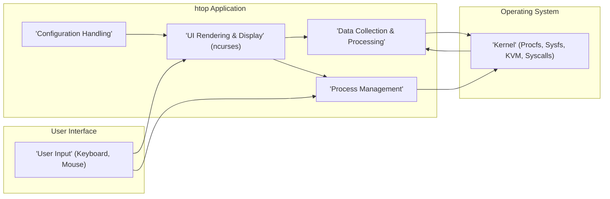
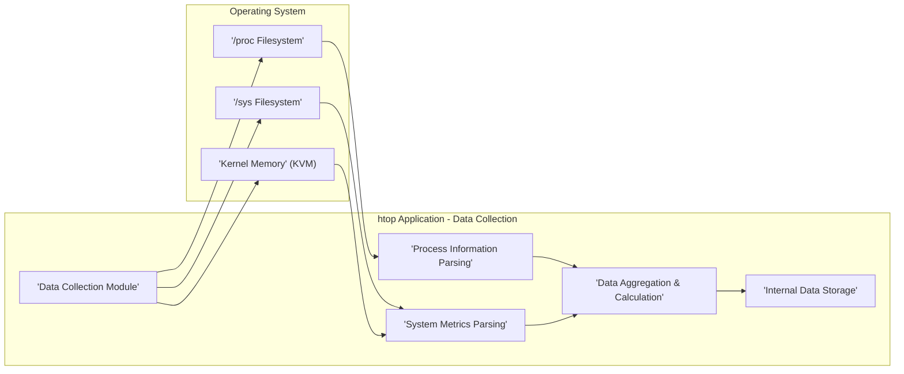
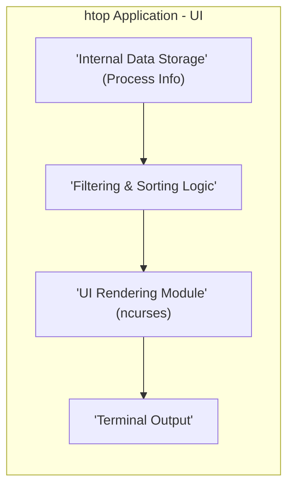
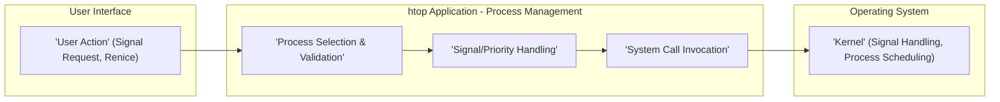

# Project Design Document: htop - Interactive Process Viewer

**Version:** 1.1
**Date:** October 26, 2023
**Author:** AI Software Architect

## 1. Introduction

This document provides an enhanced and detailed design overview of the `htop` project, an interactive process viewer for Linux, macOS, and FreeBSD. This document aims to clearly articulate the system's architecture, components, and data flow, making it suitable for subsequent threat modeling activities. This revision includes more specific details and clarifications based on a review of the initial design.

`htop` is a command-line utility that allows users to interactively monitor system processes and resources. It presents a real-time, dynamically updated view of running processes, along with key system metrics like CPU usage, memory consumption, and swap usage. Unlike the traditional `top` command, `htop` offers a more user-friendly interface with features like scrolling, filtering, and process management actions, all within a text-based terminal environment.

## 2. Goals and Objectives

The primary goals of `htop` are:

*   Provide a user-friendly and interactive interface for monitoring system processes within a terminal.
*   Display real-time information about running processes, including detailed CPU usage (per core), memory usage (resident, virtual, shared), I/O statistics, and other relevant metrics.
*   Allow users to perform actions on processes directly from the interface, such as sending various signals (e.g., `SIGKILL`, `SIGTERM`, `SIGHUP`), changing process priority (`renice`), and tracing system calls.
*   Offer powerful filtering and sorting capabilities based on various process attributes to easily find and analyze specific processes or groups of processes.
*   Be lightweight and efficient in terms of resource consumption, minimizing its own impact on system performance.
*   Be portable across different Unix-like operating systems, adapting to variations in kernel interfaces.

## 3. System Architecture

`htop` employs a monolithic architecture, where all functionalities are tightly integrated within a single executable. The core components directly interact with the operating system kernel to gather information and execute process management commands.

### 3.1. High-Level Architecture

### 3.2. Component Description

*   **User Interface (UI) Rendering & Display (ncurses):** This component is responsible for presenting the process information and system metrics to the user within the terminal. It leverages the `ncurses` library to manage the terminal display, handle keyboard and mouse input, implement scrolling, highlighting, and dynamically update the various columns of information. It manages the layout of the screen, including the header, process list, and footer.
*   **Data Collection & Processing:** This is the central component responsible for gathering real-time information about running processes and overall system resources. It interacts directly with the operating system kernel through well-defined interfaces:
    *   **`/proc` filesystem (procfs):**  Used extensively to retrieve process-specific information like CPU time, memory usage, status, command-line arguments, and environment variables.
    *   **`/sys` filesystem (sysfs):** Used to gather system-level information such as CPU core counts, total memory, and potentially hardware details.
    *   **Kernel Virtual Memory (KVM):** In some cases, and with appropriate permissions, `htop` might directly access kernel memory via KVM to obtain specific performance metrics not readily available through procfs or sysfs.
    *   This component parses the raw data obtained from these sources, transforms it into structured data, and makes it available to the UI rendering component. It also handles aggregation and calculation of derived metrics (e.g., CPU percentage).
*   **Process Management:** This component handles user requests to perform actions on selected processes. It translates user commands (e.g., pressing 'k' to kill) into system calls:
    *   **`kill()` system call:** Used to send signals to processes. The component allows users to select from a list of signals.
    *   **`renice()` system call:** Used to change the priority of a process.
    *   Potentially other system calls for more advanced process manipulation or tracing (though core `htop` functionality primarily relies on `kill` and `renice`).
    *   This component ensures that the user has the necessary permissions to perform the requested action.
*   **Configuration Handling:** This component manages the user's configuration settings, allowing customization of the displayed columns, sorting order, color themes, and other UI preferences. It typically reads and writes configuration data to a file (usually `~/.config/htop/htoprc`). This component is responsible for parsing the configuration file on startup and applying the settings to the UI and data display.

## 4. Data Flow

The primary data flow within `htop` involves the continuous cycle of retrieving process and system information from the kernel and presenting it in an interactive manner to the user.

### 4.1. Data Collection Flow (Detailed)

*   **Initialization:** On startup, the `Data Collection Module` identifies the available and relevant data sources (procfs, sysfs, KVM if enabled and permitted).
*   **Periodic Data Retrieval:** The module periodically reads data from specific files and directories within `/proc` (e.g., `/proc/[pid]/stat`, `/proc/[pid]/status`, `/proc/meminfo`, `/proc/stat`) and `/sys` (e.g., `/sys/devices/system/cpu/`) at a configurable refresh interval. It might also access kernel memory via KVM for specific metrics like hardware performance counters.
*   **Raw Data Parsing:** The retrieved data, which is typically in text format, is parsed by the `Process Information Parsing` and `System Metrics Parsing` sub-modules. This involves extracting relevant fields using string manipulation and conversion techniques.
*   **Data Aggregation and Calculation:** The parsed data is then processed by the `Data Aggregation & Calculation` module. This involves calculating derived metrics like CPU percentage utilization (requiring comparisons between snapshots of CPU time), memory percentages, and potentially I/O rates.
*   **Internal Data Storage:** The processed and calculated data is stored in efficient internal data structures within the `Internal Data Storage`. This is typically an array or linked list of structures, where each structure represents a process and its associated attributes.

### 4.2. Display Update Flow (Detailed)

*   **Refresh Trigger:** The UI update is triggered periodically based on the configured refresh interval or when user interaction necessitates an immediate screen update (e.g., after sending a signal).
*   **Data Retrieval:** The `UI Rendering Module` accesses the `Internal Data Storage` to retrieve the latest process information.
*   **Filtering and Sorting:** If the user has applied filters or sorting rules, the `Filtering & Sorting Logic` module processes the data to present only the relevant processes in the desired order.
*   **Formatting and Rendering:** The `UI Rendering Module` formats the data for display in the terminal. This includes:
    *   Column alignment and width management.
    *   Applying color coding based on resource usage or process state.
    *   Drawing the header, process list, and footer sections.
    *   Handling scrolling and highlighting of selected processes.
*   **Terminal Output:** The formatted data is sent to the terminal using `ncurses` functions, which efficiently update only the changed portions of the screen, minimizing redraw overhead.

### 4.3. Process Management Flow (Detailed)

*   **User Input:** The user interacts with the UI to select a process and request an action, such as sending a signal (e.g., pressing 'k' for kill) or changing the process priority (e.g., pressing '<' or '>').
*   **Process Selection & Validation:** The `Process Management` module identifies the target process based on the user's selection. It may perform basic validation to ensure a valid process is selected.
*   **Signal/Priority Handling:** The module determines the specific signal to be sent or the new priority level based on the user's input.
*   **System Call Invocation:** The `System Call Invocation` sub-module uses the appropriate system call:
    *   `kill(pid, signal)` to send a signal to the target process.
    *   `renice(priority, pid)` to change the priority of the target process.
*   **Kernel Action:** The operating system kernel receives the system call and takes the corresponding action: delivering the signal to the process or adjusting its scheduling priority.

## 5. Security Considerations (Enhanced)

While `htop` primarily reads information, its ability to send signals to processes introduces potential security considerations that need careful examination.

*   **Privilege Escalation (Indirect):** `htop` itself runs with the user's privileges. However, the ability to send signals allows a user to potentially disrupt or terminate processes belonging to other users *if* the user running `htop` has the necessary permissions to signal those processes. This highlights the importance of proper Unix permission management. A compromised user account running `htop` could be used to attack other processes.
*   **Information Disclosure (Terminal Exposure):** `htop` displays sensitive information about running processes, including command-line arguments (which might contain secrets), user IDs, resource usage, and environment variables. If an unauthorized user gains physical access to the terminal where `htop` is running (e.g., over SSH without proper security), this information is readily exposed.
*   **Input Validation (Limited but Present):** While `htop`'s direct user input is primarily through keyboard shortcuts, the process filtering and search functionalities could theoretically be vulnerable to injection issues if not carefully implemented. For example, if process names or command-line arguments are used directly in shell commands without proper sanitization (though this is unlikely in `htop`'s core functionality).
*   **Dependency Vulnerabilities (ncurses):** `htop` relies on the `ncurses` library for its terminal interface. Vulnerabilities in `ncurses` could potentially be exploited to compromise `htop` or the system. Keeping dependencies updated is crucial.
*   **Signal Injection (Abuse of Functionality):** A malicious actor with sufficient privileges (or a compromised user account) could use `htop` to send signals to critical system processes, leading to denial of service or system instability. This underscores the need to restrict access to accounts with broad signaling permissions.
*   **Configuration File Security (User-Specific Risk):** The configuration file (`~/.config/htop/htoprc`) stores user preferences. While not directly a security vulnerability in `htop` itself, a compromised configuration file could potentially be used to subtly alter `htop`'s behavior or display, potentially misleading the user.
*   **Local Exploitation (Less Likely):** Due to its nature as a command-line utility, `htop` is less susceptible to remote exploitation. However, vulnerabilities in the parsing of `/proc` or `/sys` data, or in the `ncurses` library, could potentially be exploited locally by a malicious process.

## 6. Deployment

`htop` is typically deployed as a standalone, statically or dynamically linked executable.

*   **Installation:** It is commonly installed via package managers on Linux distributions (e.g., `apt install htop`, `yum install htop`, `pacman -S htop`), through ports collections on BSD systems, or compiled directly from source code.
*   **Execution:** Users execute `htop` from the command line within a terminal emulator. It requires a terminal environment that supports `ncurses`.
*   **Permissions:** `htop` requires read access to the `/proc` and `/sys` filesystems to gather process and system information. Sending signals to other processes requires the user running `htop` to have the necessary permissions to signal those specific processes, as determined by the operating system's security policies.

## 7. Technologies Used

*   **Core Programming Language:** C (primarily)
*   **User Interface Library:** `ncurses` (for terminal manipulation and UI rendering)
*   **Operating System Interface Libraries/Headers:** Standard C library (`libc`) for system calls and file I/O.
*   **Operating System Interfaces (Direct Interaction):**
    *   `/proc` filesystem (procfs) - for process-specific information.
    *   `/sys` filesystem (sysfs) - for system-level information.
    *   System calls (e.g., `kill()`, `renice()`, potentially others).
    *   Potentially Kernel Virtual Memory (KVM) access (requires specific permissions and kernel configuration).
*   **Build System:** Autotools (autoconf, automake) or CMake are commonly used for building `htop` from source.

## 8. Future Considerations

*   **Enhanced Security Auditing:** While not a primary focus, incorporating more robust input sanitization and validation, especially in any future features that involve more complex user input or interaction with external data, could be considered.
*   **Modularization and Plugin Architecture:** Exploring a more modular architecture could improve maintainability, testability, and allow for the development of plugins to extend `htop`'s functionality without modifying the core.
*   **Extended Metrics and Data Sources:** Adding support for displaying more advanced system metrics (e.g., GPU usage, network statistics) or integrating with other monitoring data sources could enhance its utility.
*   **Improved Error Handling and Resilience:** Enhancing error handling, especially when interacting with the operating system, could make `htop` more robust in various system conditions.
*   **Consideration of Modern Terminal Features:** Exploring the use of more modern terminal features beyond basic `ncurses` capabilities could potentially lead to richer UI experiences in the future.

This document provides an enhanced and more detailed design overview of the `htop` project, suitable for use in subsequent threat modeling activities. The refined descriptions of the architecture, data flow, and security considerations offer a more comprehensive understanding of the system and its potential vulnerabilities.
