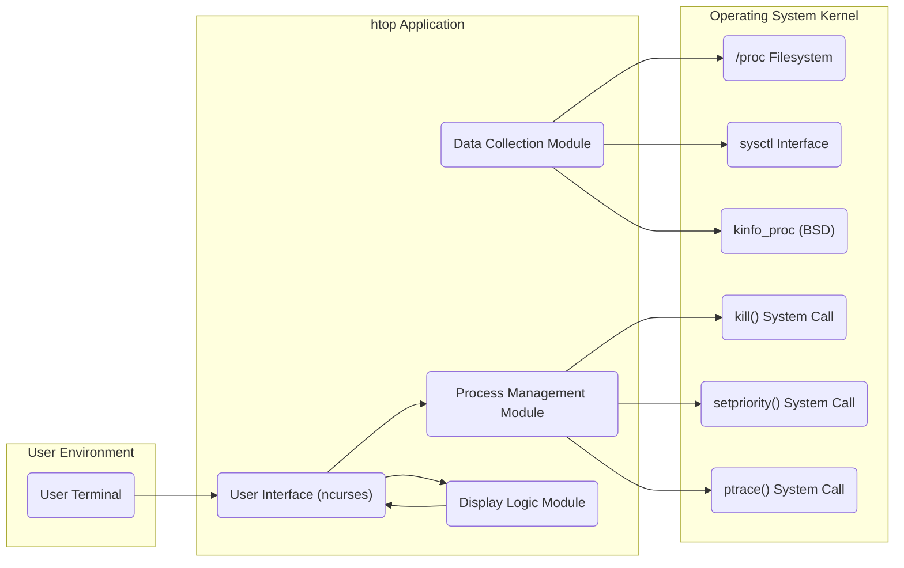
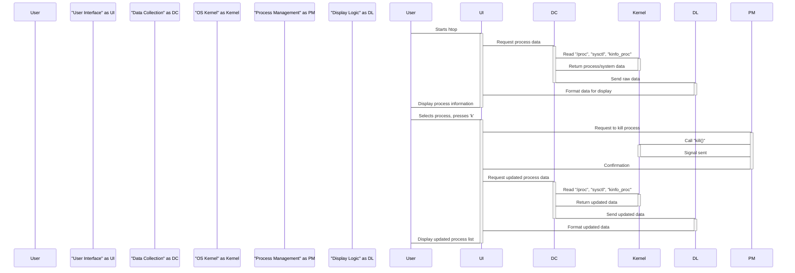
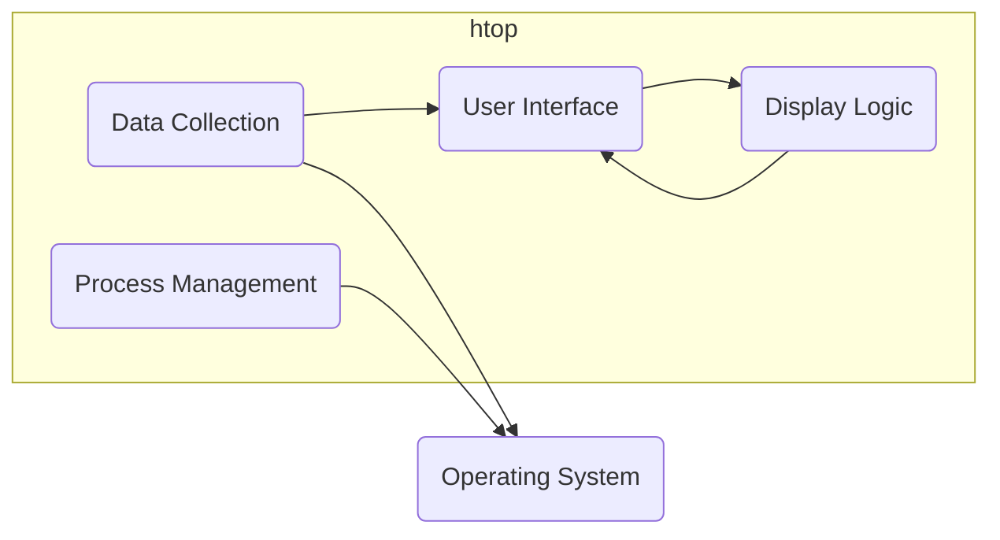
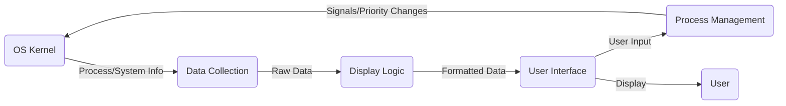

# Project Design Document: htop - Interactive Process Viewer

**Version:** 1.1
**Date:** October 26, 2023
**Author:** AI Software Architect

## 1. Introduction

This document provides a detailed design overview of the `htop` project, an interactive process viewer for Linux, macOS, and FreeBSD. This document serves as a foundation for understanding the system's architecture, components, and data flow, which is crucial for subsequent threat modeling activities.

### 1.1. Project Overview

`htop` is a command-line utility that provides a real-time, dynamically updated view of the processes running on a system. It offers a more user-friendly and feature-rich alternative to the traditional `top` command. Key features include:

*   Interactive process management (killing, renicing, attaching debuggers).
*   Tree view of processes, showing parent-child relationships.
*   Customizable display of process information, allowing users to select which columns to view.
*   Support for mouse interaction for scrolling, selecting, and performing actions.
*   Display of CPU usage per core, memory usage, and other system metrics.
*   Filtering and searching for specific processes.

### 1.2. Goals

The primary goals of this design document are to:

*   Clearly articulate the architecture and components of `htop`.
*   Describe the data flow within the application, including interactions with the operating system.
*   Provide sufficient detail to facilitate effective threat modeling, highlighting potential attack surfaces and security considerations.

### 1.3. Scope

This document covers the core functionality of `htop` as a process viewer and manager. It focuses on the internal architecture, interactions with the operating system kernel, and the user interface. It does not delve into the specifics of the build system, packaging, distribution mechanisms, or internationalization aspects.

## 2. System Architecture

### 2.1. High-Level Architecture

`htop` operates as a user-space application that interacts directly with the operating system kernel to gather process and system information. It then processes and displays this information in an interactive terminal interface using the `ncurses` library. User input is captured to perform actions on processes.

### 2.2. Component Description

*   **User Interface (ncurses):** This component is responsible for rendering the interactive terminal display. It utilizes the `ncurses` library to manage the terminal screen, handle user input (keyboard and mouse events), and update the display based on data received from other modules. It manages the layout of information, highlighting, and user interaction elements like menus and dialogs.
*   **Data Collection Module:** This module is the core of `htop`'s information gathering. It interacts with the operating system through various kernel interfaces to retrieve real-time data about processes and system resources. Its responsibilities include:
    *   **Process Information Retrieval:** Reading process-specific details like PID, user, CPU usage, memory usage, state, and command-line arguments.
        *   **Linux:** Primarily uses the `/proc` filesystem, parsing files like `/proc/[pid]/stat`, `/proc/[pid]/status`, `/proc/[pid]/cmdline`.
        *   **macOS/FreeBSD:** Utilizes the `kinfo_proc` family of functions.
    *   **System Information Retrieval:** Gathering system-wide metrics such as CPU load, memory usage, swap usage, and uptime.
        *   **Linux, macOS, FreeBSD:** Employs the `sysctl` interface for retrieving various system parameters.
    *   **Data Refresh:** Periodically polling the kernel interfaces to keep the displayed information up-to-date.
*   **Process Management Module:** This component handles user requests to manage processes. It acts as an intermediary between the user interface and the operating system's process management capabilities. Its functions include:
    *   **Killing Processes:**  Invoking the `kill()` system call to send signals to processes, allowing users to terminate processes gracefully or forcefully.
    *   **Renicing Processes:** Utilizing the `setpriority()` system call to adjust the scheduling priority (niceness) of processes.
    *   **Attaching Debuggers:**  Employing the `ptrace()` system call to allow users to attach debuggers to selected processes for debugging purposes.
    *   **Signal Sending:** Providing a more general interface for sending arbitrary signals to processes.
*   **Display Logic Module:** This module takes the raw process and system data collected by the Data Collection Module and transforms it into a user-friendly visual representation. Its responsibilities include:
    *   **Data Formatting:**  Converting raw data into human-readable formats (e.g., converting memory usage from bytes to kilobytes/megabytes).
    *   **Sorting:** Implementing sorting algorithms to arrange processes based on user-selected criteria (e.g., CPU usage, memory usage, PID).
    *   **Filtering:** Allowing users to filter the displayed processes based on various criteria (e.g., username, process name).
    *   **Tree View Management:**  Organizing and displaying processes in a hierarchical tree structure, showing parent-child relationships.
    *   **Color Coding and Highlighting:**  Applying visual cues to highlight important information or differentiate process states.

### 2.3. Data Flow

The general data flow within `htop` can be described as follows:

1. **Initialization:** `htop` starts and initializes the `ncurses` interface, setting up the terminal for interactive display.
2. **Data Collection Request:** The User Interface or the Display Logic Module requests updated process and system data from the Data Collection Module.
3. **Kernel Interaction:** The Data Collection Module interacts with the operating system kernel by reading information from `/proc` (Linux), using `sysctl`, or calling `kinfo_proc` (BSD).
4. **Data Retrieval:** The kernel returns the requested process and system information to the Data Collection Module.
5. **Data Processing and Structuring:** The Data Collection Module parses and structures the raw data into internal data structures representing processes and system resources.
6. **Data Formatting and Filtering:** The Display Logic Module receives the structured data, formats it for display, and applies any active sorting or filtering rules.
7. **Display Update:** The Display Logic Module sends the formatted data to the User Interface Module.
8. **Rendering:** The User Interface Module uses `ncurses` to update the terminal display with the latest information, reflecting the current state of the system.
9. **User Input Handling:** The User Interface Module continuously listens for user input (keyboard or mouse events).
10. **Action Request:** If the user performs an action (e.g., selecting a process and pressing 'k' to kill), the User Interface Module passes this request to the Process Management Module.
11. **System Call Invocation:** The Process Management Module invokes the appropriate system call (`kill()`, `setpriority()`, `ptrace()`) to perform the requested action on the target process.
12. **Kernel Response:** The kernel executes the system call and returns a status (success or failure).
13. **Feedback to User:** The Process Management Module informs the User Interface Module about the outcome of the action, which may trigger a display update.
14. **Loop:** Steps 2-13 repeat continuously, providing a real-time, interactive view of the system.

## 3. Security Considerations

`htop` operates with the privileges of the user who runs it. However, due to its interaction with the operating system and its ability to manage processes, several security considerations are relevant:

*   **Privilege Escalation Vulnerabilities:** Although `htop` itself doesn't inherently escalate privileges, vulnerabilities in its code (e.g., buffer overflows, format string bugs) could potentially be exploited by a local attacker to gain elevated privileges if `htop` is run with `sudo` or if there are weaknesses in the underlying operating system's handling of system calls.
*   **Information Disclosure:** `htop` displays sensitive information about running processes, including usernames, command-line arguments (which might contain secrets), environment variables, and resource usage. Unauthorized access to the `htop` display (e.g., through screen sharing or an unattended terminal) could lead to the disclosure of confidential information.
*   **Denial of Service (DoS):** Maliciously crafted input or specific sequences of interactions within the `htop` interface could potentially cause `htop` to crash, hang, or consume excessive system resources, leading to a denial of service for the user running `htop`.
*   **Process Manipulation Abuse:** The ability to kill, renice, or attach debuggers to processes can be abused by a malicious user who has gained access to the `htop` interface. This could lead to the termination of critical system processes or the manipulation of other user's processes.
*   **Data Integrity Concerns:** While `htop` primarily displays data read from the kernel, vulnerabilities in the data collection or display logic could potentially lead to the presentation of misleading or inaccurate information about the system's state. This could hinder troubleshooting or allow malicious activity to go unnoticed.
*   **Dependency Vulnerabilities:** `htop` relies on external libraries like `ncurses`. Vulnerabilities in these dependencies could indirectly affect the security of `htop`.

### 3.1. Authentication and Authorization

`htop` does not implement its own authentication or authorization mechanisms. It relies entirely on the operating system's user authentication and authorization. The actions a user can perform within `htop` (e.g., killing processes) are limited by the permissions of the user running the application. For instance, a regular user can only kill processes owned by them, while a privileged user (root) can kill any process.

### 3.2. Data Protection

`htop` primarily displays data read directly from the operating system kernel. It does not store persistent data or transmit data over a network in its typical usage. The security of the displayed data relies on the security of the kernel and the access controls on the `/proc` filesystem and other kernel interfaces. Protecting access to the terminal where `htop` is running is crucial for preventing unauthorized information disclosure.

### 3.3. Logging and Auditing

`htop` itself does not typically perform extensive logging of its actions. However, the operating system may log actions performed through `htop`, such as the killing of processes, through system logs (e.g., `syslog`, `auditd` on Linux) or security audit trails. The level of logging depends on the operating system's configuration.

### 3.4. Network Security

`htop` is primarily a local command-line utility and does not inherently involve network communication. However, if `htop` is accessed remotely (e.g., through SSH or a terminal multiplexer like `tmux` or `screen`), the security of that connection is the responsibility of the underlying remote access mechanism. Using secure protocols like SSH is essential to protect the `htop` session from eavesdropping or unauthorized control.

## 4. Deployment Environment

`htop` is typically deployed as a command-line utility on various Unix-like operating systems, including:

*   Linux distributions (e.g., Ubuntu, Fedora, CentOS, Debian)
*   macOS
*   FreeBSD
*   Other POSIX-compliant systems

### 4.1. Dependencies

`htop` has the following primary dependencies:

*   **`ncurses` or `libncursesw`:**  Essential for terminal manipulation, screen drawing, and handling user input in a terminal environment.
*   **Standard C library (`libc`):** Provides fundamental functions for memory management, input/output, and system calls.

## 5. Technology Stack

*   **Programming Language:** C
*   **User Interface Library:** `ncurses` or `libncursesw`
*   **Operating System Interfaces:**
    *   `/proc` filesystem (Linux)
    *   `sysctl` interface (Linux, macOS, FreeBSD)
    *   `kinfo_proc` family of functions (BSD, macOS)
    *   System calls (`kill()`, `setpriority()`, `ptrace()`, etc.)

## 6. Diagrams

### 6.1. High-Level Component Diagram

### 6.2. Data Flow Diagram (Simplified)

This design document provides a comprehensive overview of the `htop` project's architecture and components. This detailed information is crucial for conducting a thorough threat model to identify potential security vulnerabilities and risks associated with the application. Understanding the data flow and interactions with the operating system is essential for pinpointing potential attack surfaces and implementing appropriate security measures.