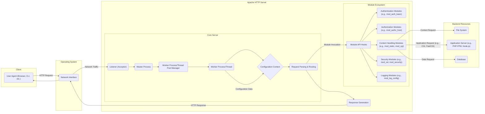

# Project Design Document: Apache HTTP Server (httpd) - Enhanced

**Version:** 1.1
**Date:** October 26, 2023
**Author:** AI Software Architect

## 1. Introduction

This document provides an enhanced and more detailed design overview of the Apache HTTP Server (httpd), an open-source, cross-platform web server. This enhanced version aims to provide a deeper understanding of the system's architecture, components, and data flow, specifically tailored for effective threat modeling. The design is based on the publicly available source code and documentation of the Apache HTTP Server project. This document builds upon the previous version by adding more granular detail and focusing on security-relevant aspects.

## 2. Goals and Objectives

*   Provide a clear, concise, and more detailed description of the Apache HTTP Server's architecture.
*   Identify key components and their interactions with a focus on security boundaries and data transformations.
*   Outline the data flow within the server, highlighting potential points of vulnerability.
*   Elaborate on important security considerations, design choices, and potential threats.
*   Serve as a comprehensive and improved reference document for threat modeling exercises.

## 3. Scope

This document focuses on the core architecture and functionality of the Apache HTTP Server, providing a more in-depth look at its internal workings relevant to security. It includes:

*   The main server process and its responsibilities, including process management.
*   The request processing lifecycle with a focus on module interaction points.
*   Key modules and their roles, with emphasis on security-related modules.
*   Configuration mechanisms and their security implications.
*   Detailed explanation of basic and advanced security features.

This document still does not cover:

*   Specific module implementations in exhaustive detail, but provides more context.
*   Operating system-specific configurations beyond general principles.
*   Detailed performance tuning aspects unless directly related to security.
*   Third-party modules beyond their general interaction with the core server, but common examples are elaborated upon.

## 4. High-Level Architecture

The Apache HTTP Server employs a modular architecture, facilitating extensibility and customization. The core server process manages incoming requests and delegates processing through a series of modules. This architecture introduces various trust boundaries and points of interaction that are crucial for threat modeling.

**Key Components (Enhanced Descriptions):**

*   **Listener (Acceptor):**  Operates at the network layer, utilizing OS system calls to listen on configured ports. It's the initial entry point and a potential target for denial-of-service attacks.
*   **Master Process:**  The parent process responsible for initializing the server, reading configuration files, and managing worker processes/threads. It typically runs with higher privileges and is a critical component for security.
*   **Worker Process/Thread Pool Manager:**  Manages the pool of worker processes or threads, dynamically allocating them to handle incoming connections. The choice of MPM (Multi-Processing Module) impacts resource utilization and security isolation.
*   **Worker Processes/Threads:**  Handle individual client requests within their allocated resources. Security vulnerabilities within a worker process are often contained within that process, depending on the MPM.
*   **Configuration Context:** Represents the loaded server configuration, including directives for modules, virtual hosts, and security settings. Misconfigurations are a common source of vulnerabilities.
*   **Request Parsing & Routing:**  Analyzes the incoming HTTP request, validating its format and determining the appropriate handler based on the requested URI and server configuration. This stage is susceptible to various injection attacks if not implemented carefully.
*   **Module API Hooks:**  Defines the interfaces through which modules interact with the core server. This provides extensibility but also introduces potential security risks if modules are not well-vetted.
*   **Authentication Modules:**  Verify the identity of the client (e.g., `mod_auth_basic`, `mod_auth_digest`, `mod_auth_openidc`). Vulnerabilities in these modules can lead to unauthorized access.
*   **Authorization Modules:**  Determine if an authenticated user is permitted to access the requested resource (e.g., `mod_authz_host`, `mod_authz_user`, `mod_authz_core`). Incorrect authorization rules can lead to privilege escalation.
*   **Content Handling Modules:**  Process the request and generate or retrieve the content to be served (e.g., `mod_static` for static files, `mod_cgi` for CGI scripts, `mod_proxy_fcgi` for FastCGI applications). These modules often interact with external resources and are potential points of vulnerability.
*   **Security Modules:**  Provide additional security features (e.g., `mod_ssl` for TLS/SSL encryption, `mod_security` for a web application firewall). Proper configuration is crucial for their effectiveness.
*   **Logging Modules:**  Record server activity, including access attempts and errors (`mod_log_config`). Secure logging practices are essential for incident detection and forensics.
*   **Response Generation:**  Constructs the HTTP response, including headers and the response body, ensuring adherence to HTTP standards. Improperly formatted responses can sometimes lead to client-side vulnerabilities.

## 5. Component Details

This section provides a more detailed examination of the key components, focusing on their functionality and security implications.

*   **Listener (Acceptor):**
    *   Utilizes system calls like `socket()`, `bind()`, and `listen()` to establish listening sockets on specified IP addresses and ports.
    *   Accepts new connections using `accept()`, potentially creating a new socket for each connection.
    *   Configuration directives like `Listen` define the listening addresses and ports.
    *   Susceptible to SYN flood attacks and other connection-based denial-of-service attacks.

*   **Master Process:**
    *   Typically started by the operating system's init system or a service manager.
    *   Reads the main configuration file (`httpd.conf`) and any included configuration files.
    *   Binds to privileged ports (if necessary) before forking or spawning worker processes/threads.
    *   Manages signal handling for graceful restarts and shutdowns.
    *   A compromise of the master process could have severe consequences for the entire server.

*   **Worker Processes/Threads:**
    *   The number of worker processes/threads is determined by the configured MPM (e.g., `mpm_prefork`, `mpm_worker`, `mpm_event`).
    *   Each worker handles one or more concurrent connections.
    *   Workers operate within the security context of the user the server is running as (typically `www-data` or `apache`).
    *   Resource limits (e.g., memory, file descriptors) can be configured to mitigate the impact of resource exhaustion attacks.

*   **Configuration Context:**
    *   Configuration files are parsed and interpreted by the server.
    *   Directives are processed in a specific order, and their scope can be global or limited to specific directories or virtual hosts.
    *   Security misconfigurations, such as overly permissive access controls or insecure module settings, are common vulnerabilities.
    *   `.htaccess` files allow for decentralized configuration, which can be a security risk if not managed properly.

*   **Request Parsing & Routing:**
    *   Parses the HTTP request line, including the method, URI, and protocol version.
    *   Validates the request format to prevent malformed requests from causing errors or exploiting vulnerabilities.
    *   Decodes URL-encoded characters and handles different character encodings.
    *   Routes the request to the appropriate handler based on virtual host configuration, directory directives, and module configurations.
    *   Vulnerable to buffer overflows, format string bugs, and other parsing-related vulnerabilities if not implemented securely.

*   **Module API Hooks:**
    *   Modules register callback functions (hooks) that are executed at specific stages of the request processing lifecycle.
    *   The order in which modules are loaded and their hooks are executed can be significant for security.
    *   Vulnerabilities in individual modules can potentially compromise the entire server.

*   **Authentication Modules:**
    *   Implement various authentication schemes, such as Basic, Digest, and integration with external authentication providers.
    *   Secure storage and handling of credentials are critical.
    *   Vulnerabilities can lead to unauthorized access to protected resources.

*   **Authorization Modules:**
    *   Enforce access control policies based on user identity, IP address, hostname, or other criteria.
    *   Incorrectly configured authorization rules can lead to unauthorized access or privilege escalation.

*   **Content Handling Modules:**
    *   `mod_static`: Serves static files directly from the file system. Vulnerabilities can arise from path traversal issues or serving sensitive files.
    *   `mod_cgi`: Executes external scripts (CGI). Security risks include command injection vulnerabilities in CGI scripts.
    *   `mod_proxy_fcgi`: Proxies requests to FastCGI applications. Misconfigurations can lead to information disclosure or SSRF (Server-Side Request Forgery) vulnerabilities.

*   **Security Modules:**
    *   `mod_ssl`: Provides TLS/SSL encryption. Proper configuration of cipher suites, protocols, and certificate management is crucial.
    *   `mod_security`: Acts as a web application firewall, providing protection against common web attacks. Requires careful configuration of rulesets.

*   **Logging Modules:**
    *   `mod_log_config`: Configures the format and destination of access and error logs.
    *   Logs can contain sensitive information and should be protected from unauthorized access.
    *   Proper logging is essential for security monitoring and incident response.

## 6. Data Flow (Enhanced)

The following outlines the typical data flow for an incoming HTTP request, highlighting potential security considerations at each stage:

1. **Client sends an HTTP request** to the server's listening port. This initial transmission is unencrypted unless HTTPS is used.
2. **The Listener on the Operating System receives the network traffic.** This is the first point of contact and a potential target for network-level attacks.
3. **The Apache Listener (Acceptor) accepts the connection.**  Resource exhaustion attacks can target this stage.
4. **An available Worker process/thread is assigned** to handle the connection. The selection process should be robust to prevent denial-of-service.
5. **The Worker reads the incoming request data from the socket.** Buffer overflows or other input validation issues can occur here.
6. **The Request Parsing component analyzes the request.**  This stage is vulnerable to injection attacks (e.g., SQL injection via headers, XSS via referer).
7. **Based on the configuration and the request URI, relevant Module Handlers are invoked.** The order of module invocation is critical for security.
8. **Authentication Modules verify the client's identity.**  Weak authentication mechanisms or vulnerabilities in these modules can be exploited.
9. **Authorization Modules determine if the authenticated user has permission.** Misconfigured authorization rules can lead to unauthorized access.
10. **Content Handling Modules process the request:**
    *   For static files, `mod_static` accesses the file system. Path traversal vulnerabilities are a concern.
    *   For dynamic content, modules like `mod_cgi` or `mod_proxy_fcgi` interact with backend applications. This introduces new trust boundaries and potential vulnerabilities in the backend. Data passed to backend applications must be sanitized.
11. **The Content Generation/Retrieval component obtains the content.**  Access control on backend resources is crucial.
12. **The Response Generation component constructs the HTTP response.**  Improperly formatted responses can lead to client-side vulnerabilities. Sensitive information should not be inadvertently included in headers or the response body.
13. **Security Modules may process the response** (e.g., adding security headers, filtering malicious content). Proper configuration is essential.
14. **Logging Modules record the request and response details.**  Ensure sensitive data is not logged inappropriately.
15. **The Worker sends the HTTP response back to the client.** If HTTPS is used, `mod_ssl` encrypts the response before transmission.
16. **The Operating System sends the network traffic back to the client.**
17. **The Client receives and processes the HTTP response.** Client-side vulnerabilities can be exploited if the response is malicious.

## 7. Security Considerations (Enhanced)

Security is paramount for the Apache HTTP Server. Key security considerations, with more specific examples, include:

*   **Input Validation:**  All input, including headers, URLs, and request bodies, must be rigorously validated to prevent injection attacks (SQL injection, command injection, XSS). For example, `mod_security` can be used to enforce input validation rules.
*   **Authentication and Authorization:** Employ strong authentication mechanisms (e.g., multi-factor authentication where appropriate) and enforce the principle of least privilege through fine-grained authorization rules. Regularly review and update access control lists.
*   **Encryption (HTTPS):**  Enforce HTTPS by default and use strong TLS configurations, including up-to-date protocols and cipher suites. Regularly renew SSL/TLS certificates and use tools like SSL Labs to assess configuration.
*   **Access Control:**  Utilize `<Directory>`, `<Location>`, and `.htaccess` directives carefully to restrict access to sensitive resources. Avoid overly permissive configurations.
*   **Vulnerability Management:**  Establish a process for regularly updating the Apache HTTP Server and all loaded modules to patch known security vulnerabilities. Subscribe to security mailing lists and monitor vulnerability databases.
*   **Logging and Auditing:**  Configure comprehensive logging to track access attempts, errors, and other relevant events. Securely store and regularly analyze logs for suspicious activity. Consider using a Security Information and Event Management (SIEM) system.
*   **Process Isolation:**  Choose an appropriate MPM based on security requirements. `mpm_prefork` provides better isolation but can be less resource-efficient than thread-based MPMs.
*   **Principle of Least Privilege:**  Run the Apache processes with the minimum necessary privileges. Avoid running the server as the root user.
*   **Secure Configuration:**  Harden the server configuration by disabling unnecessary modules, setting appropriate timeouts, and limiting resource usage. Follow security best practices and use tools like Lynis for security auditing.
*   **Web Application Firewall (WAF):**  Consider using a WAF like `mod_security` to provide an additional layer of protection against common web attacks. Regularly update WAF rule sets.
*   **Regular Security Audits and Penetration Testing:**  Conduct periodic security assessments to identify potential vulnerabilities and weaknesses in the server configuration and application logic.

## 8. Deployment

Apache HTTP Server deployment considerations with security implications:

*   **Standalone Server:**  Requires careful configuration and monitoring as it represents a single point of failure and attack.
*   **Load Balanced Cluster:**  Distributes traffic and can improve availability and resilience. Ensure secure communication between load balancers and backend Apache instances.
*   **Reverse Proxy:**  Hides backend servers and can provide security benefits by centralizing security controls. Secure configuration of the proxy is crucial to prevent vulnerabilities like open redirects or SSRF.
*   **Containerized Environments:**  Provides isolation and portability. Ensure container images are built securely and updated regularly. Use security scanning tools for container images.

## 9. Technologies Used

*   **Programming Language:** Primarily C, with some modules potentially using other languages.
*   **Configuration Language:**  Apache's directive-based configuration language.
*   **Protocols:** HTTP/1.1, HTTP/2, potentially HTTP/3.
*   **Security Protocols:** TLS/SSL.
*   **Operating Systems:** Cross-platform, runs on a wide range of operating systems.

## 10. Future Considerations

*   Continued adoption of newer HTTP standards and security protocols.
*   Integration with cloud-native security tools and practices.
*   Enhancements to the module ecosystem for improved security and functionality.
*   Focus on performance and efficiency while maintaining a strong security posture.

This enhanced document provides a more detailed and security-focused understanding of the Apache HTTP Server's design. This information is crucial for conducting thorough and effective threat modeling exercises to identify potential security vulnerabilities and design appropriate mitigations. The added granularity and emphasis on security boundaries and data flow will aid in a more comprehensive threat assessment.
