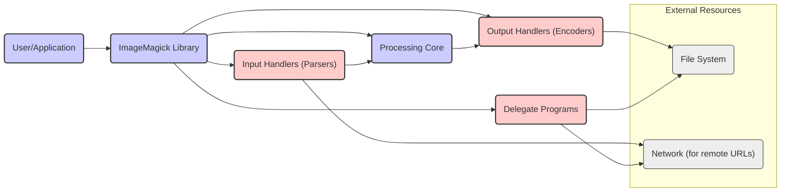
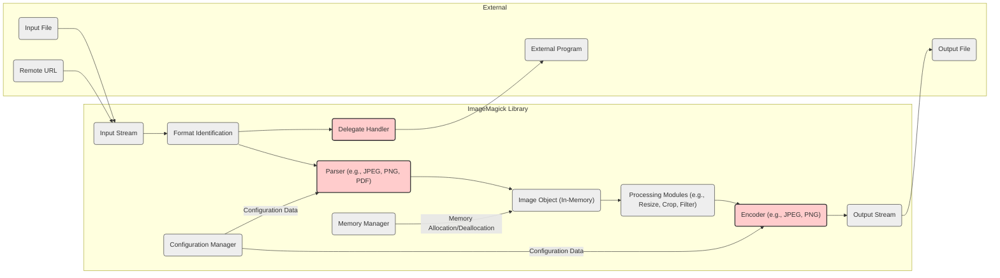
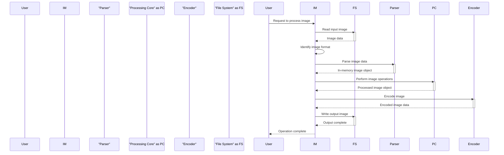

# Project Design Document: ImageMagick for Threat Modeling (Improved)

**Version:** 2.0
**Date:** October 26, 2023
**Author:** AI Software Architect

## 1. Introduction

This document provides an enhanced architectural overview of the ImageMagick project, specifically tailored for effective threat modeling. It meticulously details the core library's components, data flow pathways, and external interaction points, all with a strong emphasis on identifying potential security vulnerabilities and attack surfaces. This document serves as a critical foundation for security analysis and aims to facilitate a comprehensive understanding of the system's security posture. The focus remains on the core library functionality, with external bindings mentioned only when directly relevant to the core's security.

## 2. Goals and Objectives

The primary goal remains to provide a comprehensive architectural understanding of ImageMagick to enable thorough and targeted threat modeling. Key objectives include:

*   Clearly defining the major components and their specific roles in processing image data, with a focus on security boundaries.
*   Illustrating the complete data flow within the system, emphasizing points where external, potentially malicious, data is ingested and processed.
*   Pinpointing key interaction points with external systems and resources that could be exploited by attackers.
*   Highlighting specific areas of the codebase known to be historically sensitive from a security perspective (e.g., parsers, delegates).
*   Providing a solid basis for identifying potential threat actors, their likely motivations, and common attack patterns against image processing libraries.
*   Enabling the detailed identification of potential vulnerabilities, attack surfaces, and the potential impact of successful exploitation.

## 3. System Architecture

ImageMagick is a versatile software suite designed for displaying, converting, and editing a wide array of raster and vector image file formats. The core functionality resides within a central library (typically named `libMagickCore` or similar).

### 3.1. High-Level Architecture

*   **User/Application:** Represents the external entity (software application or direct user interaction) that initiates ImageMagick operations. This is a potential source of malicious input.
*   **ImageMagick Library:** The central component responsible for all core image processing tasks. Its security is paramount.
*   **Input Handlers (Parsers):**  Critical modules responsible for interpreting various image file formats. These are a primary attack surface due to the complexity of file formats and the need to handle potentially malformed data.
*   **Processing Core:** The engine that executes image manipulation operations. While less directly exposed to external input, vulnerabilities here could be triggered by crafted image objects.
*   **Output Handlers (Encoders):** Modules responsible for writing processed images. Less of a direct attack surface but could be a target for denial-of-service or unexpected output issues.
*   **Delegate Programs:** External executables invoked by ImageMagick to handle specific formats or operations. These represent a significant security risk if not managed carefully.
*   **File System:** Used for reading input, writing output, and potentially accessing configuration. Permissions and access control are key security considerations.
*   **Network (for remote URLs):** Enables fetching images from remote sources, introducing risks like Server-Side Request Forgery (SSRF) and exposure to malicious content.

### 3.2. Component-Level Architecture (Simplified)

*   **Input Stream:**  The raw byte stream entering ImageMagick. This is the initial point where malicious data can be introduced.
*   **Format Identification:**  Determines the image format, influencing which parser is invoked. Incorrect identification could lead to unexpected behavior or vulnerabilities.
*   **Parser (e.g., JPEG, PNG, PDF):**  Responsible for interpreting the input stream according to the image format specification. These are highly complex and prone to vulnerabilities like buffer overflows, integer overflows, and format string bugs. Each parser represents a distinct attack surface.
*   **Image Object (In-Memory):** The internal representation of the image. Vulnerabilities in processing modules could corrupt this object, leading to further issues.
*   **Processing Modules (e.g., Resize, Crop, Filter):**  Perform image manipulations. Bugs in these modules could lead to unexpected behavior or security issues if they operate on corrupted image data.
*   **Output Stream:** The raw byte stream of the processed image.
*   **Encoder (e.g., JPEG, PNG):**  Converts the in-memory image object into the output format. Similar to parsers, encoders can have vulnerabilities.
*   **Delegate Handler:** Manages the execution of external programs. A major security risk due to the potential for command injection.
*   **Configuration Manager:**  Handles loading and applying configuration settings. Insecure defaults or the ability to inject malicious configurations can create vulnerabilities.
*   **Memory Manager:**  Responsible for memory allocation and deallocation. Memory management errors are a common source of security vulnerabilities in C/C++ applications.
*   **Input File:** The source image file on disk.
*   **Output File:** The destination for the processed image.
*   **External Program:** A separate executable invoked by ImageMagick.
*   **Remote URL:** A network address pointing to an image.

## 4. Data Flow

The typical data flow through ImageMagick, highlighting potential security implications at each stage:

1. **Input Acquisition:** Image data is read from a source (file, URL, standard input). *Potential Threat:* Maliciously crafted files or URLs can be introduced here.
2. **Format Detection:** ImageMagick attempts to identify the format. *Potential Threat:*  Bypassing format detection could force the use of an incorrect parser, potentially triggering vulnerabilities.
3. **Parsing:** The appropriate parser is invoked to decode the image data. *Potential Threat:* This is a critical stage where parser vulnerabilities (buffer overflows, integer overflows, etc.) can be exploited.
4. **Image Processing:** The in-memory image is manipulated. *Potential Threat:*  Vulnerabilities in processing modules could be triggered by specific image properties or operations.
5. **Encoding:** The processed image is encoded. *Potential Threat:* Encoder vulnerabilities could lead to issues, although less commonly exploited for direct code execution.
6. **Output Writing:** The encoded data is written to the destination. *Potential Threat:*  Less of a direct threat to ImageMagick itself, but could impact the receiving system.

## 5. Key Components for Security Consideration

These components are particularly sensitive from a security standpoint:

*   **Input Parsers:** The primary attack surface. Vulnerabilities here can lead to:
    *   **Buffer Overflows:**  Writing beyond allocated memory.
    *   **Integer Overflows:**  Arithmetic errors leading to incorrect memory allocation or logic.
    *   **Heap Corruption:**  Damaging the heap, potentially leading to code execution.
    *   **Denial of Service (DoS):**  Crashing the application or consuming excessive resources.
    *   **Remote Code Execution (RCE):**  Allowing an attacker to execute arbitrary code.
*   **Delegate Handler:**  A significant risk if not properly secured:
    *   **Command Injection:**  Injecting malicious commands into the arguments passed to delegates.
    *   **Arbitrary Code Execution:**  Executing any program with the privileges of ImageMagick.
    *   **Exposure to Delegate Vulnerabilities:**  If the delegate program itself has vulnerabilities.
*   **Memory Manager:** Errors in memory management can result in:
    *   **Heap Overflows/Underflows:** Similar to parser vulnerabilities.
    *   **Use-After-Free:**  Accessing memory that has already been freed.
    *   **Double-Free:**  Freeing the same memory twice.
*   **Configuration Manager:**  Improperly secured configurations can lead to:
    *   **Insecure Defaults:**  Leaving vulnerable settings enabled.
    *   **Configuration Injection:**  Injecting malicious settings to alter behavior.
*   **Network Handling (for remote URLs):** Introduces risks such as:
    *   **Server-Side Request Forgery (SSRF):**  Tricking ImageMagick into making requests to internal or external systems.
    *   **Exposure to Malicious Content:** Downloading and processing infected or malicious images.
    *   **Denial of Service:** Targeting internal infrastructure through ImageMagick.

## 6. Security Considerations

Key security considerations for ImageMagick:

*   **Input Validation and Sanitization:**  Thoroughly validate and sanitize all input data, including file headers, metadata, and pixel data, to prevent parser exploits.
*   **Secure Delegate Handling:** Implement strict controls over delegate usage. This includes:
    *   Disabling delegates by default.
    *   Using a whitelist of allowed delegates.
    *   Carefully sanitizing any data passed to delegates.
    *   Avoiding shell execution where possible.
*   **Memory Safety Practices:** Employ secure coding practices to prevent memory-related errors. Consider using memory-safe libraries or languages for new development where feasible.
*   **Resource Limits:** Implement and enforce limits on resource consumption (memory, CPU, file sizes, execution time) to mitigate DoS attacks.
*   **Principle of Least Privilege:** Run ImageMagick processes with the minimum necessary privileges.
*   **Regular Security Audits and Penetration Testing:**  Proactively identify vulnerabilities through security assessments.
*   **Keep Up-to-Date:** Regularly update ImageMagick and its dependencies to patch known vulnerabilities.
*   **Secure Configuration:**  Use secure default configurations and restrict access to configuration files.
*   **Error Handling and Logging:** Implement robust error handling to prevent information leakage and log security-relevant events.

## 7. Assumptions and Constraints

*   This document primarily focuses on the security of the core ImageMagick library. Security considerations for specific language bindings or external applications using ImageMagick may have additional complexities.
*   The architecture described is a general representation and may vary slightly across different versions or build configurations of ImageMagick.
*   The threat modeling process will assume that potential attackers have varying levels of sophistication and may target both known and unknown vulnerabilities.
*   The analysis considers both local and remote attack vectors, including scenarios where ImageMagick processes untrusted user-supplied input.

## 8. Future Considerations

*   **Sandboxing and Isolation:** Explore using sandboxing technologies (e.g., containers, seccomp) to isolate ImageMagick processes and limit the impact of potential compromises.
*   **Memory-Safe Language Adoption:**  Consider migrating critical components, especially parsers, to memory-safe languages to eliminate entire classes of vulnerabilities.
*   **Automated Fuzzing and Static Analysis:** Implement continuous fuzzing and static analysis pipelines to proactively identify potential security flaws in the codebase.
*   **Improved Delegate Management:**  Explore more secure alternatives to the current delegate mechanism, such as plugin architectures or restricted execution environments.
*   **Content Security Policies (for web contexts):** When using ImageMagick in web applications, leverage Content Security Policies to mitigate certain types of attacks.

This improved design document provides a more detailed and security-focused foundation for conducting a comprehensive threat model of ImageMagick. By understanding the architecture, data flow, and inherent security considerations, security professionals can effectively identify potential vulnerabilities, assess risks, and implement appropriate mitigation strategies.