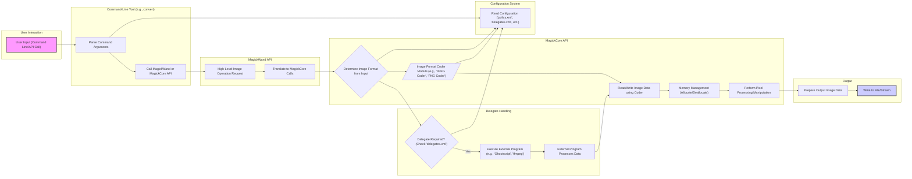

## Project Design Document: ImageMagick (Improved)

**1. Introduction**

This document provides an enhanced architectural overview of the ImageMagick project, specifically tailored for threat modeling. ImageMagick is a versatile software suite for manipulating bitmap images, encompassing creation, editing, composition, and conversion. It boasts extensive format support (over 200), including common types like PNG, JPEG, GIF, HEIC, DNG, Postscript, TIFF, and SVG. Its primary interface is through command-line tools, but it also offers libraries for integration into other applications.

**2. Project Goals**

* Provide a robust and feature-rich toolkit for bitmap image manipulation.
* Maintain broad compatibility with a wide array of image file formats.
* Offer flexible access through both command-line utilities and programming libraries.
* Ensure cross-platform functionality across various operating systems.
* Deliver high performance and efficiency in image processing tasks.

**3. Architectural Overview**

ImageMagick's architecture is structured around several key interacting components:

* **Command-Line Interface (CLI):**  Provides direct user interaction through executable tools.
* **Application Programming Interfaces (APIs):** Offers libraries for programmatic access:
    * **MagickWand (C):** A high-level, user-friendly C API.
    * **MagickCore (C):** A low-level C API providing fine-grained control.
* **Image Processing Modules (Coders):**  Pluggable modules responsible for handling specific image formats.
* **Configuration System:** Manages settings, policies, and external program dependencies.
* **Memory Management Subsystem:** Handles allocation and deallocation of image data.
* **Delegate Handlers:**  Manages the execution of external programs for specific tasks.

**4. Detailed Component Description**

* **Command-Line Interface (CLI):**
    * Serves as the primary entry point for users.
    * Tools like `convert`, `mogrify`, `identify`, and `composite` perform specific image operations.
    * Parses user-provided arguments to determine actions and parameters.
    * Internally utilizes the MagickWand or MagickCore APIs to execute image processing tasks.
    * Manages input and output image file handling.
    * Example usage:
        * `convert input.jpg output.png`: Converts a JPEG image to PNG format.
        * `mogrify -resize 50% *.jpg`: Resizes all JPEG images in the current directory to 50% of their original size.
* **Application Programming Interfaces (APIs):**
    * **MagickWand API:**
        * Provides a simplified, object-oriented-like interface for common image manipulations.
        * Offers functions for loading, saving, resizing, and performing basic image operations.
        * Internally calls functions within the MagickCore API.
    * **MagickCore API:**
        * Offers low-level control over image processing.
        * Handles core functionalities like pixel manipulation, color management, and complex algorithms.
        * Used directly by developers requiring fine-grained control and internally by the MagickWand API.
* **Image Processing Modules (Coders):**
    * Responsible for encoding and decoding image data for various formats.
    * Each format (e.g., JPEG, PNG, GIF) has a dedicated coder module.
    * Implements the logic to:
        * Read pixel data from a file format and translate it into ImageMagick's internal representation.
        * Convert ImageMagick's internal representation back into the specific file format for writing.
    * Examples of coder modules: `jpeg.c`, `png.c`, `gif.c`, `heic.c`.
* **Configuration System:**
    * Relies on XML-based configuration files to define operational parameters.
    * **`policy.xml`:** Defines security policies, including resource limits (memory, disk), disabled coders, and allowed operations. This is critical for security.
    * **`delegates.xml`:** Specifies external programs to be used for handling certain formats or operations (e.g., using Ghostscript for Postscript or PDF). This introduces external dependencies and potential vulnerabilities.
    * **`type.xml`:** Maps font names to their corresponding font files.
    * Other configuration files manage various aspects of ImageMagick's behavior.
* **Memory Management Subsystem:**
    * Manages the allocation and deallocation of memory required to store image data.
    * Image data can be substantial, requiring efficient memory handling to prevent leaks and ensure stability.
    * Employs techniques like reference counting and potentially some form of garbage collection.
* **Delegate Handlers:**
    * Facilitate the use of external programs to extend ImageMagick's capabilities.
    * When a specific format or operation requires an external tool (as defined in `delegates.xml`), ImageMagick executes that program.
    * Involves passing image data or file paths as arguments to the external program.
    * Examples of common delegates: `gs` (Ghostscript) for Postscript and PDF, `ffmpeg` for video formats. This interaction is a significant area for potential security vulnerabilities.

**5. Data Flow Diagram**

**6. Security Considerations (Detailed)**

* **Input Validation Vulnerabilities:**
    * **Malformed Image Files:**  ImageMagick must robustly validate input image files to prevent vulnerabilities arising from malformed headers, incorrect data structures, or unexpected values. Failure to do so can lead to buffer overflows, crashes, or even arbitrary code execution.
    * **Format-Specific Exploits:** Vulnerabilities can exist within the individual image format coders. Attackers may craft specific image files that exploit parsing flaws in these coders.
* **External Dependency Vulnerabilities (Delegates):**
    * **Insecure Delegates:** Relying on external programs (delegates) introduces security risks if those programs have known vulnerabilities.
    * **Command Injection:** Improper sanitization of arguments passed to delegate programs can lead to command injection vulnerabilities, allowing attackers to execute arbitrary commands on the server. The `delegates.xml` configuration is a critical point of concern.
* **Resource Exhaustion (Denial of Service):**
    * **Memory Exhaustion:** Processing extremely large or complex images can consume excessive memory, potentially leading to denial-of-service conditions.
    * **CPU Exhaustion:** Certain image processing operations or specially crafted images can consume significant CPU resources, causing performance degradation or service disruption. The `policy.xml` file plays a crucial role in mitigating these risks.
* **Configuration Vulnerabilities:**
    * **Insecure Policy Settings:** Misconfigured `policy.xml` files (e.g., allowing excessive resource usage or enabling potentially dangerous coders) can create security vulnerabilities.
    * **Unrestricted Delegate Access:**  A poorly configured `delegates.xml` might allow the execution of a wide range of external commands without proper restrictions.
* **Integer Overflow Vulnerabilities:**
    * **Image Dimensions and Parameters:**  Careless handling of image dimensions, offsets, or other parameters can lead to integer overflows, potentially resulting in unexpected behavior, buffer overflows, or other memory corruption issues.
* **Directory Traversal Vulnerabilities:**
    * **File Path Handling:** When processing file paths (for input, output, or delegates), inadequate sanitization can lead to directory traversal attacks, allowing attackers to access or overwrite arbitrary files on the system.
* **Supply Chain Risks:**
    * **Vulnerable Dependencies:** ImageMagick relies on numerous external libraries. Vulnerabilities in these dependencies can indirectly affect ImageMagick's security.
    * **Compromised Build Process:**  A compromised build environment could introduce malicious code into the ImageMagick binaries.

**7. Deployment Scenarios and Security Implications**

* **Web Servers:**
    * **Scenario:** Used for dynamic image resizing, format conversion, and manipulation for web applications (e.g., processing user uploads, generating thumbnails).
    * **Security Implications:** Highly susceptible to vulnerabilities related to processing untrusted user-supplied images. Delegate vulnerabilities and resource exhaustion are significant concerns.
* **Desktop Applications:**
    * **Scenario:** Integrated into image editing software or other applications requiring image processing.
    * **Security Implications:**  Less exposed than web servers but still vulnerable to malicious image files opened by users. The impact is typically limited to the user's system.
* **Command-Line Tools:**
    * **Scenario:** Used directly by users for batch processing or individual image manipulation tasks.
    * **Security Implications:**  Security depends on the user's awareness and the source of the images being processed.
* **CI/CD Pipelines:**
    * **Scenario:** Automated image processing as part of build and deployment processes (e.g., optimizing images for deployment).
    * **Security Implications:**  Vulnerabilities could potentially compromise the build process or introduce malicious content into deployed applications.
* **Cloud Environments (Serverless Functions, Containers):**
    * **Scenario:** Deployed as part of serverless functions or containerized applications for scalable image processing services.
    * **Security Implications:**  Similar to web server deployments, with a focus on securing the function or container environment and mitigating risks associated with processing untrusted input.

**8. Dependencies**

ImageMagick depends on various external libraries for core functionalities:

* **Image Format Libraries:**
    * `libjpeg`: For handling JPEG images.
    * `libpng`: For handling PNG images.
    * `libtiff`: For handling TIFF images.
    * Many others for various formats (e.g., `libwebp`, `libheif`).
* **Font Rendering:**
    * `freetype`: For rendering fonts.
* **Compression:**
    * `zlib`: For data compression.
* **Color Management:**
    * `lcms2`: For color management.
* **XML Parsing:**
    * `libxml2`: For parsing XML data (used in SVG and other formats).
* **Delegate Programs (Optional, but Common):**
    * `Ghostscript` (`gs`): For Postscript and PDF handling.
    * `FFmpeg`: For handling video and some image formats.
    * Other specialized tools.

**9. Future Considerations**

* **Sandboxing and Isolation:** Implementing sandboxing techniques to isolate the image processing engine and limit the potential impact of vulnerabilities. This could involve using containerization or other isolation mechanisms.
* **Memory Safety Enhancements:** Exploring the use of memory-safe programming languages or techniques to mitigate memory-related vulnerabilities (e.g., buffer overflows).
* **Improved Input Validation and Fuzzing:** Continuously enhancing input validation mechanisms and employing fuzzing techniques to discover and address potential vulnerabilities in format coders.
* **Secure Defaults and Hardening:**  Ensuring secure default configurations for policy files and delegate settings, and providing guidance on hardening ImageMagick deployments.
* **Regular Security Audits:** Conducting regular security audits and penetration testing to identify and address potential weaknesses.

This improved design document provides a more detailed and security-focused overview of the ImageMagick project architecture, serving as a robust foundation for subsequent threat modeling activities. The enhanced descriptions of components, the detailed data flow, and the comprehensive security considerations aim to facilitate a thorough analysis of potential attack vectors and the development of effective mitigation strategies.