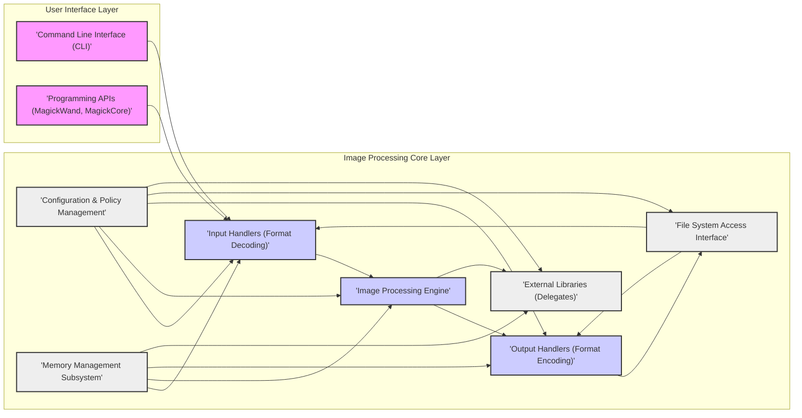

# Project Design Document: ImageMagick

**Project Name:** ImageMagick

**Project Repository:** [https://github.com/imagemagick/imagemagick](https://github.com/imagemagick/imagemagick)

**Document Version:** 1.1
**Date:** 2023-10-27
**Author:** AI Software Architect

## 1. Introduction

This document provides a detailed design overview of the ImageMagick project, an open-source software suite for displaying, converting, and editing raster and vector image files.  It is designed to be used as the foundation for threat modeling activities. The document clearly outlines the system's architecture, key components, and data flow to facilitate the identification of potential security vulnerabilities and inform the development of effective mitigation strategies.

## 2. Project Overview

ImageMagick is a versatile and powerful command-line tool and programming library for image manipulation. It boasts extensive support for a wide array of image formats, encompassing popular raster formats like JPEG, PNG, GIF, and TIFF, as well as vector formats such as SVG and PDF.  Its widespread adoption spans diverse applications, including web servers, content management systems, desktop image editors, and scientific software.  Core functionalities include:

*   **Format Conversion:** Seamlessly converting images between numerous file formats.
*   **Image Editing & Manipulation:** Offering a rich set of operations for resizing, cropping, rotating, color adjustments, applying filters, and more.
*   **Image Display:** Enabling image rendering and display across various platforms.
*   **Scripting & Automation:** Facilitating batch image processing through command-line tools and scripting language integration.
*   **Library Integration:** Providing robust APIs for developers to embed image processing capabilities directly into custom applications.

## 3. System Architecture

ImageMagick's architecture is structured into distinct layers and components, promoting modularity and maintainability.

### 3.1. High-Level Architecture Diagram

### 3.2. Component Description

*   **Command Line Interface (CLI):**  This is the primary user interaction point, providing a suite of command-line utilities (e.g., `convert`, `identify`, `mogrify`). Users leverage these tools to execute image operations directly via terminal commands.
*   **Programming APIs (MagickWand, MagickCore):** ImageMagick offers a set of programming libraries (APIs) in C, C++, and other languages. These APIs empower developers to integrate ImageMagick's image processing functionalities into their applications. `MagickWand` provides a higher-level, user-friendly interface, while `MagickCore` grants more granular control and direct access to the core engine.
*   **Input Handlers (Format Decoding):** This component is responsible for interpreting and decoding various image file formats. Dedicated decoder modules exist for each supported format (JPEG, PNG, GIF, TIFF, etc.). These handlers parse the file structure, validate format compliance, and extract raw image data into an internal representation suitable for processing by ImageMagick.
*   **Image Processing Engine:**  The central processing unit of ImageMagick, this engine executes image manipulation operations. It encompasses a wide range of algorithms for tasks such as resizing, cropping, color manipulation, applying filters, compositing multiple images, and advanced image transformations. It operates on the in-memory image representation generated by the input handlers.
*   **Output Handlers (Format Encoding):**  This component handles the reverse process of encoding processed image data back into various output file formats (JPEG, PNG, GIF, TIFF, etc.). Corresponding encoder modules format the processed in-memory image data according to the specifications of the chosen output format.
*   **Configuration & Policy Management:** ImageMagick's behavior is governed by configuration files (e.g., `policy.xml`, `delegates.xml`, `ImageMagick.xml`). These files define crucial aspects such as security policies (e.g., allowed file types, resource limits, permitted operations), delegate program configurations for format handling, and general operational settings.  `policy.xml` is particularly important for security, defining restrictions to mitigate potential vulnerabilities.
*   **Memory Management Subsystem:**  This subsystem manages memory allocation and deallocation for image data and internal data structures. Efficient memory management is critical for performance, stability, and preventing memory-related vulnerabilities, especially when processing large images.
*   **File System Access Interface:** ImageMagick interacts with the file system to read input image files, write output image files, and access configuration files and delegate programs. Secure and controlled file system access is essential to prevent unauthorized file operations.
*   **External Libraries (Delegates):** To extend its format support and capabilities, ImageMagick leverages external libraries, known as delegates. These are external programs or libraries invoked by ImageMagick to handle specific tasks. Examples include `libpng` for PNG decoding/encoding, `libjpeg` for JPEG, `Ghostscript` for Postscript/PDF rendering, and many others. Delegates are configured in `delegates.xml` and are crucial for supporting a wide range of formats but also introduce potential security dependencies.

## 4. Data Flow

The typical data flow within ImageMagick follows these stages:

1.  **Input Acquisition:** The user provides an image, either as a file path via the CLI or as image data through the programming API.
2.  **Format Identification:** ImageMagick determines the format of the input image, typically by examining file headers or extensions.
3.  **Decoding & Parsing (Input Handlers):** Based on the identified format, the appropriate input handler is invoked. This handler reads the image file, parses its structure according to the format specification, and decodes the image data into an internal, in-memory representation (pixel data). Delegate libraries might be used in this stage for certain formats.
4.  **Image Processing (Engine):** User-specified operations (e.g., resize, crop, filters) are applied to the in-memory image representation by the Image Processing Engine. This involves complex algorithms and pixel manipulations.
5.  **Encoding (Output Handlers):** If saving is requested, the appropriate output handler is selected based on the desired output format. The handler encodes the processed in-memory image data into the specified format. Delegate libraries may also be involved in encoding.
6.  **Output Generation:** The encoded image data is written to the designated output file or returned via the programming API.
7.  **Policy Enforcement & Configuration Application:** Throughout the entire process, the Configuration & Policy Management component actively governs operations. Policies can restrict allowed formats, limit resource consumption (memory, CPU), and disable features based on security configurations.

## 5. Technology Stack

ImageMagick is primarily implemented in **C and C++**, ensuring performance and portability. It relies on a rich ecosystem of external libraries (delegates) for extended format support and functionalities. Key technologies and dependencies include:

*   **Core Languages:** C, C++
*   **Core Libraries:** ImageMagick's internal libraries (MagickCore, MagickWand, etc.) providing core functionalities.
*   **Delegate Libraries (Examples - Security Relevant highlighted):**
    *   **Image Raster Formats:** `libpng` (PNG), `libjpeg`/`libjpeg-turbo` (JPEG), `libtiff` (TIFF), `giflib` (GIF), `libwebp` (WebP), `libheif` (HEIF), etc.
    *   **Vector Graphics & Document Formats:** `Ghostscript` (Postscript, PDF, EPS - **High Security Risk due to complexity and history of vulnerabilities**), `librsvg` (SVG), `libxml2` (XML parsing for SVG and other formats - **Potential XML vulnerabilities**), etc.
    *   **Fonts & Text Rendering:** `freetype` (Font rendering), `libraqm` (Complex text layout).
    *   **Compression:** `zlib` (zlib compression), `libbz2` (bzip2 compression), `liblzma` (LZMA/XZ compression).
    *   **Other:** `libopenjp2` (JPEG 2000), `libraw` (RAW camera formats), etc.
*   **Build System:** Autoconf, Automake, Libtool (standard Unix-like build system).
*   **Operating System Compatibility:** Cross-platform, supporting Linux, Windows, macOS, and various other operating systems.

## 6. Security Considerations (Crucial for Threat Modeling)

Based on the architecture and data flow, several areas present significant security considerations and are paramount for threat modeling. Exploitation of vulnerabilities in these areas could lead to various security impacts, including remote code execution, denial of service, information disclosure, and file system manipulation.

*   **Input Validation & Format Parsing Vulnerabilities (Input Handlers):**
    *   **Vulnerability:** Image format specifications are inherently complex and can contain ambiguities or features that are difficult to parse securely. Maliciously crafted image files can exploit parsing vulnerabilities in input handlers. These vulnerabilities can manifest as:
        *   **Buffer Overflows/Heap Overflows:**  Parsing logic might not correctly handle oversized or malformed data, leading to memory corruption. *Impact: Potential for arbitrary code execution.*
        *   **Format String Vulnerabilities:**  Improper use of format strings in error handling or logging could allow attackers to inject format specifiers and potentially execute code. *Impact: Potential for arbitrary code execution.*
        *   **Integer Overflows/Underflows:**  Integer arithmetic errors during parsing could lead to unexpected behavior, including buffer overflows or incorrect memory allocation. *Impact: Potential for memory corruption and denial of service.*
        *   **Logic Errors in Parsing Logic:** Flaws in the parsing algorithm itself can lead to incorrect interpretation of image data, potentially causing crashes or exploitable conditions. *Impact: Denial of service, potential for memory corruption.*
    *   **Focus for Threat Modeling:** Deeply analyze input handlers for each supported format, especially for less common, complex, or historical formats. Prioritize formats known for past vulnerabilities (e.g., formats relying on complex compression or encoding schemes). Focus on boundary condition handling, error handling robustness, and memory safety within parsing routines.

*   **Vulnerabilities in Delegate Libraries:**
    *   **Vulnerability:** ImageMagick's reliance on external delegate libraries introduces a dependency chain. Vulnerabilities within these delegates directly impact ImageMagick's security.  Common issues include:
        *   **Vulnerabilities in Delegate Parsers:** Delegates themselves may have parsing vulnerabilities similar to ImageMagick's input handlers. *Impact: Potential for arbitrary code execution via vulnerable delegates.*
        *   **Insecure Delegate Execution:**  If ImageMagick executes delegates in an insecure manner (e.g., without proper sandboxing or input sanitization), vulnerabilities in delegates become directly exploitable through ImageMagick. *Impact: Potential for arbitrary code execution, command injection.*
    *   **Focus for Threat Modeling:**  Thoroughly assess the security posture of commonly used delegate libraries. Track known vulnerabilities in these libraries and ensure ImageMagick uses updated and patched versions. Analyze the interface and interaction between ImageMagick and delegates, focusing on data passing mechanisms and delegate execution methods.  Specifically, investigate potential command injection vulnerabilities arising from insecure delegate command construction.

*   **Memory Management Errors:**
    *   **Vulnerability:**  Improper memory management within ImageMagick's core engine or in delegate libraries can lead to critical memory corruption vulnerabilities:
        *   **Memory Leaks:** Failure to release allocated memory can lead to resource exhaustion and denial of service over time. *Impact: Denial of service.*
        *   **Double Free/Use-After-Free:**  Incorrectly freeing memory multiple times or accessing memory after it has been freed can lead to crashes or exploitable conditions. *Impact: Potential for arbitrary code execution, denial of service.*
        *   **Uninitialized Memory Use:** Using memory without proper initialization can lead to unpredictable behavior and potential information disclosure. *Impact: Information disclosure, potential for unexpected behavior.*
    *   **Focus for Threat Modeling:**  Analyze memory allocation and deallocation patterns in core image processing algorithms and format handlers. Utilize memory safety tools (e.g., Valgrind, AddressSanitizer) to detect memory errors. Investigate potential race conditions or concurrency issues related to memory management, especially in multi-threaded scenarios.

*   **Policy Enforcement Bypasses & Configuration Weaknesses:**
    *   **Vulnerability:**  Security policies defined in `policy.xml` are intended to restrict potentially dangerous operations. However, weaknesses in policy enforcement or misconfigurations can undermine these protections:
        *   **Policy Bypass:**  Vulnerabilities in policy enforcement logic could allow attackers to circumvent intended restrictions. *Impact: Allows exploitation of vulnerabilities that policies were meant to prevent.*
        *   **Overly Permissive Policies:** Default or misconfigured policies might be too lenient, allowing processing of dangerous file types or exceeding resource limits, leading to denial-of-service. *Impact: Denial of service, increased attack surface.*
        *   **Configuration Injection:** In certain scenarios, attackers might be able to influence configuration settings, potentially weakening security. *Impact: Increased attack surface, potential for policy bypass.*
    *   **Focus for Threat Modeling:**  Rigorously review the policy configuration mechanisms (e.g., `policy.xml` parsing and application). Analyze how policies are enforced throughout the data flow and identify potential bypasses or weaknesses in policy enforcement logic.  Ensure default policies are secure and provide clear guidance on secure configuration practices.

*   **File System Access Control Failures:**
    *   **Vulnerability:**  Improper handling of file paths and filenames can lead to file system vulnerabilities:
        *   **Path Traversal:**  Attackers might be able to manipulate file paths to access files outside of intended directories, potentially reading sensitive files or overwriting critical system files. *Impact: Information disclosure, file system manipulation, potential for privilege escalation.*
        *   **Uncontrolled File Creation/Deletion:**  Vulnerabilities could allow attackers to create or delete arbitrary files on the system. *Impact: Denial of service, file system manipulation.*
    *   **Focus for Threat Modeling:**  Analyze file path handling in input/output operations, delegate execution, and configuration file loading. Ensure robust sanitization and validation of file paths to prevent path traversal attacks. Implement least privilege principles for file system access.

*   **Resource Exhaustion & Denial of Service (DoS):**
    *   **Vulnerability:** Processing extremely large or maliciously crafted images can consume excessive system resources, leading to denial-of-service conditions:
        *   **CPU Exhaustion:**  Complex image processing operations or algorithmic complexity vulnerabilities can lead to excessive CPU usage. *Impact: Denial of service.*
        *   **Memory Exhaustion:**  Processing large images or memory leaks can exhaust available memory. *Impact: Denial of service, system instability.*
        *   **Disk I/O Exhaustion:**  Excessive disk reads or writes during image processing can overwhelm disk I/O. *Impact: Denial of service.*
        *   **Algorithmic Complexity Attacks:**  Specially crafted images can trigger computationally expensive algorithms, leading to DoS. *Impact: Denial of service.*
    *   **Focus for Threat Modeling:**  Analyze resource usage patterns during various image processing operations. Identify potential bottlenecks or operations that could be exploited for denial-of-service attacks. Review and enhance resource limits and throttling mechanisms within ImageMagick and its policies.

*   **Command Injection via Delegates:**
    *   **Vulnerability:**  If delegate commands are constructed insecurely, especially when incorporating user-controlled input (e.g., filenames, format options), it can lead to command injection vulnerabilities. This is a particularly critical risk due to the power of command execution. *Impact: Arbitrary code execution with the privileges of the ImageMagick process.*
    *   **Focus for Threat Modeling:**  Meticulously examine how delegate commands are constructed, especially when user-provided data is incorporated into commands.  Implement robust sanitization, validation, and escaping of all user-controlled input used in delegate commands. Consider using safer alternatives to command execution if possible, or employ sandboxing techniques for delegate processes. This is a high-priority area for threat modeling due to the severity of command injection vulnerabilities.

## 7. Threat Modeling Focus Areas (Prioritized)

Based on the security considerations, the following areas should be prioritized during threat modeling exercises for ImageMagick, ranked roughly by severity and likelihood of exploitation:

1.  **Command Injection via Delegates:** (Highest Priority) Due to the potential for immediate and severe impact (arbitrary code execution), this area requires the most stringent scrutiny.
2.  **Input Handlers (Format Decoders):** Focus on vulnerabilities in parsing logic across various image formats, especially memory corruption vulnerabilities.
3.  **Delegate Library Vulnerabilities:**  Continuously monitor and assess the security of external delegate libraries and the impact of their vulnerabilities on ImageMagick.
4.  **Memory Management Errors:** Investigate memory corruption vulnerabilities (buffer overflows, use-after-free, etc.) in core routines and format handlers.
5.  **Policy Enforcement & Configuration:** Ensure robust policy enforcement and secure default configurations to mitigate risks.
6.  **Resource Exhaustion (Denial of Service):** Analyze potential DoS vectors and implement effective resource limits and throttling.
7.  **File System Operations:**  Address path traversal and other file system access control vulnerabilities.

This design document provides a comprehensive and enhanced overview of ImageMagick's architecture, components, and security considerations. It serves as a robust foundation for conducting in-depth threat modeling, enabling security analysts and developers to proactively identify, assess, and mitigate potential vulnerabilities, ultimately strengthening the security posture of ImageMagick.