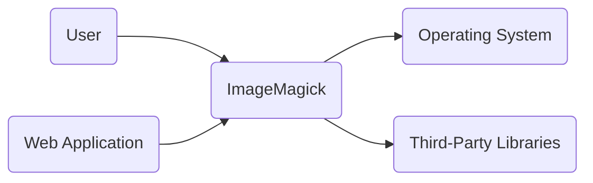
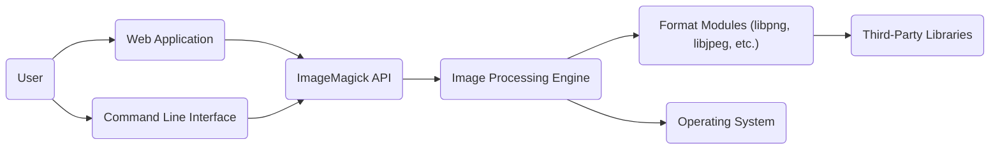
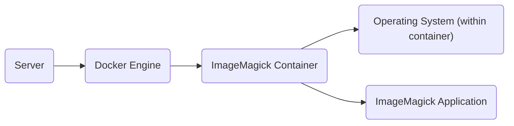
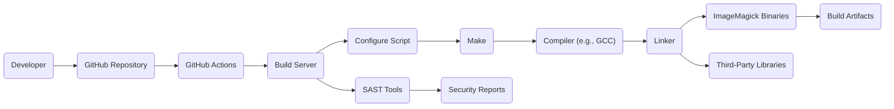

Okay, let's create a design document for ImageMagick, focusing on security aspects relevant for threat modeling.

# BUSINESS POSTURE

ImageMagick is a widely used, open-source software suite for displaying, converting, and editing raster image and vector image files. It supports over 200 image formats.  Given its widespread use, often in web applications and backend processing pipelines, the business priorities revolve around:

*   Reliability:  ImageMagick must process images correctly and consistently, without crashing or producing unexpected results.  Incorrect processing can lead to application errors, data corruption, or denial of service.
*   Performance:  ImageMagick needs to process images efficiently, especially in high-volume environments.  Slow processing can lead to user experience issues and increased infrastructure costs.
*   Security:  Given its role in handling potentially untrusted user input (uploaded images), security is paramount.  Vulnerabilities in ImageMagick can be exploited to execute arbitrary code, access sensitive data, or cause denial-of-service attacks.
*   Maintainability: The codebase should be maintainable to allow for bug fixes, security patches, and new feature development.
*   Compatibility: Support a wide range of image formats and operating systems.

Business Risks:

*   Remote Code Execution (RCE):  The most critical risk.  A vulnerability allowing RCE could allow an attacker to take complete control of a server running ImageMagick.
*   Denial of Service (DoS):  An attacker could craft malicious images that cause ImageMagick to consume excessive resources (CPU, memory), leading to a denial of service.
*   Information Disclosure:  Vulnerabilities could allow attackers to read arbitrary files on the server or leak sensitive information embedded within images.
*   Reputational Damage:  Publicly disclosed vulnerabilities, especially those with working exploits, can damage the reputation of projects using ImageMagick and the ImageMagick project itself.
*   Supply Chain Attacks: Compromise of the ImageMagick build process or distribution channels could lead to the distribution of malicious versions of the software.

# SECURITY POSTURE

Existing Security Controls:

*   security control: Fuzzing: ImageMagick utilizes fuzzing (e.g., OSS-Fuzz) to identify potential vulnerabilities. This is evident from the project's structure and documentation on GitHub.
*   security control: Code Audits: The project undergoes periodic code audits, both internal and external.
*   security control: Sandboxing (Policies): ImageMagick provides configuration options (policies) to restrict the resources and operations available during image processing. This can limit the impact of vulnerabilities. Described in documentation.
*   security control: Input Validation: ImageMagick performs input validation to check the validity of image formats and data. This is inherent in the image parsing process.
*   security control: Address Space Layout Randomization (ASLR) and Data Execution Prevention (DEP): These are OS-level security controls that ImageMagick benefits from, although they are not specific to ImageMagick itself.
*   security control: Regular Updates: The ImageMagick team releases updates to address security vulnerabilities and bugs.

Accepted Risks:

*   accepted risk: Complexity: ImageMagick supports a vast number of image formats, each with its own complexities and potential vulnerabilities.  It's accepted that complete elimination of all vulnerabilities is extremely difficult.
*   accepted risk: Legacy Code:  The codebase has evolved over many years and may contain legacy code that is more difficult to secure.
*   accepted risk: Third-Party Libraries: ImageMagick depends on third-party libraries for some functionality, which introduces the risk of vulnerabilities in those libraries.
*   accepted risk: User Misconfiguration:  Users may misconfigure ImageMagick's policies, weakening its security posture.

Recommended Security Controls:

*   Memory Safe Language: Consider rewriting critical components in a memory-safe language like Rust to mitigate memory corruption vulnerabilities.
*   Enhanced Sandboxing: Explore more robust sandboxing techniques, such as using separate processes or containers for image processing.
*   Content Security Policy (CSP): If ImageMagick is used in a web context, implement CSP to mitigate XSS vulnerabilities. (This is more relevant to applications *using* ImageMagick).
*   Regular Penetration Testing: Conduct regular penetration testing to identify vulnerabilities that may be missed by fuzzing and code audits.

Security Requirements:

*   Authentication: Not directly applicable to ImageMagick itself, as it's a library. Authentication is the responsibility of the application using ImageMagick.
*   Authorization:  ImageMagick's policy system provides a form of authorization, controlling which operations and resources are allowed.  This should be carefully configured based on the specific use case.
*   Input Validation:  Robust input validation is crucial.  ImageMagick must strictly validate all image data and reject malformed or suspicious input.  This includes checking image dimensions, headers, and other metadata.
*   Cryptography:  If ImageMagick is used to handle encrypted images, it must use strong cryptographic algorithms and securely manage keys.  This is likely handled by external libraries.
*   Output Encoding: If ImageMagick's output is used in a web context, proper output encoding is necessary to prevent XSS vulnerabilities. (Again, more relevant to the calling application).

# DESIGN

## C4 CONTEXT

Element Descriptions:

*   Element 1:
    *   Name: User
    *   Type: Person
    *   Description: A person interacting with ImageMagick, either directly through a command-line interface or indirectly through an application.
    *   Responsibilities: Provides input images, receives processed images.
    *   Security controls: None directly applicable to ImageMagick.

*   Element 2:
    *   Name: ImageMagick
    *   Type: Software System
    *   Description: The ImageMagick software suite.
    *   Responsibilities: Processing images, converting formats, applying transformations.
    *   Security controls: Fuzzing, Code Audits, Sandboxing (Policies), Input Validation.

*   Element 3:
    *   Name: Operating System
    *   Type: Software System
    *   Description: The underlying operating system (e.g., Linux, Windows, macOS).
    *   Responsibilities: Provides system resources (memory, CPU, file system).
    *   Security controls: ASLR, DEP.

*   Element 4:
    *   Name: Third-Party Libraries
    *   Type: Software System
    *   Description: External libraries used by ImageMagick (e.g., libpng, libjpeg).
    *   Responsibilities: Provide support for specific image formats.
    *   Security controls: Dependent on the specific library; ImageMagick should use up-to-date versions.

*   Element 5:
    *   Name: Web Application
    *   Type: Software System
    *   Description: A web application that utilizes ImageMagick for image processing.
    *   Responsibilities: Receives image from user, passes it to ImageMagick, returns processed image to user.
    *   Security controls: Input validation, output encoding, session management, authentication, authorization.

## C4 CONTAINER

In the case of ImageMagick, the container diagram is essentially an extension of the context diagram, as ImageMagick itself is the primary "container."

Element Descriptions:

*   Element 1:
    *   Name: User
    *   Type: Person
    *   Description: A person interacting with ImageMagick.
    *   Type: Person
    *   Responsibilities: Provides input images, receives processed images.
    *   Security controls: None directly applicable to ImageMagick.

*   Element 2:
    *   Name: Command Line Interface (CLI)
    *   Type: Application
    *   Description: The command-line interface for interacting with ImageMagick (e.g., `convert`, `magick`).
    *   Responsibilities: Parses command-line arguments, calls the ImageMagick API.
    *   Security controls: Input validation (of command-line arguments).

*   Element 3:
    *   Name: Web Application
    *   Type: Application
    *   Description: A web application that utilizes ImageMagick.
    *   Responsibilities: Receives image from user, passes it to ImageMagick API, returns processed image to user.
    *   Security controls: Input validation, output encoding, session management, authentication, authorization.

*   Element 4:
    *   Name: ImageMagick API
    *   Type: API
    *   Description: The programming interface for ImageMagick.
    *   Responsibilities: Provides functions for image processing.
    *   Security controls: Input validation, policy enforcement.

*   Element 5:
    *   Name: Image Processing Engine
    *   Type: Component
    *   Description: The core image processing logic of ImageMagick.
    *   Responsibilities: Coordinates image processing tasks, applies transformations.
    *   Security controls: Fuzzing, code audits.

*   Element 6:
    *   Name: Format Modules (libpng, libjpeg, etc.)
    *   Type: Component
    *   Description: Modules for handling specific image formats.
    *   Responsibilities: Decode and encode images in various formats.
    *   Security controls: Input validation, fuzzing, code audits (of the respective libraries).

*   Element 7:
    *   Name: Operating System
    *   Type: Software System
    *   Description: The underlying operating system.
    *   Responsibilities: Provides system resources.
    *   Security controls: ASLR, DEP.

*   Element 8:
    *   Name: Third-Party Libraries
    *   Type: Software System
    *   Description: External libraries used by the format modules.
    *   Responsibilities: Provide support for specific image format features.
    *   Security controls: Dependent on the specific library.

## DEPLOYMENT

ImageMagick can be deployed in various ways:

1.  **Direct Installation:** Installed directly on a server (e.g., using a package manager like `apt` or `yum`).
2.  **Containerized:** Deployed within a container (e.g., Docker).
3.  **Serverless:** Used within a serverless function (e.g., AWS Lambda). This often involves packaging ImageMagick as a layer or including it within the function's deployment package.

We'll describe the containerized deployment using Docker:

Element Descriptions:

*   Element 1:
    *   Name: Server
    *   Type: Infrastructure Node
    *   Description: The physical or virtual server hosting the Docker Engine.
    *   Responsibilities: Provides the underlying hardware resources.
    *   Security controls: OS hardening, firewall, intrusion detection system.

*   Element 2:
    *   Name: Docker Engine
    *   Type: Software System
    *   Description: The Docker Engine, responsible for running containers.
    *   Responsibilities: Manages container lifecycle, provides isolation.
    *   Security controls: Docker security best practices (e.g., using non-root users, limiting capabilities).

*   Element 3:
    *   Name: ImageMagick Container
    *   Type: Container
    *   Description: A Docker container running ImageMagick.
    *   Responsibilities: Provides an isolated environment for ImageMagick.
    *   Security controls: Container security best practices (e.g., minimal base image, regular updates).

*   Element 4:
    *   Name: Operating System (within container)
    *   Type: Software System
    *   Description: A lightweight OS within the container (e.g., Alpine Linux).
    *   Responsibilities: Provides a minimal set of system libraries.
    *   Security controls: Minimal attack surface, regular updates.

*   Element 5:
    *   Name: ImageMagick Application
    *   Type: Application
    *   Description: The ImageMagick software running within the container.
    *   Responsibilities: Processes images.
    *   Security controls: ImageMagick's internal security controls (fuzzing, policies, etc.).

## BUILD

ImageMagick's build process involves compiling the source code and linking it with various libraries. The build process can be automated using tools like `make` and configured using `configure` script. GitHub Actions are used for continuous integration.

Security Controls in the Build Process:

*   Source Code Management: GitHub provides version control and access control.
*   Continuous Integration (GitHub Actions): Automates the build and testing process.
*   SAST Tools: Static Application Security Testing tools can be integrated into the build process to identify potential vulnerabilities in the code.  This is visible in the `.github/workflows` directory.
*   Dependency Management:  ImageMagick's dependencies should be carefully managed and updated regularly to address known vulnerabilities.
*   Build Environment Security: The build server should be secured to prevent unauthorized access and modification of the build process.
*   Artifact Signing:  Build artifacts (e.g., binaries, packages) can be digitally signed to ensure their integrity and authenticity.

# RISK ASSESSMENT

*   Critical Business Process: Image processing and conversion. This is fundamental to any application relying on ImageMagick for handling user-provided or internally generated images.
*   Data We Are Trying to Protect:
    *   User-uploaded images: These may contain sensitive information, personally identifiable information (PII), or proprietary data. Sensitivity: Variable, depends on the application.
    *   Internally generated images: These may contain sensitive business data or intellectual property. Sensitivity: Potentially high.
    *   System files: ImageMagick should *not* be able to access arbitrary system files, but vulnerabilities could allow this. Sensitivity: High.
    *   Configuration files:  ImageMagick's configuration (policies) should be protected. Sensitivity: Medium.

# QUESTIONS & ASSUMPTIONS

*   Questions:
    *   What specific image formats are considered highest risk?
    *   What are the performance requirements (images per second, maximum image size)?
    *   What is the deployment environment (cloud provider, on-premise, etc.)?  This impacts the specific security controls that can be applied.
    *   Are there any specific compliance requirements (e.g., HIPAA, GDPR)?
    *   What level of logging and monitoring is required?
    *   What is the process for handling security vulnerabilities reported to the ImageMagick team?

*   Assumptions:
    *   BUSINESS POSTURE: We assume a high priority on security due to the potential for RCE and the widespread use of ImageMagick.
    *   SECURITY POSTURE: We assume that basic security best practices are followed (e.g., regular patching, principle of least privilege). We assume that ImageMagick's policy system is used, but may not be configured optimally in all deployments.
    *   DESIGN: We assume a standard deployment model, either directly on a server or within a container. We assume that ImageMagick is used as a library within a larger application, rather than as a standalone service with its own authentication/authorization mechanisms.