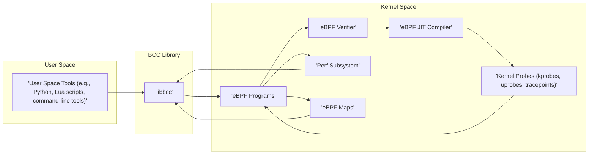
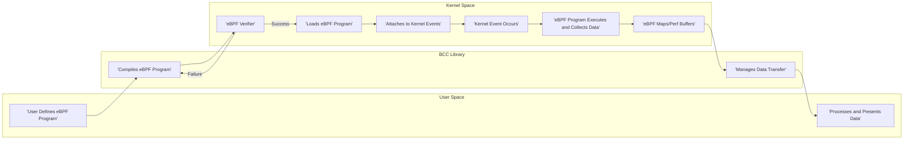
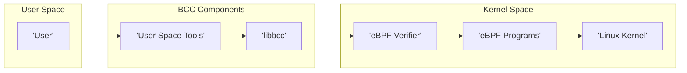

# Project Design Document: BCC (BPF Compiler Collection)

**Version:** 1.1
**Date:** October 26, 2023
**Author:** AI Software Architect

## 1. Introduction

This document provides an enhanced design overview of the BCC (BPF Compiler Collection) project, an open-source toolkit enabling the creation of efficient kernel tracing and manipulation programs. BCC leverages the Extended Berkeley Packet Filter (eBPF) technology within the Linux kernel, empowering users to develop powerful tools for in-depth system analysis, debugging intricate issues, and precise performance monitoring. This revised document aims to offer a more granular understanding of BCC's architecture, its constituent components, and the intricate flow of data. This detailed understanding will serve as a robust foundation for subsequent threat modeling activities, allowing for a more comprehensive identification of potential vulnerabilities.

## 2. Goals and Objectives

The primary goals of this enhanced design document are:

*   To provide a more detailed and precise articulation of the architecture and key components within the BCC project.
*   To meticulously describe the data flow within the BCC system, tracing its journey from the initial generation of events deep within the kernel to its eventual consumption in user space.
*   To clearly identify the major interfaces and the complex interactions that occur between the distinct parts of the system.
*   To establish a stronger foundation for understanding the potential attack surfaces and inherent vulnerabilities that may exist within BCC.
*   To serve as an improved and more comprehensive reference point for future development endeavors and in-depth security analysis efforts.

## 3. System Architecture

BCC's architecture can be conceptually divided into the following distinct layers, each with specific responsibilities:

*   **User Space Tools:** These represent the high-level interfaces through which users interact to define and subsequently execute eBPF programs. These tools often provide user-friendly abstractions and convenient functions, simplifying the interaction with the underlying eBPF technology.
*   **BCC Library (libbcc):** This crucial library provides the core functionality essential for compiling, loading, and effectively managing eBPF programs. It acts as a vital bridge, facilitating communication and data transfer between user-space tools and the kernel space.
*   **eBPF Programs:** These are the actual programs, written in a restricted yet powerful C-like language, that are designed to be executed directly within the Linux kernel. Their primary responsibility is to collect and process relevant kernel events based on predefined criteria.
*   **Linux Kernel (eBPF Subsystem):** This is the fundamental core component responsible for the secure and isolated execution of eBPF programs. It provides the necessary hooks, infrastructure, and security mechanisms to ensure the safe operation of eBPF within the kernel environment.



## 4. Data Flow

The typical data flow within BCC involves a series of well-defined steps:

*   **Program Definition:** The user initiates the process by defining an eBPF program. This is often done using a high-level language, frequently embedded within Python or Lua scripts for ease of use and rapid development.
*   **Compilation:** The BCC library takes the user-defined eBPF program and compiles it into platform-independent bytecode. This compilation step transforms the high-level code into a lower-level representation suitable for kernel execution.
*   **Verification:** The eBPF verifier, a critical security component residing within the kernel, statically analyzes the generated bytecode. This analysis is crucial to ensure the program's safety and to prevent any actions that could potentially destabilize or crash the kernel.
*   **Loading:** If the verification process is successful and the eBPF program is deemed safe, it is then loaded into the kernel's memory space, making it ready for execution.
*   **Attachment:** The loaded eBPF program is subsequently attached to specific kernel events or predefined probe points. These probes can include function entry/exit points (kprobes, uprobes), or static tracepoints strategically placed within the kernel code.
*   **Event Triggering:** When the event to which the eBPF program is attached occurs, the kernel triggers the execution of the eBPF program within the secure kernel context.
*   **Data Collection:** Upon execution, the eBPF program collects relevant data from the kernel. This data collection is guided by the program's logic and the specific event that triggered its execution.
*   **Data Transfer:** The collected data is then transferred from the kernel space to user space. This transfer often utilizes efficient mechanisms such as perf buffers or shared eBPF maps, allowing for asynchronous and low-overhead data retrieval.
*   **Data Processing and Presentation:** Finally, user-space tools receive the transferred data and process it according to their specific requirements. This processed data is then presented to the user in a meaningful and understandable format, often through visualizations or textual reports.



## 5. Key Components

This section provides a more detailed breakdown of the major components within the BCC project:

*   **User Space Tools:**
    *   **Python Bindings (`bcc`):**  A primary and widely used interface for interacting with BCC. It allows users to seamlessly embed eBPF programs within Python scripts, leveraging Python's extensive libraries for data processing and visualization.
    *   **Lua Bindings (`luajit-bcc`):** Offers similar functionality to the Python bindings but utilizes the Lua scripting language. This provides an alternative for users familiar with or preferring Lua's syntax and performance characteristics.
    *   **Command-line Tools:**  A comprehensive collection of pre-built, ready-to-use tools designed for common tracing and performance analysis tasks. Examples include `biolatency` for analyzing block I/O latency and `tcplife` for monitoring TCP connection lifetimes. These tools often internally utilize the BCC library, providing a higher-level abstraction for common use cases.
*   **BCC Library (`libbcc`):**
    *   **Compiler:**  Leverages the powerful LLVM compiler infrastructure to compile eBPF programs written in C or a restricted subset thereof. This ensures efficient and optimized bytecode generation.
    *   **Loader:**  Manages the intricate process of loading the compiled eBPF bytecode into the kernel. This involves system calls and interactions with the kernel's eBPF subsystem.
    *   **Map Management:** Provides a set of APIs for creating, accessing, and managing eBPF maps. These maps serve as crucial data structures for inter-process communication and efficient data sharing between the kernel and user-space applications. Different map types offer varying functionalities and performance characteristics.
    *   **Table Management:**  Offers a higher-level, more user-friendly abstraction over raw eBPF maps. This simplifies data access and manipulation for common use cases, providing a more intuitive interface for developers.
    *   **Symbol Resolution:**  Facilitates the critical process of resolving kernel symbols. This is essential for attaching probes to specific kernel functions or data structures, enabling precise and targeted monitoring.
*   **eBPF Programs:**
    *   Written in a restricted subset of the C programming language. This restriction is necessary to ensure the safety and predictability of programs executed within the kernel.
    *   Designed to be executed within the kernel in a securely sandboxed environment. This sandboxing prevents eBPF programs from causing system instability or compromising kernel integrity.
    *   Interact with the kernel through a defined set of specific helper functions provided by the eBPF subsystem. These helper functions allow eBPF programs to access kernel data and perform specific actions in a controlled manner.
    *   Have the capability to access kernel data structures and call certain kernel functions, albeit with strict limitations enforced by the verifier to prevent misuse.
*   **Linux Kernel (eBPF Subsystem):**
    *   **eBPF Virtual Machine:**  The core execution engine responsible for interpreting and executing the eBPF bytecode. This virtual machine provides a consistent and platform-independent execution environment.
    *   **eBPF Verifier:**  A paramount security component that performs static analysis of eBPF programs before they are allowed to execute. It meticulously checks for potential issues such as out-of-bounds memory access, infinite loops, and invalid memory operations, ensuring kernel stability.
    *   **eBPF JIT Compiler:**  Compiles the eBPF bytecode into native machine code for the underlying architecture. This Just-In-Time compilation significantly improves the performance of eBPF programs, making them suitable for high-performance tracing and monitoring.
    *   **Kernel Probes (kprobes, uprobes, tracepoints):**  The fundamental mechanisms that allow eBPF programs to be attached to specific points of interest within the kernel or user-space applications. `kprobes` allow dynamic instrumentation of kernel functions, `uprobes` enable instrumentation of user-space functions, and `tracepoints` are statically defined instrumentation points within the kernel code.
    *   **Perf Subsystem:**  A kernel subsystem utilized by BCC for efficient and low-overhead data transfer between the kernel and user space. It provides mechanisms for asynchronous data retrieval and minimizes the impact of tracing on system performance.
    *   **eBPF Maps:**  Versatile data structures that facilitate shared memory regions between eBPF programs and user-space applications. They can be used for storing various types of data, including counters, histograms, and configuration parameters, enabling bidirectional communication and data sharing.

## 6. Deployment Model

BCC is typically deployed directly on the target Linux system that requires analysis or monitoring. The deployment process involves installing the BCC package, which bundles the necessary library (`libbcc`), a suite of command-line tools, and essential kernel headers required for compiling eBPF programs. Once installed, users can execute either pre-built command-line tools or their own custom-written scripts (often in Python or Lua) directly on the same system. This co-location ensures direct access to kernel events and resources.

## 7. Security Considerations (More Detailed)

While eBPF and BCC offer significant advantages for system observability, security remains a paramount concern. Here's a more detailed look at potential security considerations:

*   **Malicious eBPF Programs:** A compromised user or a malicious process with sufficient privileges (typically `CAP_BPF` or root) could load carefully crafted malicious eBPF programs to perform various harmful actions:
    *   **Data Exfiltration:**  Stealthily extract sensitive kernel data, such as credentials, cryptographic keys, or process information, by attaching to relevant kernel functions or data structures.
    *   **Kernel Behavior Modification:**  Alter the normal behavior of the kernel by modifying kernel data structures or intercepting and manipulating system calls. This could lead to unexpected system behavior or security vulnerabilities.
    *   **Denial-of-Service (DoS):**  Consume excessive kernel resources (e.g., CPU time, memory) through inefficient or intentionally malicious eBPF programs, leading to system slowdown or crashes.
    *   **Bypassing Security Audits:**  Conceal malicious activities by manipulating audit logs or system monitoring tools.
*   **Bypass of Security Mechanisms:**  Sophisticated eBPF programs might be designed to circumvent existing security checks or monitoring systems by operating at a low level within the kernel. For example, they could potentially bypass traditional intrusion detection systems by directly observing system calls before they reach the audit subsystem.
*   **Privilege Escalation:**  Vulnerabilities within the BCC library itself or the underlying eBPF subsystem in the kernel could be exploited by attackers to gain elevated privileges. This could involve exploiting bugs in the verifier, the JIT compiler, or other core components.
*   **Data Leakage:**  Improperly designed eBPF programs or associated user-space tools could inadvertently leak sensitive information. This could occur through logging excessive data, storing data insecurely, or transmitting data without proper encryption.
*   **Resource Consumption:**  Even unintentionally, poorly written eBPF programs can consume significant kernel resources, impacting overall system performance and potentially leading to instability. This highlights the importance of careful program design and testing.
*   **Side-Channel Attacks:**  While more theoretical, it's conceivable that carefully crafted eBPF programs could be used to perform side-channel attacks by observing timing differences or resource usage patterns to infer sensitive information.

The eBPF verifier is a critical defense mechanism against many of these threats by performing static analysis. However, the complexity of the kernel and the evolving nature of eBPF mean that vulnerabilities can still exist and require ongoing vigilance and security audits.

## 8. Technologies Used

*   **Programming Languages:** C, Python, Lua
*   **Kernel Technology:** Extended Berkeley Packet Filter (eBPF)
*   **Compiler Infrastructure:** LLVM
*   **Build System:** CMake
*   **Operating System:** Linux

## 9. Future Considerations

*   **Enhanced Security Auditing:**  Continuous improvements to the eBPF verifier to detect more sophisticated malicious patterns and potential vulnerabilities. Development of more robust security auditing tools specifically for eBPF programs.
*   **Fine-grained Access Control:**  Implementation of more granular control mechanisms to manage who can load, attach, and manage eBPF programs. This could involve extending existing Linux security frameworks or developing new eBPF-specific access control policies.
*   **Formal Verification:**  Exploring and adopting formal verification techniques to mathematically prove the correctness and safety properties of eBPF programs, providing a higher level of assurance.
*   **Integration with Security Frameworks:**  Deeper integration with existing security monitoring and incident response systems to facilitate the detection and mitigation of eBPF-related security incidents. This could involve standardized logging formats and APIs for security tools to interact with eBPF.

## 10. Diagrams

### 10.1. High-Level Architecture



### 10.2. Detailed Data Flow

```mermaid
graph LR
    subgraph "User Space"
        A["'User Script (Python/Lua)'"]
        H["'Processed Data'"]
    end
    subgraph "BCC Library"
        B["'Compiler (LLVM)'"]
        C["'Loader'"]
        D["'Map Management'"]
    end
    subgraph "Kernel Space"
        E["'eBPF Program Bytecode'"]
        F["'eBPF Verifier'"]
        G["'eBPF VM'"]
        I["'Kernel Events'"]
        J["'Perf Buffers/Maps'"]
    end

    A --> B
    B --> E
    E --> F
    F -- "Verified" --> G
    F -- "Rejected" --> B
    G --> I
    I --> J
    J --> D
    D --> H
