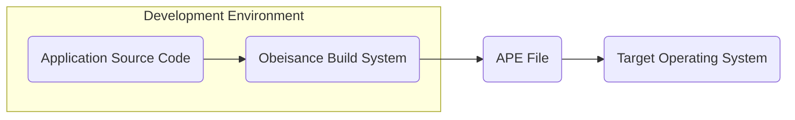
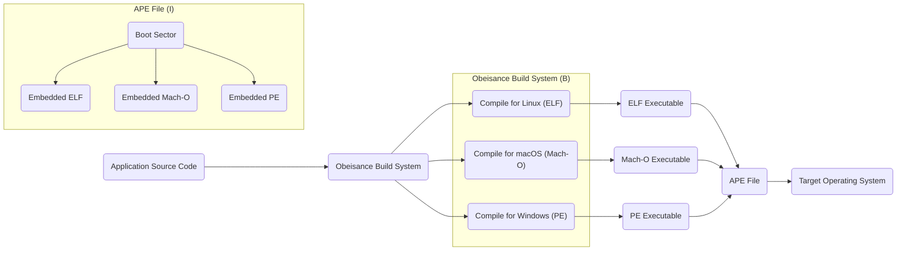

# Project Design Document: Cosmopolitan

**Version:** 1.1
**Date:** October 26, 2023
**Author:** Gemini (AI Language Model)

## 1. Introduction

This document provides an enhanced design overview of the Cosmopolitan project, as found on GitHub ([https://github.com/jart/cosmopolitan](https://github.com/jart/cosmopolitan)). Building upon the previous version, this iteration aims to provide greater clarity and detail, specifically tailored for subsequent threat modeling activities. It meticulously outlines the key components, data flows, and architectural decisions inherent in the project.

Cosmopolitan's core objective is to facilitate the creation of "actually portable executables" (APEs). These executables are engineered to run natively across a diverse range of operating systems (including Linux, macOS, Windows, FreeBSD, and OpenBSD) and hardware architectures without necessitating traditional installation procedures or reliance on virtualization technologies. This remarkable portability is achieved through a sophisticated and innovative executable format coupled with a specialized build process.

## 2. Goals and Objectives

*   **Seamless Cross-Platform Execution:**  Enable a single, unified executable binary to operate flawlessly across various operating systems and hardware architectures.
*   **True Zero-Dependency Deployment:** Eliminate the requirement for external dependencies, runtime environments, or package managers beyond the fundamental operating system kernel.
*   **Simplified Application Distribution:**  Streamline the distribution process for applications by encapsulating all necessary components within a single, self-contained file.
*   **Achieve Near-Native Performance:**  Ensure that applications running as APEs achieve performance levels comparable to natively compiled executables on the target platform.
*   **Maintain Open Source Principles:**  Uphold an open and transparent development process, fostering community contribution and scrutiny.

## 3. High-Level Architecture

The Cosmopolitan project's architecture can be conceptually divided into the following key components and their interactions:

*   **Application Source Code:** The core logic of the application, typically authored in languages like C or C++.
*   **Obeisance Build System:** A custom-built system, primarily implemented using Python scripts, responsible for the intricate process of compiling and linking the application source code into the unique APE format. This involves orchestrating multiple compilers and linkers, each targeting a specific platform.
*   **Actually Portable Executable (APE) File:**  A meticulously crafted executable file format. Its defining characteristic is the embedding of multiple executable formats (e.g., ELF, Mach-O, PE) within a single file. At runtime, the APE intelligently selects and executes the format appropriate for the detected operating system.
*   **APE Loader (within the APE):** A compact piece of code embedded at the beginning of the APE file. This acts as a bootstrap loader, responsible for detecting the current operating system and architecture and subsequently initiating the execution of the corresponding embedded executable format.
*   **Target Operating System:** The specific operating system (e.g., Linux, macOS, Windows) on which the APE is being executed.

## 4. Component Design

This section provides a more granular description of the key components within the Cosmopolitan project.

### 4.1. Application Source Code

*   **Description:**  This represents the core application logic developed by the software engineer.
*   **Language:** Typically written in C or C++, leveraging their portability and performance characteristics.
*   **Cross-Platform Considerations:** While the APE format handles much of the platform abstraction, developers still need to be mindful of platform-specific nuances in their code, particularly when interacting directly with the operating system.

### 4.2. Obeisance Build System

*   **Primary Function:** To automate and manage the complex process of transforming source code into a multi-platform APE file.
*   **Key Operations:**
    *   **Compiler Orchestration:**  Intelligently invokes different compilers (e.g., GCC, Clang, MinGW) with the correct configurations for each target architecture and operating system.
    *   **Linking Management:**  Handles the linking stage, combining compiled object files and necessary libraries into the final executable segments for each platform.
    *   **APE Format Assembly:**  Constructs the APE file by carefully embedding the individually compiled executables for each target platform, along with the boot sector and any shared resources.
    *   **Resource Embedding:**  Manages the inclusion of application resources (e.g., images, configuration files, data files) directly within the APE file.
    *   **Build Configuration:**  Relies on configuration files to define target platforms, compiler flags, linker options, and other critical build parameters.
*   **Implementation Details:** Primarily implemented using Python scripting, leveraging its flexibility and extensive libraries for build automation.

### 4.3. Actually Portable Executable (APE) File Format

*   **Conceptual Structure:**  A sophisticated container format designed to hold multiple executable formats within a single file.
*   **Key Sections:**
    *   **Boot Sector (or "MZ Header"):** A small piece of executable code located at the beginning of the file. This is the first code executed by the operating system. It contains the logic for platform detection and redirection.
    *   **Embedded Executables:**  Complete, self-contained executable files for different operating systems. For example, an APE might contain an ELF executable for Linux, a Mach-O executable for macOS, and a PE executable for Windows.
    *   **Optional Shared Resources:**  A section where data or code segments can be stored that are potentially shared and accessible by all the embedded executables.
*   **Runtime Execution Flow:**
    1. The user initiates the execution of the APE file on their operating system.
    2. The operating system loads the APE file into memory.
    3. The operating system begins execution at the entry point defined in the boot sector.
    4. The boot sector code executes. This code is designed to detect the currently running operating system.
    5. Based on the detected operating system, the boot sector code transfers control (jumps) to the entry point of the corresponding embedded executable within the APE file.

### 4.4. APE Loader (within the APE)

*   **Core Responsibility:**  To perform the initial platform detection and then redirect execution to the appropriate embedded executable.
*   **Implementation Language:** Typically written in assembly language for maximum efficiency and low-level control over the execution process.
*   **Key Functions:**
    *   **Operating System Detection:**  Utilizes specific system calls or checks for characteristic file system structures or environment variables to identify the running operating system.
    *   **Architecture Detection (Implicit):** The selection of the embedded executable often implicitly handles architecture differences (e.g., selecting an x86-64 ELF vs. an ARM64 ELF).
    *   **Execution Redirection:**  Calculates the memory address of the entry point of the correct embedded executable and performs a jump to that address, effectively starting the execution of the platform-specific binary.

### 4.5. Target Operating System

*   **Role:** Provides the fundamental kernel and system services that the executed APE relies upon.
*   **Interaction:** The embedded executable within the APE interacts with the operating system through standard system calls, just like any other native application.

## 5. Data Flow

The process of creating and running a Cosmopolitan application involves the following key stages of data flow:

1. **Application Development:** Software engineers write the source code for their application.
2. **Build Process Initiation:** The developer invokes the Obeisance build system, providing the application's source code and configuration details.
3. **Platform-Specific Compilation:** Obeisance orchestrates the compilation of the source code multiple times, once for each target platform, using the appropriate compilers and settings.
4. **Platform-Specific Linking:**  The compiled object files for each platform are linked with necessary libraries to create platform-specific executable files (e.g., an ELF file, a Mach-O file, a PE file).
5. **APE Packaging:** Obeisance assembles the APE file, embedding the generated platform-specific executables, the boot sector code, and any specified resources.
6. **Distribution of the APE:** The resulting APE file is distributed to end-users through various channels.
7. **APE Execution:** An end-user executes the APE file on their operating system.
8. **Operating System Loading:** The operating system loads the APE file into memory.
9. **Boot Sector Execution and Platform Detection:** The boot sector code within the APE begins execution and identifies the current operating system.
10. **Redirection to Embedded Executable:** The boot sector code transfers control to the appropriate embedded executable within the APE.
11. **Native Execution:** The selected embedded executable runs natively on the user's operating system, utilizing standard system calls.

## 6. Security Considerations (Pre-Threat Modeling)

This section expands upon the initial security considerations, providing more specific areas for investigation during threat modeling.

*   **Obeisance Build System Security:**
    *   **Build Poisoning:** A compromised Obeisance build system could inject malicious code into all generated APE files, affecting all applications built with it. This includes supply chain attacks targeting the build system's dependencies (e.g., Python packages).
    *   **Configuration Tampering:**  Malicious modification of build configuration files could lead to the inclusion of unintended code or the disabling of security features in the generated APEs.
*   **APE File Format Vulnerabilities:**
    *   **Boot Sector Exploits:**  Bugs or vulnerabilities in the boot sector code could allow attackers to gain control early in the execution process, potentially bypassing security measures or gaining elevated privileges.
    *   **Embedded Executable Manipulation:**  Exploits could target the boundaries between the boot sector and the embedded executables, or the process of selecting and loading the correct executable.
    *   **Resource Section Attacks:**  If the APE format allows for embedded resources, vulnerabilities in how these resources are handled could be exploited.
*   **Supply Chain Risks:**
    *   **Third-Party Libraries:**  Vulnerabilities in third-party libraries used by the application code will be present in the APE.
    *   **Compiler/Linker Trust:** The security of the generated APEs relies on the trustworthiness of the compilers and linkers used by the Obeisance build system. Compromised toolchains could introduce subtle vulnerabilities.
*   **Platform Detection Bypass:**
    *   **Forced Execution of Incorrect Binary:**  Exploiting weaknesses in the platform detection logic could trick the APE into executing the binary intended for a different operating system, potentially leading to unexpected behavior or security vulnerabilities.
*   **Code Signing and Verification:**
    *   **Lack of Signing:** Without proper code signing, it's difficult to verify the authenticity and integrity of APE files, making them susceptible to tampering.
    *   **Weak Signing Mechanisms:**  The use of weak or improperly implemented code signing mechanisms could be circumvented by attackers.
*   **Sandbox Evasion Potential:**
    *   **Multi-Platform Complexity:** The inherent complexity of supporting multiple platforms within a single executable could introduce unique challenges for operating system sandboxing mechanisms, potentially allowing APEs to bypass intended restrictions.
*   **Shared Resource Vulnerabilities:** If shared resources are used, vulnerabilities in how these resources are accessed and managed could be exploited across different platforms.

## 7. Deployment Model

The intended deployment model for Cosmopolitan APEs is straightforward and aims for ease of use:

*   **Single-File Distribution:**  The primary method of deployment is the distribution of the single, self-contained APE file.
*   **Direct Execution:** End-users can typically execute the APE file directly from the command line or file explorer, without requiring any prior installation or the presence of specific runtime environments.
*   **Potential for Package Management Integration:** While designed for standalone execution, APEs could potentially be integrated into existing package management systems.

## 8. Assumptions and Constraints

*   **Trust in Underlying Operating Systems:** The security model assumes the underlying operating systems provide a reasonable level of security and isolation.
*   **Standard System Call Interface:**  Applications within the APE primarily interact with the operating system through standard, well-defined system calls. Deviations from these standards could lead to compatibility issues or security vulnerabilities.
*   **Kernel Feature Parity:** The APE format implicitly assumes a degree of functional parity across the kernels of the supported operating systems, particularly regarding the system calls used by the embedded executables.
*   **Complexity as a Potential Risk:** The innovative and complex nature of the APE format introduces inherent complexity, which could potentially lead to unforeseen vulnerabilities or edge cases that are difficult to anticipate.

## 9. Future Considerations

*   **Expanding Platform Support:**  Continuously adding support for new and emerging operating systems and hardware architectures.
*   **Enhancements to the Build System:**  Improving the Obeisance build system with features like more robust dependency management, advanced resource handling capabilities, and improved build performance.
*   **Integration of Security Best Practices:**  Exploring and integrating advanced security features directly into the APE format or the build process, such as built-in code signing or integrity verification mechanisms.
*   **Community Engagement and Standardization:**  Fostering a strong community around the project and potentially working towards the standardization of the APE format to encourage wider adoption and interoperability.

This enhanced design document provides a more detailed and nuanced understanding of the Cosmopolitan project's architecture and potential security considerations. This information will be invaluable for conducting a comprehensive threat modeling exercise to identify and mitigate potential risks.