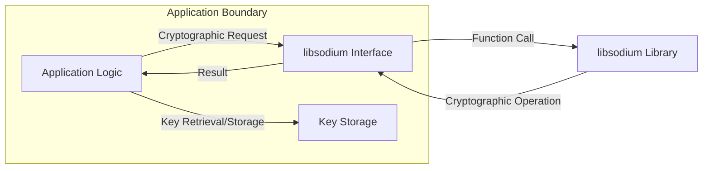

## Project Design Document: libsodium Integration

**Project Name:** libsodium Integration

**Project Repository:** [https://github.com/jedisct1/libsodium](https://github.com/jedisct1/libsodium)

**Document Version:** 1.1

**Date:** 2023-10-27

**Author:** AI Architecture Expert

**1. Introduction**

This document outlines the design of a system integrating the libsodium cryptographic library. It serves as a foundation for subsequent threat modeling activities. This document details the components, data flows, and interactions relevant to understanding the security posture of a system leveraging libsodium.

**2. Goals**

*   Clearly define the scope and boundaries of the libsodium integration.
*   Identify the key components and their interactions.
*   Describe the data flows and sensitive information handled by the system.
*   Provide a visual representation of the system architecture.
*   Serve as input for threat modeling exercises.

**3. Scope**

This design focuses on the integration of libsodium as a cryptographic provider within a hypothetical application. It does not encompass the internal workings of libsodium itself, but rather its utilization within a broader system. The scope includes:

*   The application utilizing libsodium.
*   The interaction between the application and the libsodium library.
*   The storage and management of cryptographic keys used by libsodium.
*   Data flows involving cryptographic operations performed by libsodium.

**4. System Architecture**

The following diagram illustrates the high-level architecture of the system integrating libsodium:

**5. Component Description**

*   **Application Logic ("Application Logic"):** This represents the core functionality of the application that requires cryptographic operations. It initiates requests for encryption, decryption, signing, verification, etc.
*   **libsodium Interface ("libsodium Interface"):** This component acts as an abstraction layer, mediating between the application logic and the libsodium library. It translates application-level requests into specific libsodium function calls. This might be a direct function call or an abstraction layer provided by the application's framework.
*   **Key Storage ("Key Storage"):** This component is responsible for securely storing and managing cryptographic keys used by libsodium. The specific implementation will vary depending on the application's requirements and environment. Examples include:
    *   Environment variables
    *   Configuration files
    *   Hardware Security Modules (HSMs)
    *   Key management services
    *   Operating system keychains
*   **libsodium Library ("libsodium Library"):** This is the core cryptographic library providing the actual cryptographic primitives. It performs the requested operations based on the provided data and keys.

**6. Data Flow Description**

The following outlines the typical data flow for a cryptographic operation:

1. The "Application Logic" determines the need for a cryptographic operation (e.g., encrypting data).
2. The "Application Logic" sends a cryptographic request to the "libsodium Interface", including the data to be processed and potentially an identifier for the key to be used.
3. The "libsodium Interface" retrieves the necessary cryptographic key from "Key Storage".
4. The "libsodium Interface" calls the appropriate function in the "libsodium Library", passing the data and the retrieved key.
5. The "libsodium Library" performs the cryptographic operation.
6. The "libsodium Library" returns the result (e.g., encrypted data) to the "libsodium Interface".
7. The "libsodium Interface" returns the result to the "Application Logic".
8. The "Application Logic" processes the result.

**7. Key Management**

Secure key management is crucial for the security of the system. The following aspects are important:

*   **Key Generation:** Keys should be generated using cryptographically secure random number generators provided by libsodium.
*   **Key Storage:** Keys must be stored securely to prevent unauthorized access. The chosen "Key Storage" mechanism should be appropriate for the sensitivity of the data being protected.
*   **Key Distribution:** If keys need to be shared between parties, a secure key exchange mechanism must be employed. This might involve protocols like TLS or dedicated key exchange algorithms.
*   **Key Rotation:** Keys should be rotated periodically to limit the impact of a potential compromise.
*   **Key Destruction:** When keys are no longer needed, they should be securely destroyed to prevent recovery.

**8. Security Considerations**

*   **Dependency Management:** Ensuring the integrity and authenticity of the libsodium library is critical. Utilize secure package management practices and verify checksums.
*   **Configuration:** Proper configuration of libsodium and the application utilizing it is essential. Avoid insecure defaults and carefully consider the implications of different options.
*   **Input Validation:**  Validate all input data before passing it to libsodium functions to prevent vulnerabilities like buffer overflows or format string bugs (though libsodium is designed to be memory-safe).
*   **Error Handling:** Implement robust error handling to gracefully manage failures and avoid exposing sensitive information through error messages.
*   **Side-Channel Attacks:** Be aware of potential side-channel attacks (e.g., timing attacks) and consider mitigations if necessary for highly sensitive applications. libsodium includes some built-in protections against common side-channel attacks.
*   **Key Compromise:**  Develop a plan to handle key compromise scenarios, including key revocation and re-keying procedures.

**9. Technology Stack**

This section details the technologies involved in the integration:

*   **Cryptographic Library:** libsodium
*   **Programming Language:**  [Specify the programming language used to interact with libsodium, e.g., C, Python, Go]
*   **Operating System:** [Specify the target operating system(s)]
*   **Key Storage Mechanism:** [Specify the chosen key storage mechanism, e.g., OS Keychain, HSM]

**10. Deployment Environment**

This section describes the environment where the application will be deployed:

*   **Environment Type:** [e.g., Cloud, On-Premise, Embedded]
*   **Network Configuration:** [Briefly describe the network setup and any relevant security measures]
*   **Access Controls:** [Outline the access control mechanisms in place for the application and its resources]

**11. Future Considerations**

*   **Integration with Hardware Security Modules (HSMs):**  Consider integrating with HSMs for enhanced key security.
*   **Formal Verification:** For high-security applications, explore formal verification techniques to ensure the correctness of the libsodium integration.
*   **Regular Security Audits:** Conduct regular security audits and penetration testing to identify potential vulnerabilities.

This document provides a comprehensive overview of the libsodium integration. It serves as a valuable resource for understanding the system's architecture and identifying potential security risks during the threat modeling process.
