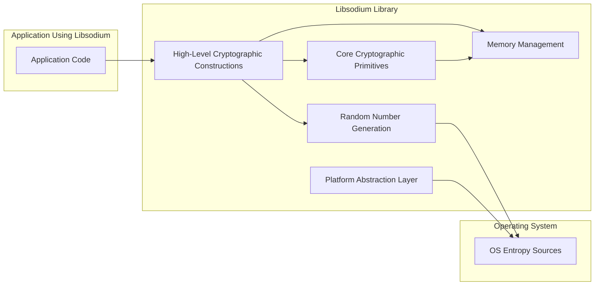
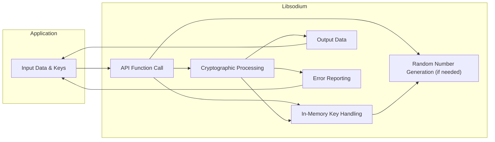

## Project Design Document: Libsodium - Improved

**1. Introduction**

This document provides an enhanced design overview of the Libsodium cryptographic library, specifically tailored for threat modeling purposes. It details the key architectural components, data flows, and security considerations relevant for identifying potential vulnerabilities. This document is intended for security engineers, developers, and architects involved in the security assessment of systems integrating and utilizing Libsodium. The primary goal is to provide a clear and comprehensive understanding of Libsodium's internal workings to facilitate effective threat identification and mitigation strategies.

**2. Project Overview**

Libsodium is a modern, portable, and easy-to-use cryptographic library. It offers a high-level API to perform common cryptographic operations such as encryption, decryption, digital signatures, password hashing, and authenticated key exchange. A core design principle of Libsodium is to be secure-by-default, meaning it aims to guide developers towards secure cryptographic practices and prevent common implementation errors. It is a fork of the NaCl library, maintaining API compatibility while extending its feature set. Libsodium prioritizes security, usability, and performance.

**3. System Architecture**

Libsodium's architecture is structured in layers, providing increasing levels of abstraction. This design allows developers to interact with the library at a level appropriate for their needs, while the underlying complexities are handled securely.

*   **High-Level Cryptographic Constructions:** This layer offers ready-to-use, high-level cryptographic operations. Examples include:
    *   Authenticated Encryption: `crypto_secretbox`, `crypto_box`
    *   Digital Signatures: `crypto_sign`
    *   Password Hashing: `crypto_pwhash`
    *   Key Exchange: `crypto_kx`
    These constructions internally utilize the core cryptographic primitives.
*   **Core Cryptographic Primitives:** This layer implements the fundamental cryptographic algorithms. Examples include:
    *   Symmetric Encryption: ChaCha20, AES256-GCM (conditional)
    *   Public-key Cryptography: Curve25519, Ed25519
    *   Hashing: BLAKE2b, SHA-256, SHA-512
    *   Message Authentication Codes (MACs): Poly1305, HMAC-SHA-256, HMAC-SHA-512
*   **Memory Management:** Libsodium implements careful memory management practices for sensitive data, such as cryptographic keys. This includes techniques like:
    *   Automatic memory allocation and deallocation for cryptographic objects.
    *   Zeroing of memory after use to prevent residual data leaks.
    *   Use of non-swappable memory where possible.
*   **Random Number Generation:** Libsodium relies on a cryptographically secure pseudo-random number generator (CSPRNG). It typically interfaces with the operating system's provided entropy sources (e.g., `/dev/urandom` on Unix-like systems, `CryptGenRandom` on Windows).
*   **Platform Abstraction Layer:** This layer provides an abstraction over platform-specific functionalities, ensuring portability across different operating systems and architectures. It handles differences in system calls and available hardware features.
*   **Build System:** While not a runtime component, the build system (typically using Autotools or CMake) is a crucial part of the architecture, ensuring consistent and secure compilation across different environments.

**4. Data Flow**

The typical data flow within Libsodium involves the following stages, depending on the specific cryptographic operation being performed:

1. **Input from Application:** The application provides input data (plaintext, ciphertext, messages, passwords, etc.) and cryptographic keys (or instructions for key generation) to the Libsodium API. The application is responsible for the secure storage and management of long-term keys.
2. **API Function Invocation:** The application calls a specific Libsodium API function corresponding to the desired cryptographic operation (e.g., `crypto_secretbox_easy`, `crypto_sign_detached`).
3. **Cryptographic Processing:** Libsodium utilizes the appropriate core cryptographic primitives based on the invoked API function. This involves algorithms for encryption, decryption, hashing, signing, verification, or key exchange.
4. **Key Handling within Libsodium:**  During cryptographic operations, Libsodium securely handles cryptographic keys in memory. Key generation, if requested, relies on the random number generation component. Note that Libsodium itself does not persist keys; this is the responsibility of the calling application.
5. **Output to Application:** Libsodium returns the processed data (ciphertext, plaintext, signatures, hashes, shared secrets, etc.) to the calling application.
6. **Error Handling:** If errors occur during processing (e.g., invalid keys, incorrect input size, verification failure), Libsodium provides error codes or exceptions to the application, allowing it to handle the error appropriately.

**5. Security Considerations**

Several security considerations are paramount when using Libsodium:

*   **Choice of Cryptographic Primitives:** While Libsodium makes secure-by-default choices, understanding the underlying algorithms and their suitability for specific use cases is important.
*   **Key Management by the Application:** Libsodium provides tools for key generation, but the secure storage, distribution, rotation, and destruction of cryptographic keys are the responsibility of the application using the library. Weak key management practices at the application level can negate the security provided by Libsodium.
*   **Quality of Randomness:** The security of cryptographic operations depends heavily on the quality of the random numbers used for key generation and other purposes. Ensuring the underlying operating system provides sufficient entropy is crucial.
*   **Side-Channel Attacks:** Libsodium developers actively work to mitigate side-channel attacks (e.g., timing attacks, cache attacks). However, applications dealing with highly sensitive data in potentially hostile environments should be aware of these risks and consider additional countermeasures.
*   **API Misuse:** Incorrect usage of the Libsodium API can lead to security vulnerabilities. Developers must adhere to the documented best practices and understand the implications of different function parameters.
*   **Memory Safety:** While Libsodium strives for memory safety, vulnerabilities in the underlying C code or in the application integrating Libsodium can still introduce risks. Regular security audits and code reviews are recommended.
*   **Dependency Security:** The security of Libsodium also depends on the security of its build-time dependencies (compiler, build tools). Using trusted and up-to-date build environments is important.
*   **Staying Updated:** Regularly updating Libsodium to the latest version is crucial to benefit from security fixes and improvements. Older versions may contain known vulnerabilities.
*   **Language Bindings Security:** When using Libsodium through language bindings, the security of the binding implementation itself is also a consideration.

**6. External Dependencies**

Libsodium aims to minimize external dependencies to reduce the attack surface and simplify deployment. Its primary dependencies include:

*   **Operating System:** For access to core functionalities, including entropy sources for random number generation.
*   **C Standard Library:** A fundamental dependency for any C-based library.
*   **Build Tools:** Tools like a C compiler (e.g., GCC, Clang), Autotools, or CMake are required for building Libsodium from source.
*   **Language Bindings (Optional):** When used in languages other than C, language-specific bindings (e.g., `pysodium` for Python) introduce an additional layer of dependency.

**7. Deployment Considerations**

Libsodium can be deployed in various ways, each with its own implications:

*   **Statically Linked Library:** Libsodium is compiled directly into the application's executable. This simplifies deployment but increases the executable size.
*   **Dynamically Linked Library:** The application links against a shared Libsodium library at runtime. This reduces the executable size and allows for easier updates of Libsodium, but requires the library to be present on the target system.
*   **Operating System Packages:** Libsodium is often available as a pre-compiled package through operating system package managers. This simplifies installation and updates but relies on the security practices of the package maintainers.
*   **Language-Specific Packages:** For languages with bindings, Libsodium is often distributed as a language-specific package (e.g., a Python package via pip).

**8. Future Considerations**

Ongoing development and potential future directions for Libsodium include:

*   **Incorporation of New Cryptographic Primitives:**  Adding support for newly standardized and vetted cryptographic algorithms.
*   **Enhanced Resistance to Advanced Attacks:**  Continuously improving defenses against sophisticated attacks, including advanced side-channel techniques.
*   **Hardware Acceleration Integration:**  Leveraging hardware cryptographic acceleration features available on modern processors.
*   **Formal Verification Efforts:**  Applying formal methods to mathematically prove the correctness and security of critical parts of the library.
*   **API Enhancements:**  Adding new functionalities and improving the usability and security of the existing API.
*   **Improved Documentation and Examples:**  Providing clearer and more comprehensive documentation to guide developers towards secure usage.

This improved design document provides a more detailed and nuanced understanding of the Libsodium project, specifically for the purpose of threat modeling. By understanding the architecture, data flow, and security considerations outlined here, security professionals can more effectively identify potential vulnerabilities and develop appropriate mitigation strategies for systems utilizing this valuable cryptographic library.