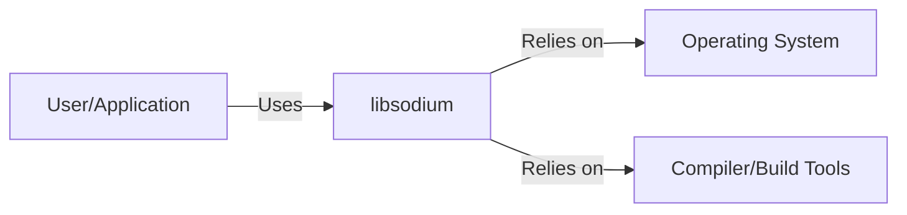
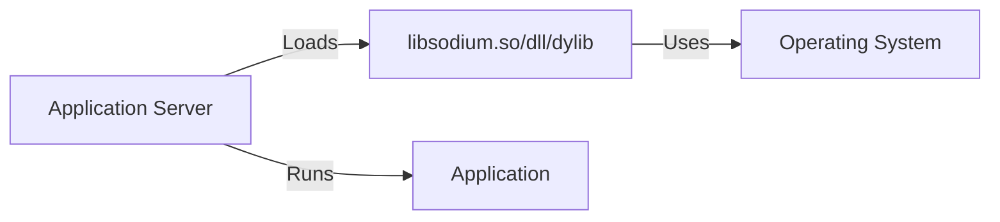
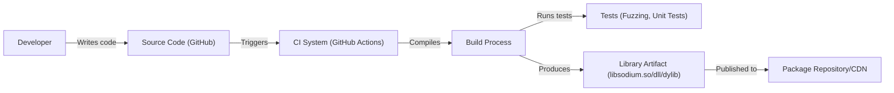

# BUSINESS POSTURE

Business Priorities and Goals:

*   Provide a portable, cross-compilable, installable, and packageable library for encryption, decryption, signatures, password hashing, and more.
*   Offer a modern and easy-to-use API for common cryptographic tasks.
*   Maintain compatibility with NaCl (Networking and Cryptography library) while improving usability and portability.
*   Be a reliable and trustworthy foundation for secure communication and data protection in various applications.
*   Support a wide range of platforms and compilers.

Most Important Business Risks:

*   Vulnerabilities in the library could compromise the security of applications relying on it, leading to data breaches, loss of confidentiality, and integrity issues.
*   Compatibility issues with different platforms or compilers could limit the library's adoption and usefulness.
*   Failure to keep up with cryptographic best practices and advancements could render the library obsolete or insecure over time.
*   Lack of proper documentation and support could hinder developer adoption and lead to misuse of the library.
*   Supply chain attacks targeting the library's build and distribution process.

# SECURITY POSTURE

Existing Security Controls:

*   security control: Use of well-vetted cryptographic primitives (e.g., XSalsa20, ChaCha20, Poly1305, BLAKE2b). Described in source code and documentation.
*   security control: Regular audits and reviews of the codebase. Mentioned in documentation and community discussions.
*   security control: Fuzzing and testing to identify potential vulnerabilities. Described in documentation and testing infrastructure.
*   security control: Constant-time implementations of critical operations to mitigate timing attacks. Implemented in source code.
*   security control: Memory management designed to prevent common buffer overflow and memory leak vulnerabilities. Implemented in source code.
*   security control: API designed to minimize the risk of misuse. Described in documentation.
*   security control: Use of AddressSanitizer, MemorySanitizer, and UndefinedBehaviorSanitizer during testing. Described in build scripts and CI configuration.

Accepted Risks:

*   accepted risk: Reliance on external compilers and build tools, which could potentially introduce vulnerabilities if compromised.
*   accepted risk: The possibility of undiscovered vulnerabilities, despite rigorous testing and auditing.
*   accepted risk: Potential for misuse of the library by developers who do not follow security best practices in their own applications.

Recommended Security Controls:

*   security control: Implement a Software Bill of Materials (SBOM) to track dependencies and facilitate vulnerability management.
*   security control: Establish a clear and responsive vulnerability disclosure process.
*   security control: Integrate static analysis tools into the build process to catch potential vulnerabilities early.
*   security control: Consider formal verification of critical components.
*   security control: Sign released artifacts to ensure integrity and authenticity.

Security Requirements:

*   Authentication: Not directly applicable to the library itself, as it provides cryptographic primitives rather than authentication mechanisms. However, the library can be used to build authentication systems.
*   Authorization: Not directly applicable to the library itself. Authorization is typically handled at a higher level in applications using the library.
*   Input Validation: The library should validate input parameters to ensure they are within expected bounds and formats. This is crucial to prevent vulnerabilities like buffer overflows.
*   Cryptography: The library's core function. It must use strong, well-vetted cryptographic algorithms and implement them securely, following best practices for key management, randomness, and constant-time operations.
*   Output Encoding: Not directly applicable, as the library primarily deals with binary data.

# DESIGN

## C4 CONTEXT

Element Descriptions:

*   Element:
    *   Name: User/Application
    *   Type: External Entity (User or Application)
    *   Description: Represents a user or an application that utilizes libsodium for cryptographic operations.
    *   Responsibilities: Calls libsodium functions to perform encryption, decryption, signing, etc.
    *   Security controls: Relies on libsodium for secure cryptographic operations. Must implement its own security best practices.

*   Element:
    *   Name: libsodium
    *   Type: System
    *   Description: The libsodium library itself.
    *   Responsibilities: Provides cryptographic functions.
    *   Security controls: Uses strong cryptographic primitives, constant-time operations, memory safety measures, input validation.

*   Element:
    *   Name: Operating System
    *   Type: External System
    *   Description: The underlying operating system.
    *   Responsibilities: Provides system calls and resources used by libsodium (e.g., memory allocation, random number generation).
    *   Security controls: Relies on the OS's security features.

*   Element:
    *   Name: Compiler/Build Tools
    *   Type: External System
    *   Description: The compiler and build tools used to build libsodium.
    *   Responsibilities: Compiles the source code into an executable library.
    *   Security controls: Relies on the security of the compiler and build tools.

## C4 CONTAINER

Since libsodium is a single library, the container diagram is essentially the same as the context diagram. It doesn't have internal containers in the traditional sense.

Element Descriptions:

*   Element:
    *   Name: User/Application
    *   Type: External Entity (User or Application)
    *   Description: Represents a user or an application that utilizes libsodium for cryptographic operations.
    *   Responsibilities: Calls libsodium functions to perform encryption, decryption, signing, etc.
    *   Security controls: Relies on libsodium for secure cryptographic operations. Must implement its own security best practices.

*   Element:
    *   Name: libsodium
    *   Type: System
    *   Description: The libsodium library itself.
    *   Responsibilities: Provides cryptographic functions.
    *   Security controls: Uses strong cryptographic primitives, constant-time operations, memory safety measures, input validation.

*   Element:
    *   Name: Operating System
    *   Type: External System
    *   Description: The underlying operating system.
    *   Responsibilities: Provides system calls and resources used by libsodium (e.g., memory allocation, random number generation).
    *   Security controls: Relies on the OS's security features.

*   Element:
    *   Name: Compiler/Build Tools
    *   Type: External System
    *   Description: The compiler and build tools used to build libsodium.
    *   Responsibilities: Compiles the source code into an executable library.
    *   Security controls: Relies on the security of the compiler and build tools.

## DEPLOYMENT

Possible Deployment Solutions:

1.  Static Linking: The libsodium library is compiled directly into the application executable.
2.  Dynamic Linking: The libsodium library is a separate shared object (.so, .dll, .dylib) that is loaded at runtime.
3.  Package Managers: Libsodium is distributed through system package managers (apt, yum, brew, etc.) or language-specific package managers (vcpkg, conan, etc.).

Chosen Solution (Dynamic Linking):

Element Descriptions:

*   Element:
    *   Name: Application Server
    *   Type: Execution Environment
    *   Description: The server or environment where the application runs.
    *   Responsibilities: Hosts and executes the application.
    *   Security controls: Standard server hardening measures.

*   Element:
    *   Name: libsodium.so/dll/dylib
    *   Type: Shared Library
    *   Description: The dynamically linked libsodium library.
    *   Responsibilities: Provides cryptographic functions to the application.
    *   Security controls: Relies on libsodium's internal security controls.

*   Element:
    *   Name: Application
    *   Type: Software System
    *   Description: The application using libsodium.
    *   Responsibilities: Performs its intended functions, utilizing libsodium for cryptography.
    *   Security controls: Application-specific security measures.

*   Element:
    *   Name: Operating System
    *   Type: Operating System
    *   Description: The underlying operating system.
    *   Responsibilities: Provides system resources.
    *   Security controls: OS-level security measures.

## BUILD

Build Process Description:

1.  Developer commits code to the GitHub repository.
2.  GitHub Actions (CI system) is triggered.
3.  The build process compiles the source code using various compilers and configurations.
4.  Extensive tests are run, including fuzzing, unit tests, and security checks (AddressSanitizer, MemorySanitizer, UndefinedBehaviorSanitizer).
5.  If all tests pass, the build process produces the library artifact (e.g., libsodium.so, libsodium.dll, libsodium.dylib).
6.  The artifact is made available for distribution (potentially through package repositories or a CDN).

Security Controls in Build Process:

*   security control: Use of a CI system (GitHub Actions) for automated builds and testing.
*   security control: Compilation with multiple compilers and configurations to ensure portability and catch compiler-specific issues.
*   security control: Extensive testing, including fuzzing and unit tests.
*   security control: Use of security sanitizers (AddressSanitizer, MemorySanitizer, UndefinedBehaviorSanitizer) to detect memory errors and undefined behavior.
*   security control: Regular updates to dependencies and build tools.

# RISK ASSESSMENT

Critical Business Processes to Protect:

*   Secure communication and data exchange between applications and users.
*   Protection of sensitive data at rest and in transit.
*   Integrity of data and systems relying on libsodium.

Data to Protect and Sensitivity:

*   Symmetric encryption keys: Highly sensitive. Compromise leads to decryption of all data protected by those keys.
*   Asymmetric private keys: Highly sensitive. Compromise allows impersonation and decryption of data intended for the key owner.
*   Digital signatures: Compromise of signing keys allows forgery of signatures.
*   Hashed passwords: Sensitive. Compromise can lead to password cracking and unauthorized access.
*   Any data encrypted or signed using libsodium: Sensitivity depends on the specific data.

# QUESTIONS & ASSUMPTIONS

Questions:

*   Are there any specific compliance requirements (e.g., FIPS 140-2) that libsodium needs to meet?
*   What is the expected threat model for applications using libsodium (e.g., web applications, embedded systems, mobile apps)?
*   What is the process for handling security vulnerabilities reported by external researchers?
*   What are the plans for long-term maintenance and support of the library?

Assumptions:

*   BUSINESS POSTURE: The primary goal is to provide a secure and reliable cryptographic library.
*   BUSINESS POSTURE: The project prioritizes security over performance, but aims for reasonable performance.
*   SECURITY POSTURE: Developers using libsodium are expected to have a basic understanding of cryptography and security best practices.
*   SECURITY POSTURE: The build environment is reasonably secure, but there is always a risk of supply chain attacks.
*   DESIGN: The library will be used in a variety of environments and applications.
*   DESIGN: The library will be primarily distributed as source code and through package managers.