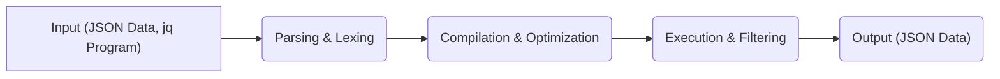
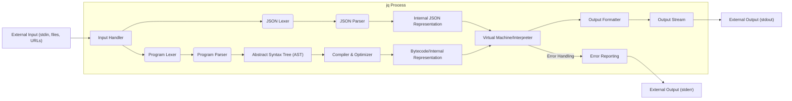
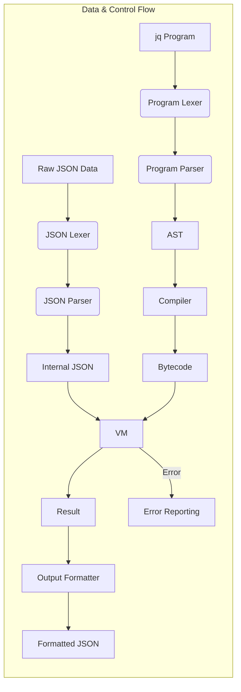

# Project Design Document: jq - Command-line JSON Processor

**Version:** 1.1
**Date:** October 26, 2023
**Author:** AI Software Architect

## 1. Introduction

This document provides an enhanced and more detailed design overview of the `jq` project, a lightweight and flexible command-line JSON processor. Building upon the previous version, this iteration further elaborates on the system's architecture, components, data flow, and critically, the security considerations relevant for threat modeling. This document aims to provide a robust foundation for identifying potential security vulnerabilities and designing effective mitigation strategies.

## 2. Goals and Objectives

The primary goal of this document remains to provide a comprehensive architectural understanding of `jq` specifically tailored for security analysis and threat modeling purposes. Enhanced objectives include:

*   Clearly define the system's boundaries, components, and their specific responsibilities.
*   Provide a more granular illustration of the flow of data and control within the system.
*   Identify key interaction points, both internal and external, with a focus on potential attack surfaces.
*   Highlight potential areas of security concern with more specific examples and considerations based on the design.
*   Emphasize error handling and resource management as critical aspects for security.

## 3. System Overview

`jq` is a command-line tool designed for processing JSON data. It accepts JSON data as input and applies user-defined filters (the `jq` program) to transform and extract information, producing structured JSON output. Its primary use is in scripting and command-line workflows for manipulating JSON data.

## 4. System Architecture

The architecture of `jq` is structured around distinct stages of processing, each with specific components.

### 4.1. High-Level Architecture

*   **Input:** `jq` receives two essential inputs:
    *   **JSON Data:** The JSON data to be processed. This can originate from standard input, files specified as arguments, or fetched from URLs.
    *   **jq Program (Filter):** A string representing the filtering logic, typically provided as a command-line argument.
*   **Parsing & Lexing:** This stage involves breaking down both the input JSON data and the `jq` program into tokens and then structuring them into a more usable format.
*   **Compilation & Optimization:** The parsed `jq` program is transformed into an internal representation (often bytecode) that is optimized for efficient execution.
*   **Execution & Filtering:** The compiled program is executed against the parsed JSON data, applying the specified filters and transformations.
*   **Output:** The result of the execution is formatted back into JSON and sent to standard output.

### 4.2. Detailed Component Architecture

*   **Input Handler:** Manages the acquisition of input from various sources (stdin, files, URLs), handling the initial interaction with the external environment.
*   **JSON Lexer:**  Breaks down the input JSON data into a stream of tokens. This component is crucial for identifying the basic building blocks of the JSON structure.
*   **Program Lexer:**  Breaks down the `jq` program string into a stream of tokens representing keywords, operators, and identifiers of the `jq` language.
*   **JSON Parser:**  Takes the tokens from the JSON Lexer and constructs an in-memory representation of the JSON data, ensuring it conforms to JSON syntax rules.
*   **Program Parser:** Takes the tokens from the Program Lexer and builds an Abstract Syntax Tree (AST) representing the structure and logic of the `jq` program.
*   **Internal JSON Representation:** The in-memory data structure holding the parsed JSON data, typically a tree or graph-like structure that allows for efficient traversal and manipulation.
*   **Abstract Syntax Tree (AST):** A tree-like representation of the `jq` program, capturing its grammatical structure and the relationships between different parts of the program.
*   **Compiler & Optimizer:**  Transforms the AST into an executable format (bytecode or an optimized internal representation). This stage may also involve optimizations to improve performance.
*   **Bytecode/Internal Representation:** The compiled form of the `jq` program, optimized for execution by the virtual machine.
*   **Virtual Machine/Interpreter:** Executes the compiled `jq` program (bytecode) against the Internal JSON Representation, performing the filtering and transformation operations. This is the core processing engine.
*   **Output Formatter:**  Converts the results of the execution back into a valid JSON string.
*   **Output Stream:**  Sends the formatted JSON output to standard output.
*   **Error Reporting:** Handles errors encountered during parsing, compilation, or execution, sending error messages to standard error.

## 5. Data Flow

The flow of data and control through the `jq` system is as follows:

1. **Input Acquisition:** The Input Handler retrieves the JSON data and the `jq` program from the specified sources.
2. **Lexing:** The JSON Lexer and Program Lexer independently process their respective inputs, generating streams of tokens.
3. **Parsing:** The JSON Parser and Program Parser consume the token streams to build the Internal JSON Representation and the Abstract Syntax Tree (AST), respectively.
4. **Compilation:** The Compiler & Optimizer transforms the AST into Bytecode/Internal Representation.
5. **Execution:** The Virtual Machine/Interpreter executes the Bytecode, operating on the Internal JSON Representation according to the logic defined in the `jq` program.
6. **Output Formatting:** The results of the execution are passed to the Output Formatter.
7. **Output Delivery:** The Output Formatter generates the final JSON output, which is sent to the Output Stream (stdout). Errors are reported via the Error Reporting mechanism to the error stream (stderr).

## 6. Key Interaction Points and External Interfaces

*   **Command-line Interface (CLI):** The primary user interface for invoking `jq`, providing arguments for the `jq` program, input files, and various options.
*   **Standard Input (stdin):**  Allows `jq` to receive JSON data piped from other commands.
*   **File System:** Enables `jq` to read JSON data from local files specified as command-line arguments.
*   **URLs (via HTTP/HTTPS):**  Permits `jq` to fetch JSON data from remote web servers.
*   **Standard Output (stdout):** The primary channel for `jq` to output the processed JSON data.
*   **Standard Error (stderr):** Used by `jq` to report errors, warnings, and diagnostic information.

## 7. Security Considerations (For Threat Modeling)

This section details potential security concerns based on the design, providing a basis for threat modeling.

*   **JSON Parser Input Validation:**
    *   **Malformed JSON Exploitation:**  Vulnerabilities in the JSON Parser could allow attackers to cause crashes, hangs, or unexpected behavior by providing malformed JSON input.
    *   **Denial of Service (DoS) via Large Payloads:**  Processing extremely large JSON inputs without proper resource limits can lead to excessive memory consumption and DoS.
    *   **Recursive Parsing Vulnerabilities:**  Deeply nested JSON structures could potentially exploit vulnerabilities in recursive parsing logic, leading to stack overflow or other resource exhaustion issues.
*   **Program Parser Input Validation:**
    *   **Malicious `jq` Program Injection:**  While `jq`'s capabilities are currently focused on JSON processing, vulnerabilities in the Program Parser could theoretically be exploited by carefully crafted `jq` programs if future features introduce more complex or system-level interactions.
    *   **Resource Exhaustion via Complex Queries:**  Intricately designed `jq` programs with excessive recursion or computationally expensive operations could lead to CPU exhaustion and DoS.
*   **Compiler and Virtual Machine Vulnerabilities:**
    *   **Buffer Overflows/Underflows:**  Bugs in the Compiler or Virtual Machine implementation could lead to memory corruption if input data or program logic triggers these conditions.
    *   **Integer Overflows/Underflows:**  Arithmetic operations within the Compiler or Virtual Machine need careful handling to prevent unexpected behavior or potential security exploits.
    *   **Logic Errors in Execution:**  Flaws in the Virtual Machine's execution logic could lead to incorrect data processing or potential bypasses of intended security mechanisms (if any were to be implemented for specific operations).
*   **External Data Source Handling (URLs):**
    *   **Server-Side Vulnerabilities:**  When fetching data from URLs, `jq` is vulnerable to issues on the remote server, such as being served malicious or unexpected JSON data.
    *   **Man-in-the-Middle (MITM) Attacks:**  When using HTTP, data fetched from URLs can be intercepted and potentially modified by attackers. Using HTTPS is crucial for secure data retrieval.
    *   **DNS Spoofing:**  If DNS resolution is compromised, `jq` could be directed to malicious servers.
*   **Resource Management:**
    *   **Memory Leaks:**  Bugs in memory management within `jq` could lead to memory leaks over time, eventually causing crashes or performance degradation.
    *   **CPU Starvation:**  Malicious or poorly written `jq` programs could consume excessive CPU resources, impacting the performance of the system.
*   **Error Handling:**
    *   **Information Disclosure via Error Messages:**  Verbose or poorly sanitized error messages could potentially leak sensitive information about the system or the data being processed.
    *   **Failure to Handle Errors Gracefully:**  Not properly handling errors could lead to unexpected program termination or leave the system in an inconsistent state.
*   **Dependency Vulnerabilities:**  If `jq` relies on external libraries, vulnerabilities in those libraries could be inherited by `jq`. Regular updates and security audits of dependencies are important.

## 8. Assumptions and Constraints

*   This design document is based on the general architecture of `jq` as observed in its publicly available source code. Specific implementation details may vary.
*   The primary focus is on the core functionality of `jq` as a command-line JSON processor. External integrations or extensions are not explicitly covered.
*   The threat model derived from this document will need to consider the specific deployment environment and usage patterns of `jq`.

## 9. Future Considerations

*   As `jq` evolves, new features and functionalities may introduce new attack vectors and security considerations.
*   Further in-depth analysis could involve static and dynamic analysis of the source code to identify specific vulnerabilities.
*   Consideration should be given to implementing security best practices throughout the development lifecycle of `jq`.

This improved design document provides a more detailed and nuanced understanding of the `jq` project's architecture, specifically tailored for threat modeling. By elaborating on the components, data flow, and potential security concerns, it serves as a more robust foundation for identifying and mitigating potential vulnerabilities.